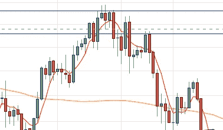
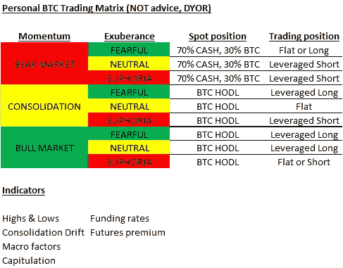

# 比特币交易指标|交易者指南

> 原文：<https://medium.com/coinmonks/indicators-for-bitcoin-trading-82cd376ccebc?source=collection_archive---------0----------------------->

这几天有几个人问我用什么样的指标来交易比特币。所以我想试试看，把它写下来。

重要的是要明白:这是我的个人意见，这些都不是财务建议。这也不是我的专业意见。如果你读了它，你应该像对待其他信息一样对待它。验证自己，做自己的研究，永远不要根据别人的观点交易。此外，我已经在金融市场交易了 20 多年，所以有很多事情对我来说是“肌肉记忆”，你不能通过简单地阅读交易手册来建立，我也不能把它放入交易指标的概述中。它通常是凭经验建立起来的，这通常意味着赔钱。请确保您理解所有这些。

好吧，我们开始吧。

# **交易哲学**

为了理解我如何使用下面的指标，重要的是理解我用它们做什么交易。一般来说，我不会交易非常短的时间(比如几个小时，甚至几天)。这条规则也有例外，但如果仓位正确，我的大部分交易会持续几天甚至几个月。还要注意，我在这里写的所有内容可能都适用于传统市场，但它(在我看来)在比特币交易中更有用。我在这里也明确排除了替代硬币。

此外，我的基本前提是我可以从两个主要的行为交易中获益:

1.  **建立势头**:在这种情况下，我发现一种趋势或“力量”可能会在接下来的一段时间内变得更强。它可能已经找到了粉丝/位置，但我们无论如何都不会过度扩张，而且一般来说，对于市场上剩下的特定力量有很多怀疑。这经常被称为“爬上忧虑之墙”。这意味着市场正在向某个方向推进，而这个方向并不是每个人都完全清楚，大多数人都有“担忧”，所以他们没有完全暴露。这意味着他们有增加仓位的空间。如果是长期交易，这种交易的顶点通常是“爆发”,如果是短期交易，则是“投降”。这些交易可以持续几天，但通常会持续几周或几个月。这种交易的关键是识别这些长期波动的开始和结束(这也意味着理解中间的任何事情都不是)。
2.  **非理性繁荣**:这种交易的基本前提是任何形式的过度扩张都是不好的/错误的。这个想法是，一旦每个人都以某种方式定位，就几乎没有更多的空间在那个方向上继续前进。在某种程度上，它与这里列出的第一个交易相反，但它通常是短期的，对动量交易中的头寸管理非常有帮助。实际上，当绝大多数市场参与者与我观点一致时，我会感到不舒服。这意味着我和大众站在一起，可能会受到“自然”市场力量的挤压，甚至是看到机会的邪恶做市商。通常，这种交易(我持有与大多数人相反的头寸)将在多头挤压(当杠杆多头头寸被止损时，价格大幅下跌，导致更多止损被触发，导致价格进一步下跌)或空头挤压(当杠杆空头头寸被止损时，价格大幅上涨，导致更多止损被触发，导致价格进一步上涨)中解决。一般来说，在这个交易结束时，大多数情绪指标都回到中性。

所以，如果你总结上述内容，你可以说我一般交易长期(几个月以上)波动(交易 1)，但我会在两者之间的短时间内减少或甚至改变我的头寸(交易 2)。

我注意到，这仍然没有涵盖头寸规模管理和风险管理，这是完全不同的领域，也是长期生存的关键。

# **指标**

所以让我们来看看我主要用在交易风格上的指标。

## ***造势贸易***

这是两种交易中较难正确识别的一种，没有单一的指标可以准确判断。为了这个概述的目的，我将假设所确定的交易是一个长期交易(即买入一个位置&如果价格上涨就赚钱)，但是使用与所描述的观察相反的方法也同样适用于短期交易。

## a)确定起点

顾名思义，多头交易的开始是盘整或崩盘的必然结果。目标是确定什么可能是新一轮牛市的开始。

## **更高的低点&更高的高点**

我们将市场结构从中性/看跌转为看涨的第一个信号是图表上出现更高的低点，然后是更高的高点。两个条件都满足是很重要的。如果你观察 2018 年底左右的[比特币](https://blog.coincodecap.com/a-candid-explanation-of-bitcoin)价格走势，你可以清楚地发现该图表创造了更高的低点(在每一次新的下跌中，价格都没有低于该期间的最大下跌，几乎每一次新的低点都高于前一次)。请注意，这不是一场比赛，我们正在等待重大低点的出现。不是每个动作都是低点或高点。

请记住，我们正试图了解价格是否已经触底，市场结构是否正在发生变化。这里不着急。你不需要跳入任何种类的交易，你可以等待，看看实际发生了什么。一旦市场结构改变，它将持续足够长的时间，让人们即使没有抓到低点也能赚钱。试图猜测底部被称为“抓刀”是有原因的，因为它很少有好的结局。

在前两个低点，你唯一能确定的是“更高的低点”。你没有得到的是“更高的高度”。为了让我的交易方式成功，你需要看到两者。我完全能理解早期交易的诱惑，并在图表结束时抓住突破，我甚至会用少量的钱来尝试，但这种交易是一种投机，以我个人的经验来看，这种交易不会产生有意义的长期回报。一旦爆发发生，你知道你也会有一个更高的高点，所以第二个条件得到满足。

这仍然是一个市场时机的问题，即一个人是购买突破还是等待重新测试。对此没有简单的答案，但如果你看看这一步是如何继续的，你会发现两者都有效。

如果你买了突破，你就能赚很多钱，如果你等待重新测试的时间足够长，你就在一个更稳定的情况下进入了一个长期头寸，但你必须等待很长时间，并且在这个过程中几乎错过了一个小牛市和一个小熊市。

## **合并漂移**

第二个向我表明我们可能已经改变了市场结构的指标是，在一个新高之后的第一个盘整期的普遍“漂移”。以我的经验来看，如果市场结构已经从熊市转为牛市，盘整期本身就会呈现出轻微的上行趋势。看看我们刚刚看到的爆发后的两次盘整。

在这两个图中，你可以看到，在大幅上涨后，价格盘整，但即使在盘整期间，价格也保持了一个高开低走的结构。如果市场结构没有改变，你很可能会看到一个“头肩底”的形态出现或类似的情况，就像稍后发生的那样(见下文)。

## **宏观因素改善**

这是识别可持续动量交易开始的最困难的方面。简而言之，“有些事情需要改变”。以我的经验来看，卖方的长期疲惫和随之而来的投降不足以构成一个新的看涨市场结构。需要有一种力量使得你所关注的资产有可能在一个较长的时期内持续攀升。同样，为了评估这一点，我们有很多时间。动量交易不是试图去狙击顶部或抓住底部，而是确定是否会有一个长期的上涨趋势。

就比特币而言，它是一种高风险的金融资产，正在寻找自己的角色，但最有可能成为一种纯粹的赌博资产，或越来越接近于一种反通胀储备资产，我们可以关注的关键宏观变量是*全球或(甚至仅仅是美国)货币供应*(它只是随着资产增加而推高所有资产)，以及威利·吴(Willy Woo)的*比特币 NVT 比率*，它试图通过交易活动来确定比特币 PE 比率。

看着*货币供应量*，我确信，如果你看这个图表，你可以看到最近“有些事情发生了变化”:

[https://fred.stlouisfed.org/series/M2](https://fred.stlouisfed.org/series/M2)

当美联储像 2020 年那样大举扩张货币供应时，你知道资产价格的新时代已经开始。事实上，在比特币诞生的时候，也发生过类似的变动(由于它不是对数图，所以不容易看到)。

在 NVT 比率方面，事情要简单一些，因为威利有一个网站(woobull.com)，在那里你甚至可以找到一个“买入/卖出”指标，这使得整个想法非常不言自明。

[http://charts.woobull.com/bitcoin-nvt-ratio/](http://charts.woobull.com/bitcoin-nvt-ratio/)

此外，如果你非常喜欢加密，你可以寻找新的趋势，如 ICOs 或 DeFi(锁定的总价值是新一轮牛市的良好指标)来增加你的观察。拥有一个人们开始大量使用的新用例通常对价格非常有利，不管你对这个用例有什么想法。

在我看来，这就是识别比特币动量交易开始的全部内容。还有一些额外的东西可能会有帮助，但它们与“肌肉记忆”有很大关系，我很难把它们拼写出来。不过，我确实认为上述内容足以确定比特币动量交易的开始。

b)识别终点

幸运的是，识别动量交易的结束比识别它的开始容易(我认为)。你在寻找投降，在长期投降的情况下，经常被称为“吹顶”。记住，我们在这里看的是一个长期交易，但是任何写的东西也适用于短期交易，它正好相反。你要寻找的是这样一个时刻，以前没有投资的人都“认输”，因为害怕错过机会而买进(FOMO)。

在比特币中，“井喷”通常发生在抛物线前进的终点。这是一个上升，你可以画一条“抛物线”来连接图表的低点。一旦这条抛物线被打破，你通常会处于中期波动的末期(不一定是牛市)。

接下来你想看到的是下一次上涨是否会再次创造更高的高点。如果是这样的话，刚刚打破的抛物线很可能还不标志着牛市的结束。但如果没有，这很可能是你退出动量交易的最佳时机，你希望在这一点上。

最后，无论是多头还是空头，投降交易都以极高的成交量出现(见上图下方的绿色和红色柱线)。

这足以让你知道你可能需要退出你的交易。熊市可能不会形成，但你可能至少会在一段时间内看到盘整和中性的市场结构。

此外，基本上作为一个附带条件，如果你正在处理一个泡沫，我经常观察到泡沫往往会打破一个既定的上升趋势通道，然后在非常短的时间内上涨 100%，然后才会崩溃。这就是我所说的“泡沫屋顶”，2017 年的比特币和 2000 年的纳斯达克都是如此。当你在更长的时间内看到这种波动时(记住，我不会交易几个小时或一天左右)，通常最好是跑。

这就完成了我称之为“建立势头”的交易。这是我交易的主要指南针，它决定了我是做多还是做空。我在牛市中尽量避免做空，在熊市中尽量避免渴望。这意味着我从不抄底，也从不在绝对高点卖出。但这意味着我在 2017 年 4 月至 2018 年 1 月期间做多比特币，在 2018 年 3 月至 2019 年 3 月期间做空比特币，并从 2020 年 7 月起在我的交易头寸中再次做多。这绝对足以产生强劲的回报，而且比试图抓住短期机会造成的压力要小得多。

# ***非理性繁荣交易***

如上所述，这种交易本质上是更短期的，我主要把它作为我长期交易头寸的补充，我的长期交易头寸总是由动量驱动的。交易是一个很好的补充，因为它会帮助你和你的恐惧和贪婪生活在一起，不管交易是好是坏，它都会让你痛苦。在交易中获利是一种非常好的感觉(我认为这是成功的重要因素)，这种感觉非常适合。

非理性繁荣交易寻求识别不可持续的过度扩张，并将进行修正。因此，每当这种定位变得极端时，它就会采取一种与大多数人目前的定位相反的立场。好消息是，这项交易只需要两个指标。

## **比特币杠杆融资利率**

使用永久期货进行比特币杠杆交易的人(也就是最有可能被双向挤压的交易者)向做市商支付一笔费用，用于“平衡”多头和空头之间的头寸。简而言之，任何资产的未结头寸都有相关的融资成本，而“通常”这是通过设定特定日期(如 12 月底到期)的期货来解决的。这样，融资成本将隐含在资产(现货)的未来价格相对于当前价格的溢价或折价中。当一个期货是“永久的”，即它没有结束日期，这必须得到不同的照顾，使现货价格和期货价格保持平衡。

因此，提供这些产品的交易所定期向它们收取融资成本，以确保期货价格与当前价格相匹配。值得注意的是，如果一个给定平台上的多头和空头完全匹配(即任何一方背后都有同样多的“压力”——没有人比当前现货支付更多或更少)，则成本为零。如果这有利于空头，融资将计入空头头寸。如果相反，多头必须付出代价。如果你查找融资成本，正利率意味着“多头支付”，而负利率意味着“空头支付”。还要注意，这不是交换费。持有人实际上互相支付，这样就有动力在代表不足的一方建仓。

有一个很棒的网站可以让你追踪交易所的当前融资成本——bybt.com。

根据我的经验，对于比特币来说，任何高于 0.01%的价格都开始过于乐观(即后果将是平仓)，任何高于 0.05%的价格都是极端的(即你可以考虑做空)。在这种方法中，任何负值都过于悲观，任何大于-0.05%的负值都意味着买入。当资金为 0.01%时，你通常可以忽略这个指标——它不太可能有所帮助。

融资利率通常表现出变化的速度有点慢，因此另外查看以下两个指标会有所帮助:

首先是以 tether(币安和 bitfinex 的平均值)定价的比特币相对于美元(Bitstamp)的溢价。如果是负数，泰瑟可以很容易地用印刷品操纵价格。如果是正面的，那就更难了，因为他们会冒险盯住美元。当 BTCUSDT 高于 BTCUSD 时，所有 tether 通过印刷和购买 BTC 与 USDT 完成的是 USDT 对真实美元的价值损失。那将是自杀。

第二个是相对于美元(Bitstamp)的杠杆溢价(bybit 和 bitmex 永久价格的平均值)。如果是负数，人们会看跌，资金可能会减少；如果是正数，系统中仍有杠杆，可以通过抛售清除。

我在 tradingview 中使用的报价器是:

*   系绳溢价:(币安:BTCUSDT +BITFINEX:BTCUSD) /2 位戳记:BTCUSD
*   杠杆 [$BTC](https://twitter.com/search?q=%24BTC&src=cashtag_click) 溢价:(BYBIT:BTCUSD+bit MEX:xbt USD)/2-bit stamp:BTCUSD

随着 CME 期货扮演更突出的角色，你也可以看看《交易员定期承诺报告》中“杠杆基金”的定位。虽然它移动得比较慢。这里可以找到**。**

## ****比特币期货溢价&折价****

**另一个指标是比特币期货曲线。期货(非永久期货)通常在每个日历季度末到期，它们以当前现货价格的溢价或折价交易。**

**当期货溢价交易时，意味着人们预期未来 3 个月或 6 个月比特币价格会更高，这被称为“期货溢价”。当它们折价时，这被称为“现货溢价”。**

**比特币的“正常”水平是 3 个月后的期货溢价约为 0.5%至 1.5%。如果期货溢价高于这个水平，这是一个表明人们过于乐观的指标。随着贴水的扩大，现货溢价也是如此。**

**每当这些指标一致时，非理性的场外交易就意味着采取相反的立场。也就是说，如果人们过度看涨，交易就做空，如果人们过度看跌，交易就做多。这些交易本质上是短期的，未来的融资和溢价可以非常非常快地恢复到“正常”状态。所以这需要非常积极的监控。通常，这种情况最多不会持续超过 3-4 天。**

**未来注意:当利率上升时，这意味着融资成本上升，因此这里描述的水平可能需要根据当前利率进行调整。**

****系绳印花****

****

**这里的最后一点是我最近才开始注意的。不管你对系绳怎么看，也不管它是否合法(在我看来这是一个巨大的骗局)，不可否认的是，它们的印刷品，尤其是它们发送到交易所(主要是币安)的信息，推动了价格。如果你认为你有一个完美的短片，但然后泰瑟打印并发送到币安——根据我的经验，你是业内的 GTFO。我不会说至于我“盲目长”系绳打印，但它不完全是一个谎言。**

**显然，还有许多其他指标和图表可以帮助交易，但我在这里列出的是我最常看的指标和图表，它们指导了我在比特币中的大多数交易头寸。**

**我个人把我的交易方式总结在这个矩阵中:**

****

**Personal BTC Trading Matrix**

**我想再次强调——以上均为个人观点。这些都不是财务或任何其他类型的建议。**

**感谢您的阅读。如果你喜欢这个，请鼓掌并看看你是否愿意在推特上关注我。**

**我的其他作品可以在这里找到:**

** [## 我的加密文章的分类存档

### 我有时会被问到我以前写过的话题，我也不认为媒体简介…

dkcrypto.medium.com](https://dkcrypto.medium.com/categorized-archive-of-my-crypto-articles-e97f0212b21d) 

*最后，最重要的免责声明:这是我的个人观点，不是我的专业建议。最重要的是，这绝不是投资建议。加密资产的价值可能会大幅波动，您的所有资本都可能会丢失。我有 50%的机会是对的。任何表达的负面观点，如果有的话，都只是针对正在讨论的令牌，而不是针对我非常尊重的开发团队(如果他们是真诚的)。***