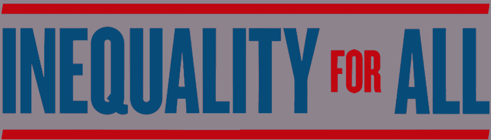
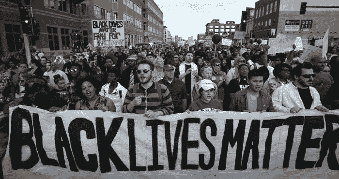
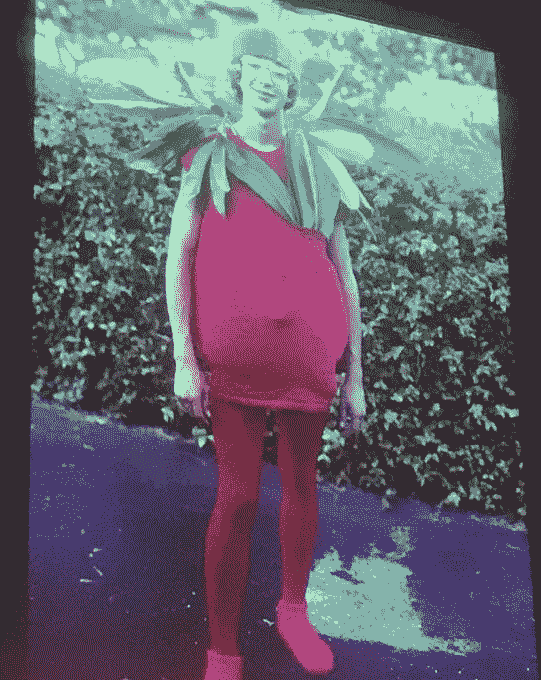
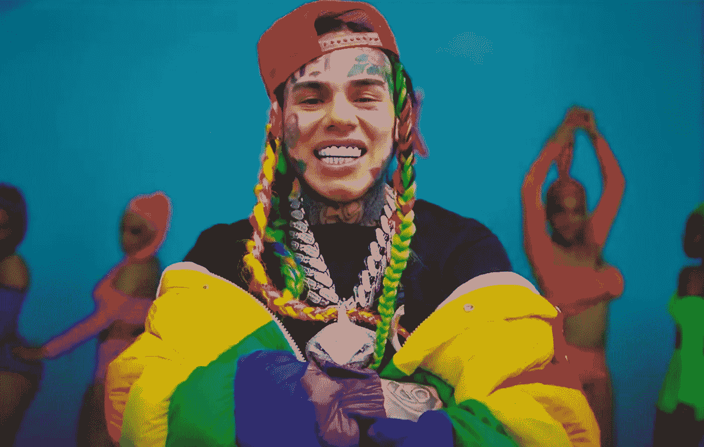

# 所有人的不平等和压迫(第一部分)

> 原文：<https://medium.com/coinmonks/inequality-and-oppression-for-all-part-1-c4a42a0d1204?source=collection_archive---------4----------------------->

## 重温从未愈合的旧伤

美国正在走向第二次内战。一系列跨领域的悲剧事件——健康的、社会的、经济的——每一个都像海啸一样一个接一个地向我们袭来。那些已经生活在吃水线附近或吃水线以下的人容易被淹死，而那些有钱有势的人从安全的鸟瞰角度看着这场大屠杀，不受潮水的影响。这就是问题所在。

新冠肺炎暴露了我们的医疗保健系统和供应链的脆弱性，迫使我们的政府关闭我们的经济。乔治·弗洛伊德被不必要的谋杀暴露了系统失败的一个完全不同的方面——警察有杀人的执照。为了修补所有问题，国会通过了数万亿美元的多项法案，暴露了系统性崩溃的另一个层面:美联储认为它可以用无限的债务解决所有问题。

> 这些浪潮中有三个共同的主题:政府干预、权力滥用和资金分配不当。

## 对所有感到受压迫的人开放

当我看着街上人们的照片时，我看到了美国人的全部，只有一个群体不见了——那 1%。我在街上看到的是对一起不可否认的冷酷谋杀的反应。真正的乔治·弗洛伊德是压垮骆驼的最后一根稻草。真相是，这种行为自警务起源以来就一直存在。换句话说，这是一个和美国一样古老的系统性失败。

正如死亡中的一句谚语所说，我们都有不同的悲伤。暴乱、抢劫和抗议是情感的集体流露。愤怒、恐惧和无助代表了穷人的情绪。依我拙见，许多人走上街头是为了各种各样的*不平等和压迫*(两者是不同的)。

我的理解是，街上的公民表达了他们对美国现状的恐惧。我使用术语“浅肤色”和“深肤色”作为一个一般概念，反映了个人在日常生活中被对待的自由程度。“肤色较浅”的群体觉得美国梦已经成为一个遥不可及的幻想——T4 的不平等。“黑皮肤”群体觉得美国梦已经成为一场失控的噩梦——压迫。

## 少数规则:1%对世界

1%的人认为底层的人没有尽自己的努力，因此“他们已经做了自己的床，现在他们不得不睡在里面。”最成功的美国人无视这样一个现实:如果他们从底层做起，他们自己也会悲惨地死去。那 1%的人喜欢吹捧过去几代人努力工作铺平道路的故事:

> “我从邮件收发室做起，20 年如一日地往上爬，今天我是首席执行官。”这在今天显然是不可能的。

Rich America’s #1 Draft Pick

我并不想挑杰夫·贝索斯的毛病，相反，我读过《百货店》，对他的成就评价很高。但如果把年轻的贝佐斯(见上图)放在洛杉矶中南部，他最好的结果更接近于 Tekashi 6ix9ine(见下图)。

Poor America’s #1 Draft Pick

这并不是要免除穷人在社会契约中应尽的责任，而是当只有特权阶层才能雇得起律师来写规则*和*连续几十年打破规则，造成难以置信的财富差距时，欢迎来到 2020 年的巅峰。

## 隐性和显性合同

有显性的公司契约和隐性的社会契约，主动和被动地保证所有人的不平等。世界各地各种教派的数百万公民涌上街头，将城市街区夷为平地，吞并社区的原因是，没有法律学位的人天生就知道他们未来的前景是暗淡的。

一个很好的例子:“关键工人”是政府认为高度可支配的工人的委婉说法。在未知的健康疫情期间，重要工人被迫冒生命危险。许多人生活在贫困线以下或接近贫困线，因此他们没有不工作的奢侈。对于他们的牺牲，新闻上一片掌声，社交媒体上一片叫好声，但是给他们金钱奖励让他们冒着生命危险，这对于 1%的人来说是不合理的，而我们的政府却向失败的企业主发放数万亿美元。关键工人的待遇反映了美国的优先事项。

## 生活是瓶子翻转的挑战

当富人抛硬币时:正面赢，反面赢。当穷人抛硬币时:正面输了，反面输了。穷人唯一的胜利条件是当它设法达到完美的平衡。

一个完美的类比是瓶子翻转挑战。对于有钱有势的人来说，他们让它看起来轻松、随意、流畅、自信。它看起来很像这样:

When the expectation is you win #nextlevel

对于穷人，我想起了另一种类型的瓶子翻转挑战。当穷人经历成功时，他们的反应通常是震惊和惊讶——庆祝是因为这是一个出乎意料的结果。

When the expectation is you lose #unexpected

## 结论

当强者对抗弱者时，除了奇迹之外，弱者唯一的机会就是**欺骗**。警察的结构是为了抓住穷人的欺骗行为，他们在媒体上的帮凶延续了罪犯代表整体的观念。一个不为人知的故事是，许多富人**习惯性地欺骗**，但是警察站在他们一边，媒体讲述的唯一故事是他们创造的数百万。

不相信我？你应该听听[robing Hood](https://www.defiance.news/podcast/robbing-hood-the-steve-mnuchin-story-part-1-friends-with-benefits)，这是一部由彼得·麦科马克(Peter McCormack)制作的迷你系列片，讲述了我们的美国财政部长史蒂夫·姆努钦(Steve Mnuchin)令人发指的“职业生涯”，顺便提一下，他的身家超过 4 亿美元。

> [在您的收件箱中直接获得最佳软件交易](https://coincodecap.com/?utm_source=coinmonks)

