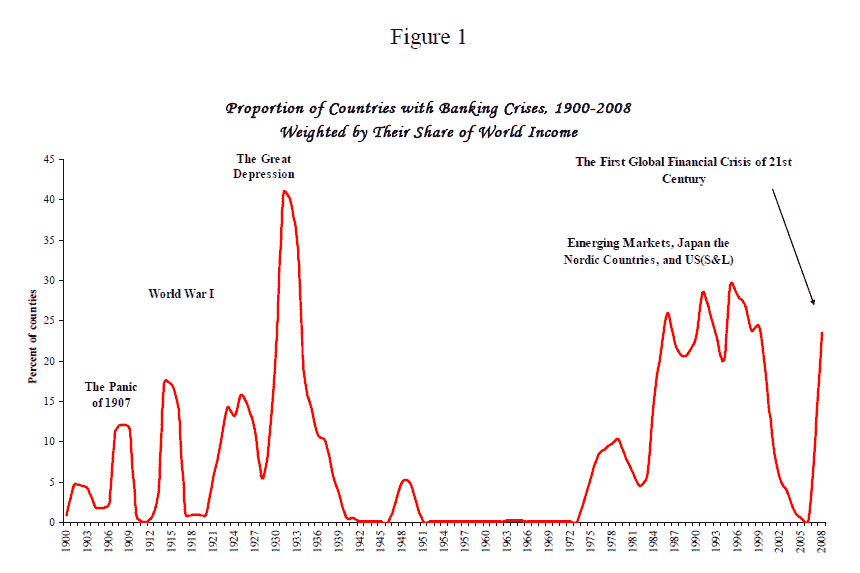

# 通货膨胀和数字资产

> 原文：<https://medium.com/coinmonks/inflation-and-digital-assets-51ccbedccd1d?source=collection_archive---------1----------------------->

比特币创造 10 多年后，随着第三次“减半”刚刚发生，通货膨胀的主题定期出现在数字资产阵营中。更准确地说，没有通胀的理念被认为是破坏性的，是稳定的保证。这个想法很有趣，但它的应用是近似的。让我们来看看这个问题。

*什么是通货膨胀？*

字典告诉我们:“通货膨胀是货币购买力的损失，这转化为价格的普遍和持久的上涨”。换句话说，今天价值 100€的一篮子商品和服务将来会更值钱。通货膨胀对消费者来说不是好消息:在其他条件相同的情况下，他或她的购买力会机械地下降。

通货膨胀是消费中一个重要的心理因素。许多消费者今天购买是因为他们害怕明天会涨价。因此，应该避免价格下跌(“通货紧缩”)，因为它会抑制消费。

*通货膨胀是一种税*

通货膨胀是一种没有说出名字的税。这是完全平等的，因为所有的经济主体都受到同等的影响；这也是完全不公平的，因为受影响最大的是低收入者，他们购买力的下降往往得不到收入增加的补偿。但是，如果我们确实存在一种税收，国家是受益人吗？是和不是，我们将回到这一点。

*通货膨胀有两大来源*

概括地说，通货膨胀的发生有两个原因:

*   首先，这是需求导向型经济增长的结果。原理简单而合理:对一种商品的需求会逐渐提高其价格。在经济规模上，在强劲增长时期，所有价格都会上涨。工资也可能上调，要么是因为企业盈利能力允许，要么是因为失业率下降时劳动力市场趋紧。这是每个人都梦想的通货膨胀。
*   另一种形式的通货膨胀是货币供应量的增加。从字面上看，如果明天货币存量增加 10%，经济中的商品和服务价格将机械地增加 10%。这种通货膨胀要阴险得多，它的影响并不总是有益的，它可以在没有经济增长的情况下存在。在这种情况下，工资将更难跟上价格，因为企业看不到对其产品的稳定需求。

因此，理解通胀也意味着观察货币供应量，即流通中的货币量。而创造货币的支柱是什么？信用。因此，谈论通货膨胀而不谈论信贷是不可能的。

*通货膨胀和信贷*

宽松的货币政策，即促进信贷创造的政策(如保持低利率)会导致通货膨胀。这是消费者最大的矛盾之一:要求大量低成本信贷与低通胀并不一致。

> 通胀和信贷之间的联系如此紧密，以至于央行被赋予了维持价格稳定的责任。

欧洲中央银行，就像美国的美联储，经常评论这个话题:他们一致认为有利的通货膨胀率在 2%左右。因此，央行必须在两个约束之间引导货币政策:授权创造货币(以信贷形式)以促进经济发展，同时避免陷入相反的过度状态，否则将鼓励通胀并侵蚀购买力。

*通货膨胀和财富转移*

如果通货膨胀是一种税，谁来收？政府受益于适度的通货膨胀(尤其是稀释债务，见下文)，但它不是传统意义上的税收，即公共当局征收的大量资金。事实上，通货膨胀组织了经济主体之间的财富转移。

我的左边是钱(纸币、硬币、活期账户等)的持有者，也就是说每个人。在我的右边是大量的借款人——无论他们是公共的还是私人的，无论他们欠了什么样的债。通货膨胀是从前者向后者的转移。第一类人的财富，以货币单位表示，每年都因通货膨胀而贬值。出于完全相似的原因，第二组国家的债务也每年因通胀而贬值。但这种贬值是一种福气:如果我 15 年来每月还€1000 英镑，那 1000€英镑的购买力会随着时间推移而下降。如今，每月 1000€的努力是可行的，但在经历了 15 年的通胀后，这种约束肯定会小得多。

本质上，这是消费者的另一个诅咒:高通胀降低了购买力，但也大大增加了他的债务能力，特别是在金额和期限方面占主导地位的债务——抵押贷款。

对一个家庭来说是正确的，对一个国家或一家公司来说也是正确的:合理的通货膨胀使得更快地吸收债务成为可能。因此，中央银行处于一个困难的境地:让通货膨胀顺其自然，让政府*稀释债务，这代表财政政策的舒适，或者积极抗击通货膨胀，以保护购买力，但这意味着对利率的严格控制。*

*通货膨胀和利率*

有没有一种简单的方法来调节通货膨胀在一个经济体中组织的财富转移？绝对是:通过利率。回到上面的例子，假设€每月 1000 英镑的还款对应于€240000 英镑的贷款年利率为 5%。现在假设我的还款与通货膨胀挂钩，即每年根据通货膨胀进行调整。例如，如果通胀率为 2.5%，我发现自己每年要偿还 7.5%，即€每月 1500 英镑，而不是€1000 英镑。这种指数化保护了贷方，因为在任何时候他或她都可以获得购买力的贬值作为补偿。

稳健的货币政策在于控制利率的总体水平，以调节信贷、货币供应并最终控制通货膨胀。在高通胀时期，央行将提高利率，这将产生放缓信贷和增加贷款人薪酬的直接影响。然而，提高利率和限制信贷也会对经济产生负面影响，因为企业(和个人)更难为投资融资。

这些观察解释了为什么许多贷款与可变利率挂钩。然而，政府债券的情况并非如此，它们大多以固定利率发行。换句话说，政府(固定利率)贷款比可变利率贷款更难抵御通胀，尤其是在长期内。例如，法国的房地产贷款是大规模固定利率贷款，这实际上是以银行为代价保护了借款人。在美国或英国，抵押贷款是“可调利率抵押贷款”(ARM)，即利率可调的贷款，允许金融机构保护自己免受通胀影响——至少在一定程度上。

*布雷顿森林*

一个没有货币通胀的世界可能吗？事实上，它最近就存在了，这是布雷顿森林协定(1944-1976)的世界。第二次世界大战结束时，大国想要一个促进稳定的货币体系，尤其是为了避免两次世界大战之间德国那样的恶性通货膨胀。布雷顿森林框架规定，货币汇率与美元挂钩，而美元价值与黄金挂钩(每盎司 35 美元)。这种针对黄金的固定汇率制度防止了美元以及其他货币不受控制的货币创造。

> 在布雷顿森林体系中，对货币创造的严格控制意味着对信贷创造的严格限制。对信贷创造的严格限制导致了……一段前所未有的稳定时期。

下图显示了 1900 年至 2008 年间处于金融危机状态的国家的百分比:

*资料来源:“银行危机:平等机会的威胁”，卡门·m·雷纳特、肯尼斯·s·罗格夫，NBER 工作文件 14587。*

显然，适用布雷顿森林体系对应的是一段平静的时期，这一时期在此之前或之后都不存在——即使在有持久和平的时候也不存在。由此得出结论，与信贷相关的不受控制的货币创造造成的问题至少与它解决的问题一样多，这只是一步之遥。在布雷顿森林体系之后，大多数金融危机都源于巨额债务和反复无常的经济活动之间的冲突。

*通货膨胀和数字资产*

大多数数字资产都有一个特点，那就是它们的协议中有“硬编码”膨胀。比特币、以太坊等很多都是这种情况。这种通货膨胀是货币型的，也就是说，它并不对应于价格的上涨，而是对应于货币的创造。因为没有中央银行来控制货币数量，所以不可能有其他的通货膨胀，因此在这些协议中没有信用的创造。因此，要借钱，就必须找到能借出自己资产的人。同样，商业银行在这些体系中也没有立足之地，因为它们在现实生活中的主要功能不是记账，而是创造信用。

数字资产可以抵御通胀的说法绝对正确。但这是以信用缺失为代价的。在基于数字货币的经济中，消费者公民会发现没有通货膨胀与货币创造相关联(除了协议中“编码”的那种)。他们可能会发现没有银行收取账户费，但他们也可能会意识到获得贷款购买房屋是一个奇迹。在一个货币供应有限的世界里，获得信贷类似于说服某人把他们的储蓄借给你。所有借款人都在为有限的资源相互竞争。此外，没有货币通胀并不意味着完全没有通胀，只是第二种通胀机制消失了。如果有一种数字货币可以用来购买橙子，那么在需求旺盛的情况下，生产商很可能会决定提高价格。

*结论*

诚然，相对于各国货币而言，没有通胀为持有者提供了安全保障，但这一论断必须得到以下观察的补充:基于数字货币的经济将与我们今天的经济完全不同。在缺乏信贷的情况下，政府(以及企业和个人)的债务能力将被严重削弱。可用于借贷的货币单位的最佳用途是什么？一辆汽车，一个工厂，公共赤字？它的价格是多少？这个单位的持有人需要支付多少利率才能接受借款人的信用风险？

这种类型的经济在人类历史上一直存在，包括在工业化时期。因此，理论上它们不可能重现。但当今世界债务负担过重，很难想象会有这样的回报。

> [在您的收件箱中直接获得最佳软件交易](https://coincodecap.com/?utm_source=coinmonks)

