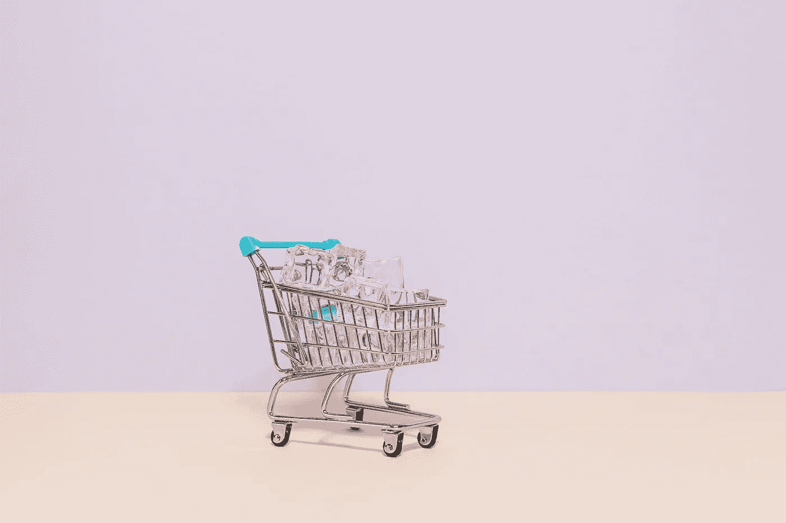
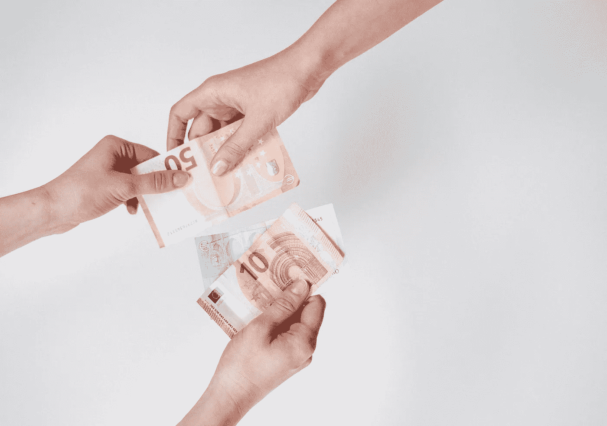
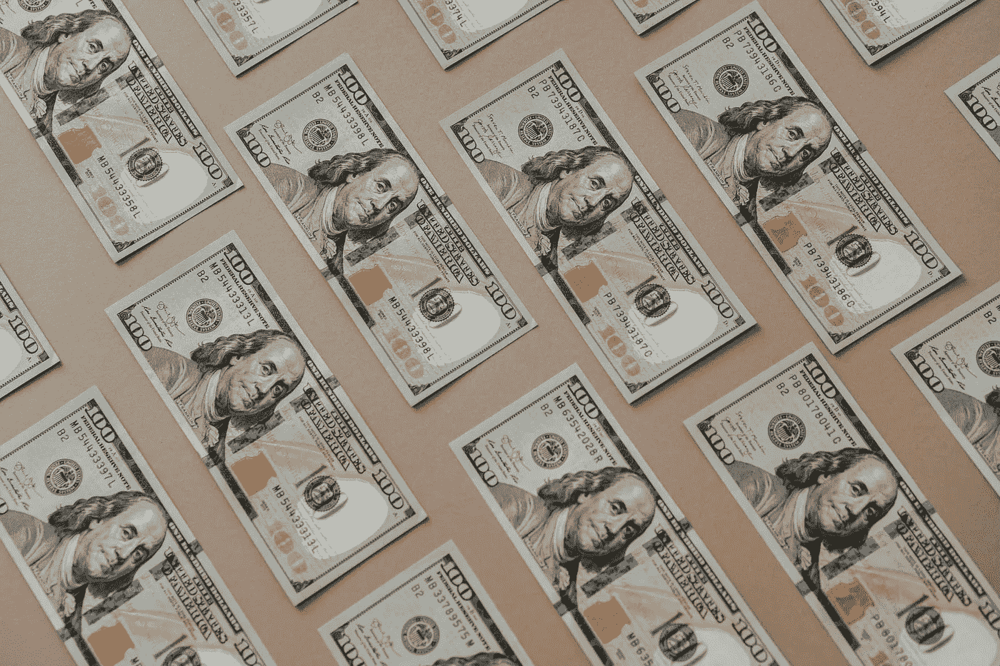

# 通货膨胀会让你变穷

> 原文：<https://medium.com/coinmonks/inflation-is-keeping-you-poor-f17408c9bafc?source=collection_archive---------2----------------------->

Karolina Grabowska (Pexels)

想象你在大海中央的一艘船上。然后你注意到一个问题:你的船里装满了水。绝望中，你试图堵住洞口，抓起一个水桶，疯狂地试图以比水进来的速度更快的速度排水。

…这就是我们的财富正在发生的变化…

这艘船是我们用挣来的钱和攒下的钱养活自己的努力。外来的水威胁着我们的船*(危机，疫情等)。)、*而水桶就是我们拯救我们金融财富的方式*(股票、房地产等)。*

现在，让我们的船沉没的是通货膨胀。让我解释一下。

通货膨胀意味着随着时间的推移，你的购买力会下降。 *举个例子，如果一个苹果在 2015 年的价格是 2 美元，现在在 2021 年的价格是 5 美元，你现在必须多花 3 美元才能买到几年前可以买到的同样商品。*

这就是**购买力下降的含义**；为同样数量的商品支付更多的钱。又称**通货膨胀**。

有趣的地方就在这里…

人们纠结于他们从工作中赚了多少钱——甚至对“育儿”感到兴奋(我的朋友这样称呼它)。是啊！拥有更多的钱听起来很棒，但是大多数人不明白财富的第二层含义。这是富人非常明白的事情:**保护你的购买力(免受通货膨胀)。**

> 不要问自己“我怎样才能赚更多的钱？”问问自己“我该如何保护自己的购买力？”—蒂姆·丹宁，退休银行家

(或者，我该如何保护我的船？)

Cottonbro (Pexels)

**有钱人对钱的看法不一样。**他们为这种类型的英特尔向财务顾问支付了大量资金，他们花了大量时间了解不同的资产类别，并相应地分配资源。他们明白，你挣多少钱不如保护你的购买力重要。

> 他们的首要目标是相对于他们经历的历史时期(衰退、危机、萧条、经济停滞)，提高他们的购买力蒂姆·丹宁，退休银行家

# 现在通货膨胀是如何产生的？

新冠肺炎疫情导致数百万人失业，陷入金融动荡。作为对此的回应，世界各地的政府和中央银行开始印刷数万亿美元。

实际上，他们做了两件事:

他们凭空创造了更多的钱。

他们降低了利率。

他们给它起了非常花哨的名字，比如“量化宽松”、“刺激检查”、“免除债务”或“财政支出”。

印刷“无限量的货币”意味着有更多的钱注入我们的经济。我们经济中更多的钱意味着它会贬值。这意味着今天的 100 美元比明天的 100 美元能买到更多的商品。这意味着**随着时间的推移，你储蓄账户里的钱实际上购买力在下降。**这意味着通货膨胀让你变穷了。

> TL；博士:意思是*未来——你*比*今天——你*穷。

更糟糕的是，我们甚至还没有开始感受到通货膨胀的真正影响。我们可能在接下来的 2-5 年内感受不到它们，这个时期可能会被标记为大通胀时代。

> 你知道吗？各国出于不同的原因印制货币:疫情、危机、资助战争、让国家走出衰退、放贷以及其他各种各样的原因。

Olia Danilevich (Pexels)

第二部分——将利率降至 0%。**这意味着人们在银行账户中的存款没有得到回报。在这样做的时候，政府和银行鼓励人们花掉他们的钱来刺激经济。**

然后你把这两个因素放在一起——加印钞票和将利率降至 0%——人们就没有多少财富了。他们被单独留在他们下沉的船上。

最糟糕的是，通货膨胀对社会各个阶层和种族的影响是不同的。虽然富人免受其害，但弱势群体、下层阶级、单亲父母、学生以及几乎所有不富裕的人却受害最深。这就是为什么下层阶级处于永无止境的贫困循环中，无法摆脱。

一旦通货膨胀开始，就非常非常难以控制。

# **最后一句话……**

你现在能做什么？专注于保护你的财富，而不是金钱。

现在比以往任何时候都更重要的是了解钱，它是如何运作的，以及谁从当前的设置中受益。了解存在哪些资产，了解它们的利弊，了解何时拥有它们。

> 蒂姆·丹宁(Tim Denning)说:“了解你可以储存你所创造的价值的方式。

这包括学习储存财富的替代方式，比如比特币。

**比特币是一种不受政府或银行控制的数字资产。这意味着这些机构不能操纵、控制或过度膨胀比特币的供应。因此，他们无法改变比特币的价值和你的财富。让它深入人心，因为它是强大的。**

事实上，永远只会有 2100 万个比特币(不像美元)。这种稀缺性很重要。这意味着比特币不受我们今天看到的通货膨胀水平的影响。 表示它是一种可以在今天、明天和 60 年后保值的资产。

**有史以来，比特币首次成为了一种摆脱通胀的方式。**我们有办法为我们自己、我们的孩子以及我们孩子的孩子保护我们的财富。

我们有一艘新的更好更安全的船。

*想买比特币？考虑在 Netcoins.ca* 购买

— — — — — — — — — — — — — — — — —-

> 加入 Coinmonks [Telegram group](https://t.me/joinchat/EPmjKpNYwRMsBI4p) 并了解加密交易和投资

## 另外，阅读

*   什么是[闪贷](https://blog.coincodecap.com/what-are-flash-loans-on-ethereum)？
*   最好的[密码交易机器人](/coinmonks/crypto-trading-bot-c2ffce8acb2a) | [网格交易](https://blog.coincodecap.com/grid-trading)
*   [3 商业评论](/coinmonks/3commas-review-an-excellent-crypto-trading-bot-2020-1313a58bec92) | [Pionex 评论](/coinmonks/pionex-review-exchange-with-crypto-trading-bot-1e459d0191ea) | [Coinrule 评论](https://blog.coincodecap.com/coinrule-review-a-perfect-trading-bot)
*   [AAX 交易所评论](/coinmonks/aax-exchange-review-2021-67c5ea09330c) | [德里比特评论](/coinmonks/deribit-review-options-fees-apis-and-testnet-2ca16c4bbdb2) | [FTX 密码交易所评论](/coinmonks/ftx-crypto-exchange-review-53664ac1198f)
*   [n 零审核](/coinmonks/ngrave-zero-review-c465cf8307fc)
*   [Bybit Exchange 审查](/coinmonks/bybit-exchange-review-dbd570019b71) | [Bityard 审查](https://blog.coincodecap.com/bityard-reivew)|[inter tax 审查](https://blog.coincodecap.com/interdax-review)
*   [3Commas vs Cryptohopper](/coinmonks/3commas-vs-pionex-vs-cryptohopper-best-crypto-bot-6a98d2baa203)
*   最好的比特币[硬件钱包](/coinmonks/the-best-cryptocurrency-hardware-wallets-of-2020-e28b1c124069?source=friends_link&sk=324dd9ff8556ab578d71e7ad7658ad7c) | [BitBox02 回顾](/coinmonks/bitbox02-review-your-swiss-bitcoin-hardware-wallet-c36c88fff29)
*   [总账 vs 平均](https://blog.coincodecap.com/ngrave-vs-ledger)
*   [密码拷贝交易平台](/coinmonks/top-10-crypto-copy-trading-platforms-for-beginners-d0c37c7d698c) | [比特码拷贝交易](https://blog.coincodecap.com/bityard-copy-trading)
*   [莱杰 nano s vs x](https://blog.coincodecap.com/ledger-nano-s-vs-x)
*   [Vauld Review](https://blog.coincodecap.com/vauld-review)|[you hodler Review](/coinmonks/youhodler-4-easy-ways-to-make-money-98969b9689f2)|[BlockFi Review](/coinmonks/blockfi-review-53096053c097)
*   最好的[加密税务软件](/coinmonks/best-crypto-tax-tool-for-my-money-72d4b430816b) | [CoinTracking 评论](/coinmonks/cointracking-review-a-reliable-cryptocurrency-tax-software-5114e3eb5737)
*   最佳[加密借贷平台](/coinmonks/top-5-crypto-lending-platforms-in-2020-that-you-need-to-know-a1b675cec3fa)
*   [莱杰纳米 S vs 特雷佐 one vs 特雷佐 T vs 莱杰纳米 X](https://blog.coincodecap.com/ledger-nano-s-vs-trezor-one-ledger-nano-x-trezor-t)
*   [block fi vs Celsius](/coinmonks/blockfi-vs-celsius-vs-hodlnaut-8a1cc8c26630)|[Hodlnaut 审核](https://blog.coincodecap.com/hodlnaut-review)
*   [Bitsgap 审查](/coinmonks/bitsgap-review-a-crypto-trading-bot-that-makes-easy-money-a5d88a336df2) | [Quadency 审查](/coinmonks/quadency-review-a-crypto-trading-automation-platform-3068eaa374e1)
*   [埃利帕尔泰坦评论](/coinmonks/ellipal-titan-review-85e9071dd029) | [赛克斯斯通评论](https://blog.coincodecap.com/secux-stone-hardware-wallet-review)
*   [BlockFi 评论](/coinmonks/blockfi-review-53096053c097) |在您的加密中赚取高达 8.6%的利息
*   [DEX Explorer](https://explorer.bitquery.io/ethereum/dex) 和[区块链 API](https://explorer.bitquery.io/graphql)
*   [加密套利](/coinmonks/crypto-arbitrage-guide-how-to-make-money-as-a-beginner-62bfe5c868f6)指南:新手如何赚钱
*   最佳[加密制图工具](/coinmonks/what-are-the-best-charting-platforms-for-cryptocurrency-trading-85aade584d80)
*   了解比特币的[最佳书籍有哪些？](/coinmonks/what-are-the-best-books-to-learn-bitcoin-409aeb9aff4b)

> [在您的收件箱中直接获得最佳软件交易](/coinmonks/newsletters/coinmonks)

