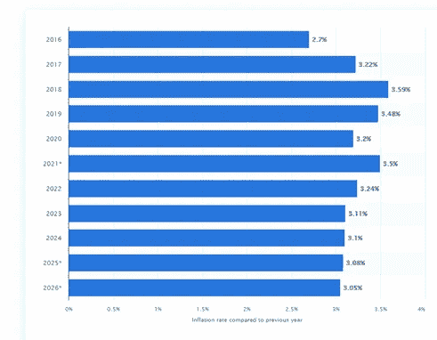
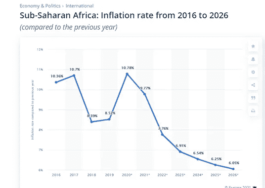

# 通货膨胀:消失无踪

> 原文：<https://medium.com/coinmonks/inflation-sinking-without-a-trace-d9754058b2fc?source=collection_archive---------12----------------------->

当事情超出你的控制时，你需要接受它。然而，你也需要专注于你能控制的事情，同时努力保持乐观。保持乐观并不容易。但这是最有回报的道路。这会使工作更容易。做工作，一步一步来。你能做的最糟糕的事情就是呆在流沙里。

## 通货膨胀就像流沙

*你就像
流沙，流沙
把我拉得越来越近
在你怀里
无法抗拒你爱的魅力
你就像流沙让我越陷越深*

> "通货膨胀可能会成为你前进的动力，这完全取决于你的定位."

安迪是个聪明的小男孩。当他上大学时，一些大男孩会聚在一起欺负他。他们会奚落他，让他回击。有时，他会被撞进储物柜，他的启动资金被盗。这就是大学里的霸凌。还有一种微妙的恶霸叫做*通货膨胀*。

今天，许多人为一份又一份的薪水而奋斗。通货膨胀也于事无补。这就像站在流沙中。你在银行里有钱，但是利率是个位数，而通货膨胀是两位数。你决定投资债券，却意识到可能需要 20 年才能让投资翻倍，或者获得可观的回报。

有人拉你一把，你就更容易摆脱困境。

一位女士在拉各斯开了一家面包店。最初，她卖得很好，生意也做得不错。沿着这条线，投入的成本开始上升。发酵粉、面粉、糖、黄油，所有的东西都开始增加。出于沮丧，她开始对员工使用强硬的措辞。

她的员工一个接一个地开始离开。他们中的一些人加入了她的一个竞争对手，生意开始急转直下。她不知道如何经营面包店。她对面包店的生意知之甚少——她只看到她的朋友生意做得很好，就决定也去做。最后，她寻求建议，不得不参加一个课程，学习管理面包店盈利。

通货膨胀是一个恶霸。通货膨胀告诉你，你的工资不再能够支持你曾经的生活质量。你打算怎么办？

[Global inflation rate courtesy of Statista](https://www.statista.com/statistics/256598/global-inflation-rate-compared-to-previous-year/)

## 通货膨胀可能是你航行中的风

通货膨胀通常是由两个因素的平衡或不平衡引起的。首先是流通中的货币。

当有大量货币流通时，通货膨胀就会加剧。第二是商品或服务的可获得性。

因此，当供应极度短缺或需求极度飙升时，也可能导致商品和服务价格上涨。

Inflation rate in Sub-Saharan Africa

## 通货膨胀的类型

通货膨胀有两种类型。需求拉动型通货膨胀是由顾客的需求引起的。对商品和服务的过高需求导致商品和服务价格上涨。在这种情况下，货币政策在控制通货膨胀方面是有效的。第二种通胀是成本推动型通胀。这是由该国企业生产成本的增加造成的。生产成本的增加导致商品和服务价格的上涨。生产者将成本(生产链中产生的额外成本)转移给消费者，导致消费者为商品支付更多的钱。

## 中央银行的角色

央行通常会设定一个他们认为的理想通胀水平目标。他们称之为“通胀目标”中央银行的规则是制定货币政策，并监控货币供应量，新的货币被印出来以满足这一目标。

这种思想认为，如果普通工人的工资随着通货膨胀同步增长，那么这对工人是有利的。

另一方面，如果通货膨胀与工人的工资相比上升太多，那么工人就不能像过去那样用同样的工资买那么多东西。因此，从技术上讲，这些工人的生活质量已经下降。

中央银行是不是印了太多的钱？这个问题的答案是肯定的。中央银行的政策是解决大问题，如经济不景气，或通过推动问题来促进即将到来的金融崩溃。他们试图通过印更多的钱来解决这个问题。这并不总是坏的，当然，它有它的用处。但是，当长期印刷的货币过多时，就会导致通货膨胀。

随着时间的推移，这使得奈拉价值下降。这些旨在刺激经济和支持贫困人口的活动大多是必要的，但当这些活动走到极端时，就有导致恶性通货膨胀的风险。它可能变得如此糟糕，以至于失去控制，无论中央银行采取什么行动，都没有效果，他们无法控制它，处方不起作用，病人对治疗没有反应。

## 用于衡量通货膨胀的指标

有许多指数用来衡量通货膨胀率。它们包括消费者价格指数(CPI)和生产者价格指数(PPI)。这两个指数被认为是衡量通货膨胀的重要指标。消费者价格指数是衡量消费者购买商品和服务的平均价格变化的指标。在衡量消费者价格指数时，一些家庭需求和日常需求项目被考虑在内。在考虑 CPI 时，牛奶、谷物、运输成本、住房成本等项目都被考虑在内。

生产者价格指数(PPI)是从生产经济中消费的产品的行业的角度来衡量成本的。它从生产者的角度衡量价格。

## 这完全是关于定位的

把你的钱存在银行，依靠利息并不是最好的选择，因为与通货膨胀率相比，你的资本利息可以忽略不计。让你的钱发挥作用。投资企业。投资于人。投资房地产或其他商品。退出现金，进入资产。那样的话，你会从通货膨胀中受益，因为资产会持续增值，而你的现金会持续贬值。

事实是，受打击最大的是低收入人群。富人拥有资产，富人的想法不同，他们投资于增值的资产，所以他们资产的收入比如说你有一处房产，而该房产可以让你获得租金，所以他们资产的利息可以支付费用，这是理所应当的。但对于那些依赖于薪水的人来说，他们将在这个经济中挣扎，所以最好的事情是保留你薪水的一部分，并将其作为你的循环财富基金继续投资，我会继续增加它，你的那部分薪水将用于保障你的未来。

graphQL，

## 如何控制通货膨胀？

通货膨胀是一段时间内商品和服务成本的持续增长。一点通货膨胀并不是一件坏事。其实完全正常。

世界各地发布的各种刺激方案，以及 COVID 造成的供应瓶颈意味着通货膨胀将在中短期内加剧。

高水平的通货膨胀(例如尼日利亚的通货膨胀)令人头疼。这意味着在一段时间内，钱会失去它的价值。

尼日利亚的长期通货膨胀率是每年 12%。这意味着在 4 年内，比如说，₦1000 将会失去₦480 的价值。

那么，如何管理通胀呢？最好的办法是投资回报率高于通胀率的资产。有时这是不可能的。在这种情况下，下一个最好的选择是追求接近通货膨胀率的回报。

你也可以投资于通货膨胀率低得多的货币，如美元或英镑。

在日常生活中，尤其是食品和其他家庭用品，如果资金允许，可以考虑批量购买。

## 我想制定一个 10 年的财务计划。我该怎么做呢？

首先要注意的是，计划不是具体的。计划持续的时间越长，它改变的可能性就越大。一个计划，不管有多糟糕，总比没有计划好。

最简单的方法是把你的计划分解成年度计划甚至季度计划。这样就更容易衡量进展，并在需要时进行修改。

你可以把一个财务计划分成两点:你目前的状况和你的目标。

你目前的状况包括你的收入、你的技能和你的支出。提高这些技能会导致收入的增加，最终会增加你可以投资的金额。

随着时间的推移，费用增加是完全正常的。通货膨胀意味着东西更贵了。生活方式的膨胀也开始了。随着收入的增加，人们倾向于增加支出。

你打算去的地方可能包括将来可能发生的费用。

在某些时候，你可能会决定有一个自己的家庭。那会带来更高的费用。

随着时间的推移，提高你的金融知识也很重要。

退休也是一个人必须计划的事情，尤其是对于自雇人士。

## 你知道吗？

Club Swan-It’s your money, your lifestyle.

天鹅俱乐部的会员资格可以帮助你避免通货膨胀。您可以轻松地无缝地从 Crypto 迁移到 Fiat，然后再迁移回来。天鹅俱乐部账户有多种货币，在全球超过 38 个国家接受。更多信息，请点击此链接:[https://clubswan.com/](https://clubswan.com/)