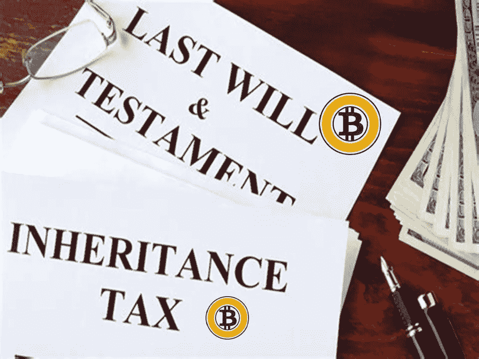
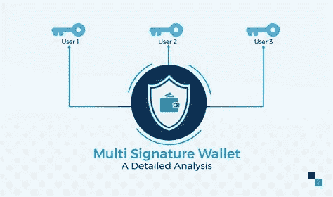

# 遗产和比特币:一项复杂的事业。

> 原文：<https://medium.com/coinmonks/inheritance-and-bitcoins-a-complex-undertaking-ae8205fef9ba?source=collection_archive---------4----------------------->

## **九点比特币继承计划，以应对司法风险、法律冲突、托管和隐私问题以及日益增加的苛捐杂税风险。**

Bitcoin inheritance

我遗产规划可能是比特币创造者最忽视的话题。这是人类的天性。密码持有者通常很年轻，倾向于认为死亡的可能性很小。据统计，大多数比特币创造者是千禧一代，而[只有 22%的千禧一代](https://www.aarp.org/money/investing/info-2017/half-of-adults-do-not-have-wills.html)似乎有意愿。年轻的比特币矿工迈克尔·穆迪(Michael Moody)的家人经历了惨痛的教训。最近，另一位比特币千万富翁——41 岁的米尔恰·波佩斯库在哥斯达黎加溺水身亡——的财富可能永远消失了。因此，谨慎的做法是尽早为不可避免的事件做好计划，以确保至少我们的比特币将惠及我们的家庭，而不仅仅是从加密资产日益增加的货币稀缺性中受益的比特币社区。

但是制定一个好的加密继承计划并不容易。

遗产规划是复杂的，有管辖权，税收和隐私问题。此外，与任何其他资产相比，加密货币/加密资产的自我保管要复杂得多。

要确保你的家人能拿到你的比特币钱包，需要一个万无一失的周密计划。

最近，一些公司，如 [Casa](https://keys.casa/) 和 [Unchained Capital](https://unchained-capital.com/) ，已经推出了新的保管服务，处理多签名地址的技术处理，使密码持有者能够在多个可信方之间共享钱包的保管权，以避免单点故障。

虽然这种服务有很好的优点——特别是对于那些不持有大量密码并且在技术上精通处理过程的人——但在我看来，它们不适合任何持有更多密码的人。

原因在于，在这种情况下，必须仔细考虑其他问题，这些问题比多信令地址的简单技术实现更重要。**这些问题是:( a)对隐私的需求,( b)对继承适用法律的专业建议的需求,( c)选择最合适的司法管辖区来保护待继承的加密资产。**

对于任何严肃的比特币玩家来说，上述服务都有以下限制和缺点:

*   您将向不受任何保密义务约束的公司披露您持有的比特币，如果需要，该公司也没有能力合法抵制政府机构或司法法院就您的加密资产发出的令状。
*   这些公司的总部设在美国，它们将受到美国政府将来可能颁布的任何限制性法规的约束。目前在美国和欧盟都有很多监管方面的不确定性，为了安全起见，我认为这两个地区对密码持有者来说都是“危险的”。此类法规可能会通过强制 KYC 或出于税务目的的强制报告，严重影响加密持有者的“隐私”。任何此类公司也可能受到代表第三方在针对加密持有者的司法案件中发出的传票。
*   通过与这样的公司互动，密码持有者不必要地将自己暴露给第三方弱点。如果无法避免与此类公司打交道，那么可以通过插入额外的保护层来实现，如信托、信托公司或律师。律师将根据专业授权行事，他/她将受到法律上可执行的律师-委托人特权的约束。

虽然[律师-客户特权](http://www.ellislawgrp.com/article19privilege.html)和工作成果原则[有时可以被放弃](https://www.ropesgray.com/en/newsroom/alerts/2019/02/A-Brief-Exploration-of-Privilege-Nuances-in-the-Tax-Context)，**但这通常意味着律师不能被迫向当局或第三方披露他与客户的专业交易细节，当然更不用说客户持有多少比特币，以及其遗产规划。虽然律师-委托人特权起源于英美法系和大陆法系国家的不同传统，但它在世界范围内得到了法律上的认可。[关于国际上律师-委托人特权的详细分析，请参见此处](https://legacy.pli.edu/product_files/Titles/1695/%23237710_02_International_Corporate_Practice_P3_20180604150126.pdf)。**

因此，对于任何持有大量密码的人，我建议采取不同的、更谨慎的遗产规划方式。多少是“实质性的”显然是主观的。对某人来说可能是 5 万美元，对千万富翁来说可能超过 50 万美元，而对亿万富翁来说可能是 5000 万美元。无论如何，根据我的经验，有一个阈值，超过这个阈值，专业咨询和建立继承计划的成本是完全合理的，这是要继承的加密资产的市场价值，大约为 500.000 美元。但是对于价值超过 200，000 美元的加密资产，如果客户预计加密资产在未来会增加，或者如果他/她更重视能够为继承人的未来保护资产，那么获得专业建议仍然是有意义的。毕竟，规划和结构都可以是模块化的，并基于客户的需求和预算。

加密继承的九点计划。

1.适用于继承的法律必须仔细考虑。国际法律冲突也经常成为问题。除非你位于少数几个传统上进步和加密友好的司法管辖区(如瑞士和列支敦士登)或一些即将到来的司法管辖区(如萨尔瓦多、塞浦路斯或葡萄牙)，否则就加密资产/加密货币而言，请始终假设你位于一个“高风险”的司法管辖区。

风险是双重的:(i) [地方当局可能禁止或严格限制加密资产所有权的风险](https://en.wikipedia.org/wiki/Legality_of_bitcoin_by_country_or_territory)；以及(ii)更广泛的风险，即政府将利用法规“抑制”加密资产的采用，要么使其过于繁琐(通过监管合规)，要么过于昂贵(通过不相称的税收)。抛开上述(I)项下的风险(这很容易评估，目前仅限于全球少数几个已知国家),大多数密码持有者都应该关注上述(ii)项下的风险，正如最近[美国监管机构在最近的参议院基础设施法案](https://www.coindesk.com/with-crypto-tax-rules-conservatives-chose-tax-cheats-over-free-enterprise)中所确认的那样。不幸的是，这种风险很难预测。这就是为什么我建议在可预见的未来，根据上述(ii)项，将美国和大多数欧盟国家视为高风险国家。

2.在许多司法管辖区，对于选择哪种法律适用于遗产继承有法定限制。例如，如果您居住在欧盟，您应该意识到，不管其他因素(如您的国籍)如何，欧盟第 650/2012 号法规已经规定，默认情况下，管理遗产的法律应该是死者“惯常居住地”的法律。然而，根据第 650/2012 号法规第 22 条，立遗嘱人可以在遗嘱中选择其国籍国的法律适用于继承。对于潜在的法律冲突，更有甚者，欧盟 Reg 650/2012 并未对遗产的税务处理做出规定，遗产的税务处理主要由(I)遗产所在地的税法或(ii)两国之间的任何现有遗产税条约进行规定。

那么继承的比特币钱包的税收问题呢？

这将取决于所涉及的国家和相关税收协定(如果存在)的规定。税收协定既没有约束也没有定义加密资产和加密货币。如果解释现有条款并将加密货币/加密资产与法定货币进行比较，则适用的税法将是加密钱包所在地的法律。否则将适用死者住所地国家的法律。

**正如上文第 1(ii)条所述，未来影响美国和欧盟加密持有者的最大风险将是资产的过度征税，因此，立遗嘱人最好完全避免这种混乱的环境和潜在的冲突和风险，并将钱包/私钥存储在加密友好和税收高效的外国管辖区。**这与他/她的国籍和惯常居住地无关。想象一下，如果你的继承人将不得不面对继承的加密资产的 50 %- 60%的苛捐杂税。以为这是幻想？这可能不会发生吗？

After the Great Reset “[own nothing (be a slave) and be happy](https://www.forbes.com/sites/worldeconomicforum/2016/11/10/shopping-i-cant-really-remember-what-that-is-or-how-differently-well-live-in-2030/)” the last creation of the “Illuminati” globalist crowd to implement THEIR version of YOUR future well being is called Agenda 2030

当我看到在大多数欧盟国家和美国掌权的政治家是谁，以及他们与特殊利益集团的关系，如[彼尔德伯格集团](https://en.wikipedia.org/wiki/List_of_Bilderberg_participants)、[三边委员会](https://freddonaldson.com/2021/03/02/trilateral-commission-current-membership-with-2021-individual-affiliations-and-photos/)、[索罗斯开放社会基金会](https://legacy.gscdn.nl/archives/images/soroskooptbrussel.pdf)、WEF 和他们的寡头驱动的极权主义议程时，我宁愿安全起见，认真关注并相应计划。

3.隐私问题也必须仔细考虑，以及密码持有的历史。如果你在 KYC 的加密交易所购买了比特币，你的计划将不同于那些在没有 KYC 的情况下购买比特币的人。

4.雇佣熟悉国际遗产事务和密码事务的律师。避免非合格律师和财务顾问的税务顾问。如上所述，原因是您希望受到律师-客户特权的法定保护，以避免将关键信息泄露给第三方，甚至税务机关或司法程序。

更好的是，如果这样的律师是一个加密友好和税务有效的司法管辖区的居民，可以安全地处理整个程序，远离你居住国的税务机关。

5.如果你在一个没有比特币的司法管辖区，你的加密资产将面临上述 1(i)项下的风险，你应该确保在需要时，你的家人可以访问你的离岸加密资产，远离政府。

假设你是一个富有的中国人，不顾政府的禁令，囤积了大量比特币。在这种情况下，留给继承人以获得加密资产的信息量必须保持在最低限度。没有数量，没有钱包地址，没有私人钥匙。只是暗示联系一个值得信赖的海外律师就足够了。

6.建立一个多对多地址方案来保管你希望你的继承人继承的密码。仔细计划需要多少可信方来共同保管钱包，以及钱包和备份种子将存放在哪里。

举个例子，在你居住的国家，你只能保管一个钱包，并有书面指示，以便你的继承人找到它并采取行动。第二个钱包可以由你的离岸加密继承律师持有，第三个钱包可以一直存放在离岸保险箱中，你持有一把钥匙，你的律师持有另一把。通过这种方式，你可以随时获取你的硬币，而不需要受托人。你的继承人也一样。但如果出了问题，你家里的钱包丢失或被地方当局没收，你的继承人仍可以在海外获得比特币，并收回由受托人保管的钱包以及存放在保险箱中的钱包。multisig 钱包中每个地址的备份种子显然也是如此。

7.如果需要，考虑介入法律结构，如托管一个或多个 multisig 小墙的信托或信托公司。

8.仔细计划你能给予你的受托人什么类型的激励，以在未来为你家庭的最大利益而行动。在成功分配给你的继承人时，从加密堆栈中支付的成功费将创造奇迹，激励那些可能坐在办公桌前等待继承人联系他的人。

9.批判性地评估你的继承人的技术能力，以成功地执行你的继承计划。如果您认为他们的加密知识不足，请考虑一个可以在此过程中帮助他们的可信的人，并为他/她的参与制定计划。

一个可靠的、称职的、有能力的加密律师和一个基于加密友好和税收高效的司法管辖区的 multisig 钱包方案可能是最好和最安全的解决方案，尽管可能不是最便宜的。

**我可以在我的网站** **上使用** [**这份“联系表”秘密联系我。**](https://www.bianconiandrea.com/contact/)

#加密#区块链#比特币#加密货币#遗产#税收#法律冲突

[www.bianconiandrea.com](http://www.bianconiandrea.com)—2021

如果你喜欢这篇文章，请在左下角“鼓掌”x 次，这样会有更多的人分享。非常感谢

**捐赠给**[**www.bianconiandrea.com/**](https://www.bianconiandrea.com/)支持我独立自由的写作

******************************************************************

**法律免责声明**:本网站及其中包含的信息仅供一般指导，并不构成法律意见。因此，它不应被用来替代就具体问题与律师的磋商。本文中的所有信息均按“原样”提供，不保证完整性、准确性、及时性或任何形式的明示或暗示的担保。

**投资免责声明**:本网站及其中包含的信息无意成为与所提交材料相关的建议或信用分析的来源，本网站中包含的信息和/或文件不构成投资建议。

www.bianconiandrea.com—2021 年

*原载于 2021 年 8 月 17 日 https://andreabianconi.medium.com**[*。*](https://andreabianconi.medium.com/inheritance-and-bitcoins-a-complex-undertaking-12d7dd6010e1)*

> 加入 [Coinmonks 电报频道](https://t.me/coincodecap)，了解加密交易和投资

## 另外，阅读

*   [电网交易机器人](https://blog.coincodecap.com/grid-trading) | [Cryptohopper 审核](/coinmonks/cryptohopper-review-a388ff5bae88) | [Bexplus 审核](https://blog.coincodecap.com/bexplus-review)
*   [加密复制交易平台](/coinmonks/top-10-crypto-copy-trading-platforms-for-beginners-d0c37c7d698c) | [如何在 WazirX 上购买比特币](/coinmonks/buy-bitcoin-on-wazirx-2d12b7989af1)
*   [CoinLoan 点评](https://blog.coincodecap.com/coinloan-review)|[Crypto.com 点评](/coinmonks/crypto-com-review-f143dca1f74c) | [火币保证金交易](/coinmonks/huobi-margin-trading-b3b06cdc1519)
*   [OKEx vs KuCoin](https://blog.coincodecap.com/okex-kucoin) | [摄氏替代品](https://blog.coincodecap.com/celsius-alternatives) | [如何购买 VeChain](https://blog.coincodecap.com/buy-vechain)
*   [币安期货交易](https://blog.coincodecap.com/binance-futures-trading)|[3 commas vs Mudrex vs eToro](https://blog.coincodecap.com/mudrex-3commas-etoro)
*   [如何购买 Monero](https://blog.coincodecap.com/buy-monero) | [IDEX 评论](https://blog.coincodecap.com/idex-review) | [BitKan 交易机器人](https://blog.coincodecap.com/bitkan-trading-bot)
*   [尤霍德勒 vs 科恩洛 vs 霍德诺特](/coinmonks/youhodler-vs-coinloan-vs-hodlnaut-b1050acde55a) | [Cryptohopper vs 哈斯博特](https://blog.coincodecap.com/cryptohopper-vs-haasbot)
*   [顶级付费加密货币和区块链课程](https://blog.coincodecap.com/blockchain-courses) | [币安评论](/coinmonks/binance-review-ee10d3bf3b6e)
*   [MXC 交易所评论](/coinmonks/mxc-exchange-review-3af0ec1cba8c) | [Pionex vs 币安](https://blog.coincodecap.com/pionex-vs-binance) | [Pionex 套利机器人](https://blog.coincodecap.com/pionex-arbitrage-bot)
*   [如何在印度购买比特币？](/coinmonks/buy-bitcoin-in-india-feb50ddfef94) | [WazirX 评论](/coinmonks/wazirx-review-5c811b074f5b) | [BitMEX 评论](https://blog.coincodecap.com/bitmex-review)
*   [印度的加密交易所](/coinmonks/bitcoin-exchange-in-india-7f1fe79715c9) | [比特币储蓄账户](/coinmonks/bitcoin-savings-account-e65b13f92451) | [HitBTC 评论](/coinmonks/hitbtc-review-c5143c5d53c2)
*   [币安收费](/coinmonks/binance-fees-8588ec17965) | [Botcrypto 审查](/coinmonks/botcrypto-review-2021-build-your-own-trading-bot-coincodecap-6b8332d736c7) | [Hotbit 审查](/coinmonks/hotbit-review-cd5bec41dafb) | [KuCoin 审查](https://blog.coincodecap.com/kucoin-review)
*   [我的密码交易经验](/coinmonks/my-experience-with-crypto-copy-trading-d6feb2ce3ac5) | [AAX 交易所评论](/coinmonks/aax-exchange-review-2021-67c5ea09330c)
*   [逐位融资融券交易](/coinmonks/bybit-margin-trading-e5071676244e) | [币安融资融券交易](/coinmonks/binance-margin-trading-c9eb5e9d2116) | [超位审核](/coinmonks/overbit-review-9446ed4f2188)
*   [加密货币储蓄账户](/coinmonks/cryptocurrency-savings-accounts-be3bc0feffbf) | [YoBit 审查](/coinmonks/yobit-review-175464162c62) | [Bitbns 审查](/coinmonks/bitbns-review-38256a07e161)
*   [Botsfolio vs nap bots vs Mudrex](/coinmonks/botsfolio-vs-napbots-vs-mudrex-c81344970c02)|[gate . io 交流回顾](/coinmonks/gate-io-exchange-review-61bf87b7078f)
*   [CoinFLEX 评论](https://blog.coincodecap.com/coinflex-review) | [AEX 交易所评论](https://blog.coincodecap.com/aex-exchange-review) | [UPbit 评论](https://blog.coincodecap.com/upbit-review)