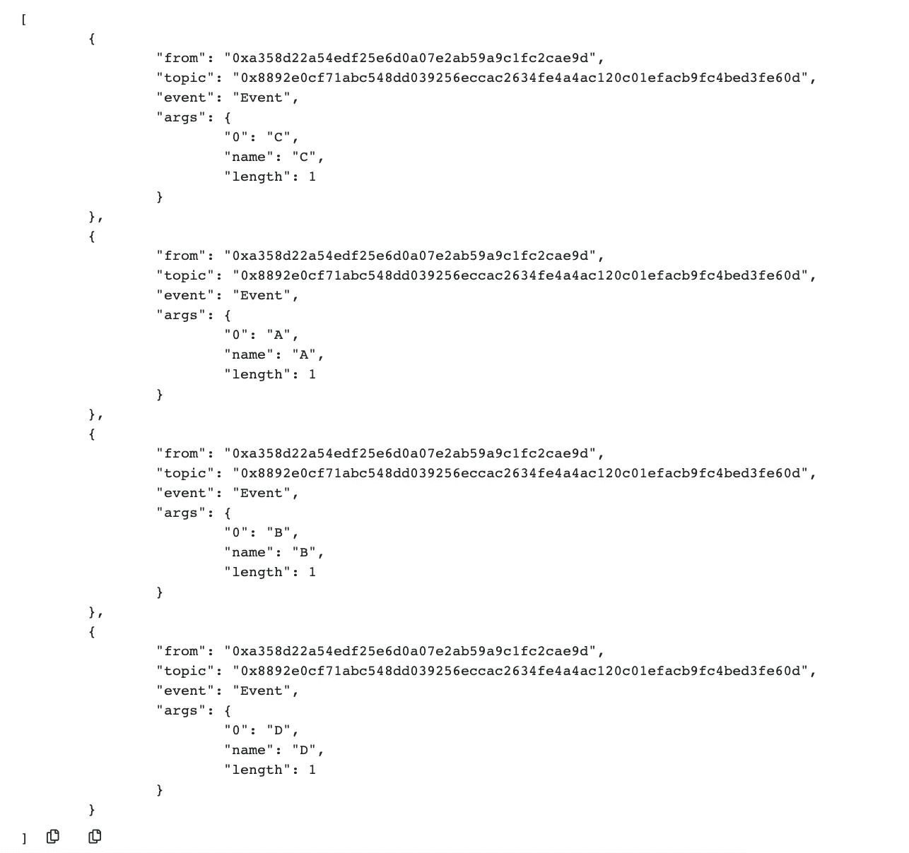
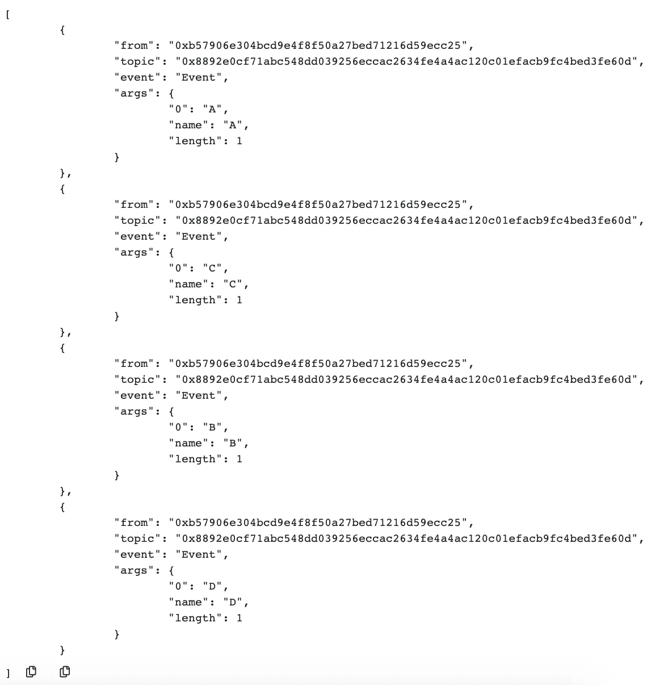

# 通过分析深度优先和广度优先的合同解决方案，解除了继承的神秘性

> 原文：<https://medium.com/coinmonks/inheritance-in-solidity-debunked-3d8dd32d3a99?source=collection_archive---------1----------------------->

Solidity 是为[以太坊区块链](https://medium.com/coinmonks/ethereum/home)编写智能合同最常用的编程语言。在本文中，我们将探讨可靠性语言的一个重要特征，那就是**继承**。

Solidity 的继承受到 Python 的启发，并使用 **C3 线性化**，也称为**方法解析顺序(MRO)** 来解析基类(Solidity 中的契约)。本文讨论的主题是如何通过 **C3 线性化**算法以特定顺序解析基本智能合约，以获得最终的智能合约。理解 **C3 线性化**算法并不是理解继承所必需的，也超出了本文的范围。

我们将把我们的[智能契约](https://blog.coincodecap.com/tag/smart-contact/)布局在一个基于菱形的继承图中，以更好地了解基础契约的解析。

我们在上述文件中有四个合同，即 **A、B、C** 和 **D** 。协定 D 继承自 B 和 C，协定 B 继承自协定 a。派生协定 D 的基础协定的解析从右向左进行。D 之后要解决的第一个契约是 B，然后是 A，最后是 C。合同的解决顺序可以描述为:

**D- > B- > A- > C**

我们已经在 Solidity 的官方文档中读到了用于解决基础契约的深度优先方法，我们将通过在 Remix 中部署契约 D 来验证它，并检查事件`Event`的日志，因为它是为每个包含在继承图中的契约发出的。

depth-first Inheritance

上面的屏幕截图显示了当我们部署契约 d 时，Remix 中的日志输出。输出中的日志按照这样的顺序排列，最后一个日志表示第一个发出的事件，第一个日志表示最后一个发出的事件。如果我们查看日志的“args”参数，我们可以看到合同的构造函数是按照 **D- > B- > A- > C** 的顺序执行的。这允许我们验证当选择用于解析的下一个契约是 A 而不是 c 时，在契约 B 的解析中使用的深度优先方法。

如果契约 C 也继承了契约 A，并且我们提出了菱形继承，那么基础契约的解析顺序会是一样的吗？

上面的文件有相同的契约，唯一的区别是现在契约 C 也继承了契约 A，我们有一个菱形的继承图。现在，如果我们部署合同 D，并在下面的快照中查看日志:

breadth-first inheritance

合同的解决顺序为 **D- > B- > C- > A** 。我们可以从上面快照的日志中看到，协定 B 的解析不涉及协定 A 的解析，并且算法在解析协定 B 之后立即解析协定 C，跳过协定 A。这是因为协定 A 后来也作为另一个协定基的一部分出现在继承链中。这几乎看起来像是广度优先的方法。这里的问题是，只选择继承链中最后一个出现的契约进行解析，其他的都被丢弃。当解析协定(协定 B)时，该算法查看基础协定(协定 A)并检查该协定是否是继承链中后来存在的另一个协定的基础，如果是(协定 C)，则该协定被丢弃，并且在该协定最后一次出现时进行解析(协定 A)。

我们还需要考虑到，这种继承应该对 **C3 线性化**算法有效。如果我们从契约 A 和 B 继承契约 D，使得`contract D is B, A {}`并试图编译契约 D，我们将不会成功，因为这种继承对于 **C3 线性化**是无效的。我们实际上是要求契约 A 覆盖契约 B，而契约 B 又覆盖契约 A，因此继承图是不可能的。

> [直接在您的收件箱中获得最佳软件交易](https://coincodecap.com/?utm_source=coinmonks)

