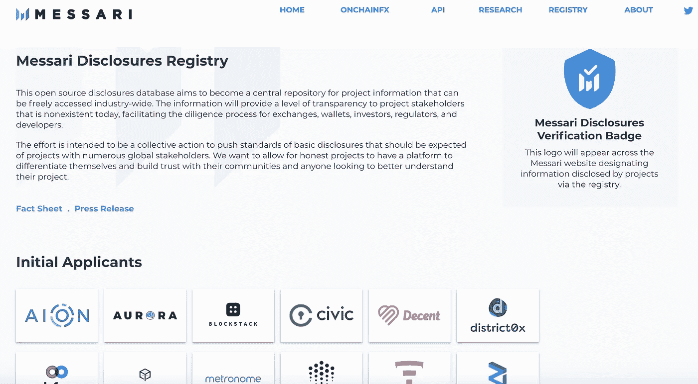
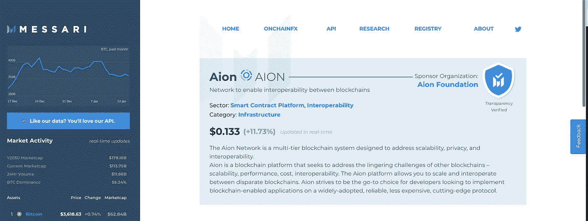
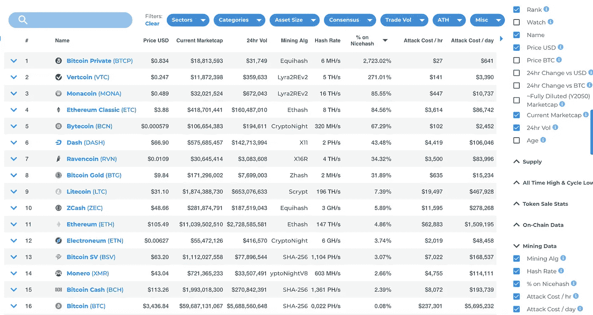
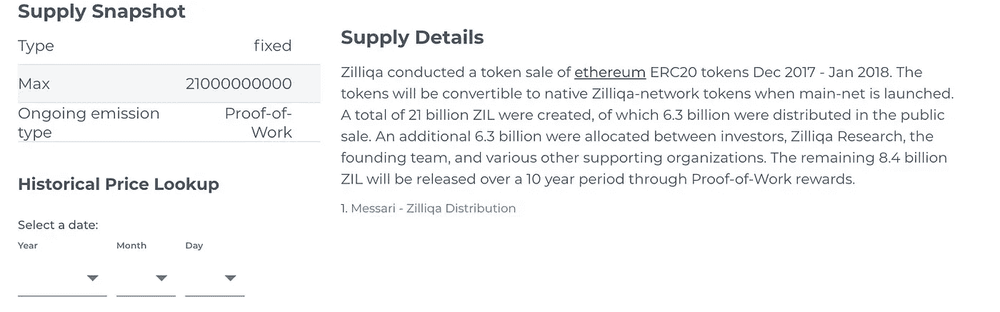
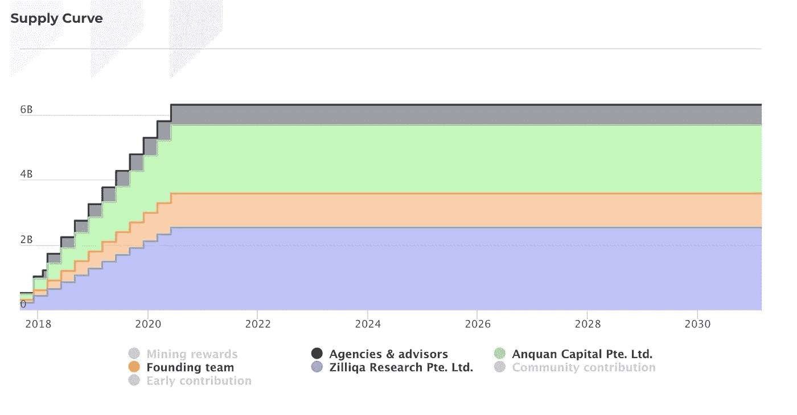
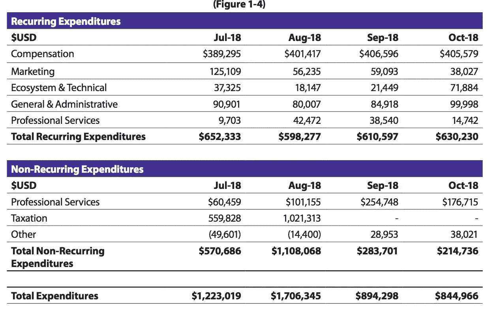

# 梅萨里的加密情报平台

> 原文：<https://medium.com/coinmonks/inside-messaris-crypto-intelligence-platform-3431525f469c?source=collection_archive---------3----------------------->

> 这篇文章关注的是如何用 Messari 的工具套件简化你的加密研究。

The front page of Messari’s Disclosures Registry

如果新闻业是民主的第四等级，那么研究就是密码的第四等级。分析师团队和独立研究人员揭露行业的障碍和突破，并为该领域几乎每家公司的战略决策提供支持。分析师们目前不得不搜索网络来汇编和分析杂乱无章的数据集。最受欢迎的资源，如 CoinDesk 的 Crypto-Economics Explorer 和 TokenData.io，对于找到指标和令牌网站的聚合链接很有用，但无法创建无缝的研究体验。

*进入 Messari。*

Messari 的平台是目前市场上最全面的密码研究和尽职调查工具集。它通过将网络上的数字资产数据汇集到一个位置，消除了研究人员工作流程中的许多低效问题。

2018 年 7 月，Messari 团队收购了首屈一指的加密资产数据追踪器 OnChainFX，这表明他们的产品战略可能取决于聚合有价值的数据集，以创建加密研究的核心。

**在我们深入研究 Messari 平台的一些用例之前，让我们先来探索一下它的三个主要优势:**

*   **便利性** : Messari 将项目信息(例如:筹资细节)、各种指标(例如:Github 统计)和专有研究结合起来，简化了搜索数据和来源的过程。该平台中可用的强大数据使其成为一个方便的令牌尽职调查一体化平台。
*   数据完整性:该团队致力于为您提供可信、可验证的数据。他们的[披露注册](https://messari.io/registry)计划，其中 token 团队选择公开分享他们的数据，以及研究团队最近对夸大指标的[独立分析](https://messari.substack.com/p/xrp-market-cap-may-be-61-billion)例证了 Messari 对推动透明度作为加密标准的重视。
*   **适应性:**高级过滤让您可以快速定制 Messari 的数据，以适应无数的用例。从投资者、开发商到交易所，任何人都可以梳理出相关的见解，利用 Messari 平台做出数据驱动的决策。

# 1 —市场研究

Messari 中的配置文件使用“部门”和“类别”标签，让您可以快速了解项目正在处理的问题集。通过点击一个标签(比如“互操作性”)，你可以描绘出该项目的前景和竞争对手。事实证明，这比通过几十个网站来构建自己的列表要方便得多。当您考虑每个项目使用的特定于协议的语言的数量时，可能会误解项目在生态系统中的位置。这些列表对于解决这个问题特别有帮助。

在 OnchainFX 菜单的“资产分类”标签下，你会发现 5 个主要的项目类别。这些类别进一步分为大约 40 个不同的部门，[可以在这里找到](https://messari.io/classifications)。这种内置的分类法使您能够理解团队为特定问题构建的不同解决方案，并且不会意外忽略任何关键项目。

# 2 —部门/项目跟踪和分析

当您使用 Messari 的分类系统通过 OnChainFX 工具构建自定义视图时，它的真正价值就变得很明显了。通过市场数据、链上数据和 Github 数据等指标来分析行业，您可以构建大量视图来开发 OnChainFX 的洞察力。

如果你是那些喜欢看世界燃烧的人之一，你可以做一个有趣的图表，这是一个关于 51%攻击的图表。

Chart= Filters> ‘Asset Size: Sm, Med, Lrg cap’ + ‘Consensus: Proof-of-Work’ . ‘% on Nicehash’ as ranking column

通过这个视图，我们了解了哪些资产最容易受到 51%的攻击。虽然这对攻击者很有用，但对优秀的演员来说更重要。通过定期以 CSV 格式导出这些统计数据，或者通过 [Messari 的 API](https://messari.io/api) 持续导出，我们可以主动监控区块链面临的攻击风险。

通过创建一个带有自定义资产列表的“观察列表”,并通过 OnChainFX 导出各种可用的指标，可以很容易地自动跟踪您跟踪的项目和部门中正在发生的变化。

# 3 —基本分析

虽然指标很重要，但是在研究令牌项目时，您可能还想研究更多。除了 OnChainFX insights，Messari 的个人资料也支持基本面分析。在这里，可以找到重要的项目因素和资源(令牌分发动态、关键人员、技术概述等)。

在考察一个项目的长期生存能力时，代币发行和货币政策是一个重要因素。团队是否为未来的发展分配了足够的资金？什么样的时间锁定事件会影响供给？是否会不断发行新的令牌来激励长期网络安全？

您可以找到相关的数据来回答所有这些问题，并在档案中收集深入的项目信息。

Zilliqa’s supply details from the overview tab on their [Disclosures Registry page](https://messari.io/asset/zilliqa#overview).

在 Zilliqa 的档案中，我们了解到 30%的令牌被分发给公众(流动性)，30%被分配给支持组织(发展激励)，40%将被发放给电力矿工(网络安全激励)。

通过分析 Zilliqa 在披露注册中心的 profile 选项卡下找到的令牌供应曲线，我们发现每三个月支持组织将能够向市场释放总令牌供应的 2.4%。

Every 3 months 509,250,000 tokens (2.4% of total supply) will be released to Zilliqa’s supporting teams until June of 2020.

项目简介还管理白皮书、社区讨论、[财务报告](https://aion.org/uploads/Aion_Foundation_Report_Web_Version.pdf)等的链接。，在这里你可以更好地了解一个项目的协议，或估计其团队的燃烧率和跑道。

Aion’s non-recurring expenditures fell over the 4 month period, while recurring costs stayed about the same.

上面强调的特征并不详尽，但它们说明了你可以在梅萨里的简介中找到的各种基本要素。通常情况下，寻找和提炼这些信息需要几个小时，但有了梅萨里，这很快。

# **一些最后的想法:**

总的来说，Messari 平台的最大价值是它所管理的强大数据的聚合和可信度，允许无限的用例。这篇文章中详细介绍的功能展示了它如何解决分析师和研究人员目前面临的一些低效问题。

该平台最大的两个改进领域是:

1.  允许用户查看指标的历史值，并跨项目进行比较，而无需导出这些值并进行分析。
2.  简档需要他们所拥有的信息的一致性。与其他项目相比，大揭露注册上的一些项目是相对光秃秃的，这在未经核实的档案中更是如此。

这两个问题都可以通过实施像 [CoinMetrics.io](https://coinmetrics.io/charts/#assets=btc) 这样的历史数据集来解决，并利用他们的分析师社区来消除配置文件的不一致性。

彻底的调查和研究需要比平台目前提供的更多的数据集。**然而，很明显，Messari 是研究过程中的第一步，帮助用户收集见解，告知他们将在哪里优先考虑他们的工作。**

仅仅一年的时间，Messari 已经以惊人的速度交付了工具和研究。在整个 2019 年，我预计该平台将集成更多数据集和功能，专注于帮助爱好者和专业人士在新兴的加密经济中做出明智的决策。

*对 Messari 如何改进有什么想法？下面提一下。*

**免责声明:我与梅莎莉没有隶属关系，只是粉丝。**