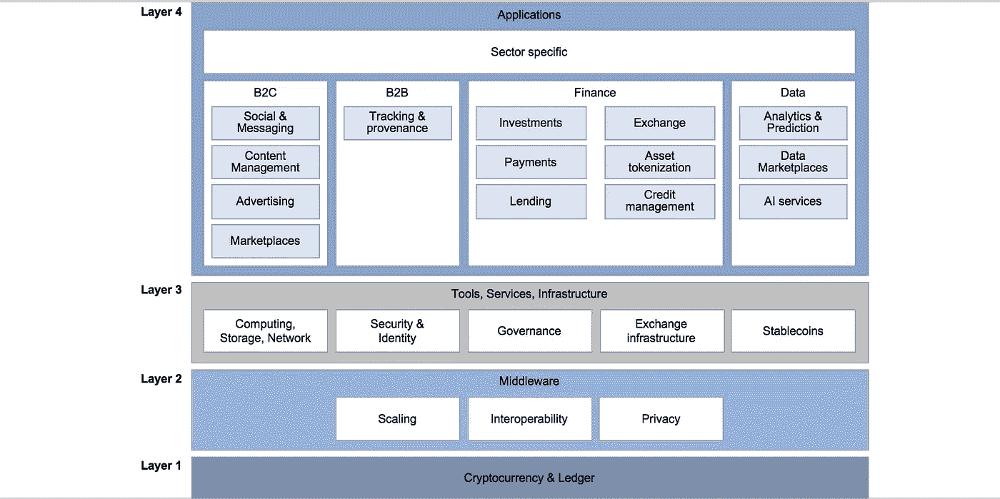
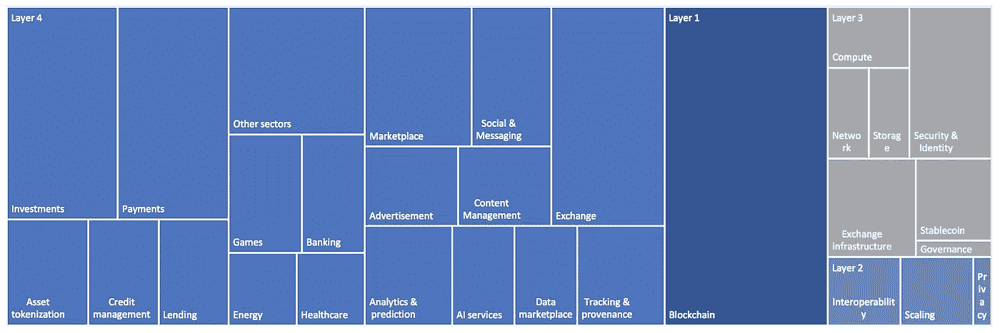
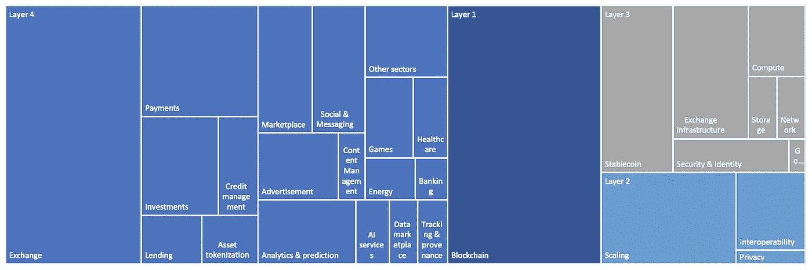
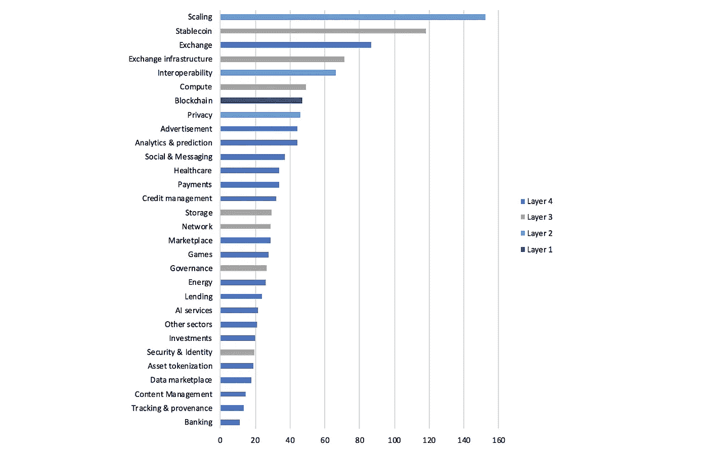
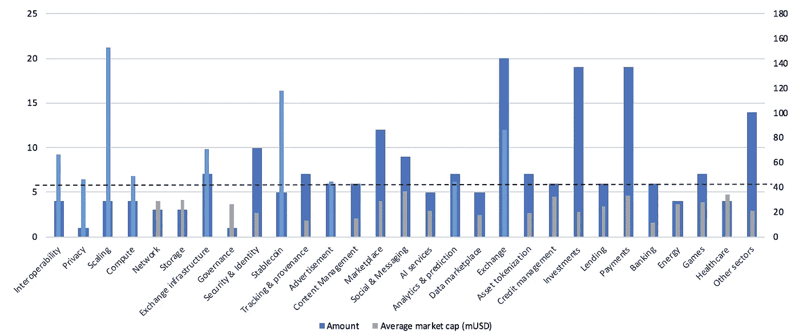
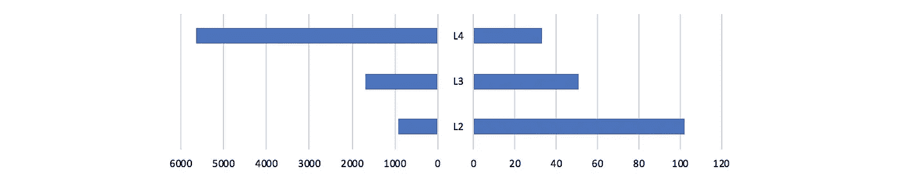

# 洞察以太坊生态系统

> 原文：<https://medium.com/coinmonks/insights-into-the-ethereum-ecosystem-6ffff98e1f0e?source=collection_archive---------0----------------------->

按市值分析排名前 250 位的 ERC 20 证券

2016 年夏天，USV 的乔尔·莫内格罗(Joel Monegro)发表了所谓的 [**Fat Protocols**](http://www.usv.com/blog/fat-protocols) **论文**关于区块链/加密货币生态系统中价值是在哪里创造的。他认为**投资使得较低层次的市值增长总是快于构建在顶层的应用的总价值**，因为应用层的成功推动了协议层的进一步投机。正因为如此，区块链技术栈的本质鼓励协议和其他较低层的创新。我很好奇**这是否也适用于《区块链议定书》生态系统的不同层面**。

由于这是迄今为止最大的令牌生态系统，我决定研究以太坊生态系统来解决这个问题。根据来自 [Coinmarketcap](https://coinmarketcap.com/) 的数据，**以太坊(到目前为止)拥有最多的代币，目前有> 800 枚，其次是 NEO，只有大约 25 枚**。所以我看了一下以太坊上面的~250 代币；在撰写本文时，市值已从顶部降至约 500 万英镑。**这些项目的总市值约为 10b，因此与以太坊的约 20b 相比，Fat 协议论文的最初前提似乎成立**。为了进一步研究，我对项目进行了分类，并将我发现的类别映射到一个 4 层结构中(见下文)。

Blockchain technology layer structure

首先来看一下**项目数量**，有一些有趣的观察结果:

Distribution of number of projects by layer and category

*   **67%的项目是在应用层**(第 4 层)开发的，其中交易、支付和投资项目是最大的子类别，各占所有项目的 8%左右。
*   占 16%的第二大类别是新的基础层协议，它还没有推出自己的区块链，这实际上不会是以太坊生态系统的一部分。
*   **第二层&第三层项目仅占少数**项目，分别占 4%和 13%。

现在看看项目的总市值，情况看起来有所不同:

Distribution of market cap of projects by layer and category

*   第 4 层仍然是最大的，但第 2 层和第 3 层同样有 17%的项目持有 36%的总市值，即平均而言，它们的交易价值是其余项目的两倍。
*   第 2 层和第 3 层的最大子类别是扩展(6%)、稳定连接(6%)和 Exchange 基础架构(5%)
*   在应用层中，**exchange 表现最为突出，占 17%。然而，仅币安硬币就占了 11%。**

由于类别大小受类别内项目数量的影响，我计算了每个类别的**平均市值**接下来:

Average market cap of projects per category

*   **前 10 个类别明显被较低级别的类别所支配**:所有的 2 级类别和 7 个 3 级类别中的 3 个都在最上面。
*   在第 4 级分类中，只有交易所明显名列前茅，这也是受币安硬币市值的影响。

还想**比较项目数量与平均市值**。该图用一个窄条显示了平均市值，用一个宽条显示了项目数量。右边是平均市值，左边是项目数量。此外，上一个图表中的前 10 个类别以更亮的蓝色突出显示:

Comparison of number of projects and the average market cap per category

*   项目数量与平均市值的关系在**隐私类别中尤为突出；这似乎是市场的一个缺口**。
*   扩展性、稳定性和互操作性之间的关系也清楚地显示出高于平均水平的交易价值

当将以太坊与基于以太坊的所有项目的总市值进行比较时，Fat 协议的论点显然是正确的，但在上面的层上就不那么直接了。**较高层的项目总市值更高，但较低层的项目平均市值更高。**

Total market cap vs. average market cap per layer

在某种程度上，较低的总市值很可能是由于第 2 层和第 3 层技术本身仍在开发中，因此还没有被高层项目使用。但是并不是所有的第 4 层协议都需要所有的第 2 层和第 3 层解决方案才能工作。从平均市值来看，Fat 协议的前提似乎仍然成立。

**另一方面，币安硬币显示，应用层**也可以产生显著的价值累积，其表现优于所有单个第 2 层&第 3 层硬币。即使在这种情况下，它也没有超过基础层协议。

然而，加密货币领域仍然年轻，价值更多地基于投机而不是基本面，所以我们可能需要在一两年内重新审视这一点。

## **同样，阅读**

*   [顶级 DeFi 项目](/coinmonks/defi-future-10-promising-projects-in-the-defi-world-ff2b697ab006)
*   最佳加密交易机器人
*   最好的比特币[硬件钱包](/coinmonks/the-best-cryptocurrency-hardware-wallets-of-2020-e28b1c124069?source=friends_link&sk=324dd9ff8556ab578d71e7ad7658ad7c)
*   最好的[加密税务软件](/coinmonks/best-crypto-tax-tool-for-my-money-72d4b430816b)
*   [最佳加密交易平台](/coinmonks/the-best-crypto-trading-platforms-in-2020-the-definitive-guide-updated-c72f8b874555)
*   [unis WAP 最佳钱包](/coinmonks/best-wallets-to-use-uniswap-e91a6385d9e8)
*   Bitsgap 评论——一个轻松赚钱的加密交易机器人
*   为专业人士设计的加密交易机器人
*   Bitmex 的[保证金交易指南](/coinmonks/the-idiots-guide-to-margin-trading-on-bitmex-dbbd7742c6fc?source=friends_link&sk=7bfa99d2a181142510c8442c8ddb0786)
*   [加密摇摆交易权威指南](/coinmonks/the-definitive-guide-to-crypto-swing-trading-7e4af6496d4d?source=friends_link&sk=70448050bd9323b42f63bfc0bb1e60d1)
*   [Bitmex 高级保证金交易指南](/coinmonks/bitmex-advanced-margin-trading-guide-2270c195ce25?source=friends_link&sk=1d986cca731f5084b9a2db4a4bc4a7ad)

> [直接在您的收件箱中获得最佳软件交易](https://coincodecap.com?utm_source=coinmonks)

