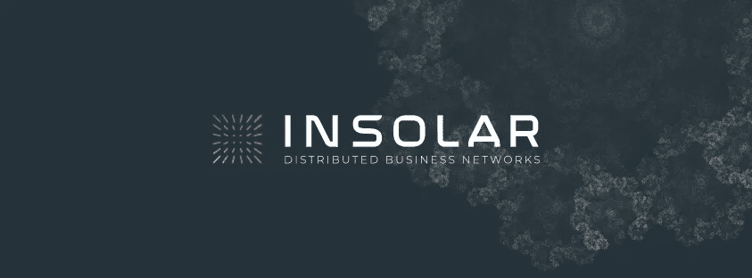
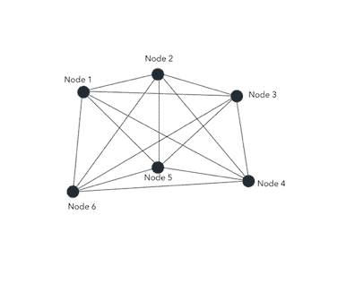
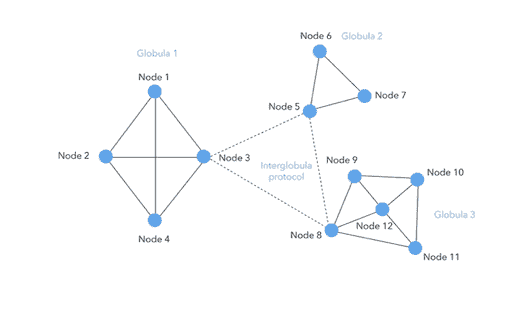

# Insolar 区块链平台:网络层

> 原文：<https://medium.com/coinmonks/insolar-blockchain-platform-network-layer-d1802d25fe40?source=collection_archive---------2----------------------->

## Insolar 网络及其如何解决区块链限制

courtesy: [https://insolar.io/](https://insolar.io/)

Insolar 是一个区块链平台，支持分布式业务网络。它允许用户在其区块链之上构建企业应用程序，并且该平台具有多层架构。该体系结构中最重要的一层是网络层。在了解网络层之前，理解如何在平台中创建和验证事务是很重要的。此外，需要注意的是，Insolar 区块链允许公共和私有网络之间的互操作性。

Insolar 遵循“由一个经过多方验证的人执行”的惯例。这意味着事务的执行将由单个节点完成，并且该事务将由许多节点验证。选择一个执行节点，它可以接收调用，收集传出调用的结果，并提供需要由其他节点验证的更新。需要注意的是，只有当执行者的状态过期时，才会选择验证器节点。

这种结构有许多优点。通过提供这种方法，处理成本与许多未投保的风险进行了权衡。可以通过添加更多的节点来验证事务，从而确保事务的安全性。频繁的小事务也可以配置为不等待验证就执行。这种设计肯定会增加吞吐量，并允许大规模交易。因此，这样一个结构的存在，我们需要一个非常一致的网络。这种一致性是 Insolar 网络层的主要目标。

让我们看看网络层的各种组件。

# 熵、脉冲和脉冲星

为了产生新的块，需要一些随机性。这种随机性被称为**熵**。熵是由一个叫做**脉冲**的信号携带的。脉冲由**脉冲星节点**或**脉冲星**产生。脉冲和脉冲星一起形成一个独立的逻辑层，负责网络同步并提供随机性。对于“由一个人执行，由许多人验证”的系统来说，熵的一致性和网络上活动节点的集合是至关重要的。验证器节点选举发生在执行后的下一个脉冲，因此可以避免共谋。为了让多个节点在一个云中协同工作(处理新的请求和操作)，所有节点必须保持同步。

## 脉冲的产生

Insolar 中脉冲的产生是基于一种称为 Pulsar 协议的协议完成的。选择脉冲星的规则因不同的云而异。这些选择是由不执行其他操作的专用服务器做出的。在公共网络的情况下，选择将由具有高正常运行时间的 10 到 50 个节点的随机子集来执行。除此之外，根据网络类型，其他配置也是可能的。

默认的脉冲产生是基于脉冲星之间的 BFT(拜占庭容错)共识。那么什么是 BFT 呢？简单地说，所有涉及的节点必须就它们之间传输的每条消息达成一致。如果一组节点遭到破坏，那么整个网络应该不会受到影响。

在这样一个共识中，每个成员都可以对熵有所贡献，但无法通过撤回投票来预测它。

那么，是什么让 Insolar 的 BFT 共识与众不同呢？

在传统的 BFT 共识中，网络中的所有节点都需要验证或同意网络中的所有事务。这是有效的，但是会造成网络变慢和可扩展性下降的问题。如前所述，这个问题是通过脉冲星和活动节点列表在 Insolar 中解决的。Insolar 节点不是让所有节点同意所有事务，而是首先同意活动节点列表和熵。这就形成了不牺牲可伸缩性的共识。

courtesy: [https://insolar.io/](https://insolar.io/)

# Globulas 和 Globula 网络协议

Globulas 是 Insolar 区块链中的另一个重要概念。球状星团是由多达 1000 个节点组成的网络。这可以作为一个真正的分散网络运行，其一致性由基于 BFT 的共识机制建立，实现为 Globula 网络协议。

前面提到的用于执行和验证的节点选择不是基于投票，相反，它们是基于活动节点列表的特性的一部分。球状体的重要性在于，通过将整个网络分成多个球状体，活动节点不需要在整个网络中维护，而是可以在每个球状体中维护。然后，这些球状体就活动节点达成一致。

GNP 的设计基于纯数据报协议。为了确保网络数据报的有效使用，GNP 实现了一组与 Globulas 内部工作相关的主要和次要特性。GNP 将新脉冲分布在球状星团的活动节点上。此外，GNP 收集活动节点的节点状态证明(NSP)来锁定节点状态。它检测欺诈性节点行为，并暂停和排除无法向阈值数量的节点提供 NSP 的节点。NSP 是在球状体的所有节点间建立共享状态的最关键元素。

与球状体相关的另一个重要概念是**球状体状态散列**。它是由 NSP 和其他信息(如节点索引)构建的 Merkle 树根。如果你想知道 Merkle 树是什么:它是一种广泛用于区块链的树结构，每个叶节点都用数据块的哈希标记，每个非叶节点都用其子节点标签的加密哈希标记。Merkle 根是这棵树的根。Globula State Hash 可以在不读取整个分类账的情况下验证过去的交易。此外，平台的完整性和完备性由全局状态散列(GSH)来维护。尽管在 GSH 中使用除 Merkle 根之外的节点列表的简单散列没有区别，但是 Merkle 根对于较大的网络是优选的。

## 球间网络协议

Insolar 还支持多达 100 个 Globulas(总共 100，000 个节点)的较大节点网络，这些节点网络根据现有的任何契约逻辑透明地跨此类网络运行。这种网络依赖于球间网络协议，该协议实现了基于领导者的共识。

courtesy [https://insolar.io/](https://insolar.io/)

接收更多数量的节点以交换网络一致性的附加阶段和球体之间的附加同步请求，从而将最小块(脉冲)时间增加到 10 秒。

InterGlobula make 使用 Globulas 之间基于领导者的一致性，在 GSH 上建立更高级别的 Merkle 树。这使得能够建立大规模的网络，同时使用 Merkle 证明进行一致性检查。

通过查看 Insolar 的网络架构，我感觉 Insolar 正在提供一个具有高交易速度的网络，而没有牺牲任何安全性。对传统共识机制的创新修改使网络具有可扩展性，这是任何业务就绪型区块链的关键。所有这些功能将使 Insolar 实现其为商业企业提供简单、低成本、可扩展且安全的区块链平台的目标。

**Click to read today’s top story**

> [在您的收件箱中直接获得最佳软件交易](https://coincodecap.com/?utm_source=coinmonks)

