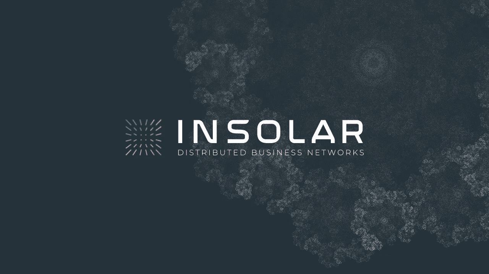
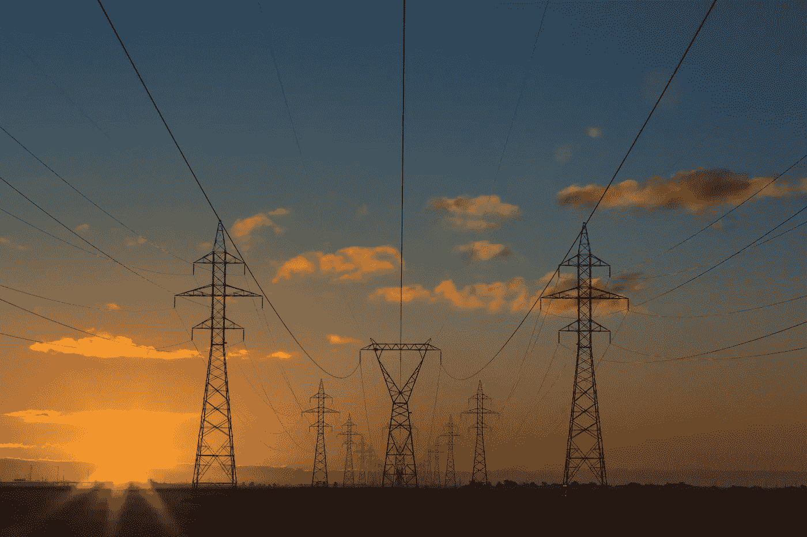

# Insolar 区块链用例

> 原文：<https://medium.com/coinmonks/insolar-blockchain-use-cases-7975ca9f9139?source=collection_archive---------2----------------------->

自从发明以来，区块链就被它的鼓吹者称为颠覆性技术，将改变世界的工作方式。但 10 年后，尽管有着无与伦比的好处，区块链仍未能将收养纳入主流。以太坊和比特币等区块链框架的失败阻碍了这些技术的大规模采用，其主要原因之一是传统的集中式系统比分散式区块链系统能提供更多的东西。

Source: [Unsplash](https://unsplash.com/photos/mf-o1E7omzk)

为了应对区块链采用率低的问题，研究人员和开发人员发现了一个由去中心化、速度和安全性组成的三重困境，它准确地反映了当前区块链框架的问题。因此，为了解决速度和安全问题，引入了私有链。Hyperledger fabric 就是这样一种技术，用于创建利益相关者的许可网络，在他们之间共享记录的分类帐。尽管 Hyperledger fabric 在速度和安全性方面有所改进，但它不像其他系统那样支持级别分散和公众参与。

# 遇见 Insolar

Source: [Insolar](https://insolar.io/)

Insolar 是区块链进化的下一个迭代。与为公共消费设计的比特币、以太坊或 EOS 不同，Insolar 是根据企业以及企业与公众互动的方式从头开始构建的。因此，Insolar 消除了以前区块链系统的所有错误和差异，并彻底改变了企业利用 DLT 的方式。

# 用例

以下是与其他区块链框架相比，Insolar 提供显著改进的一些使用案例:

## 供应链和物流

Source: [Unsplash](https://unsplash.com/photos/fN603qcEA7g)

供应链和物流中的区块链此前已被以太坊用于记录产品的变化历史，并使用智能合同验证这些变化。然而，Hyperledger 通过引入许可网络改变了这一过程。但 Insolar 通过提供公私互操作性，将区块链的供应链管理提升到了一个新的水平，产品创建者和修改者可以在私有网络中，而客户可以在公共网络中，他们有权自己验证这些产品。由于 Insolar 使用了域的概念，网络的每个成员都不必验证更改，每个利益相关者都可以定义自己的验证和管理策略。Insolar 还通过使用数据加密技术来保护机密数据，从而提供数据安全性。与以太坊和 Hyperledger 不同，网络中的节点可以选择自己的角色。因此，关于产品及其变更的信息可以分别存储在具有存储角色的节点和具有验证角色的节点中。因此，节点不得不承受在硬盘上下载和维护数万亿字节区块链数据的负担。

## 制造业

Source: [Unsplash](https://unsplash.com/photos/wSTCaQpiLtc)

通过结合 3D 打印和分布式制造，区块链可以彻底改变制造业，并节省因低效流程而浪费的数百万美元。除了在制造业的多个利益相关者之间建立信任之外，区块链还解决了剽窃、盗窃、高成本和低速度等问题。首先，Insolar 通过在交易中隐藏数据来提供数据安全性，从而解决了剽窃和盗窃问题。由于制造业的交易数量可能会随着产品数量的增加而增加，因此与以太坊每秒 15 次交易相比，Insolar 以每秒 19000 多次交易的速度挽救了局面。此外，为了实现分布式制造，公司需要分布式应用程序，Insolar 提供了编写嵌入式智能合同的支持，使用低数据存储，比其他区块链框架更便宜。

## 零售

Source: [Unsplash](https://unsplash.com/photos/2TLREZi7BUg)

在此使用案例中出现的一些关于产品跟踪、欺诈防范、忠诚度积分管理、隐私和无障碍处理的问题可以由 Insolar 回答。Insolar 的多级系统可以处理各种交易，以跟踪产品，验证其来源和历史变化。其次，区块链系统中的欺诈很可能不会发生，这仅仅是因为用于块生成和验证的共识算法，Insolar 通过允许用户选择共识算法重新发明了这一概念。此外，为了管理客户的支付和数据，Insolar 提供了对用 golang 编写的分布式应用程序的支持，这些应用程序或智能合约不仅以加密格式保护数据，而且还使用可以防止恶意节点调用智能合约中的功能的策略。最后，Insolar 中的智能合同还可用于创建实用令牌，从而简化忠诚度积分管理流程。除此之外，每秒 19000 多笔交易的速度简化了支付并提高了客户满意度。

## 能源和公用事业

Source: [Unsplash](https://unsplash.com/photos/yETqkLnhsUI)

多家初创公司已经利用区块链技术实现了 p2p 电力交换。当生产商向电网供电，智能电表使用智能合同为转移的电力创建令牌时，区块链电力交易就发生了，消费者购买令牌，因此现在拥有从电网提取电力的权利。这种商业模式虽然运作良好，但已被现有的系统所破坏。可能是因为以太坊在这种情况下主要用于创建令牌并将其与智能电表集成。这种分散电力交换系统的一个缺点是存储、处理能力和带宽的不必要浪费。假设一个住在伦敦的人使用以太坊 Dapp 通过购买电力创建了一个交易，而一个住在 6000 英里之外的泰国的人从未使用过该电力或公用事业令牌，正在使用她的机器来挖掘该交易。尽管这听起来不合理，但它也是低效和昂贵的。相反，只有那些有可能使用这种能力或令牌的节点才应该验证这种交易。显然，Insolar 可以通过引入 Globulas 来解决这个问题，Globulas 是一个共享共同配置和特征的节点集群。由于电网并不比国家覆盖区域大，每个州可以有自己的 Globula 用于全州电力交换，对于国家交换，来自一个州的生产者的交易电力被出售给另一个州的消费者，可以使用 Globula 间网络协议，这将减少验证时间和开销成本。

# 结论

区块链的进步可以提供跨多个部门的高效和可扩展的解决方案，每个部门都可以以自己特定的方式利用区块链的力量。Insolar 区块链平台具有革新这些领域的潜力，并凭借其创新优势引领区块链商业竞赛。上述行业只是一些受欢迎的使用案例，Insolar 有能力扩展到多个离散行业。

*在* [*Github*](https://github.com/insolar) *上查看 Insolar，并在代码上留下反馈。*

> [直接在您的收件箱中获得最佳软件交易](https://coincodecap.com/?utm_source=coinmonks)

