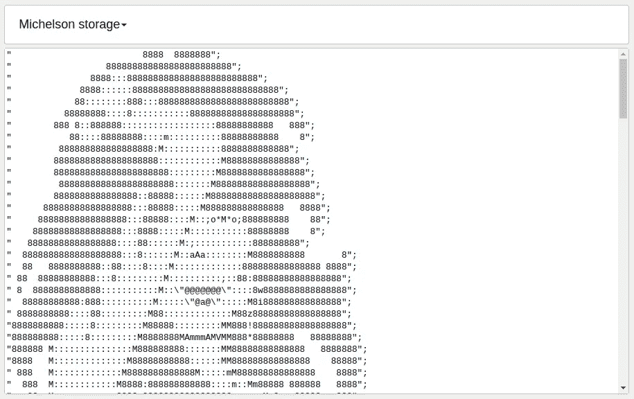

# 使用 PyTezos 检查智能合同

> 原文：<https://medium.com/coinmonks/inspecting-smart-contracts-with-pytezos-848946a15078?source=collection_archive---------0----------------------->

## DYOR 系列被烤坏了

在这篇文章中，我将向您展示如何在不同格式之间转换智能合约数据，以及这如何有助于理解代码背后的思想。

# 介绍

区块链数据可用性是一件有点争议的事情:理论上你可以访问一切，但当涉及到行动时，你会意识到事情没有那么简单。事实上，您需要有足够的资源、一堆中间件和特定的技术知识来直接访问数据。因此，区块链探索者在数据可访问性方面发挥了巨大作用，他们极大地简化了信息检索和分析。



Author of KT1NAA8rtfbBx8EUXWQekD6P2UAsycnBK36D, you made my day!

但这还不是全部，适当的数据表示扮演着同样重要的角色，因为人类需要更高级的抽象、可视化和主要成分提取。

我们来谈谈这篇文章的主题——智能合约。理解你信任的基金的智能合约内部发生了什么是至关重要的。Tezos 比使用字节码虚拟机的项目走得更远，并引入了 Michel son——一种被设计为可读编译目标的语言。但是阅读它仍然不容易，因为你需要像堆栈机器一样思考，并动态地转换嵌套结构。

我想展示一下简单的转换是如何改善这种感觉的，并帮助你理解智能合同的总体目的。

# 笔记本

## 本地运行

你需要 python 3.6+和 Jupyter 包才能继续。

```
$ git clone [https://github.com/baking-bad/pytezos.git](https://github.com/baking-bad/pytezos.git)
$ cd pytezos
$ jupyter notebook
```

导航到“examples”文件夹并运行`dyor_smart_contracts.ipynb`。

## 在 Google Colab 上玩

也可以在线摆弄代码:[https://colab . research . Google . com/drive/1 dicb 442 L2 hartxugv 91g _ sWURDFwGzK](https://colab.research.google.com/drive/1DICb442LL2hARTxUgV91g_sWURDFwGzK)

或者查看嵌入式版本:

# 摘要

我们已经展示了相当简单的转换和元数据使用可以显著提高智能契约存储(包括大地图)和事务参数的可读性。我们可以使用逆转换，用更方便的语言与智能合约进行交流。我们还可以对特定操作或时期的存储差异进行可视化。

所有这些给了我们黑盒分析的工具包，它可以通过匹配输入和产生的副作用来帮助理解代码的总体思想。

# 下一步是什么

正如您可能已经注意到的，我们几乎拥有构建单元测试平台的一切，只依赖于 [PyTezos](https://github.com/baking-bad/pytezos) 库和公共 RPC API。虽然大多数开发人员喜欢更高抽象的语言，但我想这个框架可以找到自己的位置。结合优秀的 PyCharm [扩展](https://github.com/jansorg/tezos-intellij)对于迈克尔逊来说，这是一个很好的开发环境，大家觉得呢？

在[推特](https://twitter.com/TezosBakingBad)上关注我们的更新，并在我们的[电报聊天](https://t.me/baking_bad_chat)中询问任何问题！

*最初发表于 2019 年 3 月 24 日*[*https://baking-bad.org*](https://baking-bad.org/blog/2019/03/24/inspecting-tezos-smart-contracts-with-pytezos-library/)*，在那里你可以找到文章的完整版本。*

> [直接在您的收件箱中获得最佳软件交易](https://coincodecap.com/?utm_source=coinmonks)

[](https://coincodecap.com/?utm_source=coinmonks)