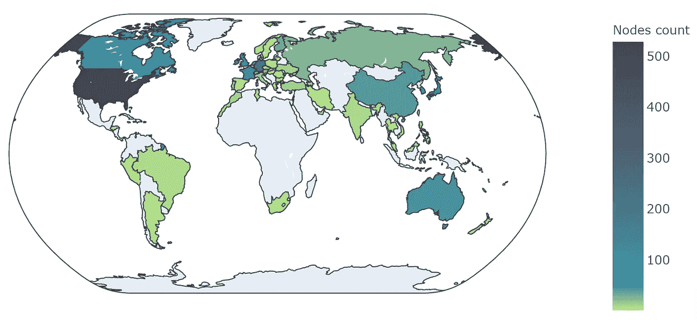
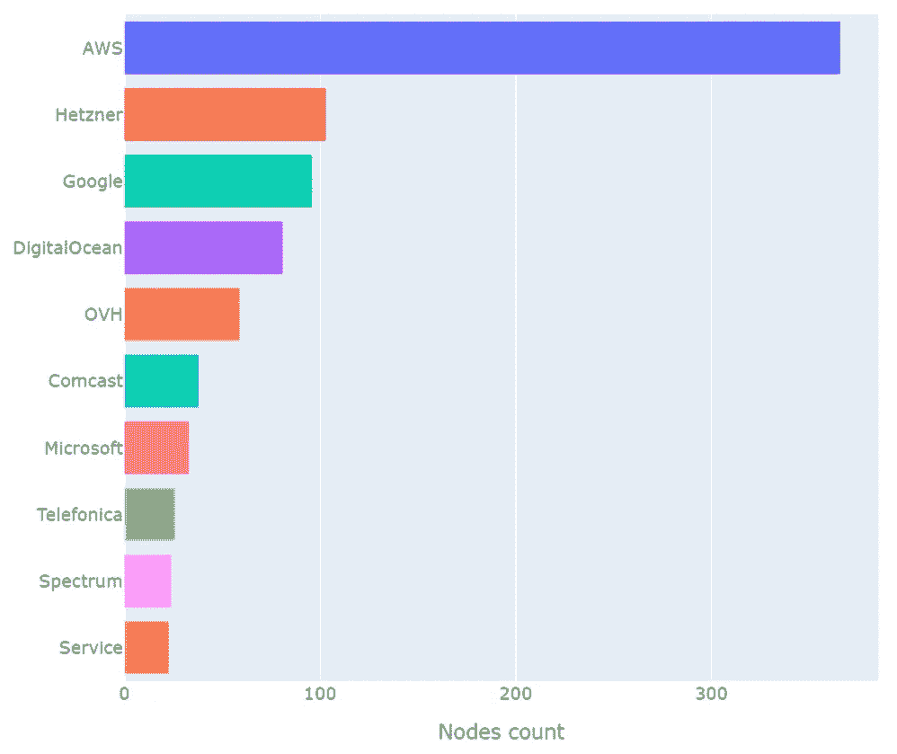
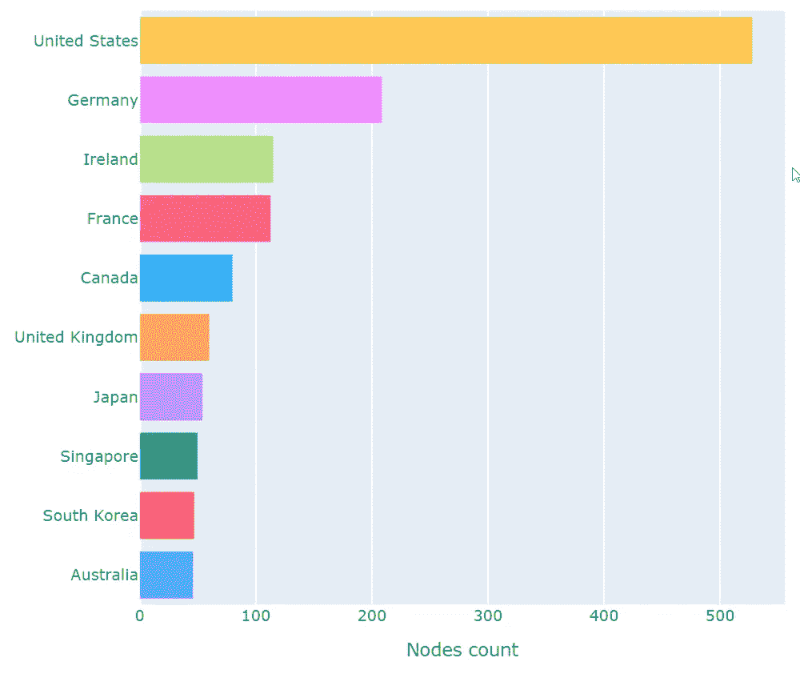
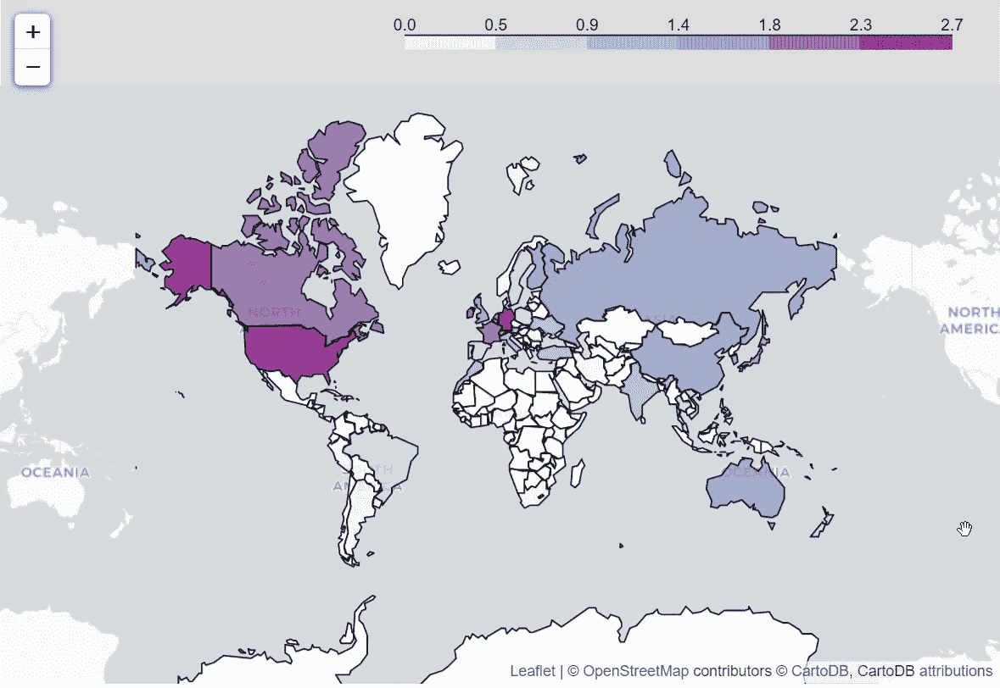
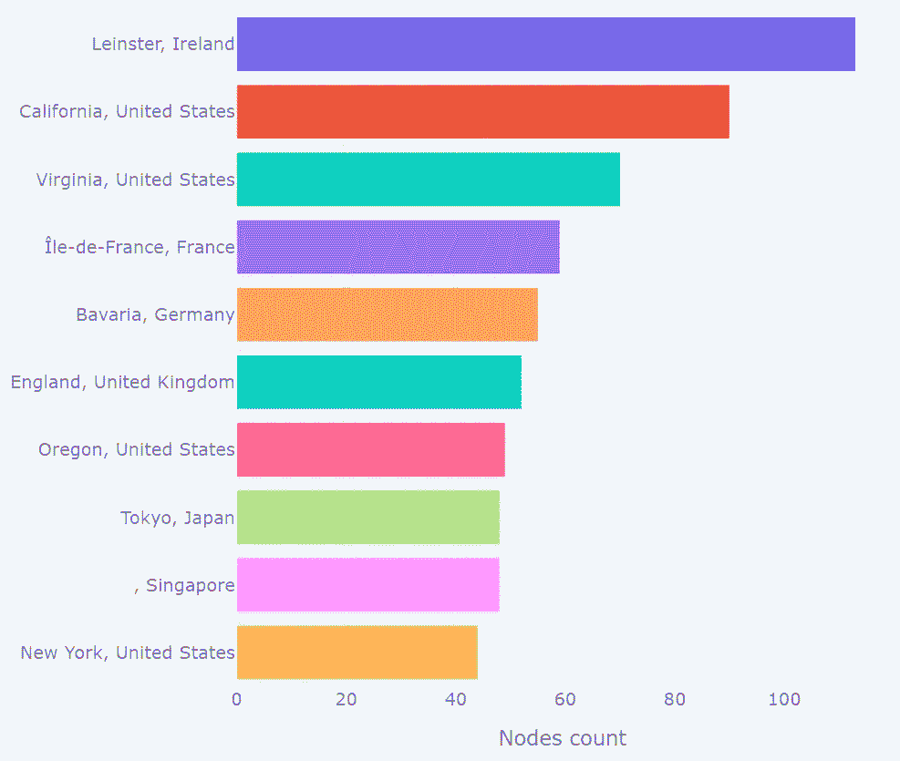
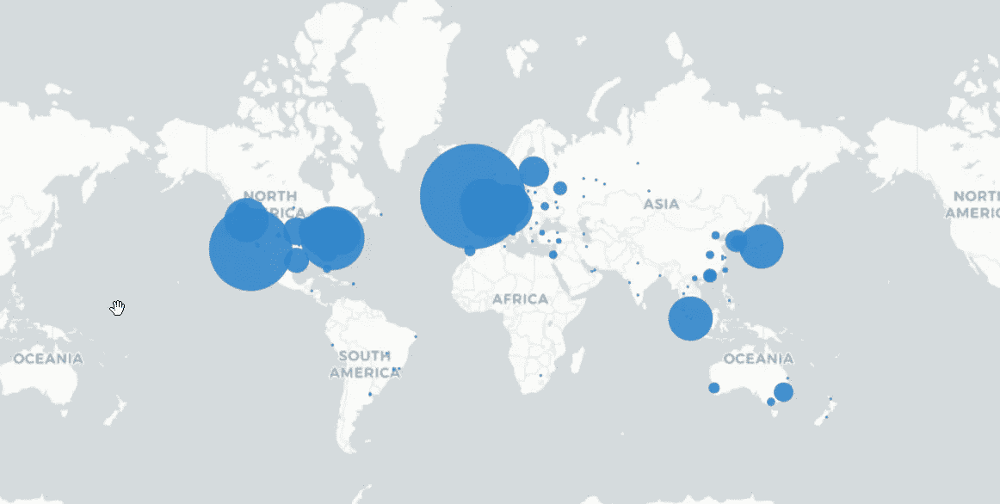
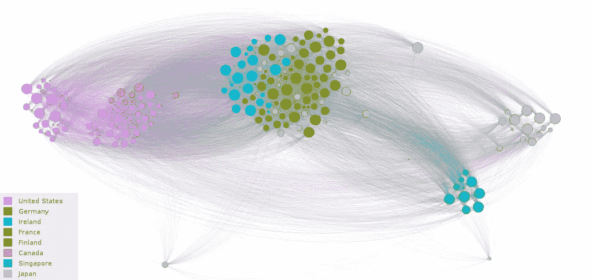
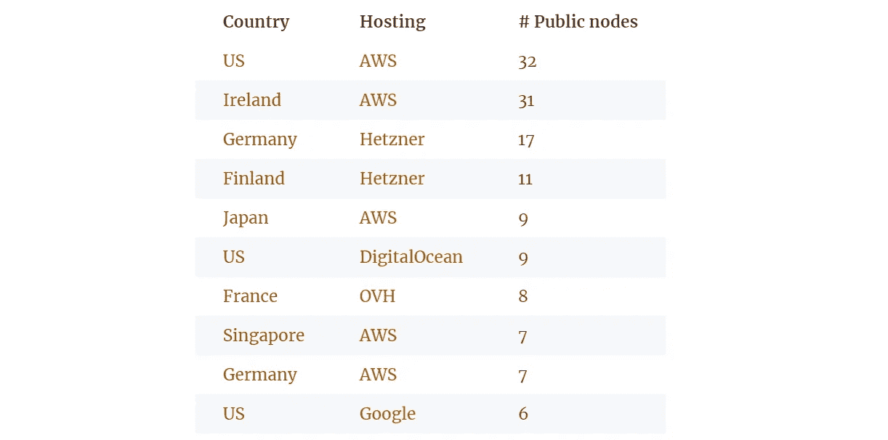
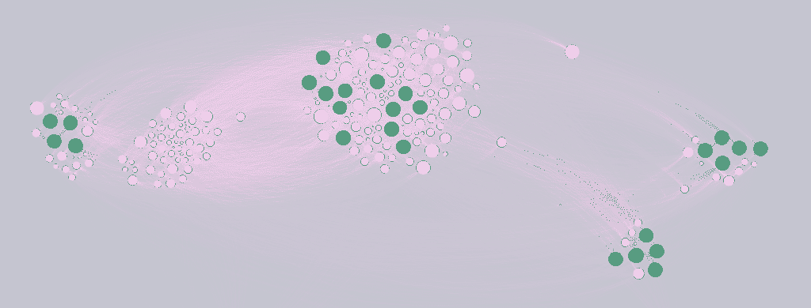

# 检查 Tezos 去中心化:200 多个公共节点，总共 1000 多个

> 原文：<https://medium.com/coinmonks/inspecting-tezos-decentralization-200-public-nodes-1000-in-total-6ef0761caac9?source=collection_archive---------3----------------------->

当谈到争论 Tezos 分散化时，他们通常把滚动分配放在第一位，说:“看，[前 5 名](https://tzkt.io/delegates)实体拥有超过一半的股份”。更高级的还强调了对投票机制的攻击:有多少实体可以阻止或强制一个提案(实际上是一个变化的值)。

然而，这并不那么简单，因为一旦你进入了一个利益攸关的网络，不仅仅是回报，还有风险价值。归根结底，当涉及到经济激励时，风险/回报比才是最重要的，而且前提是我们假设所有的代理人都是理性的！

理想情况下，对于每个攻击媒介(严格来说，每个提议都引入了一个新的媒介)，应该考虑每个攻击者类别的所有风险来估计回报/风险值(有多个配置文件)。
我们将这一点留待单独研究，但在本文中，让我们关注去中心化的另一个方面，即 P2P 层。

# 收集对等点和连接

为了进行全面的分析，我们需要高质量的数据集。
基本上，我们可以将节点配置中的`max_connections`设置为一个相对较大的值，并使用`/network/points` RPC 端点。然而，正如我们所发现的，这个输出被具有不同`chain_id`的节点或者没有运行的节点所污染。

此外，我们还想尝试构建网络图，因此我们不仅需要顶点(节点)，还需要边(连接)。我们最终没有准确地做到这一点，但我们在 Tezos 中学到了很多关于 P2P 如何工作的知识。

# 泰佐斯握手

不管怎样，我们深入研究并编写了一个简单的 P2P 扫描器，它连接到 **bootstrap** 节点并查询已知的对等点，然后尝试连接到这些对等点并查询它们的连接，等等。它运行得很好，但是我们面临几个限制:

*   显然，我们无法从没有暴露于互联网的节点(**隐藏**节点)中查询已知的对等点。基本上没问题，因为我们最感兴趣的是**公共**节点；
*   一些节点可能拒绝我们的连接，因为它们已经达到了最大连接数或其他原因。作为一种变通方法，我们以可重复的方式进行扫描，但是这并不能给我们 100%的保证我们没有遗漏任何东西；
*   主要问题与节点响应请求的方式有关:它们返回不超过 50 个结果，其中 30 个是*最佳*(按建立时间排序的活动连接)，其余 20 个是随机的(可能都是活动的，也可能都不是)。

> ***P2P 喜欢亲***
> 
> 如果你对 Tezos 中 P2P 层的工作方式感兴趣，可以看看 SimpleStaking [*博客*](https://medium.com/simplestaking) *。*

另一个问题涉及到确定一个节点是否属于一个特定的网络，在我们的例子中是 *mainnet* 。我们可以自信地区分公共节点，因为它们在握手期间返回版本字符串，但是我们不能 100%确定隐藏节点。我们只能说，如果一个特定的隐藏节点为几个公共 mainnet 节点所知，那么它很可能也是 mainnet 节点。

我们不确定 carthagenet/zeronet/other 节点出现在 mainnet 节点的已知对等节点列表中的原因。这可能是由于配置错误，或者在同一台机器上运行几个节点，或者其他原因。

# 目标和目的

鉴于上述问题和限制，我们必须决定我们可以计算什么以及如何计算。我们制定了几个目标:

1.  识别所有公共节点，因为它们本质上是网络的“中心”,并且具有最大的重要性；
2.  尝试使用试探法检测活跃的隐藏节点；
3.  对这两个群体进行地理分析；
4.  画出网络拓扑的近似值。

为此，我们使用了以下算法:

1.  进行迭代对等扫描，以处理*最大连接数*问题，并枚举所有随机点；
2.  当节点数量在足够长的时间内停止增长时，完成扫描；
3.  过滤掉不属于 *mainnet* 的节点
4.  为每个隐藏节点分配一个分数，该分数计算为知道该特定节点的公共节点的数量；
5.  过滤掉得分低于平均值的隐藏节点。

# 条件

在本文中，我们将使用术语**公共节点**和**隐藏节点**。在这两种模式下，节点都连接到其他节点，但只有公共节点接受传入的连接。
**引导节点**是节点配置中指定的默认节点。这实际上是一个隐藏负载平衡器的主机名，它将请求路由到分布在全球的 27 个节点。

> **免责声明 **
> 
> *本文简介:*
> 
> *我们只分析****Mainnet****节点；*
> 
> *扫描方法是时间拉伸的，不可能在特定时间制作快照；*
> 
> *我们只依赖于节点的地理位置以及它们之间的联系；*
> 
> *我们认识到，我们可能没有扫描整个网络，或者数据集中可能包含非活动节点。*
> 
> *因此，理解我们的结果* ***并不*** *完全表征系统是很重要的。*

我们将研究分散化的标准，这些标准决定了网络抵御崩溃或攻击的能力。

# Tezos mainnet 结果

> ***数字***
> 
> 在扫描过程中，我们发现:
> 
> **6298** 地址合计
> 
> **1679** 大概操作节点
> 
> **203** 公共节点

您可能已经注意到，Tezos mainnet 中的节点远远多于面包师的数量。很清楚为什么面包师应该是分散的(在所有意义上)，但是其他节点呢？它们是什么？

粗略地说，虽然 baker 节点确保区块链的有效状态并实际“写入”数据，但网络的其余部分提供对该数据的分散访问(即“读取”)，并确保广播的“写入请求”到达 baker。
这和块验证一样重要，因为如果不能以分散的方式访问，那么在分散的网络中还有什么意义。

在接下来的章节中，我们将分析所有(大概)独立运行的节点和公共节点。请注意，虽然我们对公共节点非常有信心，但当我们操作整个网络时，肯定会有一些偏差。尽管如此，我们认为它可以提供一些有趣的见解。

# 地理分布

这是一个直观的标准:Tezos 覆盖的大洲、国家、司法管辖区和全球网络越多越好。
连接性和网络拓扑也很重要，尤其是它们对洲际通信和一级/二级运营商的依赖，但我们稍后会对此进行研究。

热图看起来不错，虽然显然有节点高度集中的国家，但我们稍后会看到，这些大多是云提供商数据中心。

> ***数字***
> 
> *Tezos 节点分布在* ***56*** *国家和****193****地区。*

让我们详细看一下每个子标准。

# 托管提供商

在我们继续按国家和地区进行详细统计之前，让我们看一下托管提供商的节点分布情况。

毫不奇怪，我们看到了流行的云主机的流行，但如果你考虑到主机所在的国家，这个数字并不是那么大。例如，在美国拥有数据中心的前三大云提供商(AWS、Google、Digital Ocean)托管 300 个 Tezos 节点。实际的问题是这些节点对于网络总体来说有多重要，尽管我们无法从定位的角度来回答这个问题，但我们可以基于我们的数据集来分析网络拓扑。

# 国家

欧洲和美国占主导地位，约占所有节点的 2/3。

## 交互式地图

注意(十进制)对数刻度。

# 地区

至于各个国家的地区，我们可以看到与最大的主机提供商的数据中心的位置有相关性。

## 交互式地图

我们认为，更有意思的是，看看 Tezos 是如何分布在地球上的。使用缩放查看定居点的名称。

# Tezos 网络拓扑

我们将只研究逻辑[网络拓扑](https://en.wikipedia.org/wiki/Network_topology)。与物理拓扑不同，我们不会考虑节点之间的物理距离、底层网络(互联网)中数据包传播的延迟和速度。

> ***注***
> 
> *正如被* [***指出的***](https://baking-bad.org/blog/2020/07/30/inspecting-tezos-network-decentralization-200-public-nodes-1000-in-total/#terms-and-conditions) *一样，数字在现实中可以不同，但拓扑很可能保持不变。*

使用节点作为图的顶点，使用已知的对等连接作为边，我们构建了一个网络图并计算了它的基本属性。

> ***MAINNET 图***
> 
> *半径:****2*** *直径:****3*** *平均路径长度:****1.9*** *中心大小:****1082*** *聚类系数:*

**以下是对结果的简单解释:**

*   **、和很小，这有利于网络同步和快速传播，并且还说，假设每个节点都可以直接或通过可信对等体到达网络中心，或者是中心本身的一部分；**
*   **超过一半的*大概是*正在运行的节点，大概是我们使用的网络规模的一个更健壮的估计；**
*   **很高，网络分为三个集群，连接程度各不相同。这很可能是扫描方式的副作用，所以我们不要太重视它；**
*   **这表明 Tezos 图是稀疏的；**

# **公共节点**

**让我们仔细看看公共节点，我们特别感兴趣的是它们如何分布在主机提供商和国家之间。**

****

**理论上，您可以使用此信息优化延迟并提高连接性，例如，为了处理认可缺失或解决其他网络问题。**

# **热门国家和地区**

**虽然世界上最大的云提供商提供高度可靠的服务，但多样化永远不会有坏处。**

****

**有趣的观察:Tezos 一半的公共节点都在亚马逊上旋转，包括所有的 bootstrap 节点。**

# **引导节点备选方案**

**新节点最初连接到一组预定义的对等体(在默认配置中设置)。这些对等点被称为*引导对等点*，目前有 **27 个**隐藏在负载平衡器之后。假设他们是中心的一部分是合乎逻辑的，我们将主要关心他们占多大比例，他们在地理上分散到什么程度。**

**许多人担心的问题是**如果引导节点突然停止工作会发生什么？****

****

**如图所示，没什么可怕的。**

# **进一步的工作**

**利用这项工作的成果，我们将丰富我们的产品，使其具有两个特点:**

**敬请期待！**

***原载于 2020 年 7 月 30 日 https://baking-bad.org**[*。*](https://baking-bad.org/blog/2020/07/30/inspecting-tezos-network-decentralization-200-public-nodes-1000-in-total/)***

> ***[*在您的收件箱中直接获得最佳软件交易*](https://coincodecap.com/?utm_source=coinmonks)***

******