# 在 Ubuntu 18.04.3 LTS 版中安装和配置 Hyperledger Fabric v1.4 版

> 原文：<https://medium.com/coinmonks/install-and-configure-hyperledger-fabric-v1-4-on-ubuntu-18-04-3-lts-2ccbc7176887?source=collection_archive---------0----------------------->

[**Hyperledger Fabric v 1.4**](https://hyperledger-fabric.readthedocs.io/en/release-1.4/prereqs.html)的官方文档中有[区块链](https://blog.coincodecap.com/what-is-blockchain-a-simple-guide-for-dummies/)应用程序开发所需的先决条件。这篇文章展示了如何在 Ubuntu 18.04.3 LTS 上安装和配置先决条件的分步指南。

> 假设您已经安装了 Ubuntu 18.04.3 LTS 64 位版本。


Photo by [Matthew Henry](https://burst.shopify.com/@matthew_henry?utm_campaign=photo_credit&amp;utm_content=Picture+of+Hands+Typing+On+Laptop+-+Free+Stock+Photo&amp;utm_medium=referral&amp;utm_source=credit) from [Burst](https://burst.shopify.com/online?utm_campaign=photo_credit&amp;utm_content=Picture+of+Hands+Typing+On+Laptop+-+Free+Stock+Photo&amp;utm_medium=referral&amp;utm_source=credit)

# **先决条件**

*   [**卷曲**](https://curl.haxx.se/download.html) :最新版本
*   [**Docker**](https://www.docker.com/get-docker) **和 Docker Compose** : 17.06.2-ce 以上
*   [**Go**](https://golang.org/dl/):1.12 . x 版本
*   [**Node.js**](https://nodejs.org/en/download/) :版本 8 (8.94 及以上)或版本 10 (10.15.3 及以上)

# 卷曲

## 第一步。更新包列表

```
sudo apt-get update
```

输出

> Jay @ hlf-dev:~ $ sudo apt-get update
> Hit:1 http://in.archive.ubuntu.com/ubuntu 仿生 in release
> Hit:2 http://in.archive.ubuntu.com/ubuntu 仿生-updates in release
> Hit:3 http://in.archive.ubuntu.com/ubuntu 仿生-backports in release
> Hit:4 http://security.ubuntu.com/ubuntu 仿生-security InRelease
> 阅读包列表… Done
> jay@hlf-dev:~$

## 第二步。安装卷曲

```
sudo apt install curl
```

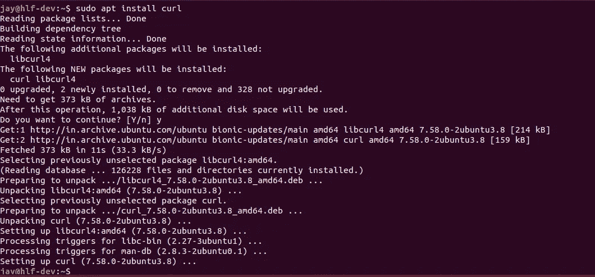

## 第二步。检查卷曲版本

```
curl --version
```

输出

> **curl 7 . 58 . 0**(x86 _ 64-PC-Linux-GNU)libcurl/7 . 58 . 0 OpenSSL/1 . 1 . 1 zlib/1 . 2 . 11 libid N2/2 . 0 . 4 libpsl/0 . 19 . 1(+libid N2/2 . 0 . 4)nghttp 2/1 . 30 . 0 librtmp/2.3
> 发布日期:2018-01-24

# 码头工人

## 第一步。更新包列表

```
sudo apt-get update
```

## 第二步。安装所需的软件包

```
sudo apt-get install apt-transport-https ca-certificates gnupg-agent software-properties-common
```

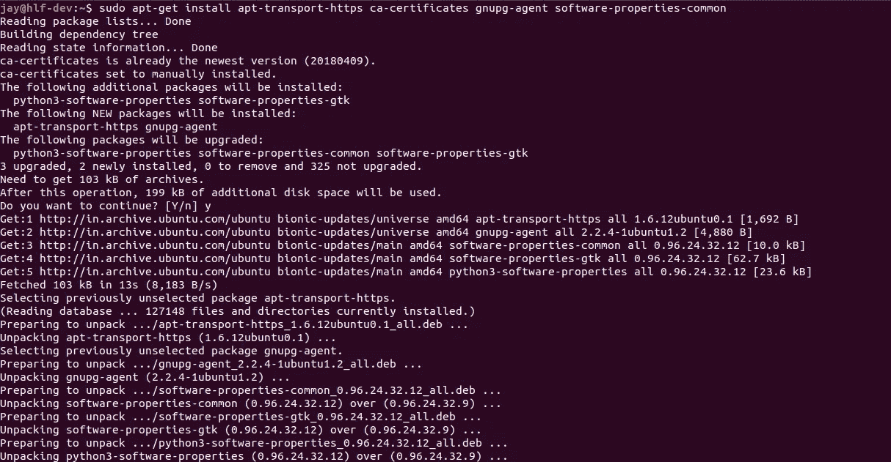

## 第三步。添加 Docker 官方 GPG 键:

```
curl -fsSL https://download.docker.com/linux/ubuntu/gpg | sudo apt-key add -
```

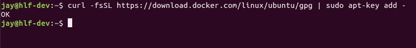

## 第四步。设置 Docker 稳定库

```
sudo add-apt-repository "deb [arch=amd64] https://download.docker.com/linux/ubuntu  $(lsb_release -cs)  stable"
```

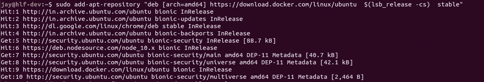

## 第五步。更新包列表

```
sudo apt-get update
```

## 第六步。安装最新版本的 Docker 引擎

```
sudo apt-get install docker-ce docker-ce-cli containerd.io
```

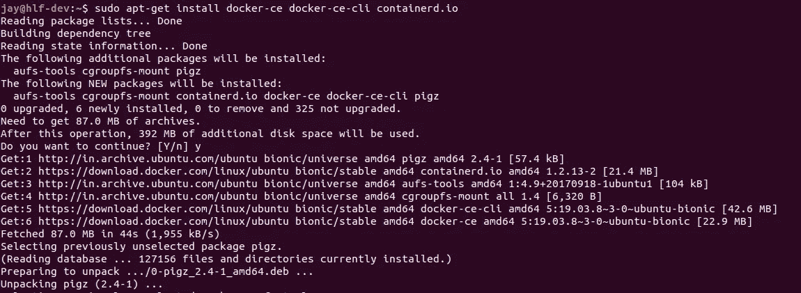

## 第七步。将用户添加到 Docker 组

为了在没有 sudo 的情况下运行 docker 命令，您需要使用下面的命令将当前用户添加到 docker 组。

```
sudo usermod -aG docker $USER
```

要确认用户是否被添加到 docker 组，请尝试以下命令

```
id -nG
```

输出

> Jay ADM cdrom sudo dip plug dev lpadmin samba share**docker**

## 第八步。检查 Docker 版本

> Jay @ hlf-dev:~ $**Docker-version**
> Docker 版本 19.03.8，build AFA CB 8 b 7 f 0
> Jay @ hlf-dev:~ $

## 第九步。验证 Docker 引擎

下面的命令下载一个测试映像，并在容器中运行它。当容器运行时，它打印一条信息性消息并退出。

```
docker run hello-world
```

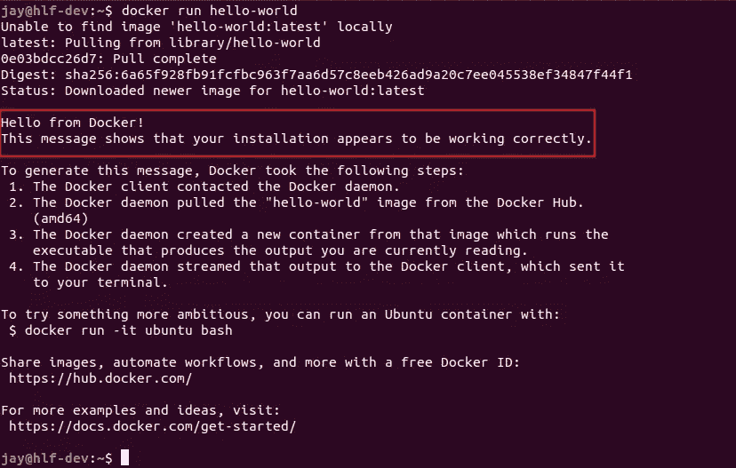

# 安装 Docker 撰写

## 第一步。下载 Docker Compose 的最新版本

```
sudo curl -L "[https://github.com/docker/compose/releases/download/1.25.5/docker-compose-$(uname](https://github.com/docker/compose/releases/download/1.25.5/docker-compose-$(uname) -s)-$(uname -m)" -o /usr/local/bin/docker-compose
```

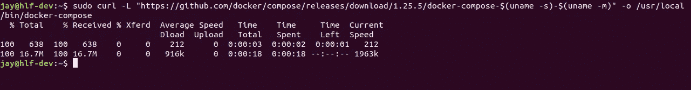

## 第二步。对二进制文件应用可执行权限

```
sudo chmod +x /usr/local/bin/docker-compose
```

## 第三步。检查 Docker 撰写版本

> Jay @ hlf-dev:~ $**docker-compose-version**
> docker-compose 版本 1.25.5，build 8 a1c 60 f 6
> Jay @ hlf-dev:~ $

# 安装 Go

[Go](https://golang.org/dl/) 的推荐版本是 1.12.x 版本。

## 第一步。下载 tar 文件

```
curl -O [https://storage.googleapis.com/golang/go1.12.9.linux-amd64.tar.gz](https://storage.googleapis.com/golang/go1.12.9.linux-amd64.tar.gz)
```

## 第二步。提取 tar 文件

```
tar -xvf go1.12.9.linux-amd64.tar.gz
```

## 第三步。移动 go 目录

```
sudo mv go /usr/local
```

## 第四步。更新环境变量

我们需要更新环境变量，即*路径*和 *GOPATH。*为此，用户的个人资料需要更新。

```
nano ~/.profile
```

在中添加以下内容。配置文件。

```
export GOPATH=$HOME/go
export PATH=$PATH:/usr/local/go/bin:$GOPATH/bin
```

保存。配置文件并加载更新的环境变量。

```
source ~/.profile
```

## 第五步。检查 go 版本

> jay@hlf-dev:~$ **go 版本**
> go 版本 go 1 . 12 . 9 Linux/amd64
> Jay @ hlf-dev:~ $

# 安装 Node.js 和 NPM

如果您将利用 Hyperledger Fabric SDK for Node.js 为 Hyperledger Fabric 开发应用程序，则 8.9.4 及更高版本支持版本 8。10.15.3 及更高版本支持 Node.js 版本 10。

我们将安装 10.x 版本。安装 Node.js 也会安装 NPM

## 第一步。安装 Node.js v10.x 存储库

```
curl -sL https://deb.nodesource.com/setup_10.x | sudo -E bash -
```

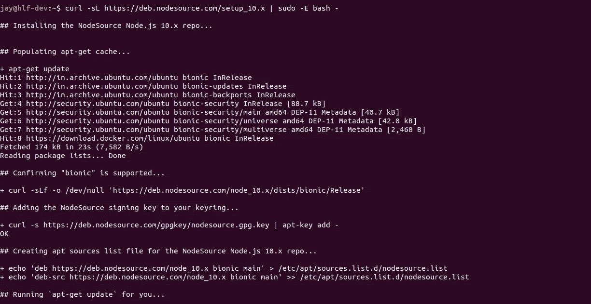

## 第二步。安装节点

```
sudo apt-get install -y nodejs
```

## 第三步。检查节点版本

> Jay @ hlf-dev:~ $**node-v**
> v 10 . 20 . 1
> Jay @ hlf-dev:~ $

## 第四步。检查 NPM 版本

> Jay @ hlf-dev:~ $**NPM-v**
> 6 . 14 . 4
> Jay @ hlf-dev:~ $

# 安装 Hyperledger 示例、二进制文件和 Docker 映像

在 Fabric 1.4.x 版本下，v 1.4.7 是最新版本，我们将安装该版本。

## 第一步。在下载结构二进制文件之前，在您的主路径中创建一个目录，例如 hyperledger。

```
mkdir hyperledger
cd hyperledger/
```

## 第二步。下载 Fabric 1 . 4 . 7 版

从 hyperledger 目录(例如/home/jay/hyperledger)运行以下命令。请注意，根据你的网速，这需要一段时间。

```
curl **-**sSL http:**//**bit**.**ly**/**2ysbOFE **|** bash **-**s **--** 1.4**.**7 1.4**.**7 0.4**.**20
```

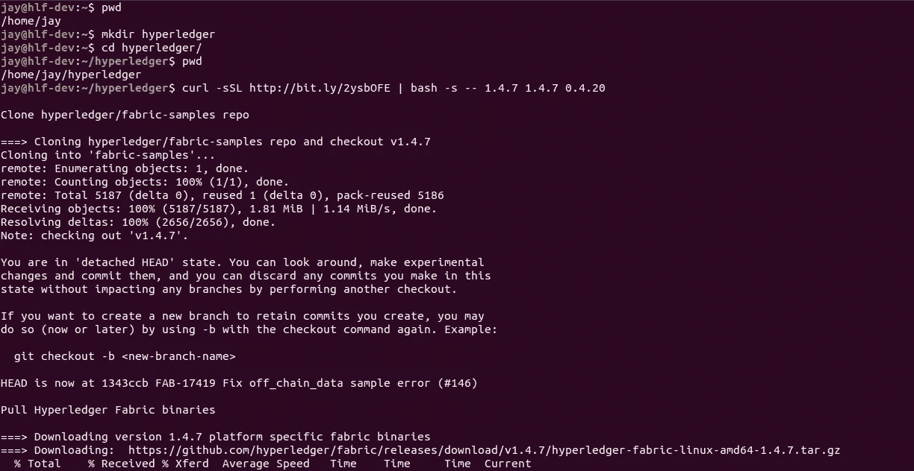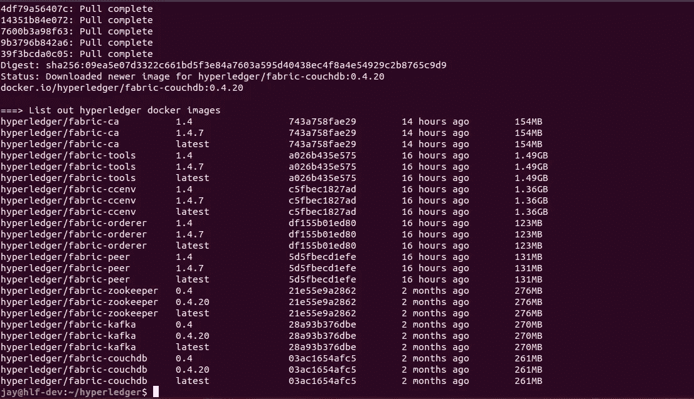

## 第三步。更新环境变量

```
nano ~/.profile
```

将结构 bin 路径添加到 path 变量中。请确保使用下载结构二进制文件的路径。

```
export PATH=/home/$USER/hyperledger/fabric-samples/bin:$PATH
```

保存。配置文件并加载更新的环境变量。

```
source ~/.profile
```

# 测试 Hyperledger Fabric 安装

织物附带的织物样品很少，可用于测试织物安装。

## 第一步。将目录更改为第一个网络目录

```
cd /home/$USER/hyperledger/fabric-samples/first-network
```

## 第二步。使用脚本打开网络。

```
./byfn.sh up
```

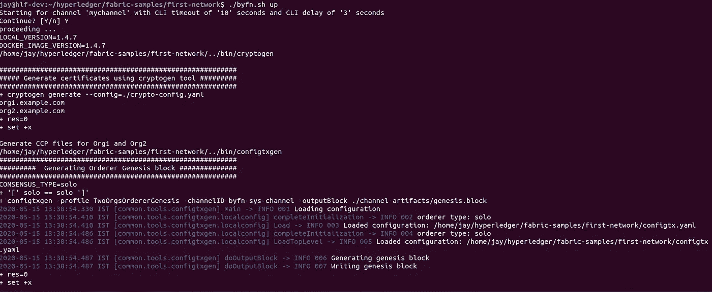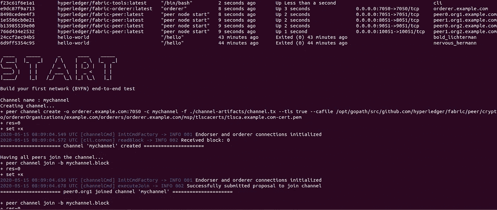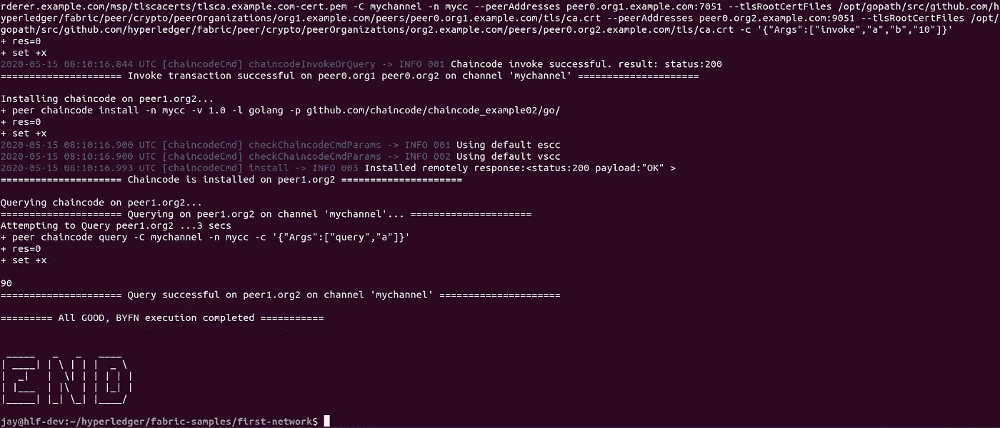

如果你想知道，byfn 代表建立你的第一个网络。更多详情，请参考此处的。

## 第三步。验证码头集装箱

```
docker ps -a
```

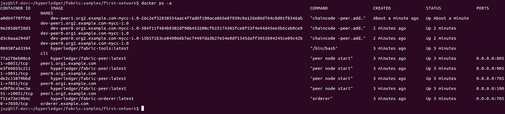

## 第四步。关闭网络

```
./byfn.sh down
```

以上是在 Ubuntu 18.04.3 LTS 版中设置 Hyperledger Fabric v1.4 版所需的步骤。

感谢您的阅读，我希望它是有帮助的！☺️

# **参考文献**

*   【Hyperledger Fabric v1.4 版的先决条件
*   [Docker 官方安装指南](https://docs.docker.com/engine/install/ubuntu/)
*   [官方 Docker 编写安装指南](https://docs.docker.com/compose/install/)
*   [官方 Node.js 安装指南](https://github.com/nodesource/distributions/blob/master/README.md#debinstall)


> [直接在您的收件箱中获得最佳软件交易](https://coincodecap.com/?utm_source=coinmonks)

[](https://coincodecap.com/?utm_source=coinmonks)