# 安装 Hyperledger Fabric V2.2 并运行测试网络🚀

> 原文：<https://medium.com/coinmonks/install-hyperledger-fabric-v2-2-run-test-network-20ef2782d64a?source=collection_archive---------2----------------------->

## 涵盖错误|每步快照|快速启动高频网络

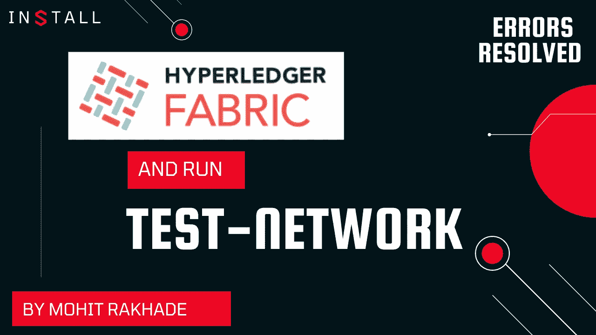

在开始这篇文章之前，让我给你一些背景知识。在这篇文章中，我们将安装 Hyperledger Fabric 并以简洁明了的步骤运行`test-network`,我们还将调查可能的错误，如果你不阅读这篇文章，这些错误可能会让你挠头几个小时。

这篇文章会牵着你的手从零开始培养人脉，如果你想强化每一个术语，我会强烈推荐你去读[的 KC Tam](https://medium.com/u/32dec75e8ca9?source=post_page-----20ef2782d64a--------------------------------) 👉([这篇](https://kctheservant.medium.com/test-network-script-walk-through-95ca973bc676)文章完成这一篇后，要详细了解事情究竟是如何运作的。

在安装织物样品之前，确保您已经安装了所有的[先决条件](https://hyperledger-fabric.readthedocs.io/en/latest/prereqs.html)

> 快速提示:参考我的 golang 文章来设置 Golang 环境👇

[](/@mohitrakhade20/install-golang-setting-up-its-path-and-env-variable-cafae8c9f54) [## 安装 Golang &设置它的路径(和环境变量)

### 在 Ubuntu 20.04 上运行 Hyperledger Fabric 网络时，我在部署 chiancode 时遇到了很多问题，原因是…

medium.com](/@mohitrakhade20/install-golang-setting-up-its-path-and-env-variable-cafae8c9f54) 

要首先安装 fabric-sample，请运行以下命令进行安装:

```
curl -sSL https://bit.ly/2ysbOFE | bash -s --2.2.0 1.4.9
```

Fabric v2.3.0 已发布，但我们将继续使用 v2.2.0(因为它很稳定),而 1.4.9 是 fabric CA 版本

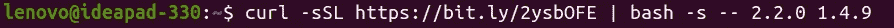

这个`curl`脚本将克隆 fabric-samples repo 并提取 Hyperledger Fabric 二进制文件。

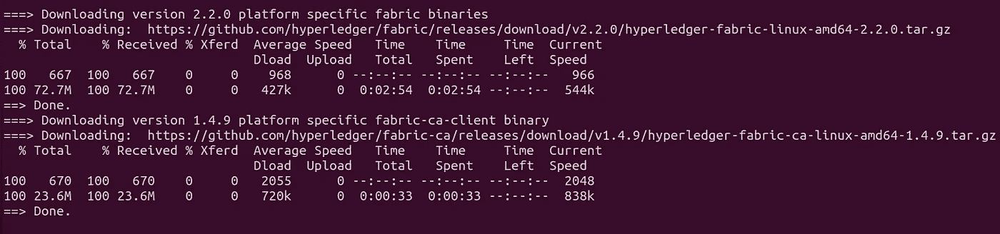

pulling binary images

它将只拉不存在的图像，并将使用以前的图像(如果您以前使用过 fabric)

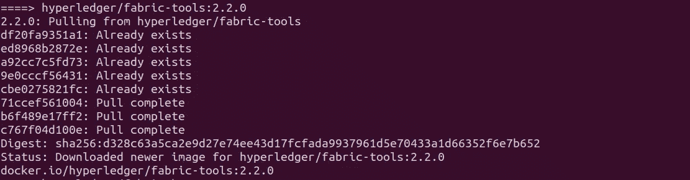

如果脚本成功运行，它将显示您提取的所有图像，如下所示

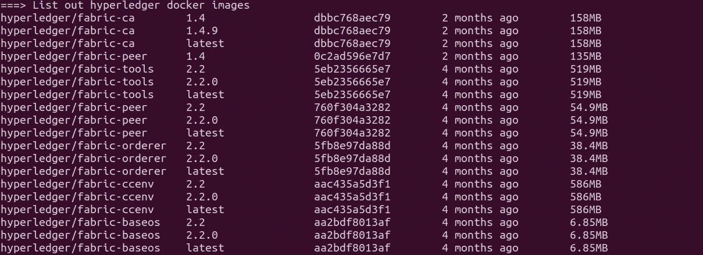

现在，导航到`test-network`来检查它是否正确安装，我们将在测试网络上做一些操作(初始化，调用)。

```
cd fabric-samples/test-network
```

要启动 nice & fresh，运行这个命令来删除以前运行的工件、加密材料、容器和链码映像，以避免不必要的错误。

```
./network.sh down
```

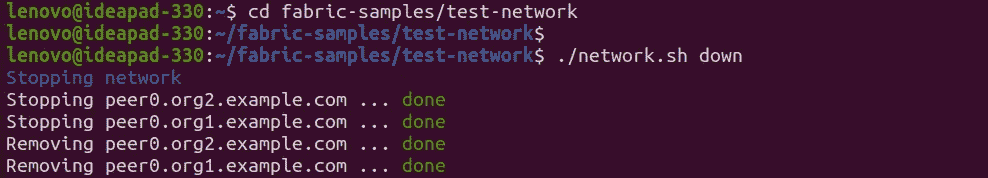

现在，我们准备通过运行来启动我们的网络—

```
./network.sh up
```

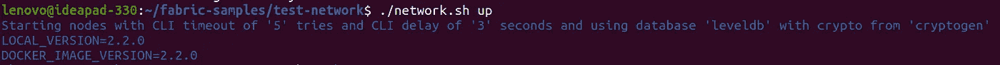

测试网络有两个成员，即组织 1 和组织 2。每个组织有两个对等点，一个订购者维护订购服务。如果我们运行，我们将能够看到两个对等体和一个订购者—

```
docker ps -a
```

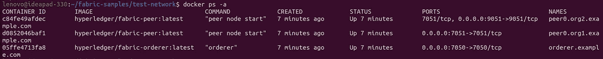

现在我们将在 Org1 和 Org2 之间创建通道，对等体也将加入相同的通道(默认通道名称:`mychannel`)，如果我们运行—

```
./network.sh createChannel
```

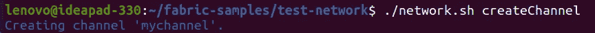

如果成功，您将会看到以下信息

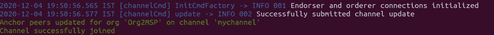

让我们部署我们的链码，如果您是第一次部署，脚本将安装链码依赖项

```
./network.sh deployCC
```

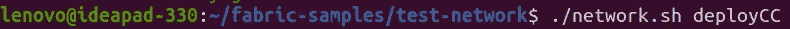

🐞如果你不设定自己的路线，并且说一些像这样的话，它就会失败

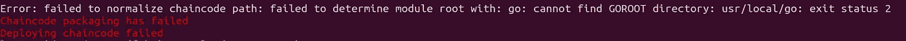

ERR: GOROOT

让我们解决我的设置 GOROOT 路径(这样做，只有当你面对以上错误)

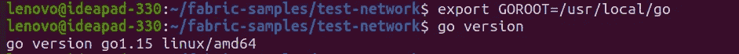

setting GOROOT path

参考这个，如果你仍然面临错误💁

[](https://hyperledger-fabric.readthedocs.io/en/release-2.2/test_network.html#troubleshooting) [## 使用结构测试网络- hyperledger-fabricdocs 主文档

### 下载 Hyperledger Fabric Docker 映像和示例后，您可以使用…部署测试网络

hyperledger-fabric . readthedocs . io](https://hyperledger-fabric.readthedocs.io/en/release-2.2/test_network.html#troubleshooting) 

```
export PATH=${PWD}/../bin:$PATH
```

&

```
export FABRIC_CFG_PATH=$PWD/../config/
```

在您的终端中初始化分类账运行—

```
peer chaincode invoke -o localhost:7050 --ordererTLSHostnameOverride orderer.example.com --tls --cafile ${PWD}/organizations/ordererOrganizations/example.com/orderers/orderer.example.com/msp/tlscacerts/tlsca.example.com-cert.pem -C mychannel -n basic --peerAddresses localhost:7051 --tlsRootCertFiles ${PWD}/organizations/peerOrganizations/org1.example.com/peers/peer0.org1.example.com/tls/ca.crt --peerAddresses localhost:9051 --tlsRootCertFiles ${PWD}/organizations/peerOrganizations/org2.example.com/peers/peer0.org2.example.com/tls/ca.crt -c '{"function":"InitLedger","Args":[]}'
```

如果命令成功，结果会是这样——

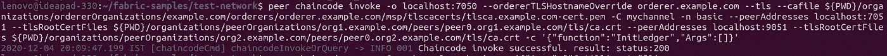

通过运行以下查询列出分类帐—

```
peer chaincode query -C mychannel -n basic -c '{"Args":["GetAllAssets"]}'
```

如果成功的话，输出会是这样的—

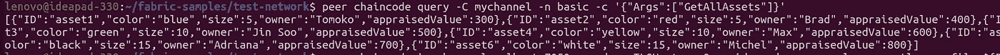

通过调用资产转移链代码更改所有者的命令—

```
peer chaincode invoke -o localhost:7050 --ordererTLSHostnameOverride orderer.example.com --tls --cafile ${PWD}/organizations/ordererOrganizations/example.com/orderers/orderer.example.com/msp/tlscacerts/tlsca.example.com-cert.pem -C mychannel -n basic --peerAddresses localhost:7051 --tlsRootCertFiles ${PWD}/organizations/peerOrganizations/org1.example.com/peers/peer0.org1.example.com/tls/ca.crt --peerAddresses localhost:9051 --tlsRootCertFiles ${PWD}/organizations/peerOrganizations/org2.example.com/peers/peer0.org2.example.com/tls/ca.crt -c '{"function":"TransferAsset","Args":["asset6","Christopher"]}' 
```

如果成功的话会有反应——

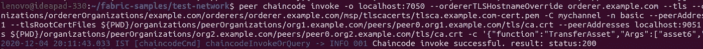

查询`peer0.org2.example.com`运行的资产转移(基本)链码

```
peer chaincode query -C mychannel -n basic -c '{"Args":["ReadAsset","asset6"]}'
```

结果显示`asset6`已传输至 Chirstoper —

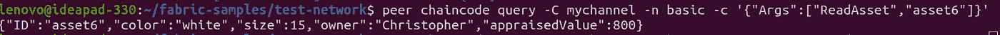

如果你坚持到了最后，那么你已经安装了 HF，运行了`test-network`，还对 chaincode 执行了一些操作。

现在要拆除测试网络，运行—

```
./network.sh down
```

恭喜🤜🤛您安装了 fabric-samples 并测试了第一个网络

感谢您的阅读🍃

## 另外，阅读

*   最好的[密码交易机器人](/coinmonks/crypto-trading-bot-c2ffce8acb2a)
*   [Deribit 审查](/coinmonks/deribit-review-options-fees-apis-and-testnet-2ca16c4bbdb2) |选项、费用、API 和 Testnet
*   [FTX 密码交易所评论](/coinmonks/ftx-crypto-exchange-review-53664ac1198f)
*   [Bybit 交换评论](/coinmonks/bybit-exchange-review-dbd570019b71)
*   最好的比特币[硬件钱包](/coinmonks/the-best-cryptocurrency-hardware-wallets-of-2020-e28b1c124069?source=friends_link&sk=324dd9ff8556ab578d71e7ad7658ad7c)
*   [密码本交易平台](/coinmonks/top-10-crypto-copy-trading-platforms-for-beginners-d0c37c7d698c)
*   最好的[加密税务软件](/coinmonks/best-crypto-tax-tool-for-my-money-72d4b430816b)
*   [最佳加密交易平台](/coinmonks/the-best-crypto-trading-platforms-in-2020-the-definitive-guide-updated-c72f8b874555)
*   最佳[加密借贷平台](/coinmonks/top-5-crypto-lending-platforms-in-2020-that-you-need-to-know-a1b675cec3fa)
*   [莱杰纳米 S vs 特雷佐 one vs 特雷佐 T vs 莱杰纳米 X](https://blog.coincodecap.com/ledger-nano-s-vs-trezor-one-ledger-nano-x-trezor-t)
*   [block fi vs Celsius](/coinmonks/blockfi-vs-celsius-vs-hodlnaut-8a1cc8c26630)vs Hodlnaut
*   Bitsgap 评论——一个轻松赚钱的加密交易机器人
*   为专业人士设计的加密交易机器人
*   [PrimeXBT 审查](/coinmonks/primexbt-review-88e0815be858) |杠杆交易、费用和交易
*   [享受九折优惠](/coinmonks/haasonline-review-d8d1a3400419)
*   [埃利帕尔泰坦评论](/coinmonks/ellipal-titan-review-85e9071dd029)
*   [SecuX Stone 评论](https://blog.coincodecap.com/secux-stone-hardware-wallet-review)
*   [BlockFi 评论](/coinmonks/blockfi-review-53096053c097) |从您的密码中赚取高达 8.6%的利息
*   [面向开发人员的最佳加密 API](/coinmonks/best-crypto-apis-for-developers-5efe3a597a9f)
*   [最佳区块链分析工具](https://bitquery.io/blog/best-blockchain-analysis-tools-and-software)
*   [加密套利](/coinmonks/crypto-arbitrage-guide-how-to-make-money-as-a-beginner-62bfe5c868f6)指南:新手如何赚钱
*   顶级[比特币节点](https://blog.coincodecap.com/bitcoin-node-solutions)提供商
*   最佳加密制图工具
*   了解比特币的[最佳书籍有哪些？](/coinmonks/what-are-the-best-books-to-learn-bitcoin-409aeb9aff4b)

> [直接在您的收件箱中获得最佳软件交易](/coinmonks/newsletters/coinmonks)

[](https://medium.com/coinmonks/newsletters/coinmonks)