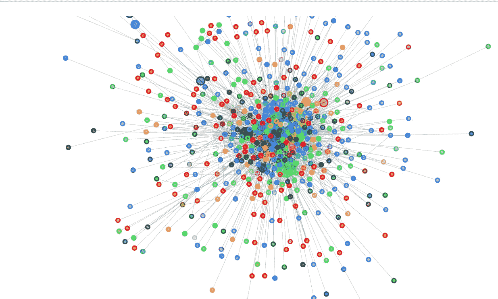
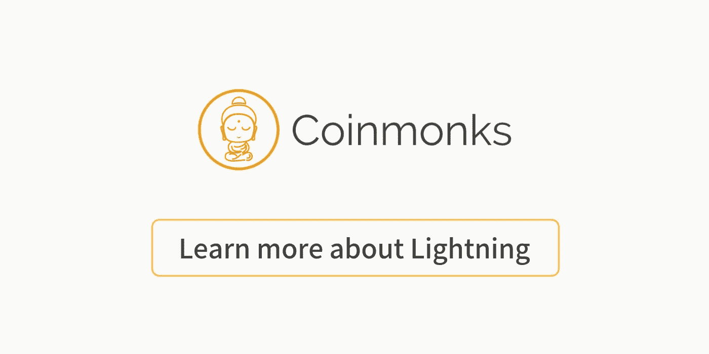

# 安装闪电网络

> 原文：<https://medium.com/coinmonks/install-lightning-network-b5608ffb6874?source=collection_archive---------3----------------------->

[Image source](https://www.google.co.in/url?sa=i&rct=j&q=&esrc=s&source=images&cd=&cad=rja&uact=8&ved=2ahUKEwiijY6axdXdAhVMb30KHcYtDIIQjxx6BAgBEAI&url=https%3A%2F%2Fdecentralpost.com%2F2018%2F04%2F01%2Fstatus-in-lightning-network-land-steady-growth-in-channel-and-nodes-numbers%2F&psig=AOvVaw1MmWt-Nexiotshbu-K_8Lu&ust=1537943669121960)

## 雷电网络安装指南

**Create Crypto Invoices**

[**Cryptofi —创建加密发票，跟踪您的加密支付**](https://cryptofi.co/)

[**使用 Coinmonks 作业门户**](https://coinmonks.com/) 查找加密作业

[***加入 Coinmonks 投稿人电报组。***](/coinmonks/coinnmonks-crypto-writers-telegram-group-f56b4621af0a)

[***捐投投僧***](/coinmonks/monks-need-your-help-7440418d67ec)

**Click to find blockchain Jobs**

我列出了不同操作系统和云服务的 Lightning 网络安装指南。

**在数字海洋上安装闪电网络**

 [## 闪电网络:如何安装和(希望)赚钱

### 注:本文档写于 2018 年 7 月。闪电是一种新技术，进步很快。如果您发现任何过时的…

medium.com](/coinmonks/the-lightning-network-how-to-install-and-hopefully-make-money-6e3058e3fa7c)  [## 安装闪电网络第 2 部分:又来了

### 在第 1 部分中，我在数字海洋水滴上安装了一个闪电节点。目标是探索闪电网络，并且…

medium.com](/coinmonks/installing-lightning-network-part-2-here-we-go-again-ed5a84f9cade) 

罗纳德·曼纳克

**在 Windows 上安装闪电网络**

 [## 如何在 Windows 上运行 Lightning 网络节点

### 本文将介绍使用 Windows……在比特币 mainnet 上设置闪电网络(LN)节点所需的步骤

medium.com](/coinmonks/guide-setup-a-lightning-network-node-on-windows-8475206807f) 

由[约翰尼·法姆](https://medium.com/u/af0adacf7133?source=post_page-----b5608ffb6874--------------------------------)

 [## 面向 Windows 桌面用户的比特币闪电网络节点简易设置教程——操作指南

### 我注意到最近有很多第二层扩展解决方案令人兴奋，如闪电网络(LN ),但缺乏…

medium.com](/@jadmubaslat/bitcoin-lightning-network-node-easy-setup-tutorial-for-windows-desktop-users-a-how-to-guide-9937b5a8a669) 

由[贾德·穆巴拉克](https://medium.com/u/4a57e852757a?source=post_page-----b5608ffb6874--------------------------------)

**在树莓墩上安装雷电网络**

 [## 比特币闪电网络:在家里运行你的节点的乐趣和(无)利润⚡🤑

### 你有没有考虑过在自己的硬件上安装一个比特币闪电网络？我是这样做的。

medium.com](/coinmonks/bitcoin-lightning-network-run-your-node-at-home-for-fun-and-no-profit-da5b61be2ba9) 

西蒙卢卡·蓝迪

**在谷歌云上安装闪电网络**

 [## 在谷歌云上设置比特币闪电服务器(指南)

### 闪电网络是有史以来打击比特币网络的最大规模解决方案之一，因为它最终使其可以用作…

medium.com](/coinmonks/setup-bitcoin-lightning-server-on-google-cloud-guide-95811c439b32) 

由[李拉巴](https://medium.com/u/9f4dd122ad0?source=post_page-----b5608ffb6874--------------------------------)

**在 Linux 上安装闪电网络**

 [## RBP3 上的闪电网络节点(c-lightning)

### 这是指南的第三部分，帮助你在已经运行的比特币节点之外建立一个 c-lightning 节点…

medium.com](/@meeDamian/c-lightning-node-on-rbp3-b950660fb835) 

由[达米安·梅](https://medium.com/u/1ed700017370?source=post_page-----b5608ffb6874--------------------------------)

**使用 docker** 安装闪电网络

 [## 运行您自己的 mainnet Lightning 节点

### 使用即时闪电网络从无到有

medium.com](/@dougvk/run-your-own-mainnet-lightning-node-2d2eab628a8b) 

道格·冯·科霍恩

希望这些指南能帮助你，如果你发现更多有用的指南，请在下面评论。我们也会包括他们。😃

还查 Coinmonks 始乱终弃[闪电网文章](/coinmonks/lightning-network-a45bda621a5c) s。

现在是时候了👏

**Click to learn more about Lightning Network**

> [直接在您的收件箱中获得最佳软件交易](https://coincodecap.com/?utm_source=coinmonks)

