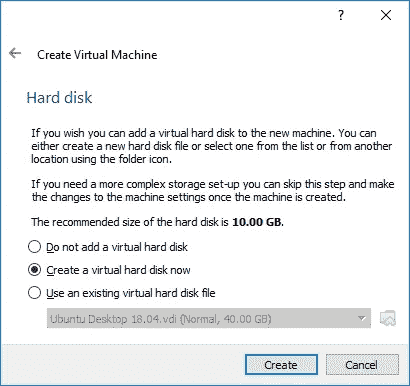
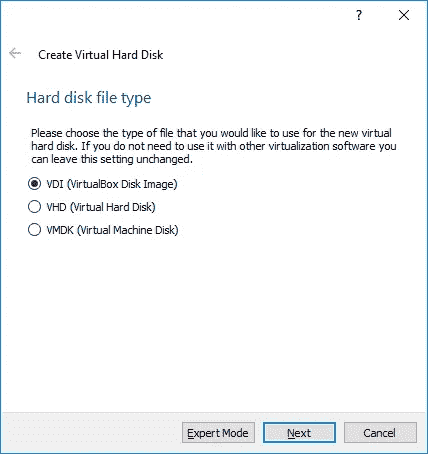
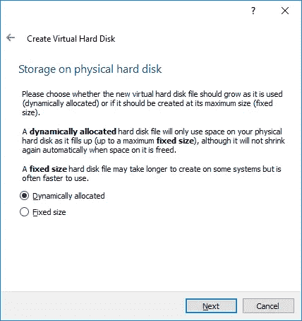
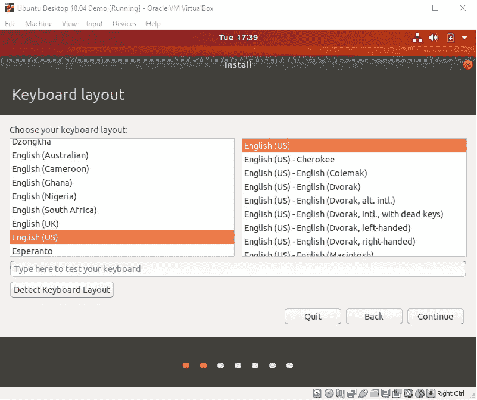

# 安装 EOS(第 1 部分)——在 VirtualBox 上安装 Ubuntu

> 原文：<https://medium.com/coinmonks/installing-eos-part-1-setting-up-ubuntu-on-virtualbox-1e791e051af8?source=collection_archive---------4----------------------->

我刚刚在一台 Windows 10 电脑上成功实现了 Ubuntu 16.04 和 18.04 上的 EOSIO 1.5.2。我说得非常具体，因为技术变化如此之快，以至于今天有效的技术明天可能会略有不同。我从 Ubuntu 16.04 开始，因为那是 nsjames 正在做的。然后我试用了 Ubuntu 18.04 作为最新的稳定版本。我没有试过，但我猜 Ubuntu 17 也可以。

我在这里分享的是几天来的阅读、尝试和失败以及挫折。我确实从几个来源学到了很多，尤其是菲利普·马丁森和 nsjames 的以下视频:

Setting up a Virtual Machine and EOSIO for smart contracts

这个视频很棒，但有点过时。直到创世节点创建之前，它都是正确的，但之后它就不适用于 EOSIO 的新版本了。

EOS V1 Setup

这个视频带你了解创世节点的创建过程。这是 nsjames 的视频中缺失的部分。

下面是 coinmonks 的一篇优秀的中型文章，其中涵盖了许多实现 EOS 的相关步骤:

 [## EOSIO 单节点测试网络设置

### 1.概观

medium.com](/coinmonks/test-4fbd38fdc4e8) 

我写这个安装指南的原因是，虽然这些视频和文章都很有帮助，但没有一个来源可以将它们整合在一起。此外，还有几个额外但关键的步骤在这些资料中没有提到，我必须找出并整合在一起。

我将这篇文章分成两部分，以减少篇幅，增加整篇文章的有用性和相关性。第 1 部分介绍了如何设置 Virtual Box 和 Ubuntu，而第 2 部分介绍了如何实际安装 EOS。

**设置 VirtualBox**

如果您还没有 Oracle VirtualBox，那么您需要做的第一件事就是获得它。您可以在这里找到它:

 [## Oracle VM VirtualBox

### VirtualBox 正随着频繁的发布而积极开发，并拥有越来越多的功能、受支持的来宾…

www.virtualbox.org](https://www.virtualbox.org/) 

安装 VirtualBox 非常简单，所以我不再赘述。一旦完成，你需要下载你想使用的 Ubuntu 安装的 ISO 文件。您可以在此下载:

 [## 下载桌面版

### Ubuntu 是一个开源软件操作系统，可以运行在桌面、云、互联网上

www.ubuntu.com](https://www.ubuntu.com/download/desktop) 

**创建虚拟机**

现在打开 VirtualBox 并点击 New 或输入 Ctrl+N。在下面的屏幕中，输入名称并选择正确的操作系统。我打算安装一台新的 Ubuntu 18.04 机器。

现在两个最重要的配置设置之一是你必须选择至少 8GB 的 RAM:

如果你没有 16GB 的内存，你不能这样设置 EOS。从理论上讲，4GB 也可以，但是您必须稍后在 configuration.ini 文件中更改一些设置。然而，我不建议这样做，你可以预期虚拟机运行非常缓慢。我从 8GB RAM 开始，但在意识到它足以安装一个 EOS 虚拟机后，我为€60 的戴尔 Inspiron 5770 额外购买了 8GB 至关重要的 DDR4 SODIMM RAM，因此这不是一项巨大的投资，但非常值得。

然后使用以下设置创建至少 40GB 的虚拟磁盘:

选择 VDI (VirtualBox 磁盘映像):

在下一个屏幕上，选择动态分配:

然后输入虚拟驱动器的名称，并选择 40GB 的大小(20GB 也可以，但我建议留出一些额外的空间):

现在，您的新虚拟机已经可以安装了，您应该能够在可用虚拟机列表中看到它。

现在进入设置，选择网络/适配器 1。然后将附加到:改为桥接适配器。这允许主机和客户机之间的通信。

然后选择共享文件夹并添加一个共享文件夹，以便您可以在虚拟机和桌面之间传输文件:

确保单击自动装载框，然后单击确定。现在，双击主窗口中的虚拟机来启动它。

您需要做的第一件事是为启动安装过程选择正确的 ISO 文件，在这种情况下，我选择了 Ubuntu 版本 18.04:

现在选择您的语言并点击`Install Ubuntu`:

然后选择您的键盘布局。

现在选择正常安装，并确保选中两个框`**Download updates while installing Ubuntu**`和`**Install third-party software for graphics and Wi-Fi hardware and additional media formats**`。这些将有助于处理幕后内务。

最后，选择`**Erase disk and install Ubuntu**`，然后点击`**Install Now**`。不要担心，这只是指新创建的虚拟磁盘。

然后你会得到一个相当可怕的弹出警告。别担心，这很好。点击`**Continue**`。

现在从下面的页面中选择您的位置。

在下一个屏幕中，您需要输入您的姓名、计算机名和用户名。这些都可以不同，但我保持简单，使我的名字和用户名相同。我确实选择了一个不同的计算机名来容易地识别我们是在谈论计算机还是用户，但是这不是必需的。

我建议选择`**Log in** automatically`，因为这样可以节省以后的时间。然后点击`**Continue**`，安装将开始。

这将需要几分钟时间来运行。安装完成后，会要求您重新启动计算机。点击`**Restart Now**`完成安装。

您将被要求移除安装介质。忽略这条消息，按回车键。最后，可能会问你要不要把 Ubuntu 更新到最新版本，去吧，点击`**Install Now**`。系统将提示您输入密码，然后更新将会运行。

整个过程大约需要 30 分钟。本安装指南的第 1 部分到此结束，在 Oracle VirtualBox 6.0 上安装 Ubuntu 18.04。

第 2 部分将带您完成 EOSIO 1.5.2 的实际安装。您可以使用此处的链接直接访问该网站:

 [## 安装 EOS(第 2 部分)—安装 EOSIO

### 这是带有 Oracle VirtualBox 虚拟机的 Ubuntu 上 EOS 安装指南的第二部分。我想…

medium.com](/@prutovitz/installing-eos-part-2-installing-eosio-883599e497ac) 

> [在您的收件箱中直接获得最佳软件交易](https://coincodecap.com/?utm_source=coinmonks)

