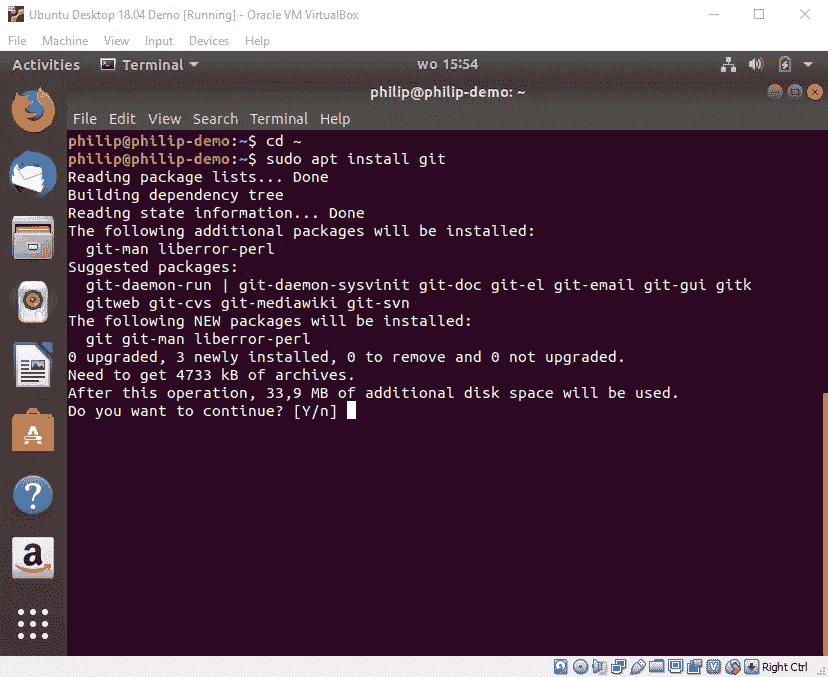

# 安装 EOS(第 2 部分)—安装 EOSIO

> 原文：<https://medium.com/coinmonks/installing-eos-part-2-installing-eosio-883599e497ac?source=collection_archive---------2----------------------->

这是带有 Oracle VirtualBox 虚拟机的 Ubuntu 上 EOS 安装指南的第二部分。我假设您已经在新创建的虚拟机上加载了 Ubuntu 18.04。我现在将介绍如何安装 EOSIO 1.5.2。如果你还没有安装 Ubuntu，请参考第 1 部分。您可以在此找到链接:

[](/@prutovitz/installing-eos-part-1-setting-up-ubuntu-on-virtualbox-1e791e051af8) [## 安装 EOS(第 1 部分)——在 VirtualBox 上安装 Ubuntu

### 我刚刚在一台 Windows 10 电脑上成功实现了 Ubuntu 16.04 和 18.04 上的 EOSIO 1.5.2。我正在…

medium.com](/@prutovitz/installing-eos-part-1-setting-up-ubuntu-on-virtualbox-1e791e051af8) 

您需要做的第一件事是安装 VirtualBox 的来宾附件。这将允许你在 Windows 和 Ubuntu 之间共享文件，也可以复制和粘贴，你会发现这非常有用。

您需要做的第一件事是加载 Guest Additions CD(不必担心，您实际上不需要有 CD)。选择菜单项`**Insert Guest Additions CD Image…**`


然后会要求您确认安装:


点击`Run`。您将被要求输入密码，然后它将继续安装来宾附件。这些是从 Windows 中复制并粘贴到 Ubuntu 中所必需的。一个提示——如果你不能从 Windows 拷贝到 Ubuntu，有时你需要重新安装。请记住`ctrl-v`在 Ubuntu 上是不工作的。相反，你应该使用`right-click + paste`或`ctrl-shift-v`。

首先，通过键入`ctrl-alt-t`进入终端。然后输入:

```
sudo apt-get install virtualbox-guest-dkms
```

系统将提示您添加所需的额外磁盘空间。


安装大约需要 5 分钟。现在，通过输入以下命令，将您创建的用户添加到现在创建的 vboxsf 组中:

```
sudo adduser <username> vboxsf
```


现在您需要设置虚拟机以允许复制和粘贴。在 VirtualBox 中，选择`Devices\Shared Clipboard\Bidirectional`。


为了从相关的存储库中下载最新的 Ubuntu 包和依赖项列表，您需要运行以下命令:

```
sudo apt update
```

您将被要求输入密码，然后更新将运行。运行更新后，您将需要使用以下命令实际升级软件包:

```
sudo apt upgrade
```

还会要求您确认所需的额外空间。


下一步是获得版本控制系统“git ”,以便能够下载 EOS 库。您需要首先通过输入`cd ~`进入您的根目录，然后运行:

```
sudo apt install git
```



将再次要求您确认额外磁盘空间的使用。

下一步是使用命令加载 EOS 存储库

```
git clone [https://github.com/eosio/eo](https://github.com/eosio/eos)s --recursive
```

现在我们来看安装的核心部分，实际上是安装 EOSIO，以便能够创建和部署 EOS 智能合同。首先，您需要通过键入`cd eos`进入新创建的 EOS 目录。运行构建脚本来构建和编译 EOS 框架。这是通过运行 EOSIO 构建脚本来实现的:

```
./eosio_build.sh
```


然后，您将看到需要安装的依赖项列表。在这里，您应该选择 1 以便继续。然后将提示您输入密码，然后构建脚本将运行，并提供所有必需的依赖项。


这将需要相当长的时间，所以让电脑嗡嗡作响，做一会儿别的事情…

为了加载 MongoDB C++驱动程序，您最终会被要求再次输入您的密码。

[](http://mongocxx.org/) [## MongoDB C++驱动程序手册

### 欢迎使用 MongoDB C++驱动程序。在这个网站上，您可以找到帮助您充分利用 MongoDB 和……

mongocxx.org](http://mongocxx.org/) 

这些是 MongoDB 的驱动程序，MongoDB 是一个存储为 JSON 文件的数据库。

[](https://www.mongodb.com/what-is-mongodb) [## 什么是 MongoDB？

### MongoDB 将数据存储在灵活的、类似 JSON 的文档中，这意味着不同文档和数据的字段可能不同…

www.mongodb.com](https://www.mongodb.com/what-is-mongodb) 

几个小时后，您应该会收到这条消息，EOSIO 构建完成。


接下来，进入构建目录并安装 EOSIO:

```
cd build
sudo make install
```

然后会再次要求您输入密码。


安装只需要一两分钟。为了确保您可以运行`cleos`、`nodeos`和`keosd`，请确保`/usr/local/eosio/bin`位于以下命令的路径中:

```
export PATH=$PATH:/usr/local/eosio/bin
```

下一步你需要做的是创建创世节点`genesis.json`。在 EOSIO 以前的版本中，这是通过运行`nodeos`来完成的，但是现在您需要使用以下命令来提取它:

```
nodeos — extract-genesis-json genesis.json
```

你可以在任何地方这样做，但是我建议你使用 EOS 目录。运行这个命令后，它会说初始化失败，但是不用担心，`genesis.json`已经创建了。见下文:


您可以看到`genesis.json`现在出现在 EOS 目录中。

最后一步是使用 nodeos 运行 EOSIO，NodeOS 实际上是 NodeOS，一个使用 npm 用 Javascript 构建的轻量级操作系统。

[](http://node-os.com/docs/) [## 什么是 NodeOS？-节点操作系统

### 第一个由 node.js 和 npm 支持的操作系统

node-os.com](http://node-os.com/docs/) 

现在，使用以下命令从同一个目录第一次运行 EOSIO:

```
nodeos -e -p eosio --genesis-json genesis.json --delete-all-blocks  --plugin eosio::chain_api_plugin --plugin eosio::history_api_plugin
```

运行此命令时，将删除所有块并创建 config.ini 文件。您现在应该会看到正在生成的块:


下次运行`nodeos`时，您不需要删除所有块或使用起源节点。您可以使用以下简化的命令:

```
nodeos -e -p eosio --plugin eosio::chain_api_plugin
```

祝贺您，您现在正在运行一个 EOS 节点！

> [在您的收件箱中直接获得最佳软件交易](https://coincodecap.com/?utm_source=coinmonks)

[](https://coincodecap.com/?utm_source=coinmonks)