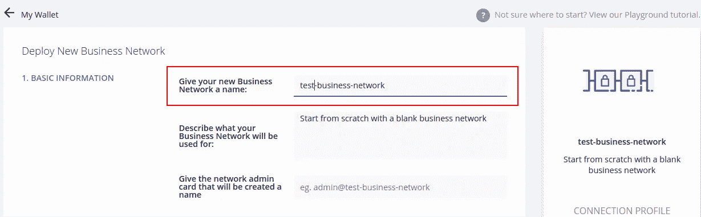

# 安装 Hyperledger Composer 游乐场

> 原文：<https://medium.com/coinmonks/installing-hyperledger-composer-playground-58ad359d4a2f?source=collection_archive---------0----------------------->


不断发展的区块链环境带来了许多区块链开发和测试工具。构建和运行自定义区块链现在比以前更容易了。Hyperledger Composer Playground 就是这样一个工具，它提供了一个快速建模和测试区块链网络的环境。composer 有一个简单的图形用户界面(用户界面)来编辑和测试商业区块链网络。操场使高度复杂的区块链网络变得容易运行。

Playground 的线上版和线下版都有。在线游乐场在浏览器内存中运行业务网络，而本地游乐场部署在 Hyperledger Fabric 实例中。

网上游乐场可以在这里进入:[https://composer-playground.mybluemix.net](https://composer-playground.mybluemix.net)

当 Playground 在仅浏览器模式下使用时，包括资产、业务网络、交易和参与者在内的所有数据都存储在浏览器本地存储中。

我们来查一下，如何在本地安装 hyperledger Composer Playground，

## 基本需求

1.操作系统:Ubuntu Linux 16.04 LTS ( 64 位)，或 Mac OS 10.12

2.至少 4Gb 内存。

3.Docker 引擎 17.03 或更高版本

4.Docker Compose 1.8 或更高版本

> Docker 和 Docker 组合安装在 Ubuntu 16.04 LTS (64 位)

## 跟随评论

→安装 docker

```
$ sudo apt install docker.io
```

→安装 docker 合成

```
$ sudo apt install docker-compose
```

→创建一个用户组

```
$ sudo usermod -a -G docker $USER
```

您可以通过以下方式检查 docker 的版本和 docker 撰写版本

```
$ docker --version
$ docker-compose --version
```

如果您以前在本地使用过 Hyperledger Fabric 或 Hyperledger Composer Playground，并且希望清除所有痕迹并重新开始，请使用以下命令。它将删除所有下载的图像和任何正在运行的容器。但是，如果您在机器上使用任何其他 docker 图像，请小心。

```
docker ps -aq | xargs docker rm -f 
docker images -aq | xargs docker rmi -f
```

创建容器并在本地安装操场

```
curl -sSL [https://hyperledger.github.io/composer/install-hlfv1.sh](https://hyperledger.github.io/composer/install-hlfv1.sh) | bash
```

或者

```
docker run --name composer-playground --publish 8080:8080 hyperledger/composer-playground
```

此命令将下载并启动 Hyperledger Fabric 实例和 Hyperledger Composer Playground。在执行此命令之前，请确保互联网的连通性。需要稳定的网络连接。

如果你已经安装了它，那么使用下面的命令来重新启动游乐场

→打开端子

→键入此命令并按 enter 键:

```
./composer.sh
```

一个游乐场正在运行，你可以在网络浏览器中访问该游乐场。

我们来查一下[http://localhost:8080/log in](http://localhost:8080/login)

可以看到区块链游乐场欢迎画面。


点击按钮“让我们区块链！”开办游乐场。


点击“部署新的企业网络”按钮。



给网络起个名字。


我们可以从这里选择一个合适的模板。有几个模板将被加载。

在本例中，我们刚刚创建了一个空的企业网络模板。

单击部署按钮部署区块链。您可以看到还为 admin 用户创建了一个 ID 卡。


在 id 卡的底部，有一个“现在连接”按钮将管理员连接到新的网络，

连接到业务网络模式后，您将被引导定义选项卡。


在顶部，我们可以看到“定义”选项卡和“测试”选项卡。

从“定义”选项卡，我们可以定义或编写并使用业务网络中的模型。

单击“添加文件”按钮添加文件

从向导中，您可以添加四个必需的文件，即

*   模型文件
*   作业脚本文件
*   查询文件
*   访问控制文件


## **模型文件**

在这个文件中，我们定义了业务模型中的资产、参与者和事务。

选择此文件并单击“添加”按钮。新模型文件将自动打开。

```
/**
 * New model file
 */
namespace org.acme.myfirstmodel
asset Test identified by testId {
  o String testId
  o String message
}
transaction helloworld {
  --> Test test
}
```

## **脚本文件(。js)**

```
/**
 * New script file
 */
/**
 @param {org.acme.myfirstmodel.helloworld} helloworld
 @transaction
 */
function helloworld(helloworld) {
  console.log("Hello world" + helloworld.test.message);
}
```

通过单击“更新”按钮更新它。我们正准备测试这个模型。


在我们可以使用测试模型之前，我们必须实例化一个资产并将其存储在资产注册中。创建新资产，给出一个测试 Id 和消息并保存它。


该实例保存在资产注册表中。


现在，我们可以通过单击 F12 打开 javascript 控制台。然后点击“提交事务”按钮调用“helloworld”事务。


然后指定事务的 id 并提交它。我们可以检查控制台来查看事务状态。


这里没有什么特别的，它只是向您展示了一个资产和事务管理的模型。如何实例化资产，将资产存储在资产注册中，并将资产传递到事务中。显然，一个真正的应用会更复杂。但我希望它能给你一个基本的想法来测试你的模型和操场。

> Nikhil krishnan