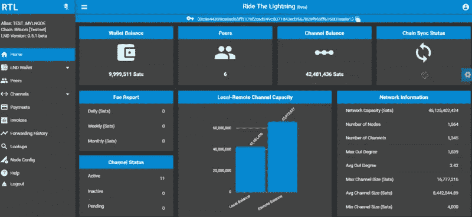

# 在树莓派上安装 RTL⚡🍓

> 原文：<https://medium.com/coinmonks/installing-rtl-on-raspberry-pi-3cad96c25652?source=collection_archive---------0----------------------->



RTL GUI homepage

让我们面对现实:我们这些“书呆子”喜欢玩 shell 命令，但通常一个好的 GUI 会有很大的帮助。

因此，如果你像我一样使用 RaspberryPi 在家里安装了比特币闪电网络，我将向你展示如何安装“驾驭闪电”( RTL) GUI。

# 强制介绍:什么是乘风破浪(RTL)？

引自项目的 [github](https://github.com/ShahanaFarooqui/RTL/blob/master/README.md) :

*“RTL 是 lightning 网络守护程序的全功能、设备无关的 web 用户界面，有助于管理 Lightning 节点操作。”*

因为我在我的 Lightning 网络节点上使用 LND，我决定尝试一下 RTL，它似乎是命令行工具`lnd`的理想伴侣

# 如何在树莓派上安装 RTL

下面是我一步一步做的。

以管理员身份登录并安装节点

```
sudo apt-get update
sudo apt-get dist-upgrade
curl -sL https://deb.nodesource.com/setup_11.x | sudo -E bash -
sudo apt-get install -y nodejs
```

将 RTL 安装为比特币用户

```
 sudo su - bitcoin
cd /mnt/hdd
git clone [https://github.com/ShahanaFarooqui/RTL.git](https://github.com/ShahanaFarooqui/RTL.git)
cd RTL
npm install
```

一段时间后…我们可以回到主目录并创建一个符号链接

```
cd
ln -s /mnt/hdd/RTL .RTL
```

现在是编辑配置文件的时候了，使用`sample-RTL.conf`作为草稿

```
cp sample-RTL.conf RTL.conf
```

下面是内容，记得改一下`rtlPass`字段

```
[Authentication]
macaroonPath=/home/bitcoin/.lnd
nodeAuthType=CUSTOM
lndConfigPath=/home/bitcoin/.lnd/lnd.conf
rtlPass=XXXXXXXXX[SSO]
rtlSSO=0
rtlCookiePath=
logoutRedirectLink=/login
[Settings]
flgSidenavOpened=true
flgSidenavPinned=true
menu=Vertical
menuType=Regular
theme=dark-blue
satsToBTC=false
bitcoindConfigPath=/home/bitcoin/.bitcoin/bitcoin.conf
enableLogging=true
port=3000
lndServerUrl=[https://localhost:8080/v1](https://localhost:8080/v1)
```

现在让我们启动服务器，检查一切是否正常，并打开 web 浏览器。记得用您的 Raspberry Pi 节点的 ip 地址更改`localhost`。

```
node rtl$ Server is up and running, please open the UI at [http://localhost:3000](http://localhost:3000)
```

现在我们知道 RTL 正在工作，我们可以将 RTL 设置为一个服务。

我们需要创建 RTL systemd 单位和以下内容。保存并退出。记得使用`admin`用户。

```
sudo vim /etc/systemd/system/RTL.service
```

这是文件的内容:

```
# Raspibolt RTL: systemd unit for RTL
# /etc/systemd/system/RTL.service[Unit]
Description=RTL daemon
Wants=lnd.service
After=lnd.service[Service]
ExecStart=/usr/bin/node /home/bitcoin/.RTL/rtl
User=bitcoin
Restart=always
TimeoutSec=120
RestartSec=30[Install]
WantedBy=multi-user.target
```

现在启用并启动 RTL

```
sudo systemctl enable RTL
sudo systemctl start RTL
```

Yoi 还可以实时监控 RTL 日志文件(用 Ctrl-C 退出)

`sudo journalctl -f -u RTL`

# 如何使用 RTL 图形用户界面

[Saubyk](https://medium.com/u/f20be2293ec2?source=post_page-----3cad96c25652--------------------------------) 写了一篇关于这个主题的优秀指南，所以我只是参考一下:

[](/@suheb.khan/how-to-ride-the-lightning-447af999dcd2) [## 如何驾驭闪电！

### 舌头紧紧地贴在脸颊上；-)，这是一个如何操作 LND 节点的指南，带有“乘风破浪”的网络界面…

medium.com](/@suheb.khan/how-to-ride-the-lightning-447af999dcd2) 

希望这有所帮助！

```
*Feel free to connect my Lightning Network node:
>$ lncli connect* 039401f72bc0d40efb58b01de15527a2a5ae1943d7c29067b725a1467a93c7e66f@2.238.144.76:9735
```

> [直接在您的收件箱中获得最佳软件交易](https://coincodecap.com/?utm_source=coinmonks)

[](https://coincodecap.com/?utm_source=coinmonks)