# 安装 Tezos 水龙头

> 原文：<https://medium.com/coinmonks/installing-tezos-taps-382adedd6a0f?source=collection_archive---------0----------------------->

## 一步一步的入门指南

*更新 2: TAPS v1.1.1 于 2019 年 9 月 10 日发布，具有默认批量支付、债券池管理和奖励“偿还”按钮等高级选项。*

*更新 1: TAPS v1.0.0 于 2019 年 2 月 28 日发布，采用原生钱包，使其独立于 Tezos node。将发布一篇新文章，并提供截图。*

泰佐斯。来自里约热内卢的开发者、设计师、投资者和研究人员组成的团队 Rio 于 2 月 16 日发布了他们的第一版 TAPS 软件(Tezos Automatic Paying System 的首字母缩写)，这是一个允许面包师自动向委托人分配奖励的系统。关于 TAPS 及其工作原理的介绍可以在我们之前的文章中找到:【https://medium.com/@lmilfont/bakers-on-holiday-6b15b300f0b1 

水龙头安装有一些要求，让它工作。这篇文章旨在成为一个循序渐进的入门指南。

# 安装水龙头

TAPS 是在 CFML 编写的，因此它需要一个 Coldfusion 应用程序服务器来运行。我们设计 TAPS 在 Lucee 上运行，Lucee 是 Coldfusion 的免费开源版本。

## 第一步

从 https://download.lucee.org/[下载 Lucee 服务器](https://download.lucee.org/)

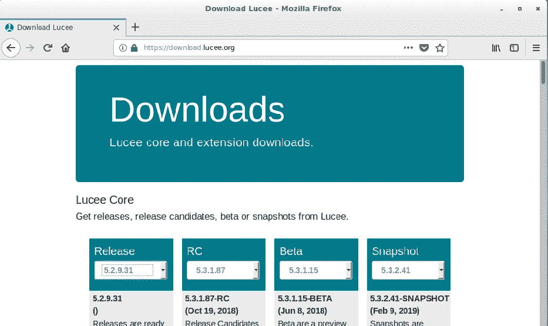

Lucee Server download website

从“发布”栏中选择适当的二进制文件。在我们的例子中，是 Linux 64b 安装程序。

当我们等待下载完成时，下载 H2 数据库 Lucee 扩展会很方便，它就在同一个网页上。您可以向下滚动并手动查找，或者只需按 CTRL + F 并键入 H2:

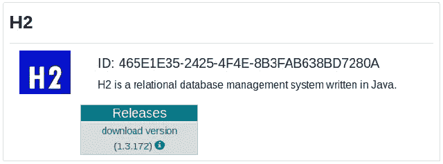

点击“下载版本(1.3.172)”并让它完成以备将来使用。

Lucee 服务器下载完成后，检查您的下载文件夹。您将拥有一个名为“lucee-5 . 2 . 9 . 031-pl1-Linux-x64-installer . run”的文件。这是可执行的二进制 Lucee 安装程序。

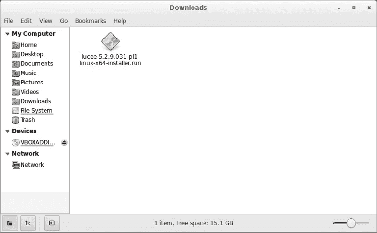

您可能需要获得下载文件夹的 root 权限。之后，用鼠标右键点击 Lucee 安装程序图标并选择“打开”。您可能会看到下面的消息:

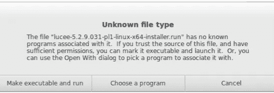

选择“生成可执行文件并运行”。这将执行 Lucee 安装向导。

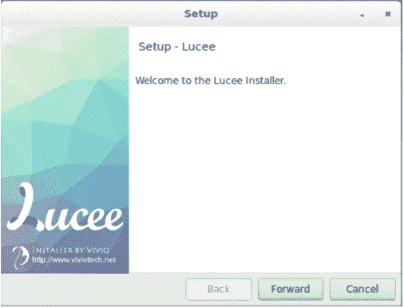

Lucee installation wizard

点击“前进”按钮。将显示许可协议屏幕。选择“我接受许可协议”，然后单击“转发”。

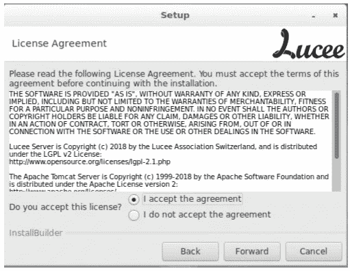

Lucee 安装程序会询问安装目录。保持默认的“/opt/lucee”，按“前进”。

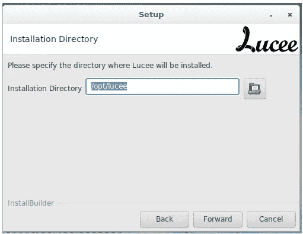

现在安装程序将提示您输入密码。这将需要访问 Lucee 管理员配置页面。输入两次密码，长度不超过 6 个字符。把它写在一张纸上，这样你就不会忘记了。

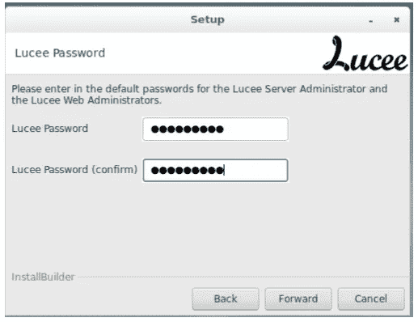

Lucee 需要一个 web 端口来响应请求。目前，不要更改任何默认端口号。只需按下“前进”按钮。

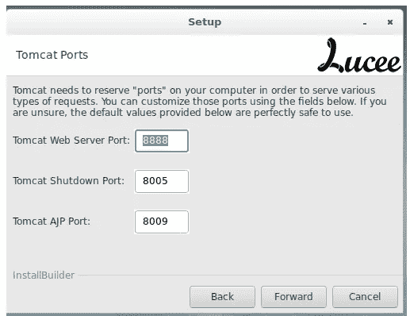

接下来，还要维护“root”用户作为 Tomcat 将使用的系统用户帐户。

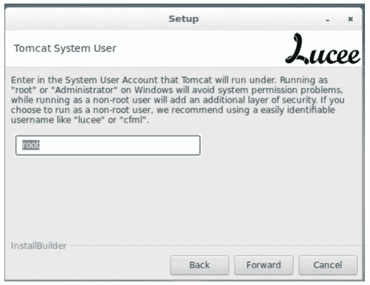

现在安装程序会问我们是否想在每次启动时自动启动 Lucee。选择是。

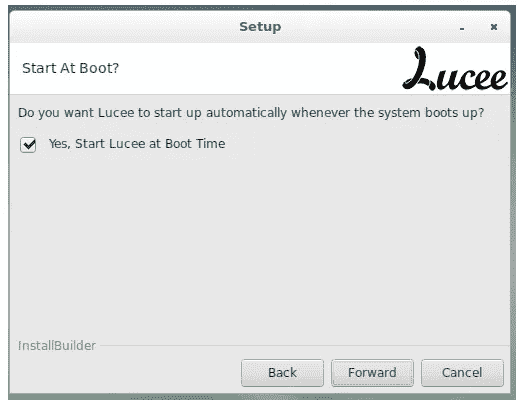

下一步非常重要。我们不想启用对 Lucee 的外部访问，因为我们没有发布一个公共网站。我们意图是只限制对本地主机的访问。因此，在这里，我们将把复选框留空，因为我们不会安装 Apache Connector。

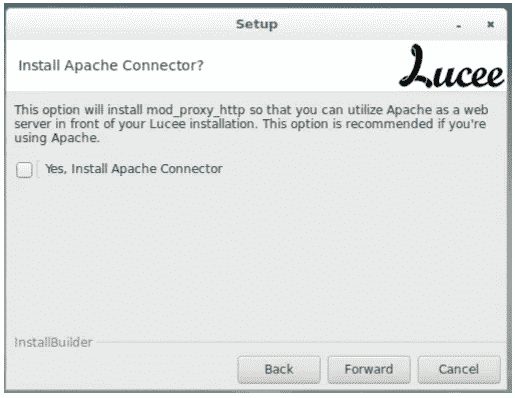

有了之前给 Lucee 向导的所有信息，它将开始复制文件。它将显示一个“准备安装”窗口。只需点击“转发”继续，并等待它完成:

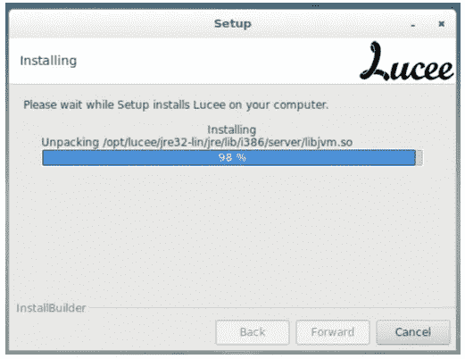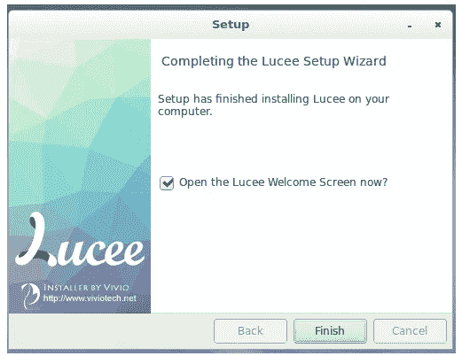

按下“完成”按钮后，在某些系统上“Lucee 欢迎屏幕”可能不会显示，即使复选框设置为打开它。不要担心那个。

打开网络浏览器，通过手动输入地址让我们看到“Lucee 欢迎屏幕”: [http://127.0.0.1:8888/](http://127.0.0.1:8888/)

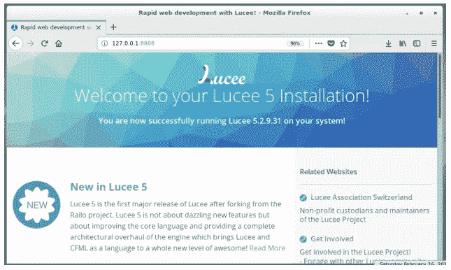

如果您看到这个屏幕，这意味着 Lucee 已经成功安装，并且可以在您的服务器上运行 CFML 代码。不错！

您可以使用以下命令启动/停止 Lucee 应用服务器:

sudo/opt/lucee/lucee _ CTL[开始][停止]

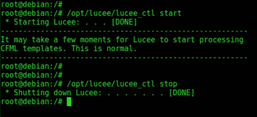

既然 Lucee 已经成功安装，我们必须为它添加一个数据库管理系统。出于速度和简单性的考虑，我们选择了 H2 数据库。安装非常简单。

在我们的下载文件夹中，我们可能已经放置了文件“org . h2–1 . 3 . 172 . lex”，因为我们在上一步中已经下载了 H2。文件扩展名”。lex”的意思是“Lucee 扩展”,这是向 Lucee 添加扩展的一种非常简单的方式。我们只需要将这个文件复制到 Lucee 安装目录下的一个特定文件夹中。所以，右击“org . H2–1 . 3 . 172 . lex”文件，选择“复制”。然后，转到文件夹/opt/lucee/Tomcat/lucee-server/deploy/并将文件粘贴到那里。搞定了。

安装的 Lucee 服务器和数据库部分已经完成。现在我们将从它的 GitHub 库中克隆 TAPS。打开一个 shell 命令提示符。

首先，我们必须进入 Lucee 的 webapps 目录。这是一个特殊的文件夹，Lucee server 希望在其中找到它的应用程序。尽管这一步并不难，但它可能会因您的操作系统而异:

*Debian:/opt/lucee/Tomcat/web apps*

*Ubuntu:/opt/lucee/Tomcat/web apps/ROOT*

因此，根据您的系统，使用 CD 命令更改您的目录以进入 Lucee 的 apps 文件夹:

cd /opt/lucee/tomcat/webapps

一旦进入 webapps(或 webapps/ROOT)文件夹，现在是时候实际克隆 Taps github 存储库了。这将在 webapps 中创建一个“taps”文件夹:

git 克隆[https://github.com/TezosRio/taps.git](https://github.com/TezosRio/taps.git)

TAPS 源代码将被下载到您的本地服务器上。完成后，只需遵循以下步骤:

*   使用[http://127 . 0 . 0 . 1:8888/TAPS/index . cfm](http://127.0.0.1:8888/taps/index.cfm)在浏览器中启动 TAPS
*   使用默认用户/通行证登录 TAPS:admin/admin。

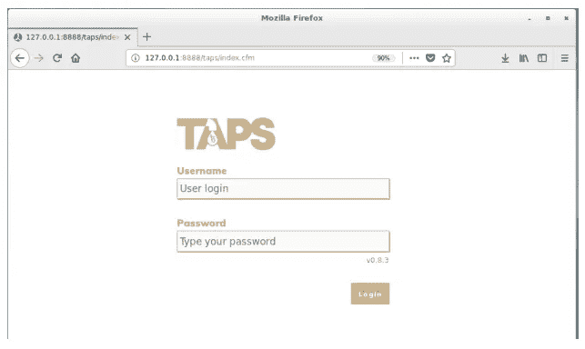

现在，登录后，转到“设置”页面，输入您的面包师的详细信息:

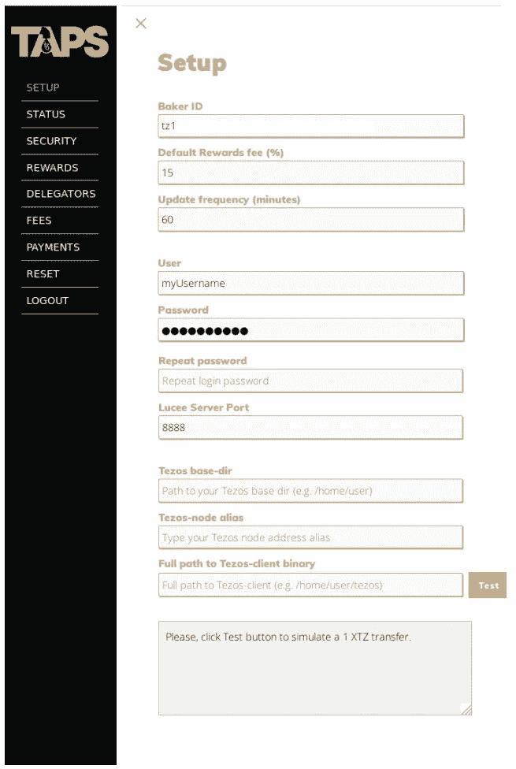

面包师 ID 是必需的，因此 TAPS 将从 TzScan.io API 收集关于面包师的奖励和委托人的信息。

默认奖励费用百分比将用于填充面包师所有委托人的已收费用的初始信息。这可以在以后单独更改。

更新的频率域是 TAPS 最重要的内容之一。这将配置计划任务(TAPS 的核心)每隔 *n* 分钟运行一次。没有必要指定低于 10 分钟的频率，因为非常低的频率会有被禁止滥用 TzScan API 的风险。这意味着，每隔 *n* 分钟，TzScan API 将被查询以查看是否发生了周期变化。如果是这样，TAPS 将对委托人进行奖励分配。设置为 10 分钟即可。

作为一种安全措施，用户名和密码用于限制对 tap 的访问。建议安装后立即更改默认用户名和密码。只能配置一个用户使用 tap。

Lucee 服务器端口——如果您已经安装了 Lucee 服务器来使用另一个端口号，那么您应该只更改 Lucee 服务器端口。否则，将其保留为默认的 8888。

Tezos base-dir、Tezos-node 别名和 Tezos-client 的路径——另一个极其重要的字段。TAPS 将使用这些来动态构建*传输*命令，该命令将被传递给 tezos-client 执行。当你点击测试按钮时，你将能够在下面的文本区域中看到，建立的传输命令模拟。如果 TAPS 能够运行该命令，将会出现一个绿色的勾号，与保存按钮一起出现。只需按保存继续。

更新(v1.1.1):使用配置了本机钱包的 Taps 要容易得多，也更灵活。选择“本地钱包”选项，这样你就可以忽略前面的段落注释。

如果一切顺利，我们将进入祝贺屏幕:

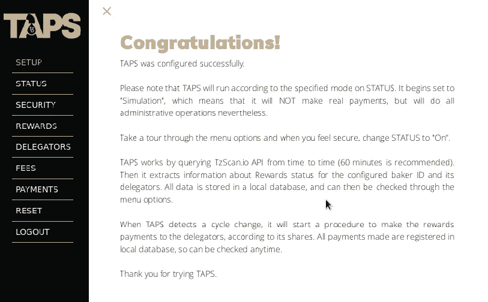

这确认 TAPS 配置正确并且能够运行。现在你可以浏览菜单选项，如奖励、授权、费用和付款。计划任务将在后台执行。所以，如果它没有来得及填充本地数据库表，你会看到这样的东西:

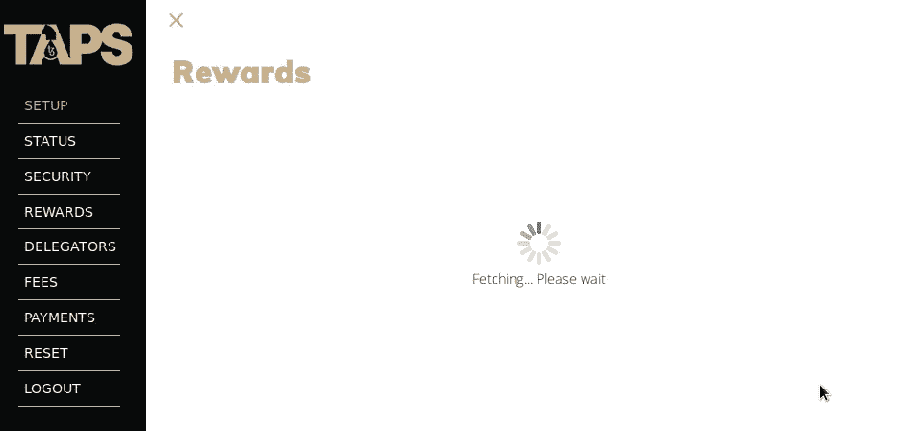

TzScan.io 获取完成后，将显示有关奖励、委托人和费用的信息:

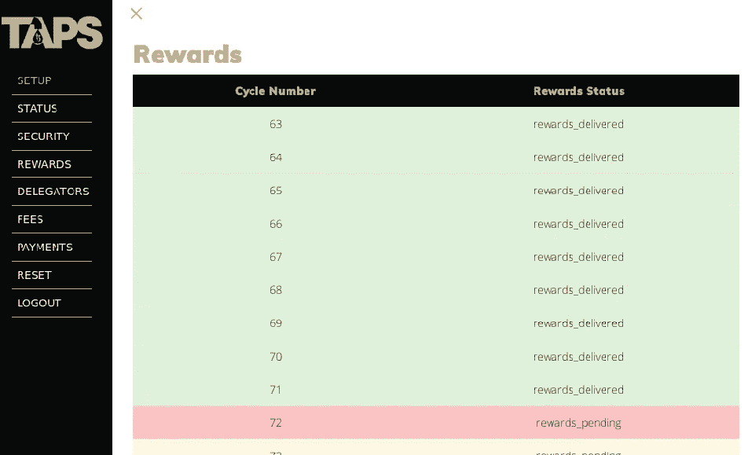

Rewards information fetched from TzScan.io API

“委托人”屏幕显示了所有贝克委托人的列表，其余额在奖励待定周期中的快照，其在总投资价值中的份额，每个委托人将获得的奖励，收取的费用(如在 SETUP 中首次配置的)，以及委托人将获得的实际价值(不含费用)。请注意，计算会截断值，而不是对值进行舍入。因此，2.928 XTZ 的值将变为 2.92 XTZ。在未来的 TAPS 版本中，这将是一个由面包师配置的参数(取整或截断值)。

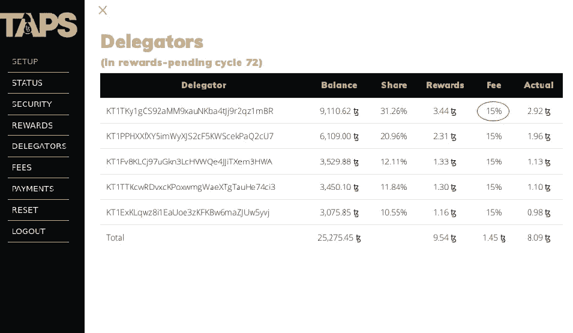

“费用”页面将允许面包师编辑为每个委托人单独收取多少费用。因此，如果我们将第一个更改为，比如 5%，并返回到 DELEGATOR 页面，它将被更新:

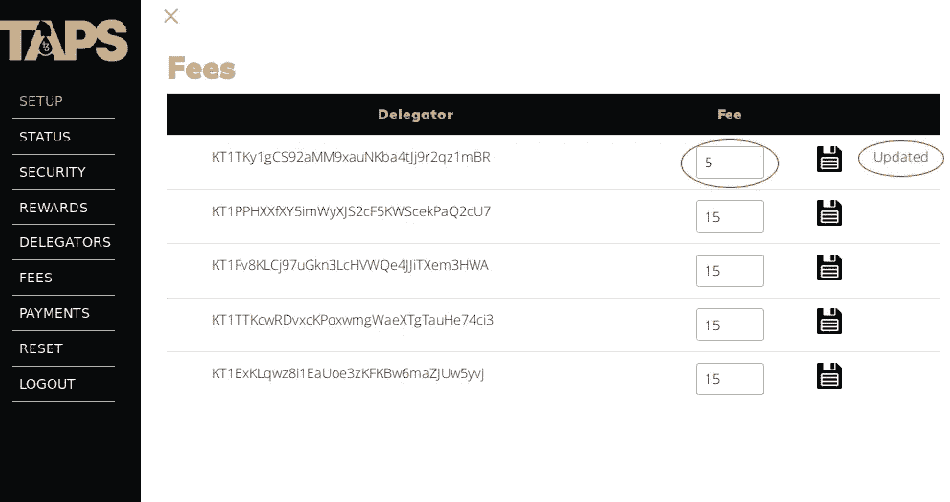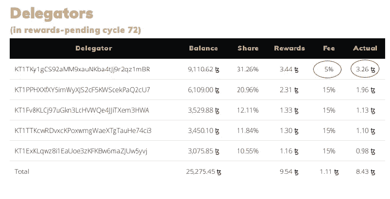

Updated delegate rewards calculation after fee change

## 结论

这基本上是成功运行 Taps 所需要的。在这一步一步的指导下，Taps 将在后台运行，等待下一个循环周期，这时它将触发它的动作(并自动付款)。

## 最新版本(v1.1.1)

Taps v1.1.1 有一些先进的新功能:

*   批量支付

Taps 会将内存中的一个集合中的所有事务分组。之后，它将发送一个包含 n 个事务的唯一操作。这比逐个发送事务要有效得多，因为它更能抵抗故障。它也更快。在一个周期的付款完成后，检查您在 tzScan.io 上的面包师地址交易。您会注意到所有的最后一次付款交易都共享相同的散列和时间戳。这证实了它们是同时发送的，作为一个批次。

*   债券池管理

您可以注册您的所有债券池参与者，他们向池中贡献的个人 XTZ 数量，并定义向每个参与者收取的管理费用。此外，您可以考虑将其中一名池成员作为经理。经理将获得行政管理费。如果您打开债券池支付选项并正确设置了其成员，Taps 在向委托人支付费用后，会将剩余的奖励分配给债券池委托人:假设您的节点在第 140 周期获得了 100 XTZ 的奖励。想象一下，80 XTZ 是付给代表团的。剩余的 20 个 XTZ 债券将被分配给你们的债券池。

*   高级“还款”按钮

嗯，事情出错的可能性总是很小的。想象一下，如果出于某种意想不到的原因，Taps 没有在一个周期内支付给您的委托人。然后，我们创建了“偿还”按钮，正是这样做的:如果水龙头没有在一个周期的工作，只是去高级菜单选项，并点击偿还按钮。Taps 将再次支付该周期的费用。但是，请记住:在使用此功能之前，请始终等待一两个小时，以了解 Taps 是否真的错过了循环付款。

> [直接在您的收件箱中获取最佳软件交易](https://coincodecap.com/?utm_source=coinmonks)

