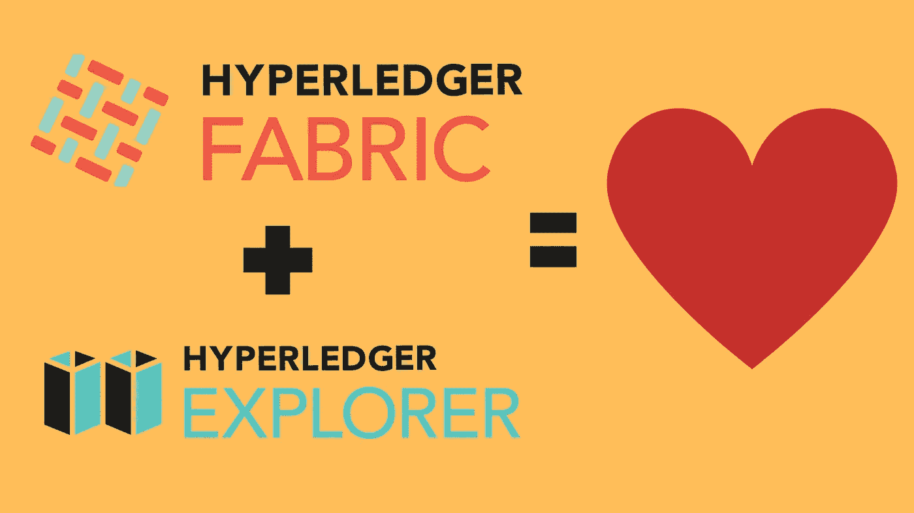
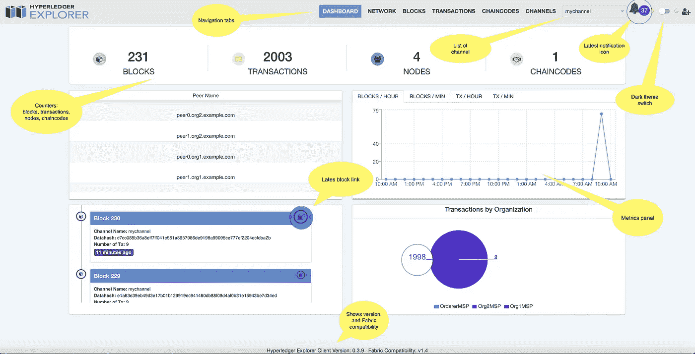
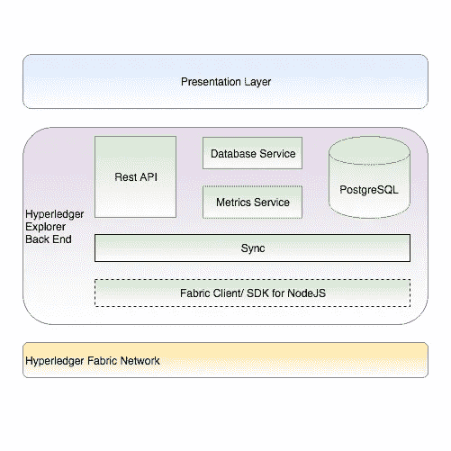
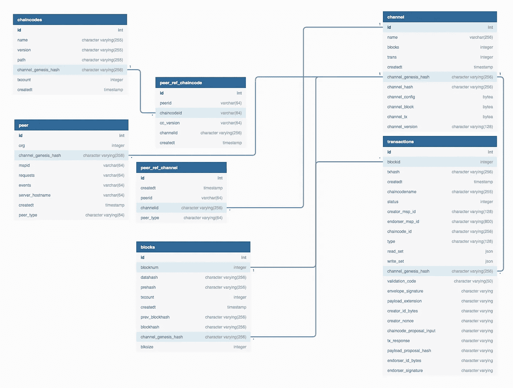
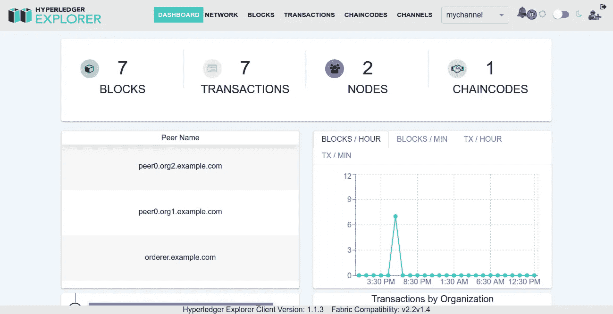
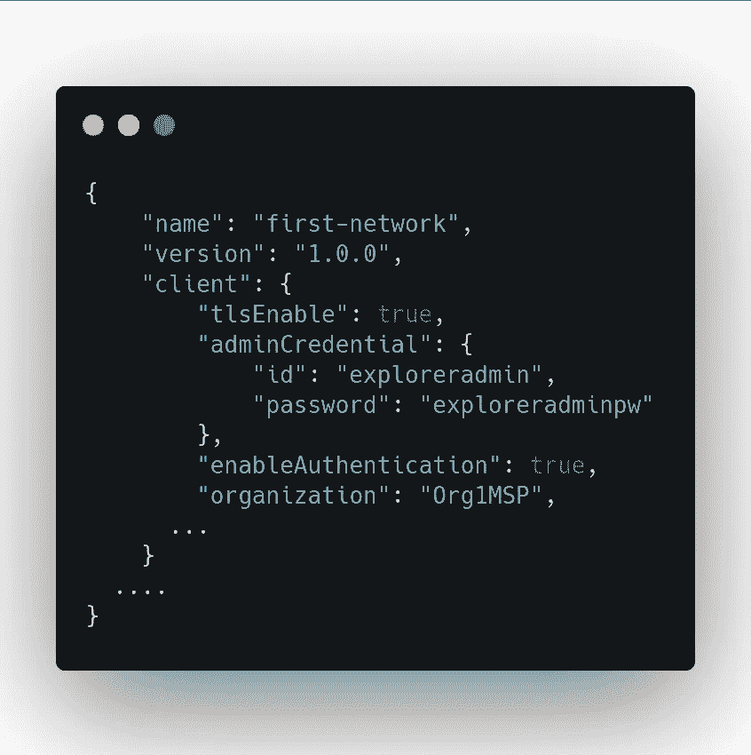
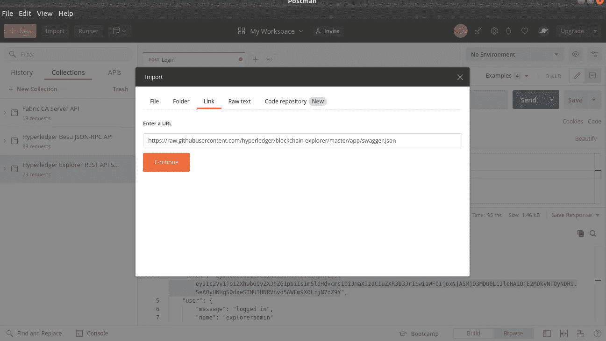
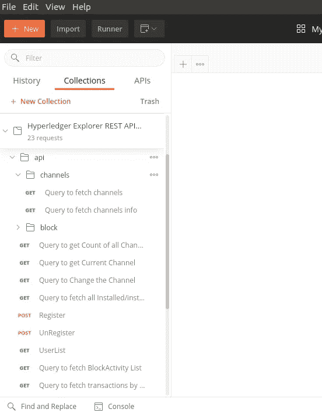

# 将 Hyperledger Explorer 与 Hyperledger Fabric Network v2.2 集成

> 原文：<https://medium.com/coinmonks/integrating-hyperledger-explorer-with-hyperledger-fabric-network-v2-2-9a70e4c5311?source=collection_archive---------0----------------------->



# **1。概述**

为了从数据中提取商业价值，可视化数据的能力至关重要。Hyperledger Explorer 提供了这一急需的功能。Hyperledger Explorer 是一个用户友好的 Web 应用程序工具，用于查看、调用、部署或查询块、事务和相关数据、网络信息(名称、状态、节点列表)、链代码和事务系列，以及存储在分类帐中的任何其他相关信息。在本文中，我们将学习如何将 Hyperledger Explorer 与 Hyperledger Fabric 集成。我们将使用 v2.2，因为它是当前的 LTS 版本。

> ***TL***[***源代码***](http://bit.ly/hlf-advance) ***可以在这里找到。
> 同样，结帐我的*** [***科目上的超帐结构部署在多主机上***](http://bit.ly/hlf-multihost-deployment)

# 2.Hyperledger 浏览器的主要功能



Integrating Hyperledger Explorer with Hyperledger Fabric Network v2.2

*   具有丰富用户界面的 Web 应用程序，使用最新技术开发，如 ReactJS、Google material UI、web-sockets 等。
*   可以监听和查询 Hyperledger 结构网络的区块链模块。
*   获取最新的状态块、网络和链码，查看块和事务。
*   按小时和分钟划分的块和事务度量。
*   按日期范围和渠道搜索和过滤块、交易。
*   动态发现新频道，并按频道切换数据显示。
*   获得新数据块的实时通知。

# 3.体系结构



Integrating Hyperledger Explorer with Hyperledger Fabric Network v2.2

它由 3 层组成

1.  **表示层/前端**-Hyperledger explorer 的前端构建在 ReactJs 之上
2.  **后端层-** 后端是建立在 node js 和带有 WebSockets 的 express 框架之上。
3.  **数据库层-** 它使用的是 [PostgreSQL](https://www.postgresql.org/) 数据库。关于块、交易、通道等的信息将存储在该数据库中。

下图显示了 Hyperledger Explorer 数据模型的高级视图。



Integrating Hyperledger Explorer with Hyperledger Fabric Network v2.2

# 4.履行

1.  克隆存储库

```
git clone https://github.com/adityajoshi12/fabric-samples-advance-topics
```

2.启动网络

```
cd fabric-samples-advance-topics/test-network
./network.sh up createChannel -c mychannel -s couchdb -i 2.2
```

3.启动 explorer docker 容器

```
cd ../explorer
docker-compose up -d
```

4.浏览器容器打开后，在浏览器上打开`[http://localhost:8080](http://localhost:8080)`。您可以看到资源管理器仪表板。您需要登录，一旦成功登录，您将能够看到如下屏幕。



Integrating Hyperledger Explorer with Hyperledger Fabric Network v2.2

仪表板的用户名和密码在`explorer/first-network.json`中定义，为了禁用认证，我们可以将`enableAuthentication`设置为`true`



Integrating Hyperledger Explorer with Hyperledger Fabric Network v2.2

你可以用`docker logs -f explorer.mynetwork.com`查看日志，你可以在这里找到视频教程[。](https://www.youtube.com/watch?v=JCyZYoJrb-8)

要停止 hyperledger 浏览器运行，请执行以下操作:

```
docker-compose down
```

# **5。构建自己的用户界面**

您可以使用浏览器公开的 REST API 在 hyperledger 浏览器上构建自己的用户界面。Explorer 团队为我们提供了 Swagger 规范，您可以简单地将其导入到 REST 客户端，如 [Postman](http://postman.com) 或[失眠症](https://insomnia.rest/)。你可以在这里找到 swagger 规格[。](https://raw.githubusercontent.com/hyperledger/blockchain-explorer/master/app/swagger.json)



Integrating Hyperledger Explorer with Hyperledger Fabric Network v2.2

导入 swagger 规范后，您可以看到一个包含 REST API 的集合。



Integrating Hyperledger Explorer with Hyperledger Fabric Network v2.2

现在，您可以简单地将这些 API 用于您选择的任何前端框架。

# 6.摘要

在本文中，我们学习了如何将 hyperledger explorer 与 Hyperledger Fabric network 集成，您可以看到这非常简单，在 5 分钟内我们就可以将 Hyperledger explorer 与 HLF 集成。你可以在这里找到源代码[。](https://bit.ly/hlf-advance)

> ***查看我的*** [***科目在超帐结构上的部署***](http://bit.ly/hlf-multihost-deployment)

如果你觉得这篇文章很有帮助，请点击拍手按钮，并跟随我阅读更多这样的信息丰富的文章。

你可以在 [Linkedin](https://linkedin.com/in/adityajoshi12) 上找到我或者在 [GitHub](https://github.com/adityajoshi12) 上跟踪我？如果这对你来说太社交化了，如果你想和我讨论技术，就给 adityaprakashjoshi1@gmail.com 发封邮件。

