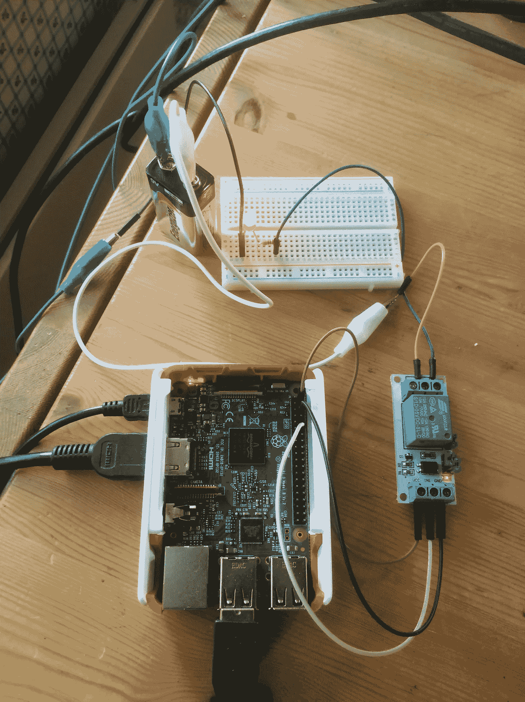
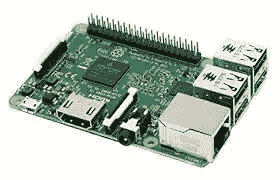
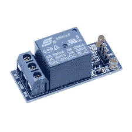
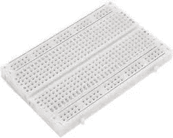
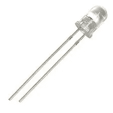
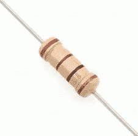
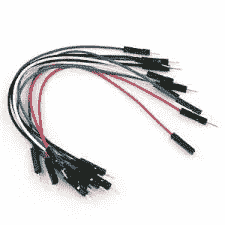
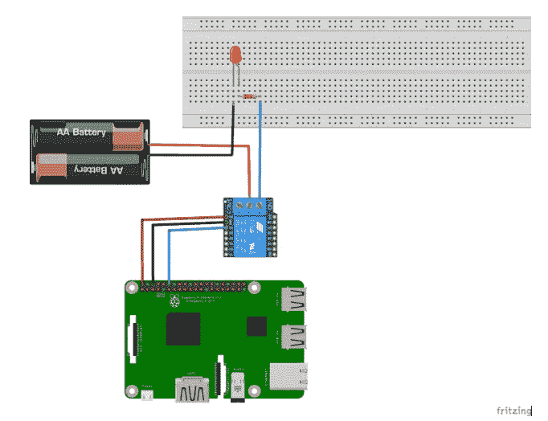

# 将物理设备与 IOTA 集成

> 原文：<https://medium.com/coinmonks/integrating-physical-devices-with-iota-83f4e00cc5bb?source=collection_archive---------0----------------------->

关于将物理设备与 IOTA 协议集成的初学者教程系列的第一部分。

# 介绍

这个初学者教程简单而强大地演示了如何使用 IOTA 协议从物理设备进行支付和接收服务。本教程的目标是演示我们如何构建一个简单的电源电路，该电路可以根据给定 IOTA 地址的电流平衡进行开关。
我们将使用互联网连接的 Raspberry PI 和 Python 编程语言来检查 IOTA tangle 上的平衡，并使用 PI 的内部 GIO 引脚对连接的继电器进行切换。继电器将再次连接到一个简单的电池供电电路，该电路打开/关闭发光二极管(LED)，代表我们项目中的物理设备。

*注意！
这个项目的一个更简单的版本是将 LED 直接连接到树莓派的 GOI 引脚，而不使用继电器。然而，由于 Raspberry PI GIO 引脚最多只能提供 5V 电压，我们将使用一个继电器来演示我们可以使用相同的基本设置来管理高压器件。然而，选择低功率电路的主要原因是* ***任何人都不应该玩弄高电压，除非他们绝对知道自己在做什么*** *。*

# *用例*

在进入构建这个项目的细节之前，我们应该后退一步，看看更大的图片，看看像这样一个简单的演示项目如何应用到真实世界的用例中，解决真实的问题。

想象一下，你住在一家酒店，每个房间都有自己的冰箱。在大多数情况下，这些冰箱只是放在那里，消耗能源，并没有被使用，但你最终还是间接支付了租金的一部分。如果有一种机制可以让你直接为冰箱的使用时间付费，同时让它在不用的时候自动关闭，会怎么样？这基本上是我们将在本教程中重新创建的用例，唯一的不同是，为了方便和安全，我们将用 LED 取代冰箱。

现在，让我们试着描述一系列事件来演示如何实现和使用这个系统。

首先，让我们想象酒店老板在你的房间里安装了一台冰箱，在冰箱电源电路中放置了一个继电器。继电器然后连接到树莓 PI 上的内部 GIO 引脚，作为冰箱支付系统的控制单元。接下来，他为冰箱创建一个 IOTA 地址，用于在添加新的冰箱资金时进行监控。最后，他打印 IOTA 地址的二维码，并将二维码贴在冰箱上。

现在系统的物理部分已经完成，他创建了一个运行在 Raspberry PI 上的简单 Python 程序，不断检查冰箱 IOTA 地址以寻找新资金，相应地打开/关闭冰箱(继电器)。

现在想象你是一个购物归来的客人，买了一瓶上好的白葡萄酒准备晚上喝。为了确保它保持凉爽，你拿起你的手机，打开你最喜欢的 IOTA 钱包，扫描贴在冰箱上的二维码，并根据你打算使用它的时间长度，将一定量的 IOTA 转移到冰箱。

一旦 tangle 确认了您的交易，冰箱的余额就会增加，并且在 PI 上运行的 Python 程序会获得余额的变化。然后，PI 将使用其 GIO 引脚打开继电器，冰箱将打开。

Python 程序将记录使用的时间和您转移的 IOTA 数量，不断从您的活动余额中删除时间，并最终在您的余额为空时关闭冰箱。

就这样…最后，你在去镇上之前享受一瓶好喝的凉葡萄酒。

*注意！
在您希望使用相同设置控制多个设备的情况下，最好有一个中央 Raspberry PI 作为所有设备的公共控制单元，其中每个设备都分配有自己唯一的 IOTA 地址。这可以通过对 Python 代码稍加修改，使用多通道继电器轻松实现。为了简化布线和编码，我们将在本教程中只管理一个设备，但以后可以随意扩展该项目来管理多个设备。*

# 成分

在这一节中，我们将看看构建项目所需的不同组件。你应该可以在大多数电子商店或 EBAY/AMAZON 上以低于 50 美元的价格买到它们。

**树莓派**这个项目的“大脑”就是树莓派。Raspberry PI 将运行 Python 代码来监控我们的 IOTA tangle 地址以获得新的资金，并处理 Raspberry PI 的 GIO pins。

**继电器**
继电器用于打开/关闭我们的电源电路，从而打开/关闭我们的设备(在本例中为 LED)。为了简化我们的电路，我们将使用一个继电器模块(屏蔽)，该模块内置了所有必需的组件、引脚和连接器。请注意，您可以购买带有多个继电器(通道)的模块，这些继电器可以单独打开/关闭。如前所述，这在需要管理多个设备的情况下非常有用。

试验板用于连接我们的电路，无需焊接，便于组装和拆卸。

**发光二极管(LED)**
LED 通电后会亮起，代表我们在这个项目中的物理设备(冰箱)。

**电阻器(330 欧姆)**
电阻器用于限制发送到我们 LED 的电流。如果没有电阻器，您可能会损坏 LED 和/或树莓 PI。您应该使用的电阻类型取决于 LED 的类型和您提供给电路的电压量。在我的情况下，我使用 9V 电池，所以 330 欧姆电阻应该没问题。我建议你根据你的项目版本中使用的元件来研究你应该使用什么类型的电阻。

**电池**电池是用来给我们的电源电路提供电能的。在我的情况下，我使用 9V 电池。

电线我们还需要一些电线把它们连接起来。

**二维码**
如果你想使用移动 IOTA 钱包支付 LED，打印的 IOTA 支付地址二维码很方便。使用 IOTA 钱包生成新地址或在[https://thetangle.org](https://thetangle.org)搜索现有地址时，您会发现一个二维码

# 为项目布线

现在，让我们看看如何连接这个项目中使用的电路。

按照以下方式连接电路:

1.  将 Raspberry PI 上的针脚 2 (5V)连接到继电器模块上的 VCC 针脚。
2.  将 Raspberry PI 上的针脚 6(接地)连接到继电器模块上的 GND 针脚。
3.  将 Raspberry PI 上的引脚 12 (GPIO18)连接到继电器模块上的 in(信号)引脚。
4.  将继电器模块上的 COM 端子连接到蓄电池的正极(+)。
5.  将继电器模块上的 NO 端子连接到 LED 的阳极(+)侧，中间有电阻器。
6.  将电池的负极(-)连接到 LED 的正极(-)侧。

*注意！
注意 LED 上的两个引脚长度不同。短引脚代表 LED 的阴极(-)侧，长引脚代表阳极(+)侧。*

# 所需的软件和库

在我们开始为这个项目编写 Python 代码之前，我们需要确保在我们的 Raspberry PI 上安装了所有需要的软件和库。

首先，我们需要在我们的 Raspberry PI 上安装一个操作系统。任何支持 Raspberry PI 的 Linux 发行版都应该可以工作。在我的例子中，我使用的是 Raspbian 发行版，因为它已经包含了 Python 和几个 Python 编辑器(IDE)。拉斯边发行版的安装说明可以在这里找到:[https://www.raspberrypi.org/downloads/raspbian/](https://www.raspberrypi.org/downloads/raspbian/)

如果你需要单独安装 Python，你可以在这里找到:[https://www.python.org/downloads/](https://www.python.org/downloads/)

最后，我们需要安装 PyOTA API 库，它将允许我们使用 Python 编程语言访问 IOTA tangle。包含安装说明的 PyIOTA API 库可以在这里找到:[https://github.com/iotaledger/iota.lib.py](https://github.com/iotaledger/iota.lib.py)

# Python 代码

现在我们已经将电路连接好，并且在 Raspberry PI 上安装了必要的软件和库，我们将开始编写运行我们项目的实际 Python 代码。

这个项目的源代码可以在这里找到:[https://gist . github . com/hug GRE/a 3044 e 6094867 Fe 04096 e 0 c 64 DC 60 f 3 b](https://gist.github.com/huggre/a3044e6094867fe04096e0c64dc60f3b)

# 运行项目

要运行这个项目，首先需要将上一节中的代码保存为 Raspberry PI 上的文本文件。

注意 Python 程序文件使用。py 扩展名，所以我们在树莓 PI 上把文件存为***let _ there _ be _ light . py***。

要执行该程序，只需启动一个新的终端窗口，导航到保存 *let_there_be_light.py* 的文件夹，然后键入:

**python let _ there _ be _ light . py**

现在，您应该可以在终端窗口中看到正在执行的代码，显示您当前的光余额，并每 10 秒钟检查一次 LED 的 IOTA 地址余额，以获得新的资金。

# 支付光

要打开 LED，您只需使用您最喜欢的 IOTA 钱包，并将一些 IOTA 转移到 LED 的 IOTA 地址。一旦 IOTA tangle 确认了交易，LED 就会亮起，并一直亮着，直到根据您传输的 IOTA 的数量，余额用完为止。在我的例子中，我将 1 秒钟的光的 IOTA/光比率设置为 1 IOTA。

*注意！
如果使用手机钱包支付电费，您可以考虑打印一个二维码，以便在支付电费时扫描。*

# 下一步是什么？

你可以在这里找到本系列下一个教程的链接

# 贡献

如果你想对本教程有所贡献，你可以在这里找到一个 Github 库

# 捐款

如果您喜欢本教程，并希望我继续制作其他教程，请随意向 Python 代码中使用的 IOTA 地址捐款。此外，在构建和测试您的项目版本时，请随意使用相同的 IOTA 地址，这样，每当我(和您)的 LED 灯亮起时，它都会很好地提醒我(我们)有人正在使用本教程。

nyzbhovsmdwabxsacajttwjoqrvvawlbsfqvsjswwbjjlsqknzfc 9 xcrpqsvfqzpbjcjrannpvmmezqjrqsvvgz