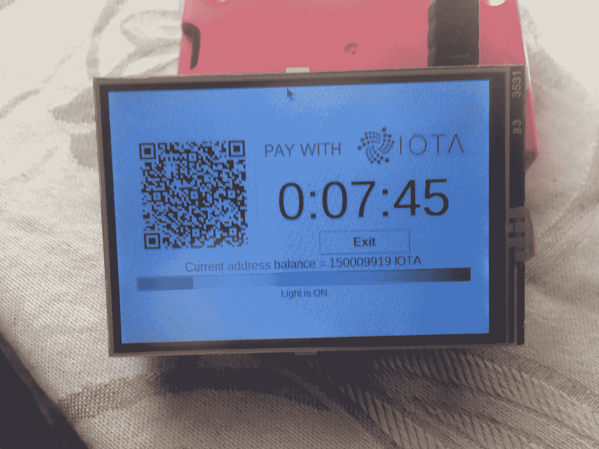
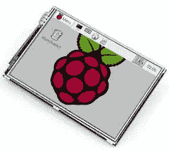
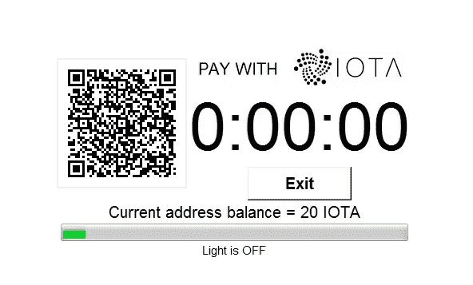

# 将物理设备与 IOTA 集成—添加用户界面

> 原文：<https://medium.com/coinmonks/integrating-physical-devices-with-iota-adding-a-user-interface-2fb028a8fee1?source=collection_archive---------7----------------------->

## 关于将物理设备与 IOTA 协议集成的初学者教程系列的第三部分。

IOTA user interface

# 介绍

这是关于将物理设备与 IOTA 协议集成的初学者教程系列的第三部分。在本教程中，我们将使用液晶显示器(LCD)为我们的 IOTA 支付系统提供一个简单的图形用户界面(GUI)。

如果您还没有阅读本系列的第一篇教程,您应该在继续之前阅读它，因为它构成了我们在本教程中构建的项目的基础。

# 使用案例

现在，我们已经按照[第一篇教程](/@hugogregersen/integrating-physical-devices-with-iota-83f4e00cc5bb)中的描述启动并运行了新的 IOTA 驱动的冰箱支付系统，我们应该后退一步，看看可以对我们的系统进行哪些改进。如果我们从用户(旅馆客人)的角度来看，一个突出的问题是没有指示器告诉他冰箱服务的当前状态，因此没有指示他是否或何时需要增加额外的资金以防他想要延长服务。我们也有一些关于印刷二维码的问题。在酒店所有者想要改变一个或多个冰箱的 IOTA 支付地址的情况下，他将不得不物理地替换其酒店中每个冰箱的印刷 QR 码。与印刷二维码相关的另一个问题是，理论上一个坏演员可以用假二维码替换官方印刷的二维码，将任何未来的冰箱付款发送到错误的地址。我们还有一个关于管理冰箱服务价格的问题。酒店所有者如何能够相对于易变的市场价格显示他的冰箱服务的最新价格？这些问题的合理解决方案是为游客提供某种类型的动态用户界面，在该界面上，游客可以与系统进行交互并从系统获取实时信息。在本教程中，我们将在我们的项目中添加一个简单的 LCD 显示器来提供这样一个界面。

*注意！
使用 LCD 动态显示我们的 QR 码可以解决另一个与重复使用 IOTA 地址相关的问题，也称为 Winternitz 一次性签名*方案*。这是一种赋予 IOTA 量子电阻特性的保护机制。只要旅馆老板不从他的冰箱地址花费任何资金，它们就是完全安全的，然而，一旦他从其中一个地址花费任何资金，该地址就不再安全，并且必须被新的 IOTA 支付地址替换。一个更好的选择可能是为每笔付款自动生成一个新的地址(和 QR 码),这样我们就可以一起忽略这个问题。这就是我们的液晶显示器派上用场的地方。我将把自动生成 IOTA 地址的主题留到以后的教程中。现在，让我们只关注在 LCD 上显示我们的静态 QR 码。*

# 成分

我不会在本教程中讨论项目的基本组件(除了 LCD)和布线，因为它可以被视为本系列第一篇教程的附加内容。

**LCD**
市场上有大量不同的兼容 Raspberry PI 的 LCD。根据型号和大小，你通常可以从易趣或亚马逊上以 15 美元或更高的价格买到它们。在我的例子中，我使用的是这个 3.5 英寸的 TFT LCD 触摸屏，它可以直接连接到我的 Raspberry PI 的 GIO 引脚上。如果您希望将 LCD 与 PI 分开放置，或者需要方便地使用 PI 的附加 GIO 引脚，您可能需要额外的电缆来连接 LCD。我不会详细介绍如何连接和安装 LCD 的驱动程序，因为这取决于类型和型号。对于这些信息，我建议您查阅您的特定模型的文档。

3.5" TFT LCD touch display

# 图形用户界面

接下来，让我们看看 GUI 本身以及它是如何构建的。在我的例子中，我使用流行的 [TkInter](https://wiki.python.org/moin/TkInter) 工具包创建 GUI。还有其他的工具包可以用来用 Python 创建 GUI，但是 TkInter 是最常用的。TkInter 的另一个优点是它已经包含在 Python 中了。有很多关于使用 TkInter 的例子和教程，所以我建议你在构建自己的 GUI 版本时查看这些资源。您想在 GUI 中包含什么信息和功能当然取决于您，在我的示例中，我选择了包含以下元素:

My IOTA payment GUI

1.  使用服务时要扫描的 IOTA 支付地址的 QR 码。
2.  “用 IOTA 支付”标志，清楚地表明这是 IOTA 支付服务。
3.  任何活动服务的剩余时间。
4.  所选 IOTA 支付地址的当前余额。(这通常与项目的实际实现无关，但在调试系统时可能有用)
5.  进度条指示检查新资金的 IOTA 纠结之间的间隔。
6.  指示灯是开着还是关着的状态标签。
    (在编写本教程时，我没有连接物理继电器和 LED，所以我使用这个标签来识别 LED 何时打开或关闭)
7.  退出按钮退出 Python 程序。
    (在项目的实际实现中包含这个按钮可能没有意义，因为我们不希望用户自己退出系统。但是，我的示例中包含了它，以提供一种在测试和调试时关闭 Python 程序的便捷方式)

*注意！
我已经决定在我的 GUI 中排除任何与服务价格相关的信息，因为我计划在未来的教程中更深入地研究这个主题。*

# 所需的软件和库

在我们开始为这个项目编写 Python 代码之前，我们需要确保在我们的 Raspberry PI 上安装了所有需要的软件和库。

首先，我们需要在我们的 Raspberry PI 上安装一个操作系统。任何支持 Raspberry PI 的 Linux 发行版都应该可以工作。在我的例子中，我使用的是 Raspbian 发行版，因为它已经包含了 Python 和几个 Python 编辑器(IDE)。带有安装说明的 Raspbian 发行版可以在这里找到:[https://www.raspberrypi.org/downloads/raspbian/](https://www.raspberrypi.org/downloads/raspbian/)

如果你需要单独安装 Python，你可以在这里找到:[https://www.python.org/downloads/](https://www.python.org/downloads/)

我们还需要安装几个 GUI 使用的库

1.  py QR code
    py QR code 库用于在 LCD 上生成和呈现我们的 QR 码。带有安装说明的 PyQRCode 库可以在[这里](https://pypi.org/project/PyQRCode/)找到。
2.  Pillow
    Pillow 库用于在 LCD 上呈现我们的 IOTA 徽标。带安装说明的枕头库可在[这里](https://pypi.org/project/Pillow/2.2.1/)找到。

最后，我们需要安装 PyOTA API 库，它将允许我们使用 Python 编程语言访问 IOTA tangle。包含安装说明的 PyIOTA API 库可以在这里找到:[https://github.com/iotaledger/iota.lib.py](https://github.com/iotaledger/iota.lib.py)

# Python 代码

现在，让我们来看看 Python 代码是如何变魔术的。与本系列第一篇教程的主要区别在于，我们现在使用基于 TkInter 的图形用户界面，而不是向控制台写入一些文本。注意我们是如何通过为根对象设置一些属性来强制 GUI 全屏显示的。另一个重要的方面当然是缩放 GUI 中的各个元素，以便它们能够正确地显示。在我的例子中，我使用的是 3.5 英寸的 LCD，并相应地调整了缩放比例。还请注意，我已经删除了所有对 GPIO 库的引用以及与 GIO 引脚相关的任何函数，因为在写本教程时我没有连接我的继电器。这也允许我在将 GUI 移动到 PI 之前，在任何计算机上创建和测试我的 GUI。

*提示！
当我将液晶显示器连接到树莓派时，我面临的一个问题是:当 LCD 处于活动状态时，PI 不再向 HDMI 端口发送任何信号。当测试和调试我的 GUI 时，这很快成为一个问题，因为我当时只能使用一个显示器，LCD 或我的 HDMI 显示器。为了解决这个问题，我最终在 PI 和我的家用电脑上都安装了* [*真正的 VNC*](https://www.realvnc.com/en/) *。现在，我可以让 PI 处于 LCD 模式，并在我的 PC 上进行编码。因此，每当我想在 LCD 上测试我的 GUI 时，我只需使用* [*真实 VNC*](https://www.realvnc.com/en/) *中的文件传输函数，并在 PI 上执行代码。*

你可以从[这里](https://gist.github.com/huggre/67efefd75a5fa2571446d3b7c9d58e0b)下载 Python 源代码。

# 运行项目

要运行这个项目，首先需要将上一节中的代码保存为 Raspberry PI 上的文本文件。

注意 Python 程序文件使用。py 扩展名，所以我们先把文件保存为***let _ there _ light _ GUI . py***在树莓派上。

要执行该程序，只需启动一个新的终端窗口，导航到保存*let _ there _ be _ light _ GUI . py*的文件夹，然后键入:

**python let _ there _ be _ light _ GUI . py**

现在，您应该会看到 GUI 出现在您的 LCD/显示器上，显示您的 IOTA 支付地址的 QR 码以及前面描述的其他元素。要退出 Python 程序，只需按退出按钮。

*注意！
在执行程序之前，请确保下载“iota_logo75.jpg”文件并将其放在与 python 文件相同的文件夹中，否则会出现错误。logo 文件可以从* [*这里下载*](https://github.com/huggre/pay_the_light_gui/blob/master/iota_logo75.jpg) *。*

# 支付光

要打开 LED(或者在我的情况下，将**灯设置为打开**状态)，您只需使用您最喜欢的 IOTA 钱包，并将一些 IOTA 转移到您选择的 IOTA 地址。一旦 IOTA tangle 确认了交易，LED 应该亮起(或者在我的情况下，将**灯设置为打开**状态)，并根据您传输的 IOTA 的数量保持亮起，直到灯余额为空。在我的例子中，我将 1 秒钟的光的 IOTA/光比率设置为 1 IOTA。

# 下一步是什么？

你可以在这里找到本系列下一个教程的链接

# 贡献

如果你想对本教程有所贡献，你可以在这里找到一个 Github 库

# 捐款

如果您喜欢本教程，并希望我继续制作其他教程，请随意向 Python 代码中使用的 IOTA 地址捐款。此外，在构建和测试您的项目版本时，请随意使用相同的 IOTA 地址，这样，每当我(和您)的 LED 灯亮起时，它都会很好地提醒我(我们)有人正在使用本教程。

nyzbhovsmdwabxsacajttwjoqrvvawlbsfqvsjswwbjjlsqknzfc 9 xcrpqsvfqzpbjcjrannpvmmezqjrqsvvgz