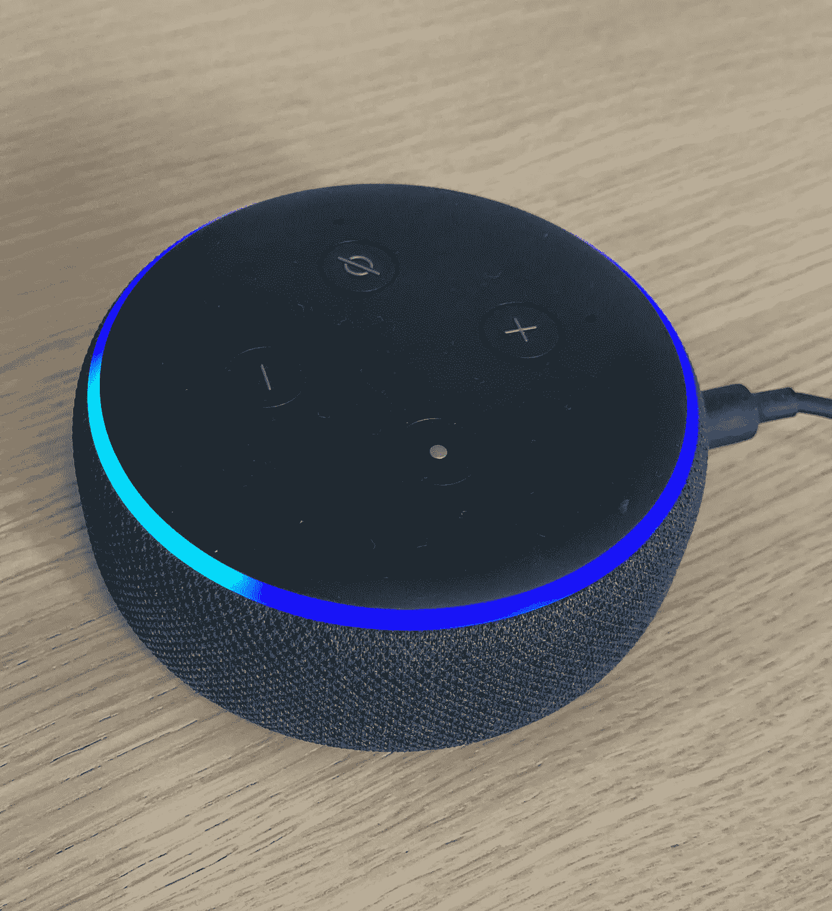
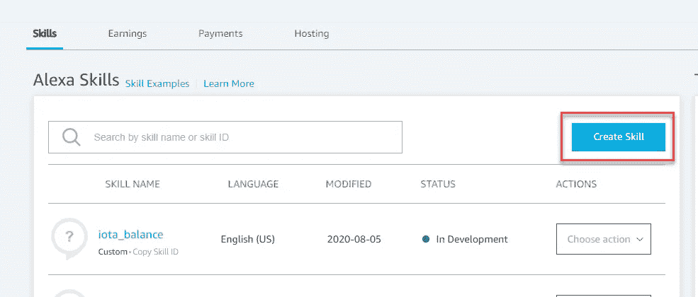
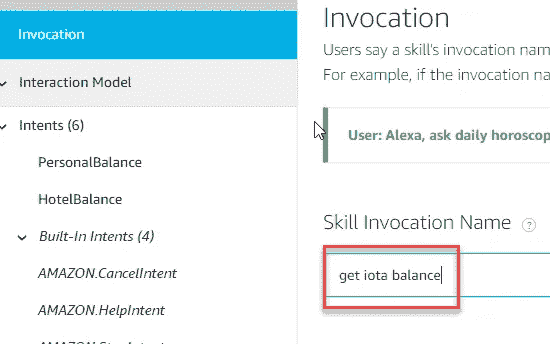
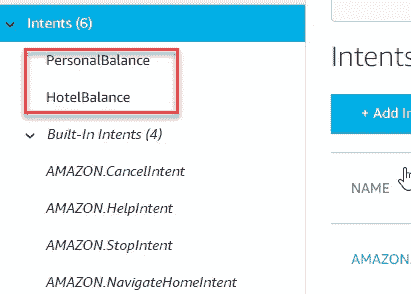
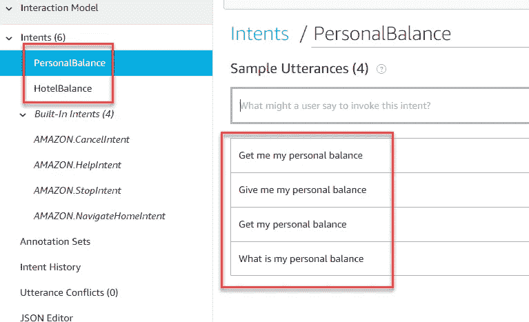
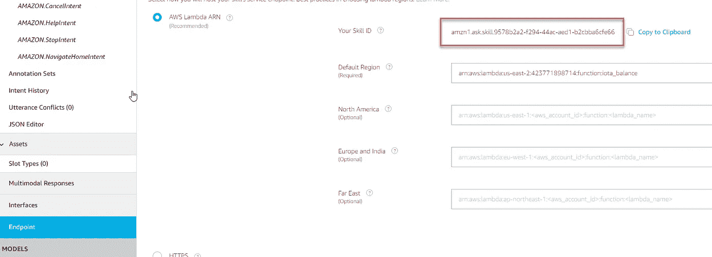
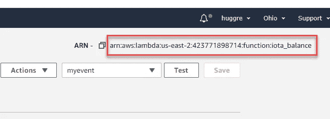
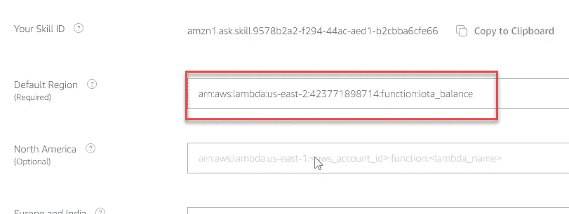
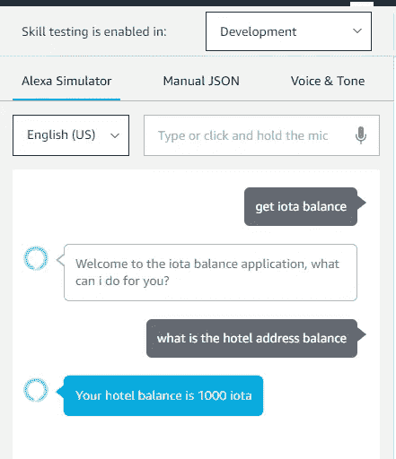

# 将物理设备与 IOTA 集成— Amazon Alexa

> 原文：<https://medium.com/coinmonks/integrating-physical-devices-with-iota-amazon-alexa-72bc5a811ac5?source=collection_archive---------1----------------------->

## 关于将物理设备与 [IOTA 协议](https://blog.coincodecap.com/iota-coin-explained-for-beginners)集成的初学者系列教程的第 20 部分

*Alexa，请发送五十个 IOTA 给 Alice
Alexa，我的 IOTA 余额是多少？
Alexa，目前 IOTA 的交易吞吐量是多少？*

完成本教程后，你可以教 Alexa 做一些很酷的事情…

# 介绍

这是初学者教程系列的第 20 部分，我们将探索如何将物理设备与 IOTA 协议集成在一起。在本教程中，我们将看看如何将亚马逊 Alexa 虚拟助手与 IOTA 协议集成在一起。同时，我们还将了解云计算的概念，因为我们这个项目的 Python 代码将作为 [AWS Lambda 函数](https://aws.amazon.com/lambda/)托管。

# 使用案例

随着时间的推移，我们的酒店所有者最终拥有多个 IOTA 地址，在那里他从各种 IOTA 供电的设备和服务接收资金。他不时需要检查这些地址的余额。唯一的问题是打开他的三位一体钱包或查看 thetangle.org 会让他无法同时做其他事情。如果他可以使用某种语音激活助手来帮助他呢？然后，他可以获得所需的信息，同时专注于手头的任务。

让我们看看我们是否能帮助他..

# 亚马逊 Alexa 是什么？

亚马逊 Alexa 是一款虚拟语音助手应用。由亚马逊开发。Alexa 应用程序。嵌入到许多不同的支持 Alexa 的设备中，如智能扬声器、智能电视、智能高保真系统、智能手表等。如果你没有注意到的话，你甚至可以在你的车里嵌入 Alexa。

*注意！
请注意，您不需要支持 Alexa 的设备来与 Alexa 对话。你可以简单地安装亚马逊 Alexa 应用程序。在你的 IOS 或 Android 智能手机上。*

# 什么是 Alexa 技能？

虽然 Alexa 可以做很多开箱即用的事情..有时我们需要教她一些她还不知道如何做的新“技能”。这正是我们在本教程中要做的。

最简单地说，Alexa 技能就像语音激活的智能手机应用程序。它们是由第三方开发者(比如我们)创建的。一些 Alexa 技能完全独立工作，而另一些则与其他东西交互，例如 Spotify 等在线服务，Roomba 机器人吸尘器等智能家居产品，或者像我们这样的 IOTA tangle。

# 什么是 AWS Lambda？

AWS Lambda 是一个事件驱动的无服务器计算平台，由 Amazon 作为 Amazon Web Services (AWS)的一部分提供。AWS Lambda 允许我们托管和运行我们新的 Alexa 技能所需的 Python 代码。Python 代码(及其所有依赖项/库)通常打包成一个. zip 文件，并以 AWS Lambda 函数的形式上传到 AWS。我们现在可以根据来自其他 AWS 服务(如 Alexa)的响应来触发 Lambda 函数(Python 代码)。

您可以在 [AWS 管理控制台](https://aws.amazon.com/console/)中免费创建和托管 AWS Lambda 功能，方法是在这里注册一个 AWS 免费层帐户

*注意！
AWS Lambda 函数可以用不同的编程语言编写，比如 Node.js、Java 和 Go，以防你更喜欢用这些语言中的一种来编写你的 Lambda 代码。在我的例子中，我决定使用 Python，因为您可能已经从我以前的教程中熟悉了 PyOTA 库。*

# 逐步实施

当开发一个新的 Alexa 技能时，我们通常从在 Alexa 开发者控制台*中创建一个新的 *Alexa 技能*开始。接下来，我们定义如何与 Alexa 互动，以便她理解我们在对话中的意图。接下来，我们获取 Python 代码，其中包含我们新的 Alexa 技能所需的所有函数，并将代码作为托管的 *AWS Lambda 函数*上传到亚马逊网络服务云中。接下来，我们将我们的 Alexa 技能“连接”到 Lambda 函数，以便 Alexa 知道当我们与她交互时要运行什么代码和函数。最后，我们测试新的 Alexa 技能。*

*让我们一步一步来..*

## *步骤 1-创建一个新的 Alexa 技能*

*让我们从在 Alexa 开发者控制台中创建一个新的 Alexa 技能开始*

*要创建一个新的 Alexa 技能，你首先需要注册一个免费的 Alexa 开发者账户。你可以在这里找到 Alexa 开发者控制台[的链接](https://developer.amazon.com/alexa/console/ask)。*

*注册并登录后，你应该会看到 Alexa 开发者控制台的主页。*

*让我们开始创建一个新的 Alexa 技能使用“创建技能”按钮。*

**

*接下来，我们需要给我们的新技能一个名字，一个默认语言，一个模型和一个托管方法。*

*让我们用默认语言**英语(美国)**来称呼这个新技能 **iota_balance** 。作为模式，选择**自定义**，作为托管方式，选择**提供您自己的**，然后按下“创建技能”按钮*

*接下来，我们需要为我们的新技能选择一个模板。*

*在按下“继续模板”按钮之前，让我们选择 **Hello World 技能**模板。*

## *步骤 2-指定调用、意图和表述*

*接下来，我们需要教 Alexa 如何在典型的对话中调用她的新技能并与之互动。这是通过使用*调用*、*意图*和*话语*来完成的。*

***调用**
调用*调用*让 Alexa 知道当我们叫她的时候要表演什么技能。在我的例子中，我决定使用短语:**获得 iota 平衡** 因此，如果我现在想要 Alexa 执行这个特定技能，我会简单地说: ***Alexa，获得 iota 平衡****

**

***意图** *意图*部分指定了 Alexa 新技能中的各种“功能”,我可能想在我们的对话中调用这些功能。在我的例子中，我有两个主要意图:*

1.  *获取我的个人 IOTA 地址的余额*
2.  *获取酒店的剩余地址*

*在我的例子中，我将这些意图命名为: *PersonalBalance* 和 *HotelBalance**

**

**注意！请注意，有一些内置意图(CancelIntent、HelpIntent 等)。)自带的* ***你好世界技能*** *模板。如果你想退出技能，获得更多关于技能的信息等等，这些是你会调用的典型意图。现在，只要把它们留在意图列表中。**

***话语**对于每个意图，你还需要指定一些典型的短语来表达特定的意图。这些短语被称为*话语*并与各自的意图相关联。例如，如果我想调用 *PersonalBalance* 意图，我可能会说“获取我的个人余额”或“什么是我的个人余额”。*

**

**注意！通过使用一些聪明的机器学习算法，即使你没有直接说出样本话语，Alexa 通常也能理解你的意图。通常在句子中只包含一两个关键词就足够了。**

## *步骤 3-为我们的 Alexa 技能创建并上传 AWS Lambda 函数*

*接下来，我们将在 AWS 中创建新的 AWS lambda 函数，并上传 Python 代码供我们的新 Alexa 技能使用。*

*首先转到 [AWS 管理控制台](https://aws.amazon.com/console/)并找到 Lambda 服务。*

*选择 Lambda 服务后，选择功能并按下“创建功能按钮”*

*选择“从头开始创作”模板，并给你的新 Lambda 函数起一个名字。在我的例子中，我使用了名称 *iota_balance* 。最后，选择 *Python 3.8* 作为你的编程语言，按下“创建函数”按钮。*

*当新的 Lambda 函数打开时，我们需要做的下一件事是指定该函数将由 Alexa 技能触发。进入*设计器*面板，按下“添加触发器”按钮。然后从“触发配置”列表中，选择“Alexa 技能套件”。当询问您的*技能 ID* 时，粘贴在步骤 1 中创建的 Alexa 技能的技能 ID。*

**注意！在你的 Alexa 技能中选择端点，你会找到你的 Alexa 技能的技能 ID。**

**

*现在我们已经创建了新的 Lambda 函数，我们可以开始上传将与该函数相关联的 Python 代码了。*

*如前所述，当将 Python 代码作为 Lambda 函数托管时，重要的是我们还要包含并上传函数所需的任何非标准 Python 库。在我们的例子中，PyOTA 库是必需的，所以我们必须确保我们也包含了这个库中的文件。我们在实践中这样做的方法是，我们将所有需要的文件打包在一个文件中。zip 文件，然后上传。AWS Lambda 函数的 zip 文件。*

**重要！我已经准备了一个. zip 文件，你可以在你的 Lambda 函数中使用，让你在创建你的第一个 Alexa 技能时有一个良好的开端。的。zip 文件包括 Alexa 使用的 lambda_function.py 文件以及与 IOTA tangle 交互时所需的 PyOTA 库。您可以找到并下载。本* [*Github 资源库*](https://github.com/huggre/amazon_alexa) *中的 zip 文件(get_iota_balance.zip)。**

*现在我们有了。zip 文件，转到 AWS 管理控制台中的新 Lambda 函数，在*功能代码*面板中选择*动作*下拉菜单，然后选择“上传. zip 文件”。您现在可以选择并上传您的。zip 文件。*

## *第四步——将你的 Alexa 技能与 Lambda 函数联系起来*

*在开始测试我们的新 Alexa 技能之前，我们需要做的最后一件事是将我们的 Alexa 技能“连接”到 Lambda 函数，以便 Alexa 知道在执行她的新技能时使用什么 Lambda 函数。*

*首先复制你在 Lambda 函数中看到的右上角的 ARN id*

**

*接下来，转到你的 Alexa 技能，选择*端点*并将 id 粘贴到*默认区域*字段*

**

*好了..点击你的 Alexa 技能中的“保存模型”和“建立模型”按钮，我们就可以开始测试我们的新 Alexa 技能了。*

## *步骤 4-测试我们的 Alexa 技能*

*要测试我们的新 Alexa 技能，从 Alexa 技能菜单中选择“测试”，然后从“技能测试启用于:”下拉菜单中选择*发展*。*

*你现在可以通过按下 Alexa 模拟器中的麦克风图标来开始输入文本或与 Alexa 交谈。*

*如果一切正常，您应该会看到(并听到)如下所示的对话框:*

**

# *Python 代码*

*让我们快速看一下这个项目的 Lambda 函数(Python 代码)以及它是如何工作的。*

*当查看代码时，你会看到我们有一些与 Alexa 交互所需的标准功能。最重要的是 *on_intent()* 函数。在这里，我们定义了步骤 2 中描述的调用每个单独意图时要执行的代码。*

*所以在我的例子中，如果你说“获取我的个人平衡”或“我的个人平衡是什么”，Alexa 技能知道我们想要执行的意图是*个人平衡*意图。接下来，我们简单地调用一个新的自定义函数( *get_personal_balance())* ，在这里，我们将与 IOTA 交互的所有代码与从 Alexa 返回的响应放在一起。*

*就这样，这是代码..*

# *创建您的项目版本*

*让您开始创建自己版本的项目(比如更改用于检查余额的 IOTA 地址)的最简单方法是简单地修改。zip 文件并上传修改后的。zip 文件到您现有的 Lambda 函数中。*

# *贡献*

*如果你想对本教程有所贡献，你可以在这里找到一个 Github 库*

# *捐款*

*如果你喜欢这个教程，并希望我继续让其他人感到自由，使一个小的捐赠给下面的 IOTA 地址。*

**

*nyzbhovsmdwabxsacajttwjoqrvvawlbsfqvsjswwbjjlsqknzfc 9 xcrpqsvfqzpbjcjrannpvmmezqjrqsvvgz*

## *另外，阅读*

*   *最好的[加密交易机器人](/coinmonks/crypto-trading-bot-c2ffce8acb2a)*
*   *[密码本交易平台](/coinmonks/top-10-crypto-copy-trading-platforms-for-beginners-d0c37c7d698c)*
*   *最好的[加密税务软件](/coinmonks/best-crypto-tax-tool-for-my-money-72d4b430816b)*
*   *[最佳加密交易平台](/coinmonks/the-best-crypto-trading-platforms-in-2020-the-definitive-guide-updated-c72f8b874555)*
*   *最佳[加密贷款平台](/coinmonks/top-5-crypto-lending-platforms-in-2020-that-you-need-to-know-a1b675cec3fa)*
*   *[最佳区块链分析工具](https://bitquery.io/blog/best-blockchain-analysis-tools-and-software)*
*   *[加密套利](/coinmonks/crypto-arbitrage-guide-how-to-make-money-as-a-beginner-62bfe5c868f6)指南:新手如何赚钱*
*   *最佳[加密制图工具](/coinmonks/what-are-the-best-charting-platforms-for-cryptocurrency-trading-85aade584d80)*
*   *[莱杰 vs 特雷佐](/coinmonks/ledger-vs-trezor-best-hardware-wallet-to-secure-cryptocurrency-22c7a3fd391e)*
*   *了解比特币的[最佳书籍有哪些？](/coinmonks/what-are-the-best-books-to-learn-bitcoin-409aeb9aff4b)*
*   *[3 商业评论](/coinmonks/3commas-review-an-excellent-crypto-trading-bot-2020-1313a58bec92)*
*   *[AAX 交易所评论](/coinmonks/aax-exchange-review-2021-67c5ea09330c) |推荐代码、交易费用、利弊*
*   *[Deribit 审查](/coinmonks/deribit-review-options-fees-apis-and-testnet-2ca16c4bbdb2) |选项、费用、API 和 Testnet*
*   *[FTX 密码交易所评论](/coinmonks/ftx-crypto-exchange-review-53664ac1198f)*
*   *[n 零审核](/coinmonks/ngrave-zero-review-c465cf8307fc)*
*   *[Bybit 交换审查](/coinmonks/bybit-exchange-review-dbd570019b71)*
*   *[3Commas vs Cryptohopper](/coinmonks/cryptohopper-vs-3commas-vs-shrimpy-a2c16095b8fe)*
*   *最好的比特币[硬件钱包](/coinmonks/the-best-cryptocurrency-hardware-wallets-of-2020-e28b1c124069?source=friends_link&sk=324dd9ff8556ab578d71e7ad7658ad7c)*
*   *最佳 [monero 钱包](https://blog.coincodecap.com/best-monero-wallets)*
*   *[莱杰纳米 s vs x](https://blog.coincodecap.com/ledger-nano-s-vs-x)*
*   *[bits gap vs 3 commas vs quad ency](https://blog.coincodecap.com/bitsgap-3commas-quadency)*
*   *[莱杰纳米 S vs 特雷佐 one vs 特雷佐 T vs 莱杰纳米 X](https://blog.coincodecap.com/ledger-nano-s-vs-trezor-one-ledger-nano-x-trezor-t)*
*   *[block fi vs Celsius](/coinmonks/blockfi-vs-celsius-vs-hodlnaut-8a1cc8c26630)vs Hodlnaut*
*   *Bitsgap 评论——一个轻松赚钱的加密交易机器人*
*   *为专业人士设计的加密交易机器人*
*   *[PrimeXBT 审查](/coinmonks/primexbt-review-88e0815be858) |杠杆交易、费用和交易*
*   *[埃利帕尔泰坦评论](/coinmonks/ellipal-titan-review-85e9071dd029)*
*   *[赛克斯·斯通评论](https://blog.coincodecap.com/secux-stone-hardware-wallet-review)*
*   *[区块链评论](/coinmonks/blockfi-review-53096053c097) |从您的密码中赚取高达 8.6%的利息*