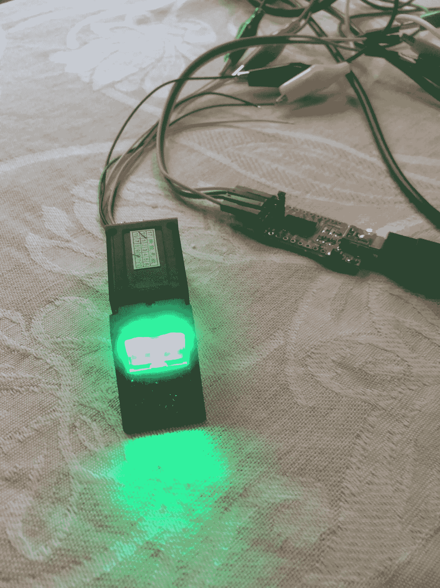
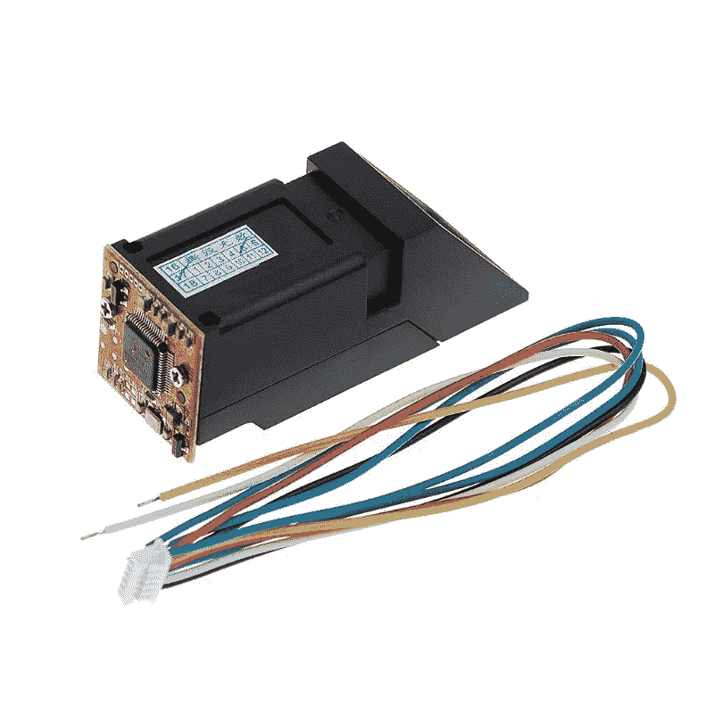
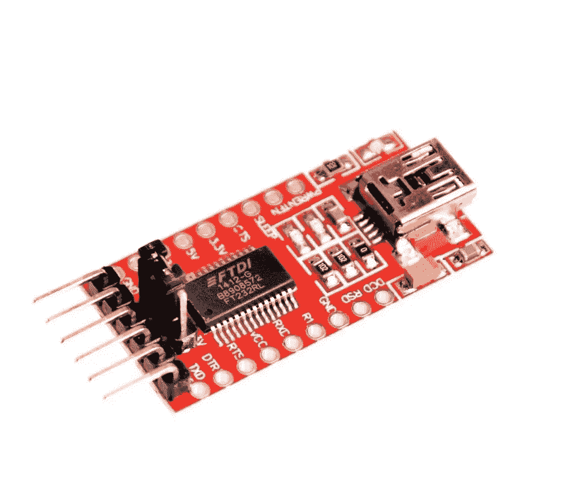

# 将物理设备与 IOTA 集成—生物识别认证

> 原文：<https://medium.com/coinmonks/integrating-physical-devices-with-iota-bio-metric-authentication-1168d630927b?source=collection_archive---------5----------------------->

## 关于将物理设备与 IOTA 协议集成的初学者教程系列的第 10 部分。

# 介绍

这是初学者教程系列的第 10 部分，我们将探索如何将物理设备与 IOTA 协议相集成。在本教程中，我们将探讨一个被称为生物认证的概念。如果你有一部带指纹识别器的智能手机，你可能已经每天都在使用这项技术了。

那么所有这些和 IOTA 有什么关系呢？

我猜想将生物识别技术与 IOTA 集成的最明显的用例是登录 IOTA 钱包(在移动 Trinity 钱包中实现)。然而，我对这个领域的兴趣是更深刻的。如果结合这些技术可以用来解决世界上更大的问题，如选民欺诈、空中交通安全或灾区的身份识别，会怎么样？

要了解生物计量技术与 IOTA 的集成如何帮助解决这些问题，我们需要从更大的角度来看。当使用手机上的指纹识别器时，用于比较和认证的指纹通常存储在识别器(手机)内部。只要你每次都使用同一个阅读器，这就很好。当你需要被另一个没有登记你指纹的阅读器认证时，问题就来了。想象一下，在全国大选中尝试实现指纹认证作为选民欺诈保护机制。全国每个投票点都必须有数千个指纹识别器。现在想象一下，必须在每个读卡器中存储每个公民的所有指纹。这几乎是不可能的。一个更好的选择可能是将所有指纹存储在一个安全且防篡改的位置，以便在需要时可以检索。这是 DLT 和 IOTA tangle 的闪光点。

我们今天不会解决任何世界性的问题。然而，本教程中提出的用例处理了同样的问题，只是规模较小。

# 使用案例

让我们想象一下，我们信任的酒店老板在每家酒店都有一个保险箱，用于存放日常业务所需的现金。有时，他的一名员工需要打开保险箱进行存款或取款。为了防止任何未经授权的个人访问保险箱，他决定在每个保险箱上安装指纹读取器形式的生物计量认证机制。当他雇佣新员工，或者他的当前员工在他的酒店之间轮换时，很难使每个阅读器中的指纹数据库与当前的员工情况保持同步。在对这个问题思考了一会儿之后，他提出了一个替代的解决方案。如果他可以将员工的指纹存储在 IOTA tangle 上，而不是指纹读取器本身，会怎么样？每当工作人员需要进入任何酒店的保险箱时，他或她的指纹会在被认证之前自动从 IOTA tangle 下载到读取器。这可能吗？

让我们看看是否能帮他一把…

*警告！
我们将使用 IOTA 事务消息片段来存储 IOTA tangle 上的实际指纹数据。重要的是要意识到 IOTA 交易消息是不加密的，并且上传到 tangle 的任何指纹数据都可能被坏人轻易解码和重新创建。为了简化这个项目的编码，我决定不包括任何数据加密/解密。如果你对上传未加密的指纹数据感到不舒服，你应该考虑在代码中加入你自己的加密/解密机制，或者用其他东西代替你的手指。*

# 成分

构建此项目所需的组件如下:

1.  任何运行基于 Debian 的 Linux 变种的联网计算机。
    就我个人而言，我用的是 Raspbian 操作系统的树莓派。
2.  智安泰克 ZFM 光学指纹识别器
3.  FTDI232 USB 转串行适配器

**智安泰克** **ZFM 光学指纹识别器** 智安泰克 ZMF 光学指纹识别器因其低成本和与树莓 PI 和 Arduino 生态系统的兼容性而广受欢迎。ZMF 有几种不同的型号(ZFM 20，ZFM 60，ZFM 70 和 ZFM 100)。我不确定我的阅读器是什么型号，因为上面没有标记。然而，用于这个项目的 python 库应该支持上面列出的所有模型。

The ZhianTec ZFM optical fingerprint reader

**FTDI232 USB 转串行适配器** ftdi 232 是一款便捷的 USB 转 TTL 串行适配器模块，提供了一种使用 USB 端口将 TTL 串行设备连接到 PC 的简单方法。你应该可以在易趣上花几块钱买到 FTDI232。

The FTDI232 USB to serial adapter

*注意！
一些 FTDI232 适配器可直接插入电脑的 USB 端口，而另一些则作为独立模块提供(如上图所示)。如果你购买一个单独的模块，确保你也有一个兼容的 USB 电缆。*

*注意！
使用 Raspberry PI 时，应该可以将指纹读取器直接连接到 PI 的 GPIO 引脚，而无需 FTDI232 适配器。但是，我自己没有测试过这个。*

# 为项目布线

有关如何连接 ZhianTec ZMF 阅读器和 FTDI232 适配器的信息，请参见以下链接。[https://tutorials-raspberry . com/how-to-use-raspberry-pi-fingerprint-sensor-authentic ation/](https://tutorials-raspberrypi.com/how-to-use-raspberry-pi-fingerprint-sensor-authentication/)

*注意！
如果你阅读文章下面的评论部分，你会看到有些人建议交换 TX 和 RX 连接，这与文章中的描述相反。我的情况就是如此。我不确定这个问题是否与我的阅读器与文章中使用的型号不同有关。如果你不能让你的阅读器工作，我建议你试试同样的方法。还要注意的是，阅读器只有在阅读时才会亮起，所以连接时不亮并不表示它工作不正常。*

# 所需的软件和库

在我们开始为这个项目编写 Python 代码之前，我们需要确保在我们的计算机上安装了所有需要的软件和库。有关安装 Python 和 PyOTA 库的更多信息，请参见之前的教程。还要确保在继续之前安装了 [PyFingerprint](https://github.com/bastianraschke/pyfingerprint) 库。关于如何安装和使用 PyFingerprint 库的说明可以在 [PyFingerprint Github](https://github.com/bastianraschke/pyfingerprint) 页面上找到。

# Python 代码

现在我们已经连接了指纹读取器并安装了 PyFingerprint 库，我们可以开始查看用于这个项目的 Python 代码了。

在查看代码本身之前，我们应该花点时间了解一下它是如何工作的。

用于这个项目的代码被分成两个独立的 Python 脚本。一个脚本用于将新指纹上传到 IOTA tangle。另一个用于对照存储在缠结上的现有指纹进行验证。

首先，我们来看看将新指纹上传到纠结的过程。

这里的一般思想是为每个用户(或者在我们的例子中，每个需要访问保险箱的酒店员工)提供一个唯一的 IOTA 种子。该种子然后将被用于生成 IOTA 地址，该 IOTA 地址将在将指纹数据(属于该特定雇员)上传到 IOTA 队列时被进一步使用。指纹数据本身由读取器创建，并以一组交易的形式发送给 tangle。包中的每个事务在其消息片段中保存一部分指纹数据。请注意，每个指纹都有一个包。您可以上传任意数量的指纹包。你甚至可以上传每个手指的多个指纹束。请注意，您上传的包越多，当它们用于验证时，下载它们的时间就越长。另请注意，ZhianTec ZMF 阅读器内存中同时存储的打印数量限制为 1000 张。

接下来，让我们看看用存储在 tangle 上的现有指纹来验证读取器上采集的指纹的过程。

这个过程从一个员工想要打开保险箱开始。然后脚本会询问他/她的种子，这样我们就知道在纠结上搜索他/她的指纹束时使用什么 IOTA 种子。接下来，脚本开始下载所有员工的指纹包，同时将它们上传到阅读器的内部存储器。最后，员工将被要求把手指放在阅读器上。如果读取器发现所采集的指纹与读取器存储器中存储的指纹相匹配，我们就有了匹配，并且该雇员已经被认证。

*注意！
如前所述，验证脚本需要有效的 IOTA 种子作为输入。然而，真的能指望每个员工在需要打开保险箱时都能记住，甚至打出 81 个字符的种子吗？大概不会。然而，这个问题可以使用在* [*之前的教程*](/coinmonks/integrating-physical-devices-with-iota-the-iota-debit-card-part-1-42dc1a05f18) *中讨论的其他技术来解决，即 RFID。种子可以储存在员工的身份证上，增加了额外的安全级别。你现在必须有有效的员工身份证和有效的指纹才能进入保险箱。*

这是上传指纹到 tangle 的脚本..

这个 python 脚本的源代码可以从[这里](https://gist.github.com/huggre/48fcc863c8edf27689817a568a014bd8)下载

这是一个脚本，用来验证一个新的指纹与存储在缠结上的现有指纹的对比..

这个 python 脚本的源代码可以从[这里](https://gist.github.com/huggre/300c87c9c8b2b97115a48a8e7de8d694)下载

# 运行项目

要运行这个项目，您首先需要将前一节中的脚本作为文本文件保存在您的计算机上。

注意 Python 程序文件使用。py 扩展名，所以将文件保存为***upload _ fingerprint . py****和****validate _ fingerprint . py***

要执行脚本，只需启动一个新的终端窗口，导航到保存脚本的文件夹，然后键入:

**python upload _ fingerprint . py***或***python validate _ fingerprint . py****

**现在，您应该可以在终端窗口中看到正在执行的代码。**

**运行 **upload_fingerprint.py** 脚本时，将要求您输入有效的 IOTA 种子。这是在将新的指纹包上传到 tangle 时将使用的种子。确保为每个没有先前交易历史的用户(员工)创建一个新种子。此外，在上传同一用户的多个指纹时，请确保使用相同的种子。提供种子后，您将被要求将手指放在阅读器上。一旦阅读器捕捉到你的指纹，它将被上传到 IOTA tangle。对每个手指重复该过程。**

**当运行**validate _ fingerprint . py**脚本时，您将再次被要求输入有效的 IOTA 种子。这是在 tangle 上搜索现有指纹束时将使用的种子。确保您使用的种子与为特定用户(员工)上传指纹时使用的种子相同。当脚本完成了从 tangle 下载照片并上传到阅读器的内存的过程后，会要求您将手指放在阅读器上。一旦阅读器捕捉到你的指纹，它将开始寻找刚刚拍摄的指纹和当前存储在内存中的指纹之间的匹配。如果找到匹配项，您会收到通知。如果没有找到匹配，或者您想要验证另一个手指，请使用“再次搜索”选项。**

***注意！
如果您在匹配时遇到问题，可能是手指在两次读数之间的位置略有不同。尝试再次搜索，对手指的位置做一些小的调整。***

# **贡献**

**如果你想对本教程有所贡献，你可以在这里找到一个 Github 库**

# **捐款**

**如果你喜欢这个教程，并希望我继续制作其他教程，请随时向下面显示的 IOTA 地址捐款。**

****

**nyzbhovsmdwabxsacajttwjoqrvvawlbsfqvsjswwbjjlsqknzfc 9 xcrpqsvfqzpbjcjrannpvmmezqjrqsvvgz**

**

[**Click to read today’s top story**](http://bit.ly/2G71Sp7)**