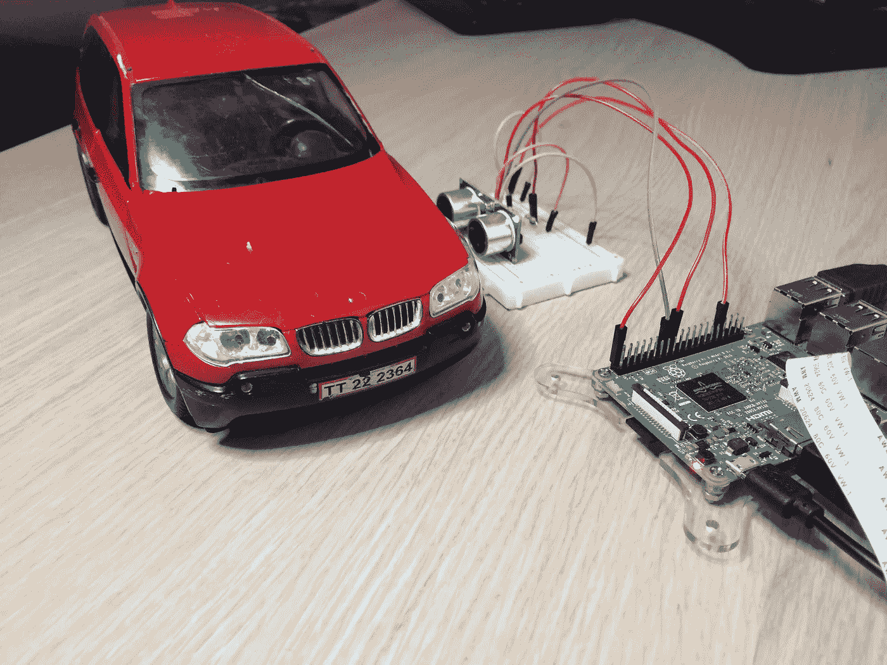
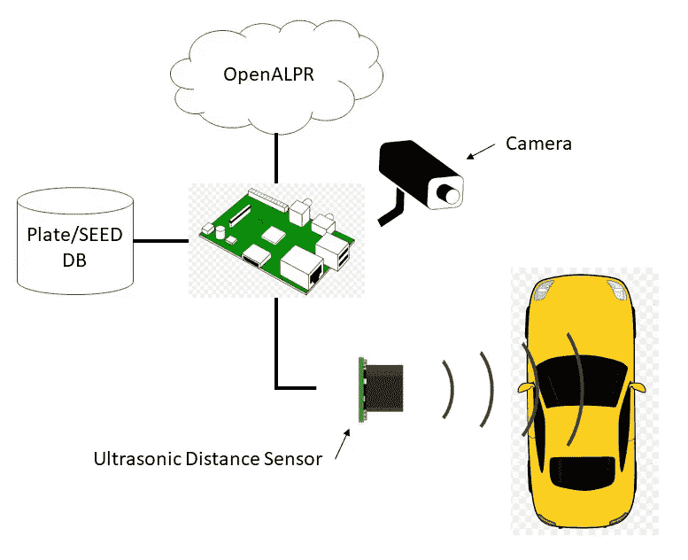
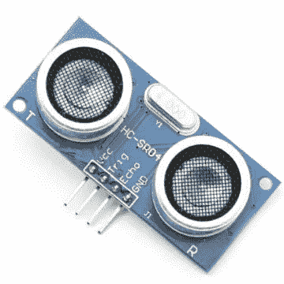
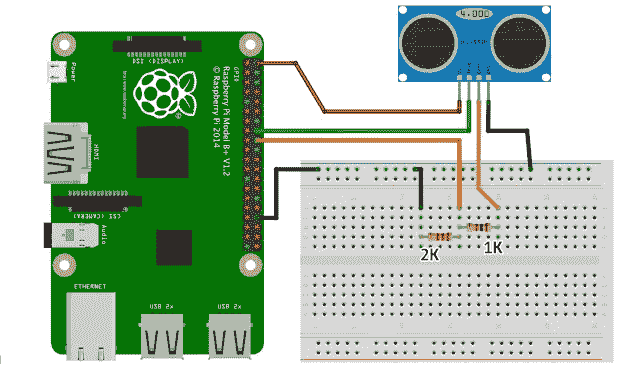
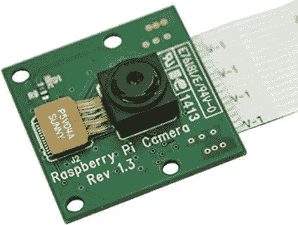
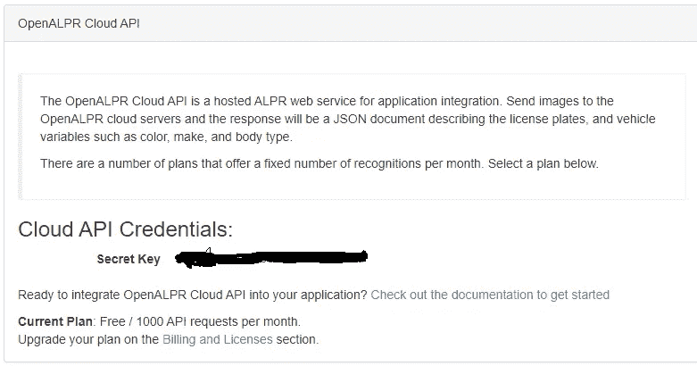
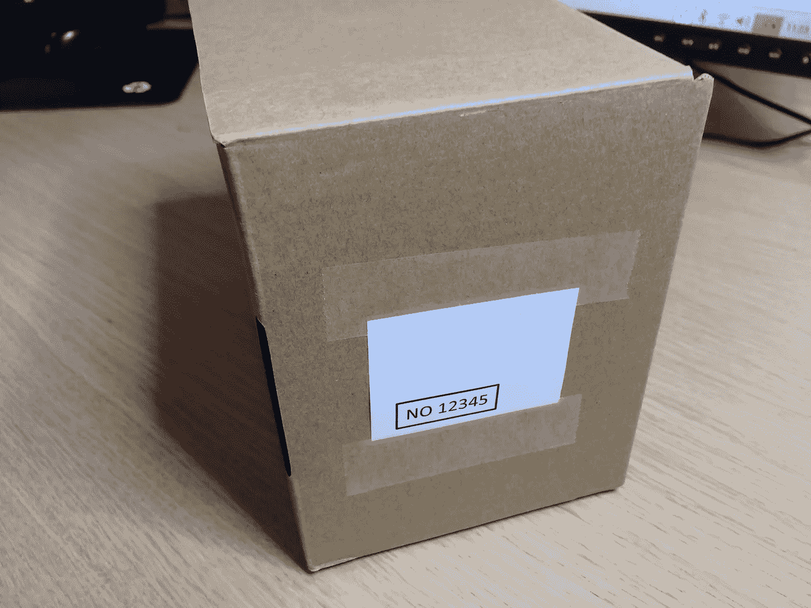
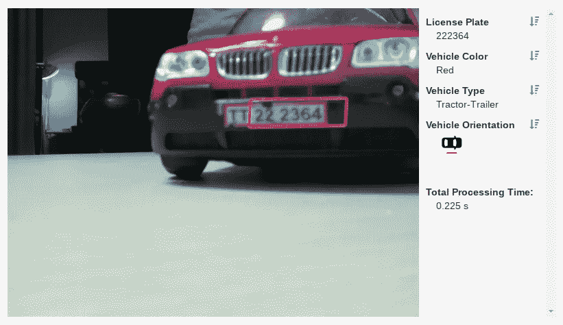

# 将物理设备与 IOTA-Car-IOTA 集成第 1 部分

> 原文：<https://medium.com/coinmonks/integrating-physical-devices-with-iota-car-iota-part-1-f63ed0a0ea1d?source=collection_archive---------0----------------------->

## 关于将物理设备与 IOTA 协议集成的初学者教程系列的第 12 部分

# 介绍

这是初学者教程系列的第 12 部分，我们将探索如何将物理设备与 IOTA 协议相集成。这一次，我们将着眼于简化和自动支付典型的汽车相关服务，如停车，收费公路，清洗等。使用 IOTA 协议。

我决定将这个教程分为两部分，因为我相信有多种方法可以处理这个用例。各有利弊。稍后会详细介绍。

在第一篇教程中，我们将尝试利用一种通常被称为自动车牌识别(Automatic License Plate Recognition，简称 ALPR)的技术来解决这个用例。

# 使用案例

在我们酒店的后面，有一个供酒店客人和员工使用的停车设施。最近出现了授权和未授权的人使用停车设施而不支付所需停车费的问题。我们酒店老板认为，这与目前处理停车费的人工和复杂流程有关。要是有一个自动系统可以在不打扰客人或员工的情况下收取停车费就好了。毕竟，目前的情况让他损失了很多钱，也让他的客人和员工感到沮丧。必须做点什么。

*注意！
本教程中提出的解决方案基于酒店所有者为其客人和员工发放 IOTA 令牌并管理种子的想法。这个想法在之前的教程中已经讨论过了，我们在为酒店的各种服务付费时使用了 RFID 技术。我建议您快速浏览这些教程，作为对它如何工作的介绍。*

[*The IOTA 借记卡，第 1 部分*](/coinmonks/integrating-physical-devices-with-iota-the-iota-debit-card-part-1-42dc1a05f18)[*The IOTA 借记卡，第 2 部分*](/coinmonks/integrating-physical-devices-with-iota-the-iota-debit-card-part-2-1f073060ae1d)[*The IOTA 借记卡，第 3 部分*](/coinmonks/integrating-physical-devices-with-iota-the-iota-debit-card-part-3-bc0f03b8b2c9)

# 组件

在我们开始研究这个项目的编码之前，我们应该后退一步，看看整体概念和使用的各种组件。

上面你会看到一个简单的各种组件的布局，用来解决本教程中提出的用例。在进入代码之前，让我们一个一个地停止它们。

**超声波传感器**
超声波传感器用于检测车辆何时进入或离开停车场。超声波传感器通过产生和接收声音脉冲来测量距离。所以它基本上只是一个扬声器和麦克风以及一些额外的电子设备组合成一个单元。通过测量从扬声器发出脉冲到麦克风收到脉冲的时间，我们可以计算出反射脉冲的物体(本例中为车辆)到目标的距离(我们知道声速)。

我在这个项目中使用的超声波传感器是流行的 HC-SR04。你应该花几块钱就能从易趣上买到一个。

使用以下电路图将 HC-SR04 连接到您的 Raspberry PI。

*警告！
注意电路中的两个电阻。电阻用于降低 HC-SR04 的 5V 输出引脚到 PI 上的 3.5 V 输入引脚的电压。电路中没有电压电阻可能会损坏您的 Raspberry PI。*

*注意！
当然，你可以使用各种技术来检测车辆何时进入或离开停车场。我在这个项目中使用超声波传感器的唯一原因是我已经有了一个来自以前项目的传感器。*

*注意！
请注意，传感器产生的声音脉冲处于人耳无法察觉的频率范围内，因此当传感器处于活动状态时，您将听不到任何声音。*

**摄像头**
摄像头用于拍摄进入停车场区域的车辆牌照。我在这个项目中使用了 Raspberry PI 相机模块 V2，但是你基本上可以使用任何可以通过 Python 脚本控制的相机。你应该可以从易趣或者当地的 PI 商店买到这个相机模块。在易趣上，你也可以只花几美元买到功能齐全的中国仿制品。

**OpenALPR** OpenALPR 是一款自动车牌识别(ALPR)软件，用于从图片或图像中识别车牌号码。您可以选择在内部安装 OpenALPR SDK，或者使用云服务来执行 ALPR。在本教程中，我们将使用云服务。请注意，OpenALPR 是授权软件，但您可以注册一个免费帐户，允许您每月免费执行 1000 次 ALPR。

要注册一个免费的 OpenALPR 账户，请前往[https://www.openalpr.com/](https://www.openalpr.com/)

登录 OpenALPR 后，选择云 API

在 Cloud API 页面上，您会发现一个密钥，当您将图像上传到 OpenALPR 云服务时，我们的 python 脚本将会用到这个密钥。

**牌照/种子数据库** “牌照/种子数据库”是对某种类型的集中存储的引用，其中每个牌照号码与将被用作 IOTA 值交易的发送者的 IOTA 种子进行比较。在本教程中，我使用一个简单的逗号分隔的文本文件(或 CSV)文件存储在 Raspberry PI 本地。然而，在任何安全是优先考虑的真实场景中，种子可能应该存储在某种类型的加密数据库中，并且限制访问。

**汽车** 我们还需要一些代表汽车本身的对象。正如你在本教程的图片中看到的，我正在用一辆在附近的跳蚤市场找到的玩具车。为了建造和测试，你只需要一个简单的盒子，盒子的一面印有牌照，如下图所示。或者更酷的是，使用真实的汽车和牌照，在预期的环境中设置系统。

*注意！如上图所示，确保你在车牌号码周围画了一个边框。否则，OpenALPR 算法将无法识别照片中的车牌位置。*

# 它是如何工作的

在查看这个项目的 Python 代码之前，让我们一步一步地看一下当一辆新车进入酒店停车场时发生的事件。

1.  一辆新车进入酒店停车场，挡住了超声波传感器。
2.  相机拍摄汽车牌照区域的照片。
3.  图片被上传到 OpenALPR 云服务，该云服务以 json 对象的形式返回识别出的车牌号码。
4.  在搜索 Plate/SEED DB 进行匹配之前，我们将车牌号从 json 对象转换成一个字符串。
5.  如果找到匹配，我们在向 tangle 发出值事务之前返回相关的 IOTA 种子，使用返回的种子作为事务的发送者。

供参考:
这里是汽车进入停车场挡住超声波传感器时，PI 摄像头拍下的图片。

这是 OpenALPR 解码的图片

*注意！
注意开头的两个 T 没有被 OpenALPR 识别为车牌号的一部分。这可能与这是一辆没有有效牌照号码语法的玩具车有关。我用实际的车牌号码做的其他测试似乎运行良好。*

# 所需的软件和库

在我们开始为这个项目编写 Python 代码之前，我们需要确保我们已经在 Raspberry PI 上安装了所有需要的软件和库。对于本教程，除了 [PyOTA](https://github.com/iotaledger/iota.py) 本身之外，还需要以下库:
* PiCamera 库(已经安装了 Raspbian)
*请求(pip 安装请求)

# Python 代码

这是这个项目的 python 代码..

这个 python 脚本的源代码可以从[这里](https://gist.github.com/huggre/a481619cc47ecadd7c6e14299ff19eb9)下载

# 关于板/种子数据库

python 脚本在一个名为 **plates.csv** 的文本文件中寻找“板/种子数据库”,该文件位于 PI 的主目录中。在运行项目之前，请确保使用您的板号和种子更新该文件。在这里你会找到一个如何构建 **plates.csv** 文件的例子[。](https://gist.github.com/huggre/5c648a628afbc2ed616305a478b902bb)

# 运行项目

要运行这个项目，首先需要将前一节中的脚本作为文本文件保存在您的计算机上。

注意 Python 程序文件使用。py 扩展名，所以在您的树莓 PI 上将文件保存为 ***car-iota-p1.py***

要执行脚本，只需启动一个新的终端窗口，导航到保存脚本的文件夹，然后键入:

**python*car-iota-P1 . py***

现在，您应该看到 python 脚本开始每 2 秒钟检查一次来车。使用超声波传感器。当发现一辆新车时，我们按照“它是如何工作的”一章中的描述启动程序。随着序列的进行，检查 raspberry 终端的状态。

*注意！
在现实生活中，您可能希望有某种类型的指示器来告诉车主交易/付款是否被接受(或何时被接受)。这可以通过一个由红变绿的指示灯来实现，甚至可以移除一个物理屏障。*

*注意！
在我的例子中，当新车进入停车场时，Raspberry PI 完成了创建和签署所需的 IOTA 值交易的所有工作。您很快就会注意到，由于 PI 的资源有限，这是一个相当缓慢的过程。在现实生活中，这可能是不可接受的，我们必须寻找其他替代方案。一种选择是将这些活动外包给一个拥有有效执行这些活动的资源的集中实体。*

# 接下来是什么？

虽然本教程中提出的解决方案可能适用于一些本地用例。对于其他用例，集中实体(在本例中是酒店所有者)控制种子的概念是不切实际或不可接受的。对于一个真正的全球和分散的解决方案，我们可能需要采取不同的方法。下次会有更多的介绍。

# 贡献

如果你想对本教程有所贡献，你可以在这里找到一个 Github 库。

# 捐款

如果你喜欢这个教程，并希望我继续制作其他教程，请随时向下面显示的 IOTA 地址捐款。

nyzbhovsmdwabxsacajttwjoqrvvawlbsfqvsjswwbjjlsqknzfc 9 xcrpqsvfqzpbjcjrannpvmmezqjrqsvvgz

> [在您的收件箱中直接获得最佳软件交易](https://coincodecap.com/?utm_source=coinmonks)

