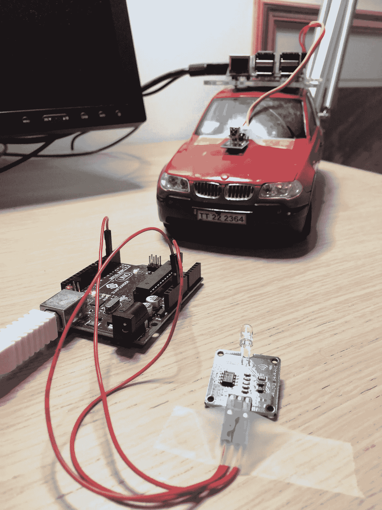
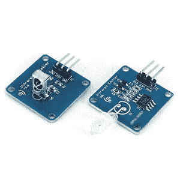
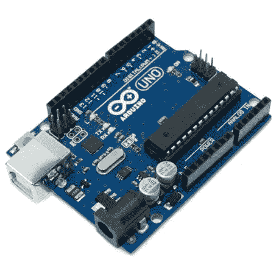
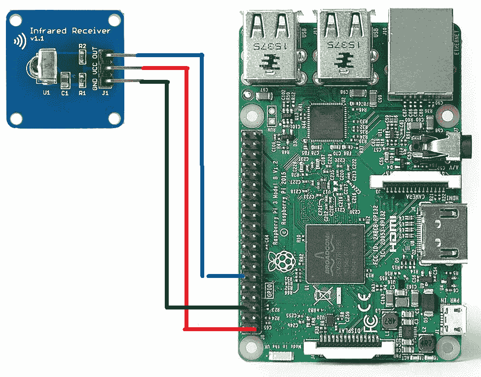
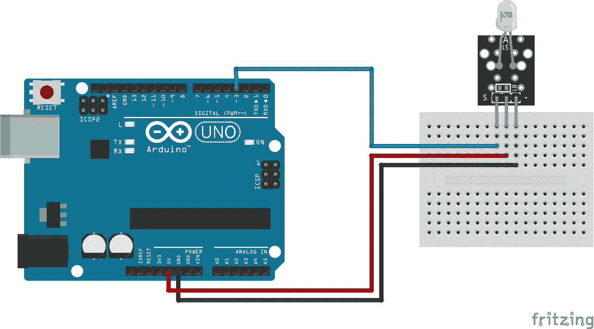

# 将物理设备与 IOTA-Car-IOTA 集成第 2 部分

> 原文：<https://medium.com/coinmonks/integrating-physical-devices-with-iota-car-iota-part-2-879ea12b7288?source=collection_archive---------2----------------------->

## 关于将物理设备与 IOTA 协议集成的初学者教程系列的第 13 部分

# 介绍

这是初学者系列教程的第 13 部分，我们将探索如何将物理设备与 [IOTA](https://medium.com/coinmonks/iota/home) 协议集成在一起。如果你关注 IOTA 项目已经有一段时间了，你可能听说过一些奇怪的想法，比如“汽车拥有自己的钱包”或者“汽车为自己的服务付费”。虽然这听起来可能是无形的和未来的，但它基本上是我们将在本教程中采用的想法。

# 使用案例

您可能还记得，我们在结束[之前的教程](/coinmonks/integrating-physical-devices-with-iota-car-iota-part-1-f63ed0a0ea1d)时，指出了一些与 ALPR 方法的集中化本质相关的问题，在这种方法中，一个集中化的实体(也就是酒店所有者)必须控制在执行支付交易时使用的种子。这种方法的伟大之处在于，汽车本身不需要任何新的电子设备，(因为基础设施(停车设施)负责所有的支付交易)。虽然这对于一些本地用例来说可能是可以接受的，但如果我们想在一个真正分散的全球范围内实现我们的停车付费系统，这就不太实际了。

在本教程中，我们将尝试通过简单地颠倒一切来解决这个问题。汽车本身将完成所有工作，而不是让停车设施管理支付交易。这样，种子就不会离开车主。

## 数据交换

在处理这个问题时，我们需要处理的第一件事是，我们需要在基础设施(停车设施)和汽车之间进行某种类型的数据交换，以便汽车知道在发送支付交易时使用什么支付地址。我猜有多种无线数据协议和技术可用于此目的(无线电、蓝牙、RFID 等)。)但是我觉得它们都有一些缺点，对于这个特定的用例来说不是最佳的。在对这个问题思考了一会儿之后，我决定采用一种简单而熟悉的技术，你可能每天坐在电视机前都会用到，即*红外通信*，简称 IR。

# 关于红外和红外通信

红外通信基于从红外发射器发送到红外接收器的光脉冲。为了防止“正常”光的干扰，IR 使用红外线光谱中的光，因此称为*红外线*。正如该技术所表明的，IR 是一种二进制通信协议，其中每个光脉冲之间的时间长度决定了所发送的数据是 0 还是 1。IR 通信的不同实现在脉冲长度、脉冲之间的时间、数据包中的脉冲数量等方面使用不同的逻辑。在本教程中，我们将使用一种叫做 [NEC](https://techdocs.altium.com/display/FPGA/NEC+Infrared+Transmission+Protocol) 的特殊红外协议。NEC 协议是一个 32 位协议，允许我们在一个数据包中发送 32 位数据(0 和 1)。由于需要 8 位来定义一个字节，NEC 协议允许我们在每个数据包中传输 4 个字节的数据。由于典型的 [IOTA](https://medium.com/coinmonks/iota/home) 地址由 90 个字节组成(包括校验和)，因此将需要 23 个 NEC 数据包来传输完整的 IOTA 地址。

# 组件

本教程中使用的主要组件是红外发射器和红外接收器。对于我的项目，我使用流行的 NE555 红外模块。它们经常成对出现，你应该可以花几块钱就能买到易贝的两只。

除了 IR 模块本身，我们还需要将每个模块连接到一个微控制器，该微控制器将负责发送和接收数据的逻辑。

**接收器控制器**
作为这个项目的接收器微控制器，我决定将我的 Raspberry PI 与 PyOTA 库一起使用。主要原因是接收器不仅用于管理 IR 通信，还必须处理与 IOTA 缠结的任何交互。

*注意！
现在有一个* [*IOTA C 客户端库*](https://github.com/iotaledger/iota.c) *可用，能够与 IOTA tangle 通信，如果您喜欢使用不同的微控制器作为接收器控制器，如 ESP32。*

**发射器控制器**
红外发射器控制器基本上只是告诉红外发射器模块发送什么数据，不需要网络或 IOTA 功能。为此，我选择了身边最便宜最简单的微控制器。我信任的**Arduino UNO。**

# 接线

现在，让我们看看每个模块是如何连接到各自的控制器的。

这是红外接收器模块如何连接到 Raspberry PI 板上

这是红外发射器模块如何连接到 Arduino UNO 板上。

# 它是如何工作的

在继续讨论这个项目使用的代码之前，让我们后退一步，看看本教程中提出的概念背后的一般思想以及它是如何工作的。

想象一下，该项目的接收器部分(红外接收器模块和控制器)放置在汽车内部，不断监控来自周围环境的红外数据。同时，想象放置在停车设施入口处的 IR 发射器不断发布其 IOTA 支付地址。

当汽车接近停车场时，它开始接收发射器发出的红外信号。一旦接收者(car)已经将所接收的数据验证为有效的 IOTA 支付地址，它就在进入设施时自动执行支付。

*注意！
在现实生活中，在付款执行之前，可能需要司机的某种批准。*

*注意！
除了 IOTA 支付地址本身之外的附加数据可以被添加到数据传输中，以包括诸如停车设施名称等元数据。*

# 代码

接下来，让我们看看这个项目使用的代码。

**发射器端** 让我们从在发射器端运行的 Arduino 代码开始。

您应该注意到的第一件事是，当从红外发射器模块发送数据时，我们使用一个名为 ***IRemote*** 的外部 Arduino 库。你可以在这里下载 IRemote 库的 zip 文件[。要安装 IRemote 库，选择 ***草图- >包含库- >添加。Arduino IDE 中的 ZIP 库***](https://www.arduinolibraries.info/libraries/i-rremote)

其次，我们需要指定将由发送器发布的 IOTA 地址。该数据存储在 msgArray[]变量中，其中数组中的每个元素由四个字节组成。

请注意，irsend()函数要求以十六进制格式指定数据，因此在设置 msgArray[]变量时，我们首先需要将 IOTA 地址转换为十六进制格式。

*注意！
我做了一个简单的 Python 脚本来帮助将现有的 IOTA 地址转换成我们 Arduino sketch 可以接受的格式，你可以在这里* *找到这个脚本* [*的链接。*](https://gist.github.com/huggre/991259a162c3c3941daa577a8a24c276)

注意，在我们开始发送实际的 iota 地址数据之前，我们首先发送一个 0x30303030 消息，让接收方知道地址数据序列开始(和结束)的位置

最后，有一个变量(delay_time)可用于控制发送每个单独 IR 消息的时间间隔。延迟时间越短，数据传输越快。

*注意！
我成功测试了低至 50 毫秒的延迟时间。这将为我们提供完整 IOTA 地址的总传输时间为 50×23 = 1，1150 毫秒。*

这是我们的发射器 Arduino 代码:

源代码可以从[这里](https://gist.github.com/huggre/8b00b5cc3681078aa8dba9367293f19c)下载

**接收端** 现在让我们来看看在接收端运行的 Python 代码。

我不打算在这里详述，因为代码本身已经有了很好的文档。然而，我会给你一个大概的概述。

首先，当二进制数据通过红外接收器模块进入时，我们开始监听它们。正如我们所知，发送方遵循 NEC 协议(参考。`irsend.sendNEC()`根据我们的 Arduino 草图，我们通过测量每个脉冲之间的时间来分析数据流，以确定数据是 0 还是 1。请注意，NEC 协议还指定了每条消息的开头和结尾。接下来，我们将二进制数据转换为十六进制，然后再转换为字节。如果接收的字节数据等于 0000，我们知道 IOTA 地址数据的新序列即将到来。当新的地址数据到来时，我们简单地将新的字节串附加到前一个字节串，直到下一个 0000 消息到来。然后，我们检查完整的字符串，看它是否是有效的 IOTA 地址。如果是，我们执行 IOTA 值事务。

这是我们的接收器 Python 代码:

源代码可以从[这里](https://gist.github.com/huggre/262f61c829c5e890c2ba7dd2caf0648a)下载

# 运行项目

要运行该项目，您应该首先将红外发射器模块连接到 Arduino UNO。然后使用 [Arduino IDE](https://www.arduino.cc/en/main/software) 将上一部分的 Arduino 草图上传至电路板。

*注意！
在编译和上传代码之前，确保已经安装了 IRemote 库。*

如果您已经将红外接收器模块连接到您的 Raspberry PI，您现在应该会看到模块上的一个小 LED 开始每 500 毫秒闪烁一次。这表明您的发射器工作正常。

接下来，下载上一节的 Python 脚本，并将其保存在您的 Raspberry PI 上，文件名为***car-iota-p2 . py***

要执行 Python 脚本，只需在 Raspberry PI 上启动一个新的终端窗口，导航到保存脚本的文件夹，然后键入:

**python*car-iota-p2 . py***

现在，您应该可以在终端窗口中看到正在执行的 Python 代码，显示从发送器接收到的数据。

*注意！
记住使用有效种子(具有正余额)更新****car-IOTA-p2 . py****文件，以便在向 IOTA tangle 发布价值交易时使用。*

# 贡献

如果你想对本教程有所贡献，你可以在这里找到一个 Github 库。

# 捐款

如果你喜欢这个教程，并希望我继续制作其他教程，请随时向下面显示的 IOTA 地址捐款。

nyzbhovsmdwabxsacajttwjoqrvvawlbsfqvsjswwbjjlsqknzfc 9 xcrpqsvfqzpbjcjrannpvmmezqjrqsvvgz

> [直接在您的收件箱中获得最佳软件交易](https://coincodecap.com/?utm_source=coinmonks)

