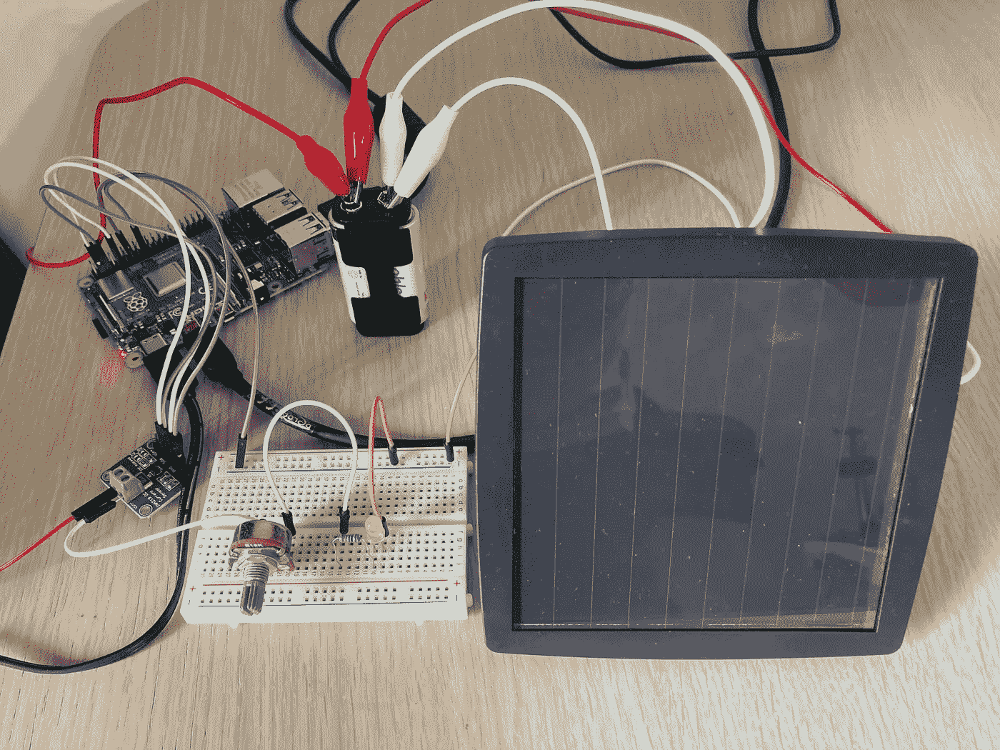
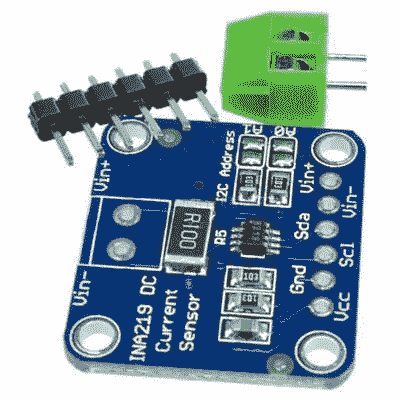
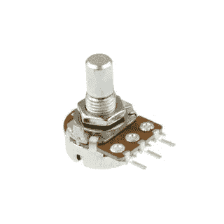
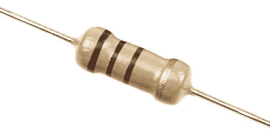
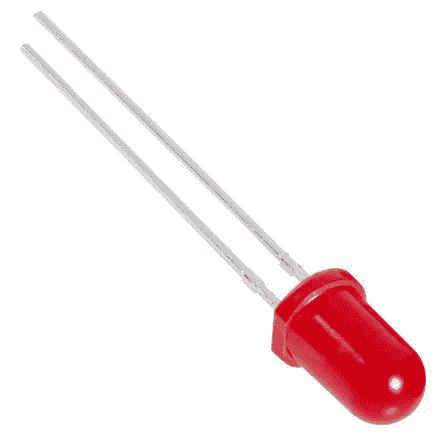
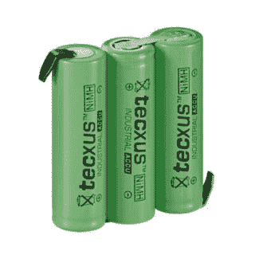
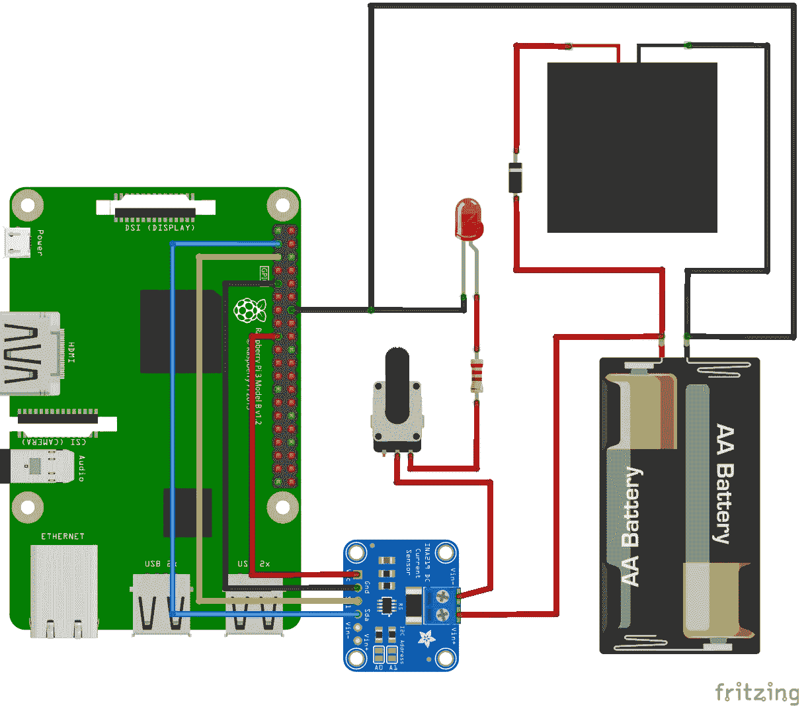

# 将物理设备与 IOTA 集成—使用 IOTA 进行点对点能源交易第 1 部分

> 原文：<https://medium.com/coinmonks/integrating-physical-devices-with-iota-peer-to-peer-energy-trading-with-iota-part-1-b86a1e173328?source=collection_archive---------0----------------------->

## 关于将物理设备与 IOTA 协议集成的初学者教程系列的第 18 部分。

# 介绍

这是初学者教程系列的第 18 部分，我们将探索如何将物理设备与 IOTA 协议集成在一起。这将是一个分为两部分的教程，我们将学习在对等能源交易解决方案中使用 IOTA 令牌作为结算货币。在第一部分中，我们将重点监控实时功耗，并相应地进行支付。在第二部分，我们将着眼于处理可变能源价格。

*注意！
在第一个教程中，太阳能电池板是可选的，因为我们将主要关注能源供应商电池和最终客户之间的电路。*

# 使用案例

最近，我们酒店的老板一直在考虑在酒店的后院安装一些新的花园灯。唯一的问题是，在花园的那个特定区域，没有电来给灯供电。当与他的隔壁邻居讨论这个问题时，邻居解释说，他附近有一个太阳能系统，如果他得到补偿增加现有系统的额外成本，他可能能够提供额外的电力。这听起来像是完美的解决方案，但仍有一个问题；他们如何处理付款以便反映实际用电量，同时消除监控用电量和处理手动付款的手动负担？

思考了一会儿这个问题后，旅馆老板向他的邻居提出了以下想法:

# 这个提议

1.  首先，我们将一个带有电源监控传感器的树莓皮放入邻居太阳能电池和酒店业主新花园灯之间的电源电路中。
2.  然后，我们让 PI 每秒从传感器读取一次读数，并记录当前的用电量。
3.  然后，在某个预定义的时间段(假设一个小时)，我们计算该时间段的平均用电量，并乘以时间(一个小时)和双方都同意的 IOTA 中的能源价格。
4.  最后，在每个周期(一个小时)之后，PI 自动创建新的 IOTA 交易，并且在开始新的周期之前，将所计算的 IOTA 令牌从酒店管理器传送到邻居接收器地址。

幸运的是，邻居喜欢这个主意，所以让我们开始建吧:-)

*注意！
如果我们想在真实规模上实现这个用例，我们可能必须使用更高的电压，如 12V 及以上。然而，为了最大限度地降低元件成本，同时注重安全性，我们将一切都缩小到低压电路。毕竟，* ***任何人都不应该摆弄高压电路，除非他们绝对知道自己在做什么*** *。*

# 组件

首先，让我们快速看一下这个项目中使用的不同硬件组件。

除了 Raspberry PI 本身和一些连接它的电线，我们还需要以下组件:

**INA219 电流/电压/功率传感器**
ina 219 是一款低成本电流/电压/功率传感器，采用分线板形式，可轻松连接到 Raspberry PI 的 GPIO 引脚。你应该可以从易趣或亚马逊上以低于 10 美元的价格买到 INA219 传感器。

**电位计**
电位计基本上是一个放置在电路中的可变电阻器，用来模拟可变的功率使用。用一些可开关的发光二极管或可调节的 DC 马达来代替电位计也同样有效。我决定使用电位计的唯一原因是为了减少电路中的器件和连接数量。

**电阻器**
电阻器放置在 LED 前面，以限制进入 LED 的电流。不使用电阻直接从电池为 LED 供电可能会损坏 LED。根据 LED 的类型，200 至 500 欧姆的电阻应该可以正常工作。

**LED**
在我们的用例中，LED 代表花园灯。转动电位计，我们可以调节进入 LED 的电流量，从而调节它产生的光量。

**电池**

*注意！在本教程的第二部分，我们将添加一个太阳能电池板和一个二极管来给电池充电。让我们在下一个教程中看看这些组件。*

# 布线图

这是一个简单的示意图，显示了如何连接电路。

*注意！
如前所述，太阳能电池板和二极管在本教程中是可选的，可以从电路中排除。*

# 所需的软件和库

该项目需要以下 Python 库。

用于与 IOTA tangle 通信的 [PyOTA 库](https://github.com/iotaledger/iota.py)。

用于与 INA219 传感器通信的 [INA219 库](https://pypi.org/project/pi-ina219/)。

# Python 代码

这个项目的 Python 代码非常简单，所以除了指出一些重要的变量之外，我就不再赘述了。

***pay _ frequency***变量以秒为单位定义了我们计算平均功耗并发出 IOTA 支付交易的时间段。

***mW_price*** 变量指定 IOTA 的每毫瓦/秒(mW/s)能量的价格。计算出的 IOTA 交易值中的任何小数都将被删除，因为我们无法发送 IOTA 的分数。

*注意！
由于我们在这个小电路中处理的功耗非常低，因此使用毫瓦(mW)而不是典型的瓦特或千瓦更方便。*

你可以从[这里](https://gist.github.com/huggre/23a2db302eb7adb8b7e71fe3dc7e06cf)下载代码

# 运行项目

要运行该项目，首先需要将上一节中的 Python 代码保存到您的机器上。

要执行代码，只需启动一个新的终端窗口，导航到保存文件的文件夹，然后键入:

**python**T7**P2P _ energy _ trade . py**

现在，您应该可以看到每秒钟打印到终端的当前 LED 电源使用情况。注意当你转动电位计时，数值是如何变化的。

每 60 秒，在创建 IOTA 值(支付)交易并将其发送到 tangle 之前，计算最后一段时间(60 秒)的平均用电量并将其打印到监视器。

# 接下来是什么？

在本教程的第二部分，我们将了解可变能源价格的管理，这是在处理太阳能、风能、水能等可再生能源时必须解决的一个常见问题。

# 贡献

如果你想对本教程有所贡献，你可以在这里找到一个 Github 库

# 捐款

如果你喜欢这个教程，并希望我继续让其他人感到自由，使一个小的捐赠给下面的 IOTA 地址。

nyzbhovsmdwabxsacajttwjoqrvvawlbsfqvsjswwbjjlsqknzfc 9 xcrpqsvfqzpbjcjrannpvmmezqjrqsvvgz

> [*在您的收件箱中直接获得最佳软件交易*](https://coincodecap.com/?utm_source=coinmonks)

