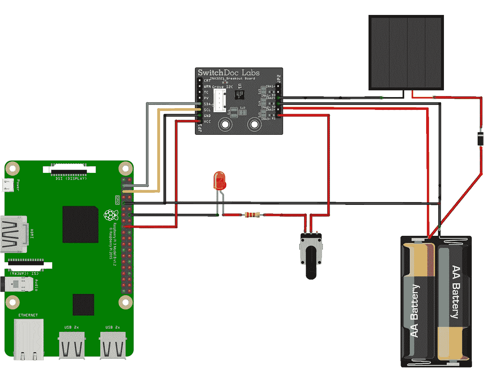
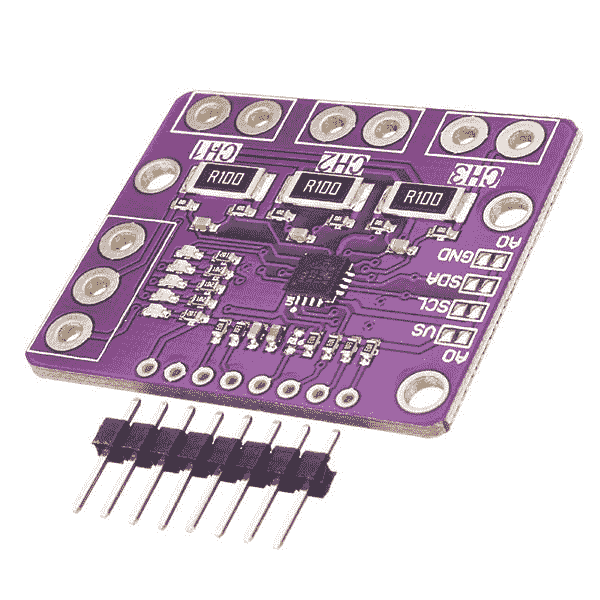
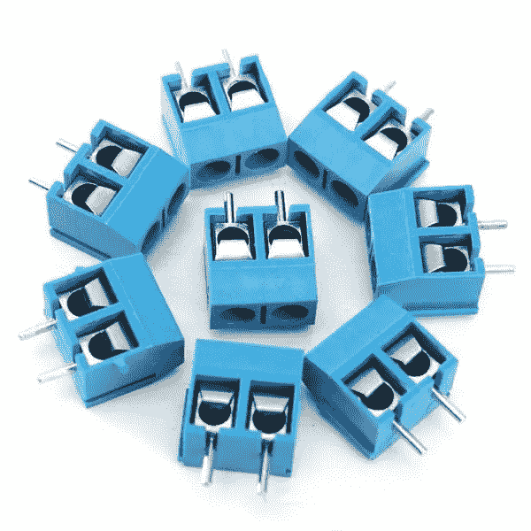
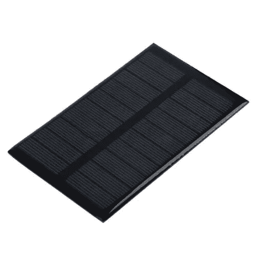
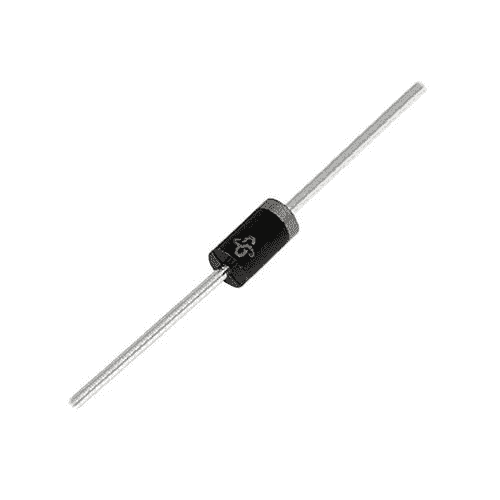

# 将物理设备与 IOTA 集成—使用 IOTA 进行点对点能源交易第 2 部分

> 原文：<https://medium.com/coinmonks/integrating-physical-devices-with-iota-peer-to-peer-energy-trading-with-iota-part-2-6c8d481662b0?source=collection_archive---------0----------------------->

## 关于将物理设备与 IOTA 协议集成的初学者教程系列的第 19 部分

# 介绍

这是初学者教程系列的第 19 部分，我们将探索如何将物理设备与 IOTA 协议集成在一起。这是两部分教程中的第二部分，我们将学习在对等能源交易解决方案中使用 IOTA 令牌作为结算货币。在[第一部分](/coinmonks/integrating-physical-devices-with-iota-peer-to-peer-energy-trading-with-iota-part-1-b86a1e173328)中，我们重点监控实时功耗，并相应地进行支付。在第二部分中，我们将探讨如何处理可变能源价格，这是处理太阳能、风能、水能等可再生能源时必须解决的一个常见问题。

*注意！
如果你还没有，你应该先看看本教程* *的* [*第一部分，然后再继续，因为它是我们在本教程中构建项目的基础。*](/coinmonks/integrating-physical-devices-with-iota-peer-to-peer-energy-trading-with-iota-part-1-b86a1e173328)

# 使用案例

在新的基于 IOTA 的对等能源交易解决方案启动并运行一段时间后，我们的两个邻居再次会面，讨论新系统的意外问题。邻居解释说，由于过去几个月的恶劣天气，他的太阳能系统没有产生他所希望的能量，并且他们双方同意的原始能量价格(0.2 IOTA/mW/秒)开始看起来对他来说是一笔糟糕的交易。他们当然可以简单地调整价格，这样邻居就可以得到更高的电价；但是，如果天气好转，他的太阳能电池板开始产生更多的电力呢？在那种情况下，旅馆老板最终吃亏了。他们需要的是某种机制，根据太阳能电池板在任何给定时间产生的能量来动态调整价格。

让我们看看我们能做什么。

# 解决方案

思考这个问题几天后，酒店老板提出了以下想法:

如果我们把第二个能量传感器放在相邻太阳能电池板和电池之间的电路中会怎么样？然后，我们测量太阳能电池板产生的能量，并相应地自动调整价格。

多好的主意，让我们开始建造吧..

# 组件

在本节中，我将仅讨论自[上一教程](/coinmonks/integrating-physical-devices-with-iota-peer-to-peer-energy-trading-with-iota-part-1-b86a1e173328)以来添加或更改的组件，请参见[上一教程](/coinmonks/integrating-physical-devices-with-iota-peer-to-peer-energy-trading-with-iota-part-1-b86a1e173328)了解此处未列出的组件的详细信息。

**INA3221 电流/电压/功率传感器**
ina 3221 是一款 3 通道低成本电流/电压/功率传感器，采用分线板形式，可轻松连接到 Raspberry PI 的 GPIO 引脚。INA3221 的优点(与我们在上一教程中使用的 INA219 传感器相比)是它具有多个通道，允许我们并行监控多个电源。你应该可以从易趣或亚马逊以低于 10 美元的价格买到 INA3221 传感器。

*注意！
本项目使用 INA3221 传感器的另一个选择是使用两个 INA219 传感器。*

**螺丝端子板** 我的 INA3221 没有附带任何用于输入/输出电源通道的螺丝端子，所以我建议你买一些。当连接我们想要监控的电源时，它们只是让生活变得更简单。

**太阳能电池板** 太阳能电池板有各种形状和尺寸。对于我们的项目，我们只需要一个能够为我们的 3V 可充电电池充电的小面板。在做这个项目的时候，我周围没有任何太阳能电池板，所以我最终黑掉了我女朋友的一些太阳能花园灯。将两块或更多小电池板串联起来，你就可以轻松获得电池充电所需的电量。

**二极管** 最后，我们需要在太阳能电池板和电池之间的电路中放置一个小二极管。使用二极管，我们可以确保电流只从太阳能电池板流向电池，而不是相反。

*注意！确保二极管在你的电路中接线正确，否则它不会工作。*

# 布线图

教程第二部分的电路图与第一部分基本相同，只是我们将单通道 INA219 传感器替换为多通道 INA3221 传感器。另外，请注意 INA3221 现在是如何放置在太阳能电池板和电池之间的电路中的。这使我们能够监控从电池流向 LED 的电流，同时监控从太阳能电池板流向电池的电流。

# 所需的软件和库

该项目需要以下 Python 库。

用于与 IOTA tangle 通信的 [PyOTA 库](https://github.com/iotaledger/iota.py)。

用于与 INA3221 传感器通信的 [INA3221 Python 库](https://github.com/switchdoclabs/SDL_Pi_INA3221)。

*注意！
虽然 INA219 和 INA3221 在功能上相似，但它们使用不同的板载电子设备，这使得两个单元之间的库不兼容。*

# Python 代码

与之前的教程相比，我们的 Python 代码的主要变化(除了使用不同的库)是，我们现在不仅监控从电池到 LED 的电流，还监控从太阳能电池板到电池的电流。 ***mW_price*** 变量也从静态变量变为动态变量，该动态变量根据太阳能电池板产生的能量的量而变化。面板产生的能量越多，价格越低，反之亦然。

这是更新后的 Python 代码..

你可以从[这里](https://gist.github.com/huggre/70ae3d2d543f4dcbbb376199772ea910)下载代码

# 运行项目

要运行该项目，首先需要将上一节中的 Python 代码保存到您的机器上。

*注意！
你还需要保存****SDL _ Pi _ ina 3221 . py****文件(从* [*INA3221 github 回购*](https://github.com/switchdoclabs/SDL_Pi_INA3221) *)。到同一个文件夹。*

要执行代码，只需启动一个新的终端窗口，导航到保存文件的文件夹，然后键入:

**python**T28**P2P _ energy _ trade _ p2 . py**

现在，您应该可以看到当前的 LED 用电量，以及太阳能电池板每秒钟产生的电量，并打印到终端上。

注意当你转动电位计时，LED 功率使用值是如何变化的。

还要注意，当你把太阳能电池板放在阳光下或用强光手电筒照射时，太阳能电池板的发电量是如何变化的。

每 60 秒计算一次上一周期(60 秒)的平均 LED 用电量和平均太阳能发电量(同期)，然后将两个值打印到显示器上。

接下来，价格(***【mW _ price】***)基于太阳能电池板在最后一段时间(60 秒)产生的能量的平均量来计算。

最后，在向 IOTA tangle 发送价值交易之前，我们计算这段时间(60 秒)的 IOTA 支付。

# 接下来是什么？

下次我们将使用亚马逊 Alexa 个人语音助手与 IOTA tangle 对话。多酷啊！！，敬请关注。

# 贡献

如果你想对本教程有所贡献，你可以在这里找到一个 Github 库

# 捐款

如果你喜欢这个教程，并希望我继续让其他人感到自由，使一个小的捐赠给下面的 IOTA 地址。

nyzbhovsmdwabxsacajttwjoqrvvawlbsfqvsjswwbjjlsqknzfc 9 xcrpqsvfqzpbjcjrannpvmmezqjrqsvvgz

## 另外，阅读

*   最好的[密码交易机器人](/coinmonks/crypto-trading-bot-c2ffce8acb2a)
*   [密码本交易平台](/coinmonks/top-10-crypto-copy-trading-platforms-for-beginners-d0c37c7d698c)
*   最好的[加密税务软件](/coinmonks/best-crypto-tax-tool-for-my-money-72d4b430816b)
*   [最佳加密交易平台](/coinmonks/the-best-crypto-trading-platforms-in-2020-the-definitive-guide-updated-c72f8b874555)
*   最佳[加密借贷平台](/coinmonks/top-5-crypto-lending-platforms-in-2020-that-you-need-to-know-a1b675cec3fa)
*   [最佳区块链分析工具](https://bitquery.io/blog/best-blockchain-analysis-tools-and-software)
*   [加密套利](/coinmonks/crypto-arbitrage-guide-how-to-make-money-as-a-beginner-62bfe5c868f6)指南:新手如何赚钱
*   最佳[加密制图工具](/coinmonks/what-are-the-best-charting-platforms-for-cryptocurrency-trading-85aade584d80)
*   [莱杰 vs 特雷佐](/coinmonks/ledger-vs-trezor-best-hardware-wallet-to-secure-cryptocurrency-22c7a3fd391e)
*   了解比特币的[最佳书籍有哪些？](/coinmonks/what-are-the-best-books-to-learn-bitcoin-409aeb9aff4b)
*   [3 商业评论](/coinmonks/3commas-review-an-excellent-crypto-trading-bot-2020-1313a58bec92)
*   [AAX 交易所评论](/coinmonks/aax-exchange-review-2021-67c5ea09330c) |推荐代码、交易费用、利弊
*   [Deribit 审查](/coinmonks/deribit-review-options-fees-apis-and-testnet-2ca16c4bbdb2) |选项、费用、API 和 Testnet
*   [FTX 密码交易所评论](/coinmonks/ftx-crypto-exchange-review-53664ac1198f)
*   [n 零审核](/coinmonks/ngrave-zero-review-c465cf8307fc)
*   [Bybit 交换审查](/coinmonks/bybit-exchange-review-dbd570019b71)
*   [3Commas vs Cryptohopper](/coinmonks/cryptohopper-vs-3commas-vs-shrimpy-a2c16095b8fe)
*   最好的比特币[硬件钱包](/coinmonks/the-best-cryptocurrency-hardware-wallets-of-2020-e28b1c124069?source=friends_link&sk=324dd9ff8556ab578d71e7ad7658ad7c)
*   最佳 [monero 钱包](https://blog.coincodecap.com/best-monero-wallets)
*   [莱杰 nano s vs x](https://blog.coincodecap.com/ledger-nano-s-vs-x)
*   [bits gap vs 3 commas vs quad ency](https://blog.coincodecap.com/bitsgap-3commas-quadency)
*   [莱杰 Nano S vs 特雷佐 one vs 特雷佐 T vs 莱杰 Nano X](https://blog.coincodecap.com/ledger-nano-s-vs-trezor-one-ledger-nano-x-trezor-t)
*   [block fi vs Celsius](/coinmonks/blockfi-vs-celsius-vs-hodlnaut-8a1cc8c26630)vs Hodlnaut
*   [bits gap review](/coinmonks/bitsgap-review-a-crypto-trading-bot-that-makes-easy-money-a5d88a336df2)——一个轻松赚钱的加密交易机器人
*   为专业人士设计的加密交易机器人
*   [PrimeXBT 审查](/coinmonks/primexbt-review-88e0815be858) |杠杆交易、费用和交易
*   [埃利帕尔泰坦评论](/coinmonks/ellipal-titan-review-85e9071dd029)
*   [赛克斯石评论](https://blog.coincodecap.com/secux-stone-hardware-wallet-review)
*   [BlockFi 评论](/coinmonks/blockfi-review-53096053c097) |从您的密码中赚取高达 8.6%的利息