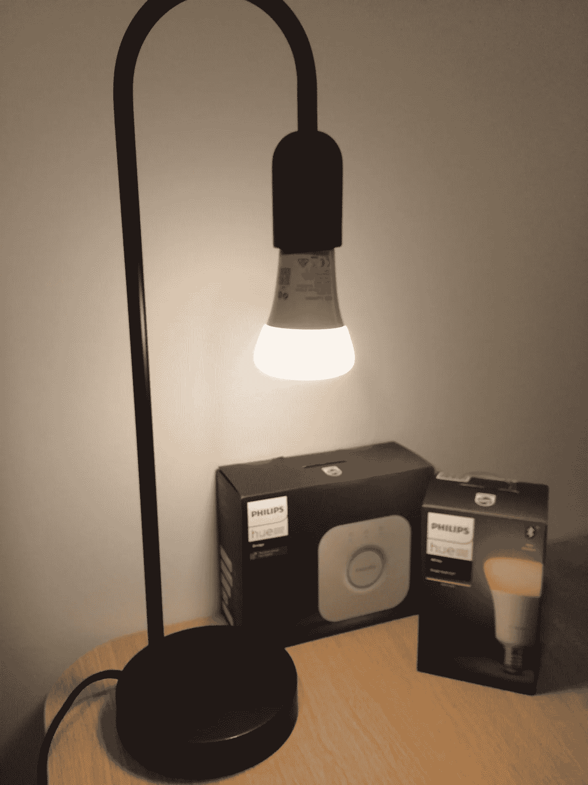
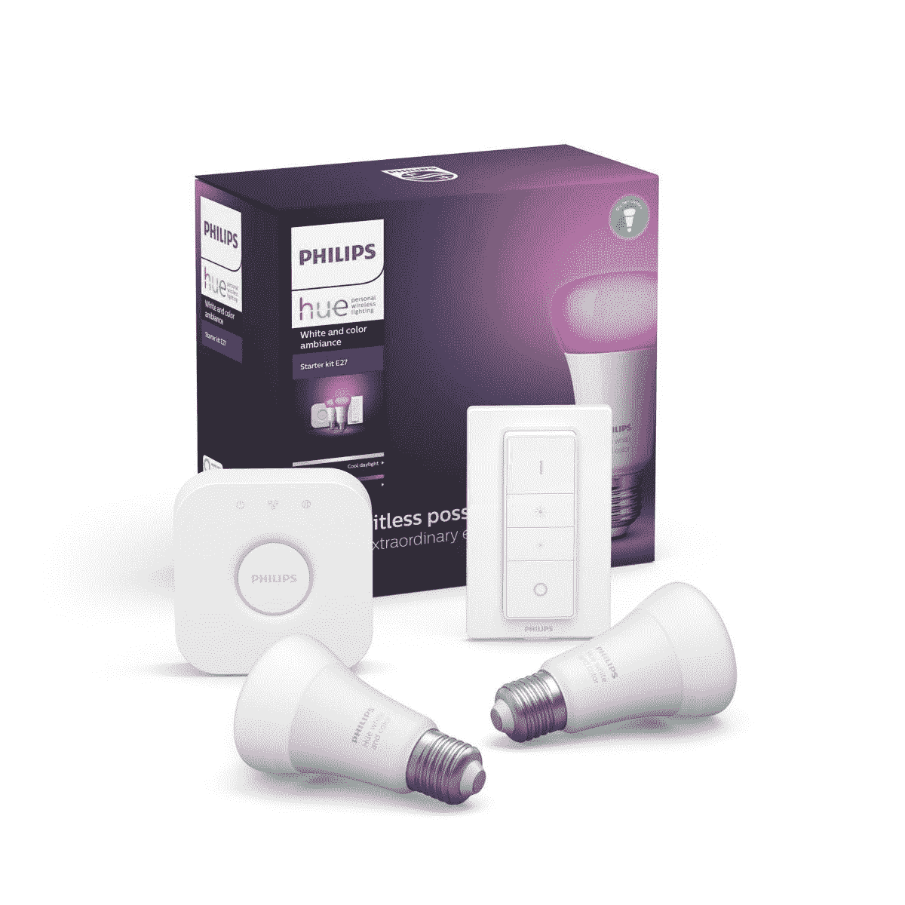

# 将物理设备与 IOTA 集成—飞利浦色调版

> 原文：<https://medium.com/coinmonks/integrating-physical-devices-with-iota-philips-hue-edition-19eec4f28ef6?source=collection_archive---------0----------------------->

## 关于将物理设备与 [IOTA](https://medium.com/coinmonks/iota/home) 协议集成的初学者教程系列的第 14 部分

# 介绍

这是初学者系列教程的第 14 部分，我们将探索如何将物理设备与 [IOTA 协议](https://medium.com/coinmonks/iota/home)集成。在本教程中，我们将重温本系列第一篇教程中的用例，在该教程中，我们构建了一个简单的电源电路，允许我们使用 IOTA 令牌从物理设备购买服务。在本教程中，我们将采用相同的想法，并将其应用于现有的硬件和软件生态系统之上，即*飞利浦 Hue* 。

这将是一个由两部分组成的教程，在第一部分中，我们将重点关注 IOTA 与流行的 *Philips Hue* 的集成。在第二篇教程中，我们将大致了解智能家居设备，以及我们如何将 IOTA 与开源的 ZigBee 协议集成。

*注意！
这可能是本系列中最容易完成的教程，因为它不涉及任何电子或微控制器。*

# 使用案例

那么，为什么我们的酒店老板会选择在像 *Philips Hue* 这样的现有生态系统上实施他的 IOTA 支付系统，而不是像我们在第一个教程中所做的那样从头开始构建它呢？嗯，简单的回答就是“即插即用”。不再需要处理大量的线路和微控制器，他现在只需去最近的电子商店，购买所有的智能设备(灯、灯泡、插头等)。)他需要在几个小时内安装并运行他的新支付系统。

*注意！
飞利浦色调系统还提供了许多从头开始很难实现的功能。例如控制光的颜色、光的强度等。*

# 飞利浦色相是什么？

*飞利浦 Hue* 是一个由变色灯、灯泡、LED 灯条、开关、调光器、运动传感器、智能电源插头等组成的生态系统。这可以通过应用程序或 Phillips Hue API 进行无线控制。在生态系统的中心是菲利普斯顺化桥。*色相桥*作为整个系统的公共控制器。 *Hue Bridge* 可以在网状无线网络中同时管理多达 50 台 Hue 设备。

你应该可以在离你最近的电器商店花不到 100 美元买到一个带电桥和几个智能灯泡的*飞利浦 Hue* 入门套件。

*注意！
当我开始学习本教程时，我没有飞利浦色相系统，所以我不得不出去买一个。那时，我还没有打算在家里永久安装它。然而，在熟悉了这个系统之后，我对硬件和软件的优雅、简单和质量留下了深刻的印象。重点是，如果你还没有一个色调系统，我强烈推荐你买一个，它很酷。*

# 安装色调

首先，在我们继续之前，您必须根据系统附带的文档安装您的*飞利浦 Hue* 系统。这很简单，应该不会超过几分钟。

在你的 IOS 或 Android 设备上安装了 [Hue app](https://www2.meethue.com/en-hk/philips-hue-app) 并验证一切正常后，你需要获取你的 Hue Bridge 的 IP 地址。

要获取您的网桥的 IP 地址，请打开飞利浦 Hue 应用程序，进入: ***设置- > Hue Bridges*** ，选择您的网桥上的(I)图标。您现在将看到一些与您的桥相关的技术细节。记下 *IP 地址*，因为我们稍后会在 Python 脚本中用到它。

# 将 IOTA 地址分配给色调设备

我们需要做的下一件事是为每个单独的色调设备分配一个唯一的支付地址。创建新地址(包括二维码)的最简单方法是使用 Trinity 钱包。记下每个地址，因为我们稍后会在 Python 脚本中用到它们。

接下来，在一张纸上打印每个地址的二维码，并将其贴在或放在各自的物理色调设备旁边。

# 所需的软件和库

飞利浦 Hue 系统的一个很酷的功能是它有自己的应用编程接口(API ),允许像我们这样的开发人员在系统上接口和构建新的应用程序。更好的是，一个叫做 self ' s[**studio imaginare**](http://studioimaginaire.com/en)的开发团队已经围绕我们将在项目中使用的 API[***phue***](https://github.com/studioimaginaire/phue)制作了一个简单的 Python 包装器。

你可以在这里找到一个 github 库，里面有 *phue* 库[的文档和安装说明。](https://github.com/studioimaginaire/phue)

# 代码

现在我们已经做好了所有的准备，让我们来看看这个项目的 Python 代码。

我们在这个项目中使用的 Python 脚本与我们在第一个教程中使用的脚本基本相同，只是做了一些小的调整。请注意，这里不再有对 Raspberry PI GPIO 引脚或库的任何引用，这意味着我们现在可以从本地网络内的任何计算机上运行 Python 脚本。

Python 脚本基本上每 10 秒检查一次每个 IOTA 地址(在前面的步骤中创建)的余额。当新的资金被添加到一个地址时，该脚本只需使用 Hue API 调用打开与其相关联的 Hue 设备。久而久之，脚本不断地从本地设备余额中删除时间，当余额为空时关闭设备(再次使用 API 调用)。

*注意！
注意，在 phue****set _ light()****函数中，第一个扩充是对作为目标的色调设备的 id 的引用。我不清楚设备 id 在 Hue Bridge/API 中是如何管理的，因为我在 Hue 应用程序中找不到对该 id 的引用，只有名称。我只能假设 id 必须与每个设备添加到网桥的顺序相关。*

*重要！
在让 Python 代码与 Hue 桥交互之前，我们首先需要让您的计算机与桥对等。要做到这一点，您可以按下桥顶上的大按钮，然后在几秒钟内在您的计算机上运行以下 Python 代码:(这只需要做一次)*

这是 Python 脚本:

你可以从[这里](https://gist.github.com/huggre/a33df65c5461c4b8181701cdb0334057)下载脚本

# 运行项目

要运行该项目，首先需要将上一节中的脚本作为文本文件保存在您的计算机上。

注意 Python 程序文件使用。py 扩展名，所以让我们将文件保存为***pay _ the _ light _ hue _ dev 1 . py***
*(* _ dev 1 . py*引用由脚本控制的特定色调设备 id)

接下来，我们需要对脚本做一些小的调整:

1.  将**b = Bridge(' 192 . 168 . 0 . 71 ')**语句中的 IP 地址替换为您的 Hue 网桥的 IP 地址
2.  将 IOTA 付款地址替换为您在本教程前面为该特定设备 id 创建的地址。
3.  根据您所针对的特定色调设备更新 device_id 变量(除非 id=1，否则无需更改)

要执行该脚本，只需启动一个新的终端窗口，导航到保存*pay _ the _ light _ hue _ de v1 . py*的文件夹，然后键入:

**python pay _ the _ light _ hue _ dev 1 . py**

现在，您应该可以在您的终端窗口中看到正在执行的代码，显示设备 1 的当前余额，并每 10 秒钟检查一次设备的 IOTA 地址余额以获取新资金。

# 支付光

要打开特定的 Hue 设备，只需拿起装有 Trinity wallet 的手机，扫描设备的相关 QR 码，并将一些 IOTA 转移到其 IOTA 地址。一旦 IOTA tangle 确认了交易，设备就会打开并保持打开状态，直到余额变空，这取决于您传输的 IOTA 的数量。在我的示例中，我将 IOTA/设备时间比率设置为 1 秒服务 1 IOTA。

# 管理多个色调设备

如果你看一下本教程的 Python 脚本，你会注意到脚本本身并不是为同时管理多个色调设备而准备的。我想处理这个问题的适当方法是重新编写代码，以包含某种类型的设备列表或数组，从而允许我们并行管理多个设备。另一种选择当然是(正如我所做的)简单地让多个 Python 实例同时运行。每个实例使用其自己的设备 id/IOTA 地址运行其自己的脚本。

如果您想接受重新编写脚本以并行支持多个设备的挑战，请随时在下面的 github 资源库中提出 pull 请求。

# 贡献

如果你想对本教程有所贡献，你可以在这里找到一个 Github 库

# 捐款

如果你喜欢这个教程，并希望我继续制作其他教程，请随时向下面的 IOTA 地址捐款。

nyzbhovsmdwabxsacajttwjoqrvvawlbsfqvsjswwbjjlsqknzfc 9 xcrpqsvfqzpbjcjrannpvmmezqjrqsvvgz

> [在您的收件箱中直接获得最佳软件交易](https://coincodecap.com/?utm_source=coinmonks)

