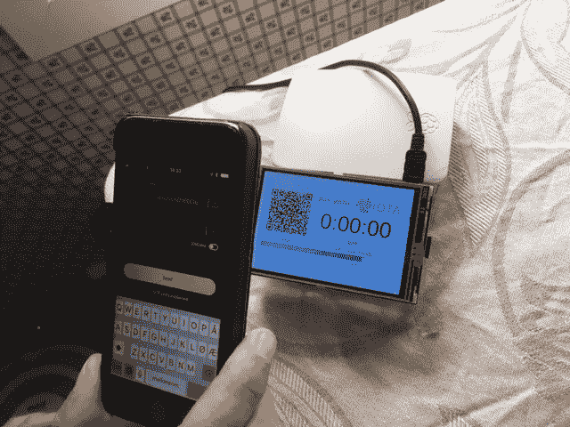
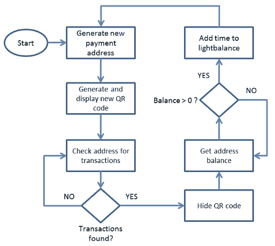

# 将物理设备与 IOTA 集成—管理价格和地址

> 原文：<https://medium.com/coinmonks/integrating-physical-devices-with-iota-price-and-addresses-4f352e321cbb?source=collection_archive---------4----------------------->

## 关于将物理设备与 IOTA 协议集成的初学者教程系列的第 4 部分。

# 介绍

这是关于将物理设备与 IOTA 协议集成的初学者教程系列的第 4 部分。在本教程中，我们将为我们的 IOTA 支付系统添加几个新功能。这些特征与我们如何在动荡的 IOTA 市场中管理我们的服务价格以及我们如何处理 IOTA 一次性签名问题有关。

如果你还没有阅读本系列的第一篇[和第三篇](/coinmonks/integrating-physical-devices-with-iota-83f4e00cc5bb)[教程，你应该在继续之前阅读它们，因为它们构成了我们在本教程中构建的项目的基础。](/@hugogregersen/integrating-physical-devices-with-iota-83f4e00cc5bb)

*注意！
与本系列之前的教程相比，本教程将更加面向软件，因为我们不会在项目中添加任何新的硬件。*

# 使用案例

现在我们已经有了基于 LCD 的用户界面，我们应该更仔细地看看在[之前的](/@hugogregersen/integrating-physical-devices-with-iota-83f4e00cc5bb)教程中简要提到的几个问题。先说通常被称为*地址复用*的话题。

**地址重用**
为了明确起见，当我使用术语“IOTA 一次性签名问题”时，我不是指 IOTA 中的任何错误或 bug 中的“问题”。IOTA 一次性签名方案是通过设计添加到 IOTA 协议中的保护机制。尽管如此，在 IOTA 协议之上构建应用程序时，这是我们需要注意和处理的事情。如先前教程“*中所述，只要酒店所有者不从他的冰箱地址花费任何资金，他们是完全安全的，然而，一旦他从其中一个地址花费任何资金，该地址就不再安全，并且必须由新的 IOTA 支付地址替换。*这实际上意味着，每次您从 IOTA 地址消费资金时，其私钥的一部分就会被暴露，这使得不良行为者有可能伪造其签名并窃取其资金。那么，我们该如何处理这个“问题”呢？我们必须假设酒店老板想花掉他辛苦赚来的一分一毫，对吗？对他来说，一个选择是只要他想从旧地址消费，就用新地址替换旧的冰箱付款地址。一个更好的选择可能是简单地为每次付款生成一个新地址，这样我们就可以一起忽略地址重用问题。现在我们已经有了新的 LCD，我们也有了实施该解决方案的实用方法。

我想在本教程中讨论的第二个问题是，在不稳定的 IOTA 市场中，我们如何管理冰箱服务的价格。我们的冰箱服务采用静态 IOTA 价格，比如 1 小时服务 1 MIOTA，可能不是我们酒店业主的最佳商业模式。毕竟，他用美元支付的电费和冰箱维护费基本上是固定的，与 IOTA 市场价格的日常波动无关。我认为对我们酒店老板来说，一个更可持续的商业模式是用美元为他的冰箱服务定价，比如 1 小时服务 1 美元，而不是在每次交易开始时将美元价格转换成 MIOTA。那么我们如何实现这个特性呢？再次，我们的新液晶显示器来拯救。通过使用 API 调用流行的 coinmarketcap.com 网站，我们可以查找以美元为单位的当前 IOTA 价格，将我们的美元价格转换为 IOTA 价格，并在 LCD 上显示正确的 IOTA 价格。我们需要考虑的另一个问题是，我们的美元价格也可能会根据外部因素(如电价)而不时变化。因此，我们必须确保我们有一个简单的方法来更新美元价格，同时确保客人得到他支付的服务时间。利用一些基本的数学知识，这一切都是可能的。

*注意！
值得注意的是，新的 Trinity 钱包已经内置了将法定货币转换为 IOTA 的功能。因此，从这个意义上说，以法定货币显示冰箱价格，并让 Trinity 负责法定货币到 IOTA 货币的转换可能就足够了。*

# 支付过程

接下来，让我们看看基于为每次支付生成新地址的新支付流程是什么样子的。

1.  **生成新的支付地址**
    我们首先使用 PyOTA 中的 *get_new_addresses()* 函数生成一个新的支付地址。注意，我们现在必须在创建 api 对象时提供一个有效的**种子**。此**种子**将在生成地址时由函数使用。还要注意的是， *get_new_addresses()* 是一个确定性函数，这意味着我们每次都需要为函数提供一个唯一的索引，以确保我们不会两次生成相同的地址。可能有不同的方法为函数提供唯一的索引，例如时间戳等。在我的例子中，我简单地使用了一个计数器，每次付款都加 1。
2.  **生成并显示新的二维码**
    接下来，我们获取新地址并将其发送到我们的二维码生成器。请注意，在进行 IOTA 支付时，我们必须在支付地址中包含校验和。因此，在将我们的地址发送到 QR 码生成器之前，我们使用 *with_valid_checksum()* 函数将校验和添加到地址中。
3.  **检查交易地址**
    接下来，我们开始查找我们地址的收款。一旦有新的交易被添加到我们的地址，我们就知道有一笔款项即将到来。
4.  **隐藏二维码**在我的例子中，我将 QR 码替换为一条消息，表明已检测到新的付款，我们正在等待付款确认。
5.  **获取地址余额**
    接下来，我们开始检查我们的地址是否有正余额，这意味着在步骤 3 中检测到的交易(支付)已经被确认。
6.  **将时间添加到 lightbalance**
    一旦检测到正余额，我们将获取新的 IOTA 余额，并根据当前时间/美元价格将其转换为时间。我们最后将计算出的时间添加到我们当前的光线平衡中，这个过程不断重复。

# 成分

相对于[之前的](/coinmonks/integrating-physical-devices-with-iota-adding-a-user-interface-2fb028a8fee1)教程，不需要额外的组件。

# 所需的软件和库

相对于[之前的](/coinmonks/integrating-physical-devices-with-iota-adding-a-user-interface-2fb028a8fee1)教程，不需要额外的软件或库。

# Python 代码

现在让我们看看自从[之前的](/coinmonks/integrating-physical-devices-with-iota-adding-a-user-interface-2fb028a8fee1)教程以来，Python 代码中添加的一些新函数。

**种子**
最重要的变化当然是我们不再有一个固定的支付地址来收取我们所有的付款。相反，我们为每笔付款生成一个新地址。为此，我们现在必须向 IOTA 地址生成器提供一个**种子**。因此，确保用自己的**种子**替换 Python 代码中的**种子**。查看[这里](https://blog.iota.org/the-secret-to-security-is-secrecy-d32b5b7f25ef)了解更多关于创建 IOTA 种子的信息。

**索引计数器**
增加了一个新的读/写索引计数器功能，以确保我们在断电等情况下跟踪最新的地址索引。索引计数器函数使用 Python *configparser* 库，该库使用**将数据存储为文本文件。ini** 格式。确保下载“let_there_be_light.ini”文件并将其放在与 Python 程序相同的文件夹中，否则会出现错误。你可以从[这里](https://gist.github.com/huggre/c5185df916ca00d2e1d12943a9d9d03a)下载文件。

**等待图标**
为了防止用户向同一个 IOTA 地址进行多次支付，一旦检测到新的支付，我们会将我们的二维码暂时替换为沙漏图标。请注意，pyQRcode 库在将 QR 代码呈现给 GUI 时使用了 TkInter BitmapImage 函数。这个函数使用一种特殊的图形文件格式，称为 XBM，这意味着我们不能使用我们典型的图形格式，如 bmp，jpg，png 等。然而，如果你想创建自己的图标，有一些应用程序和在线服务可以让你将典型的图形格式转换成 XBM。为了防止在使用我的 Python 示例代码时出现任何错误，请确保下载“hourglass.xbm”文件并将其放在与 Python 程序相同的文件夹中。你可以从[这里](https://gist.github.com/huggre/c126863786991b49c2965d42b12f6b3d)下载文件。

**价格**为此，我创建了在 Python 程序启动时读取的 lightprice_USD 变量。将我们的美元服务价格转换为 IOTA 的价格时，也会使用 lightprice_USD 变量。要更改服务价格，只需将 lightprice_USD 变量更新为与服务价格相匹配的值。请注意，lightprice_USD 是一个浮点数，价格以美元表示。一分钟服务。

你可以从[这里](https://gist.github.com/huggre/c0b4776d9430c02c07671be19c400210)下载 Python 源代码

# 运行项目

要运行这个项目，首先需要将上一节中的代码保存为 Raspberry PI 上的文本文件。

注意 Python 程序文件使用。py 扩展名，那么我们就把文件保存为***let _ there _ light _ addr . py***在树莓 PI 上吧。

要执行该程序，只需启动一个新的终端窗口，导航到保存*let _ there _ be _ light _ addr . py*的文件夹，然后键入:

**python let _ there _ be _ light _ addr . py**

现在，您应该会看到 GUI 出现在您的 LCD/显示器上，显示自动生成的 IOTA 支付地址的 QR 码。一旦一笔付款被确认，一个新的地址将被生成并显示在 GUI 中。要退出 Python 程序，只需按退出按钮。

*注意！
在执行程序之前，请确保下载“iota_logo75.jpg”文件并将其放在与 python 文件相同的文件夹中，否则会出现错误。logo 文件可以从* [*这里下载*](https://github.com/huggre/pay_the_light_gui/blob/master/iota_logo75.jpg) *。*

# 支付光

要打开 LED(或者在我的情况下，将**灯设置为打开**状态),您只需使用您最喜欢的移动 IOTA 钱包，扫描 GUI 中显示的二维码，然后传输一些 IOTA。一旦 IOTA tangle 确认了交易，LED 应该亮起(或者在我的情况下，将**灯设置为打开**状态)，并保持亮起，直到灯余额为空，这取决于您传输的 IOTA 的数量。

# 下一步是什么？

你可以在这里找到本系列下一个教程的链接

# 贡献

如果你想对本教程有所贡献，你可以在这里找到一个 Github 库

# 捐款

如果你喜欢这个教程，并希望我继续制作其他教程，请随时向下面显示的 IOTA 地址捐款。

nyzbhovsmdwabxsacajttwjoqrvvawlbsfqvsjswwbjjlsqknzfc 9 xcrpqsvfqzpbjcjrannpvmmezqjrqsvvgz