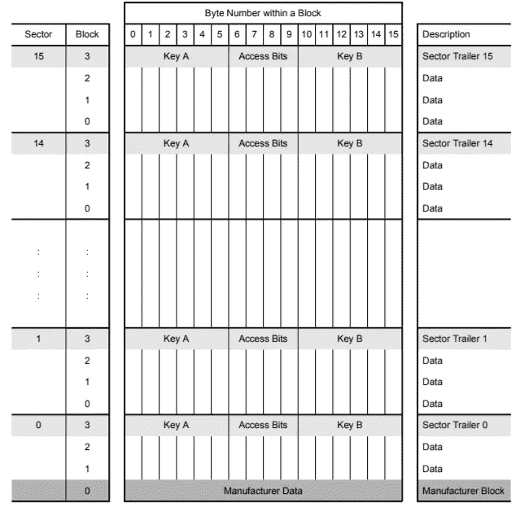

# 将物理设备与 IOTA 集成—IOTA 借记卡，第 1 部分

> 原文：<https://medium.com/coinmonks/integrating-physical-devices-with-iota-the-iota-debit-card-part-1-42dc1a05f18?source=collection_archive---------2----------------------->

关于将物理设备与 IOTA 协议集成的初学者教程系列的第 6 部分。

# 介绍

这是初学者教程系列的第 6 部分，我们将探索如何将物理设备与 IOTA 协议相集成。本教程是系列教程的第一部分，我们将尝试用基于 IOTA 的解决方案复制传统的基于 fiat 的借记卡支付解决方案。在这第一个教程中，我们将集中在借记卡本身，因为我们学习如何读取和写入卡的信息。在第二个教程中，我们将把我们的新支付解决方案与一个物理设备相集成，这将允许我们使用 IOTA 借记卡支付其服务。最后，我们将看看在使用 IOTA 借记卡时如何实现 PIN 码保护机制作为额外的安全级别。

*警告
在我们继续本教程之前，我想发出一个警告，不要在使用这些教程时使用大量 IOTA 令牌。总有一些事情会出错，当它出错时，确保你不会失去任何大量的细节。这个警告对于本教程来说尤其正确，因为我们将在 RFID 标签上创建和存储种子。如果标签出了什么问题，你可能无法找回种子。你可以采取的一个预防措施是将你保存的每一粒种子复制到一个标签上，以防你以后需要恢复它。*

# 使用案例

现在我们的酒店老板已经按照[之前的教程](/coinmonks/integrating-physical-devices-with-iota-using-rfid-with-iota-868c15e0a040)中的描述安装了新的清洁日志系统，他想解决一个困扰他一段时间的更大的问题。这个问题涉及到他如何对他的酒店客人使用位于他的酒店中的公共设备和服务收费；例如酒店接待处的咖啡机或游泳池的储物柜。人们不再随身携带硬币，实施基于签证的支付系统将变得过于复杂和昂贵。作为 IOTA 技术的热心支持者，他希望他的新支付系统基于 IOTA 令牌。但是说实话，一定有人一点也不拥有，也不知道如何得到。此外，大多数人没有在手机上安装钱包，更不用说知道如何使用它。在为这个问题绞尽脑汁了一会儿之后，他想出了一个完美的解决方案。

如果客人可以用他的酒店钥匙卡来支付咖啡机或游泳池储物柜的费用会怎么样？在这种情况下，客人将简单地去接待处并购买将被转移到他的钥匙卡的任何数量的 IOTA 令牌。就这样，有效地把他的钥匙卡变成了 IOTA 借记卡。每当客人使用他的 IOTA 借记卡来支付服务时，将从他的钥匙卡中减去适当数量的代币，并将其转移回酒店所有者的 IOTA 账户。

等等，你能把 IOTA 存储在钥匙卡上？

嗯，不是集会，但是你可以储存一个种子，允许你访问和使用与那个种子相关的种子。

第一个教程的主要目标是实现酒店所有者为其客人创建和发行新的 IOTA 借记卡所需的功能。这将包括以下功能:

*   创建 IOTA 种子并将其写入密钥卡
*   从钥匙卡中检索和显示 IOTA 种子
*   检查钥匙卡上存储的 IOTA 种子的余额
*   为存储在钥匙卡上的种子创建新的和未使用的地址，以防他想要向该卡发送额外的资金。

这听起来很棒，但是我们如何在实践中实现呢？简而言之，我们将使用来自[之前教程](/coinmonks/integrating-physical-devices-with-iota-using-rfid-with-iota-868c15e0a040)的 MFRC522 RFID 读写器，有效地将 RFID 标签转换为 IOTA 借记卡。

*注意！
你可能会问自己为什么这个列表里没有转账到卡的功能？简单的答案是，它需要使用 PyOTA 库发送有价值的 IOTA 事务，这是我们将在下一篇教程中讨论的主题。在此之前，当酒店老板想要将 IOTA 令牌转移到特定的卡时，他只需使用他最喜欢的 IOTA 钱包，并在使用“* ***显示 IOTA 借记卡种子转移地址*** *”功能时将资金转移到所示的地址。*

# Mifare RFID 标签

在这一节中，我们将仔细看看 RFID 标签本身。查看[之前的教程](/coinmonks/integrating-physical-devices-with-iota-using-rfid-with-iota-868c15e0a040)了解更多关于 RFID、MFRC522 RFID 模块以及如何安装和使用 Raspberry PI 的信息。

现在我们想从标签中读取和写入自定义数据，与[之前的教程](/coinmonks/integrating-physical-devices-with-iota-using-rfid-with-iota-868c15e0a040)相反，我们刚刚检索了标签的内部 ID，我们应该仔细看看标签本身以及它是如何工作的。

我们在本教程中使用的 RFID 标签通常被称为 Mifare 系列 RFID 标签。Mifare 系列中所有标签的一个共同特点是，它们的工作频率为 13.56MHz，并且支持身份验证和数据加密。Mifare 标签通常以钥匙圈或信用卡的形式出现。

Mifare RFID tags

在详细讨论从 Mifare 标签读取数据和向 Mifare 标签写入数据之前，我们应该花点时间讨论一下身份验证和加密的主题。如上所述，Mifare 系列包括一个验证和加密机制，可以防止在没有正确验证的情况下读取或写入数据。这是一个很好的特性，我们将在以后的教程中探索。但是，在此之前，您需要非常小心，不要无意中覆盖了默认的身份验证密钥，因为这可能会导致标签无效。下一节将详细介绍这一点。

# 使用 Mifare RFID 标签读取和写入数据

Mifare RFID 标签的功能或多或少类似于任何其他 EEPROM，其中存储器被组织在 4 个块的 16 个扇区中。每个块包含 16 个字节。第一扇区(扇区 0)的第一数据块(块 0)包含 IC 制造商数据。该块在标签制造期间被编程和写保护。请注意，每个扇区中的最后一个块被标识为“密钥 A |访问位|密钥 B”，这是存储每个扇区的认证密钥的位置。要在该扇区的块中读取或写入信息，您需要为该扇区提供有效的身份验证密钥。如果您未能提供有效的身份验证密钥，将会出现身份验证错误。因此，如果您覆盖了一个扇区中的最后一个数据块，请务必记住或记下写入该数据块的数据，因为这将作为该扇区的身份验证密钥。

*注意！
在第一个教程中，我们将只使用制造标签时写入标签的默认认证密钥。作为参考，这个认证密钥如下:[0xFF，0xFF，0xFF，0xFF，0xFF，0xFF，0xFF]。*

*警告！
在本教程中，我们不会更改标签的默认认证密钥，任何可以访问该卡的不良行为者都很容易重新创建标签上存储的 IOTA 种子并窃取其资金。*

Mifare tag memory allocation

**写入标签**
向 Mifare 标签写入数据时，我们使用 MFRC522-python 库中的 *MFRC522_Write* 函数。 *MFRC522_Write* 函数有两个参数:

1.  要写入的块的 ID。
2.  要写入块的数据

请注意，数据必须是 16 字节的列表形式，其中每个字节都由其 ASCII 数值表示。

*注意！
我的示例中使用的 Python 代码将种子分成 6 个元素，这些元素将被写入块 8、9、10、12、13 和 14。注意，块 11 被排除在外，因为该块用于扇区 2 认证密钥。*

**从标签中读取**
当从 Mifare 标签中读取数据时，我们使用 MFRC522-python 库中的 *MFRC522_Read* 函数。 *MFRC522_Read* 函数有一个参数:

1.  要读取的块的 ID。

* * *该函数返回一个字节列表，其中每个字节都由其数值 ASCII 值表示。

*注意！
请注意，两个函数中都没有指定扇区的参数，这意味着如果您将块 8 指定为参数，则根据上表，它实际上意味着扇区 2 中的块 0。*

** *重要！
如果您打开与 MFRC522-python 库一起安装的 MFRC522.py 文件，并查找 MFRC522_Read 函数，您会注意到该函数基本上只打印从标记中检索的值，不返回任何内容。这对我们的项目不起作用，因为我们需要这些值来重建我们的种子。更多关于如何解决这个问题稍后。*

# 软件和库

如果您按照 [Gus 的教程](https://pimylifeup.com/raspberry-pi-rfid-rc522/)安装 MFRC522，并且使用了[之前教程](/coinmonks/integrating-physical-devices-with-iota-using-rfid-with-iota-868c15e0a040)中的 Raspberry PI，您应该已经安装了 SimpleMFRC522 库，用于与 MFRC522 通信。SimpleMFRC522 库是标准 MFRC522-python 库的简化版本(fork ),对于开始使用 MFRC522 非常有用，无需处理复杂的内存块和验证。

然而在这个项目中，我们需要直接连接标准的 MFRC522-python 库。

MFRC522-python 库可以从[这里](https://github.com/mxgxw/MFRC522-python)下载。

或者使用..

https://github.com/mxgxw/MFRC522-python.git

*注意！
如果您按照上一教程中的描述安装了 SimpleMFRC522 库，那么 MFRC522-python 库安装文件夹可能会使用与* SimpleMFRC522 *安装文件夹相同的文件夹名称。如果是这种情况，那么在安装 MFRC522-python 库之前，您可能需要将原始文件夹重命名为其他名称。*

*重要！
当您安装完 MFRC522-python 库后，我们还需要做一件事来确保一切正常运行。还记得我们说过 MFRC522_Read 函数不返回任何数据吗？使用以下步骤解决此问题:*

1.  *从安装 MFRC522-python 库的文件夹中打开 MFRC522.py 文件。*
2.  *找到 MFRC522_Read 函数。*
3.  *在函数的末尾添加下面一行:* ***返回 backData***
4.  *保存文件*

如果您还没有安装 PyOTA 库，我们还需要确保它已经安装。带有安装说明的 PyOTA 库可以在[这里](https://github.com/iotaledger/iota.lib.py)找到。

# Python 代码

在继续这个项目的实际 Python 代码之前，让我们快速回顾一下脚本中包含的函数。

启动脚本时，您将看到一个菜单，其中包含以下选项:

1.  **将手动种子分配给 IOTA 借记卡**
    此选项允许您将预定义的种子写入 RFID 标签。该函数将在验证种子之前要求您输入 81 个字符的种子。然后你会被要求将 RFID 标签靠近阅读器。一旦 RFID 阅读器检测到标签，种子将被写入标签。
2.  **将自动种子分配给 IOTA 借记卡**
    使用此选项，Python 脚本将使用 Python 随机函数生成随机种子。然后会要求您将 RFID 标签靠近阅读器。一旦 RFID 阅读器检测到标签，种子将被写入标签。您将得到一个确认，显示已经生成并写入标记的种子。
3.  **显示存储在 IOTA 借记卡上的种子** 使用此选项，您可以检索并显示当前存储在卡上的种子。
4.  **显示 IOTA 借记卡种子余额**
    使用此选项，您可以检查存储在卡上的种子当前可用的 IOTA 令牌数量。
5.  **显示 IOTA 借记卡种子转账地址**
    使用此选项，您将获得下一个可用的种子地址，以防您想要向种子添加额外资金。重要的是，由于 IOTA 一次性签名保护，我们不会向已经花费的地址添加任何资金。在这种情况下，我们使用带有 count=None 参数的 PyOTA get_new_addresses 函数返回下一个在 Tangle 上没有事务历史的可用地址。

你可以从[这里](https://gist.github.com/huggre/1a317747d7686acd3e71d0dad761a459)下载源代码

# 运行项目

要运行项目，首先需要将上一节中的代码作为文本文件保存在安装 MFRC522-python 库的同一文件夹中。

注意 Python 程序文件使用。py 扩展名，所以我们在树莓 PI 上把文件保存为***iota _ debit _ card . py***。

要执行该程序，只需启动一个新的终端窗口，导航到保存 *iota_debit_card.py* 的文件夹，然后键入:

**python iota_debit_card.py**

现在，您应该可以在显示主菜单的终端窗口中看到正在执行的代码。

# 接下来是什么？

除非有某种使用方法，否则我们的 IOTA 借记卡不会很实用。因此，在下一个教程中，我们将把我们的新支付解决方案与一个物理设备相集成，这将允许我们使用 IOTA 借记卡支付其服务。敬请关注…

你可以在这里找到本系列下一个教程的链接

# 贡献

如果你想对本教程有所贡献，你可以在这里找到一个 Github 库

# 捐款

如果你喜欢这个教程，并希望我继续制作其他教程，请随时向下面显示的 IOTA 地址捐款。

nyzbhovsmdwabxsacajttwjoqrvvawlbsfqvsjswwbjjlsqknzfc 9 xcrpqsvfqzpbjcjrannpvmmezqjrqsvvgz

> [直接在您的收件箱中获得最佳软件交易](https://coincodecap.com/?utm_source=coinmonks)

