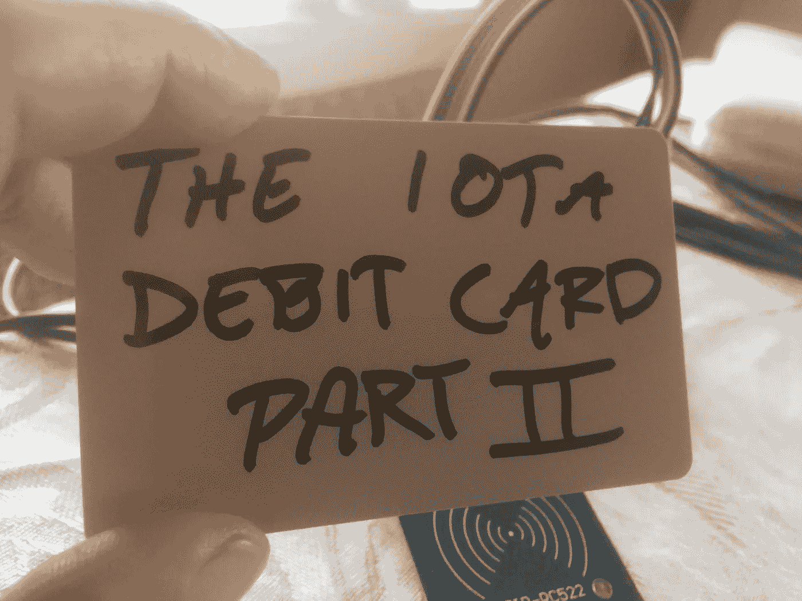
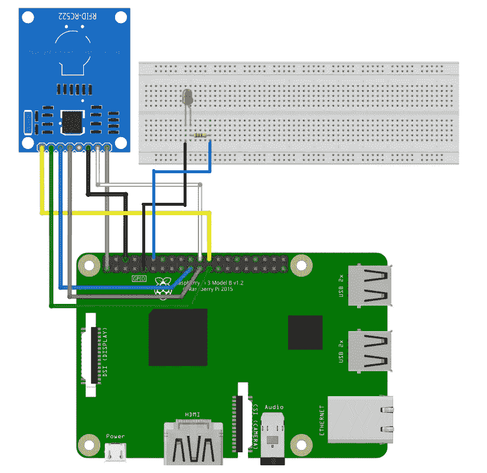
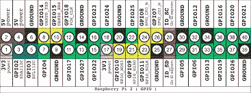

# 将物理设备与 IOTA 集成—IOTA 借记卡，第 2 部分

> 原文：<https://medium.com/coinmonks/integrating-physical-devices-with-iota-the-iota-debit-card-part-2-1f073060ae1d?source=collection_archive---------3----------------------->

关于将物理设备与 IOTA 协议集成的初学者教程系列的第 7 部分。

# 介绍

这是初学者教程系列的第 7 部分，我们将探索如何将物理设备与 IOTA 协议相集成。本教程是系列教程的第二部分，我们将尝试用基于 IOTA 的解决方案复制传统的基于 fiat 的借记卡支付解决方案。在第二个教程中，我们将构建一个简单的 LED 电路来代表物理设备，它将允许我们使用新的 IOTA 借记卡来支付其服务。

# 使用案例

现在，我们已经配置了新的 IOTA 借记卡，并按照[之前的教程](/coinmonks/integrating-physical-devices-with-iota-the-iota-debit-card-part-1-42dc1a05f18)中所述准备就绪，我们将把注意力转移到如何使用该卡支付服务上。在[之前的教程](/coinmonks/integrating-physical-devices-with-iota-the-iota-debit-card-part-1-42dc1a05f18)中，我使用接待处的咖啡机和游泳池储物柜作为我们可以集成新的 IOTA 借记支付解决方案的例子。但老实说，像这样的支付解决方案可能会集成到任何接受支付服务的机器或设备中，如自动售货机、老虎机、停车计时器或来自[第一教程](/coinmonks/integrating-physical-devices-with-iota-83f4e00cc5bb)的酒店房间冰箱。为什么就此打住？客人甚至可以使用他的 IOTA 借记卡来支付酒店餐厅的晚餐或酒店礼品店的商品，防止酒店所有者被 Visa 或任何其他第三方支付提供商收取额外的费用。可能性基本上是无穷无尽的。

我们将使用第一篇教程[中 LED 供电电路的简化版本](/coinmonks/integrating-physical-devices-with-iota-83f4e00cc5bb)来代表本教程中的器件。本教程的主要目的是使用我们的 IOTA 借记卡发送有价值的交易，因此我们将从第[篇教程](/coinmonks/integrating-physical-devices-with-iota-83f4e00cc5bb)中删除任何不需要的组件、连线和编码，因为不需要这样做来表达这一点。

# 关于价值交易

价值事务是在 IOTA 地址之间传送 IOTA 令牌 IOTA 事务，这与我们向 tangle 发送非价值事务的[教程 5](/coinmonks/integrating-physical-devices-with-iota-using-rfid-with-iota-868c15e0a040) 相反。典型的价值交易实际上由打包在*包*中的多个交易组成。*捆绑包*由 3 种交易类型组成:

1.  输入从发件人地址中扣除金额的负值交易
2.  输出 TXs
    正值交易，为接收方地址增值
3.  未用交易
    将剩余金额从发送方地址转移到新的发送方地址的零和交易。这些交易的目的是防止将来从已经使用的发件人地址消费。

虽然这听起来相当复杂，但好消息是我们不必担心设置包的复杂性，这将由 PyOTA 库来处理。

*注意！
注意，当束中的所有事务都被执行时，现有 IOTA 的总量不变，只有 IOTA 令牌的所有权地址发生了变化。这当然是 IOTA 协议的基本属性，必须一直执行。*

# 为项目布线

接下来，让我们看一下项目的布线。如前所述，本教程的电路将是第一个教程[中使用的电路的简化版本。我将从电路中移除继电器和电池，因为它们不需要演示我们在本教程中试图提出的观点。如果你想将它们包含在你的项目版本中，这是可以的。不管有没有它们，Python 代码都可以很好地工作。](/coinmonks/integrating-physical-devices-with-iota-83f4e00cc5bb)

如果您尚未设置 MFRC522 RFID 读写器，请参见[教程 5](/coinmonks/integrating-physical-devices-with-iota-using-rfid-with-iota-868c15e0a040) 了解如何设置。

有关连接 LED 的信息，请参见[教程 1](/coinmonks/integrating-physical-devices-with-iota-83f4e00cc5bb) 。如果你想像我写这篇教程时那样简化 LED 电路，你可以跳过继电器和电池，直接将 LED 连接到 Raspberry PI GIO 引脚。请注意，电路中仍然需要电阻器，否则可能会过载并损坏 LED。

*注意！
由于第一个教程中用于接地的引脚 6 现在被 MFRC522 占用，我选择使用引脚 9 作为 LED 的接地。如果使用试验板，也可以将 MFRC522 和 LED 的地连接到试验板上的公共地。*

Raspberry PI pin layout

# Python 代码

本教程的主要目的是使用我们的 IOTA 借记卡来支付物理设备的服务。在我的例子中，服务由一个闪烁的 LED 组成。在我们开始编码之前，让我们快速浏览一下代码背后的逻辑以及它是如何工作的。

1.  python 脚本首先检查接收者(酒店所有者)地址的余额，这样我们就有了一个基线来监控新的支付何时被添加到该地址。
2.  接下来，python 脚本显示了一条欢迎消息，其中将询问您想要购买多少次“眨眼”。在我的示例中，我将价格设置为 1 IOTA，持续闪烁 1 次。
3.  接下来，你将被要求持有你的 IOTA 借记卡靠近 RFID 阅读器。
    一旦 RFID 读取器检测到卡，Python 脚本将从卡中读取 IOTA 种子。
4.  接下来，我们会检查借记卡种子上是否有足够的资金来支付您订购的闪烁次数。
5.  如果资金是确定的，我们定义一个新的交易，然后再把它发送到 Tangle。
6.  接下来，我们开始监控接收者(酒店所有者)地址余额，以查看是否有任何新的资金被添加。意思是，如果来自前一步的交易已被确认。
7.  最后，当交易已被确认时，我们闪烁 LED 的订购次数。

*注意！
如果您遵循本系列中之前的教程，您将会意识到地址重用问题，当酒店所有者想要从收集 LED 闪烁代币的接收者地址花费任何资金时，将会发生该问题。在* [*教程 4*](/coinmonks/integrating-physical-devices-with-iota-price-and-addresses-4f352e321cbb) *中，我们使用带有二维码的 LCD 显示器作为使用户能够使用他的移动 IOTA 钱包进行支付的便利方式来解决地址重用问题。现在我们使用我们的 IOTA 借记卡来进行支付，用户不需要知道什么接收地址正被用于支付 LED，这可以全部在幕后管理。如果要针对本项目中的地址重用问题实现解决方案，使用与我们在* [*教程 4*](/coinmonks/integrating-physical-devices-with-iota-price-and-addresses-4f352e321cbb) *中所做的方法类似的方法，不用 LCD。*

你可以从[这里](https://gist.github.com/huggre/71c6aadb4e4e3d37018dc3acee5a17a0)下载源代码

# 运营项目

要运行该项目，首先需要将上一节中的代码作为文本文件保存在安装 MFR 522-python 库的同一文件夹中。

请注意，Python 程序文件使用。py 扩展，所以让我们将该文件保存为覆盆子 PI 上的***iota _ debit _ card _ pay . py***。

要执行该程序，只需启动一个新的终端窗口，导航到保存 *iota_debit_card_pay.py* 的文件夹，然后键入:

**python _ 借记卡 _pay.py**

现在，您应该可以在终端窗口中看到正在执行的代码，其中询问您要购买的闪烁次数。

# 对上一个教程的改进

既然我们已经对如何使用 PyOTA 创建价值交易有了基本的了解，那么在前面的教程中添加一个新选项应该是非常简单的，它将允许我们将资金从酒店所有者种子转移到借记卡种子。您可能还记得，我们具有生成新地址的功能，该地址将在向 IOTA 借记卡转移新资金时使用。现在，这只是一个扭转本教程中使用的支付过程的问题。我们不是将价值交易从 IOTA 借记卡种子发送到酒店所有者地址，而是将价值交易从酒店所有者种子发送到 IOTA 借记卡地址。在[上一篇教程](/coinmonks/integrating-physical-devices-with-iota-the-iota-debit-card-part-1-42dc1a05f18)的代码中实现这个特性应该是一个很好的学习练习，我会把它留给读者。

# 接下来是什么？

您可能已经注意到，使用 IOTA 借记卡付款时，您不需要任何授权或凭证。虽然在某些用例中这可能是好的，但是在其他用例中这可能是不可接受的。想象一下，如果你丢失了你的 IOTA 借记卡，而它被一个坏演员捡到了。没有任何保护机制，就没有什么可以阻止他使用你的卡。在下一个教程中，我们将通过为我们的 IOTA 借记卡实现 PIN 码授权机制来解决这个问题。敬请关注…

你可以在这里找到这个系列下一个教程的链接

# 贡献

如果你想对本教程有所贡献，你可以在这里找到一个 Github 库

# 捐款

如果你喜欢这个教程，并希望我继续制作其他教程，请随时向下面显示的 IOTA 地址捐款。

nyzbhovsmdwabxsacajttwjoqrvvawlbsfqvsjswwbjjlsqknzfc 9 xcrpqsvfqzpbjcjrannpvmmezqjrqsvvgz

> [直接在您的收件箱中获得最佳软件交易](https://coincodecap.com/?utm_source=coinmonks)

