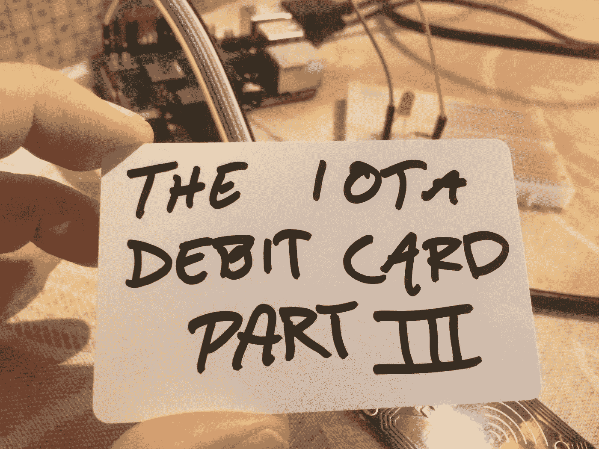

# 将物理设备与 IOTA 集成—IOTA 借记卡，第 3 部分

> 原文：<https://medium.com/coinmonks/integrating-physical-devices-with-iota-the-iota-debit-card-part-3-bc0f03b8b2c9?source=collection_archive---------7----------------------->

## 关于将物理设备与 IOTA 协议集成的初学者教程系列的第 8 部分。

# 介绍

这是初学者教程系列的第 8 部分，我们将探索如何将物理设备与 IOTA 协议集成在一起。本教程是系列教程的第三部分，我们将尝试用基于 IOTA 的解决方案复制传统的基于 fiat 的借记卡支付解决方案。在这第三个教程中，我们将为我们的 IOTA 借记卡实现 i PIN 码保护机制。

# 使用案例

如果您遵循了本系列的上一篇教程，您可能会注意到，当您使用 IOTA 借记卡付款时，不会要求您提供任何授权或凭证。虽然在某些用例中这可能是好的，但是在其他用例中这可能是不可接受的。想象一下，如果你丢失了你的 IOTA 借记卡，而它被一个坏演员捡到了。没有任何保护机制，就没有什么可以阻止他使用你的卡。在本教程中，我们将通过为 IOTA 借记卡实施 PIN 码保护机制来解决这个问题。

本教程将比本系列前面的教程略短，因为我们不会介绍任何新的硬件或 PyOTA 函数。

# Python 代码—第 1 部分

本教程中使用的 python 代码将分为两部分，其中第一部分是为您的 IOTA 借记卡分配新 PIN 码时使用的代码。第二部分是来自[之前教程](/coinmonks/integrating-physical-devices-with-iota-the-iota-debit-card-part-2-1f073060ae1d)的 [iota_debit_card_pay.py](https://gist.github.com/huggre/71c6aadb4e4e3d37018dc3acee5a17a0) 脚本的修改版。唯一不同的是，新版本将在扫描您的 IOTA 借记卡之前要求您输入 PIN 码。

因此，让我们从第一个 Python 脚本开始，它将允许您为您的 IOTA 借记卡分配自己的四位 PIN 码。请注意，新的 PIN 码将被写入模块 11 和 15 的前四个字节。我们需要将 PIN 码写入两个不同的块的原因是每个块用作存储 IOTA 种子的两个单独扇区的认证块。查看本系列的第 6 篇教程，了解更多关于从 Mifare RFID 标签读取和写入数据的信息。

你可以从[这里](https://gist.github.com/huggre/b22698a6f404d859463d4408ae2a1bbc)下载源代码

# 运行项目

要运行项目，首先需要将上一节中的代码作为文本文件保存在安装 MFRC522-python 库的同一文件夹中。

注意 Python 程序文件使用。py 扩展名，所以我们在树莓 PI 上把文件保存为***iota _ debit _ card _ pin . py***。

要执行这个程序，只需启动一个新的终端窗口，导航到你保存*的文件夹，输入:*

**python iota _ debit _ card _ pin . py**

您现在应该看到 Python 代码在您的终端窗口中执行，要求您输入旧的 PIN 码。提供旧的 PIN 码后，将要求您输入新的四位数 PIN 码。

*注意！
如果您使用的是新的 RFID 标签，当要求输入旧的 PIN 码时，您只需按 enter 键，因为脚本会使用在制造过程中分配给标签的默认认证密钥。*

*警告！
记住或记下您分配给 IOTA 借记卡的任何新 PIN 码非常重要，因为现在有办法在以后重置或更改 PIN 码，而无需首先提供旧 PIN 码。*

# Python 代码—第 2 部分

第二部分是来自[之前教程](/coinmonks/integrating-physical-devices-with-iota-the-iota-debit-card-part-2-1f073060ae1d)的 [iota_debit_card_pay.py](https://gist.github.com/huggre/71c6aadb4e4e3d37018dc3acee5a17a0) 脚本的修改版本。唯一不同的是，新版本将在扫描您的 IOTA 借记卡之前要求您输入 PIN 码。

你可以从[这里](https://gist.github.com/huggre/7f4938e189bfbe783004abdc349c12cc)下载源代码

# 运行项目

要运行项目，首先需要将上一节中的代码作为文本文件保存在安装 MFRC522-python 库的同一文件夹中。

注意 Python 程序文件使用。py 扩展名，所以我们在树莓 PI 上把文件保存为***iota _ debit _ card _ pay _ pin . py***。

要执行该程序，只需启动一个新的终端窗口，导航到保存*iota _ debit _ card _ pay _ pin . py*的文件夹，然后键入:

**python iota _ debit _ card _ pay _ pin . py**

现在，您应该看到 Python 代码正在您的终端窗口中执行，首先询问您想要购买的“眨眼”次数，然后询问 PIN 码。使用之前的 Python 脚本输入分配给标签的 PIN 码(如果尚未分配新的 PIN 码，请按 Enter 键)。如果您不提供有效的 PIN 码，该脚本将因身份验证错误而中止。

# 接下来是什么？

我在想，使用一些现成的组件，如键盘、2x16 数字显示器和 RFID 阅读器，构建一个基于 Visa style IOTA 的支付终端会很有趣。我只希望我的树莓派上有足够多的 GIO 别针。将会看到进展如何..，敬请关注。

你可以在这里找到本系列下一个教程的链接

# 贡献

如果你想对本教程有所贡献，你可以在这里找到一个 Github 库

# 捐款

如果你喜欢这个教程，并希望我继续制作其他教程，请随时向下面显示的 IOTA 地址捐款。

nyzbhovsmdwabxsacajttwjoqrvvawlbsfqvsjswwbjjlsqknzfc 9 xcrpqsvfqzpbjcjrannpvmmezqjrqsvvgz

> [在您的收件箱中直接获得最佳软件交易](https://coincodecap.com/?utm_source=coinmonks)

