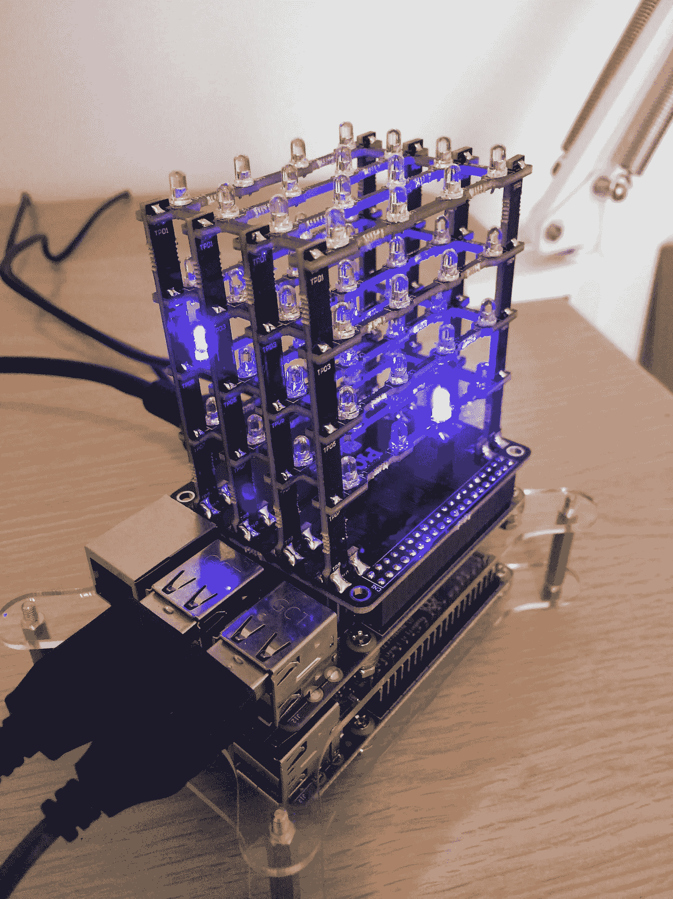
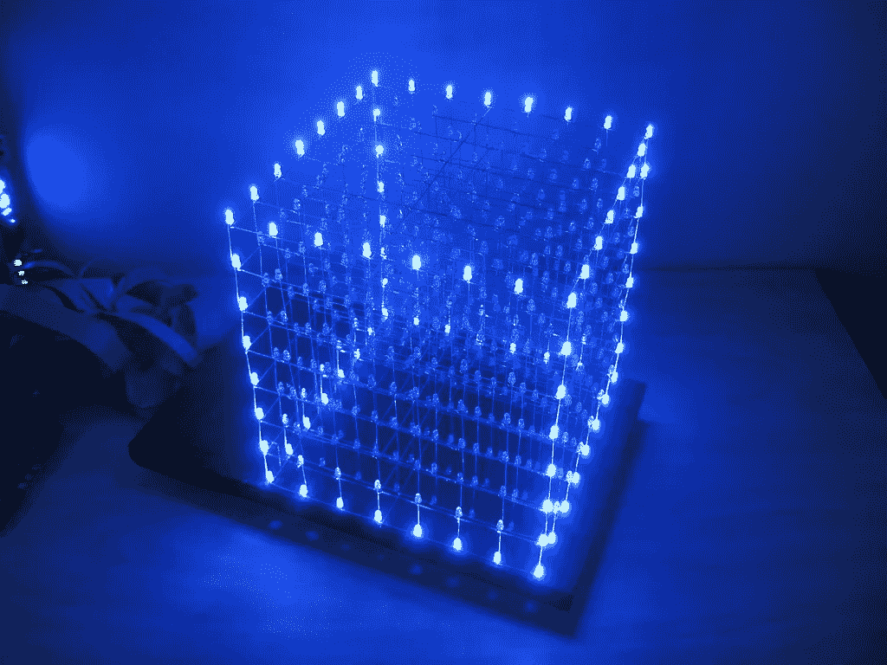
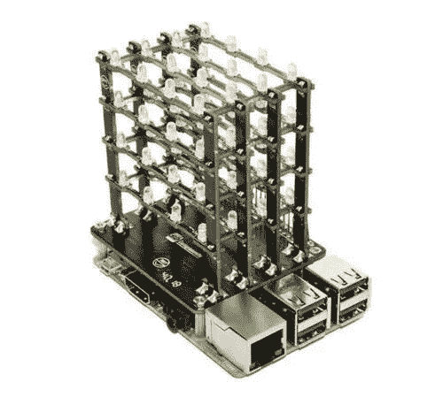
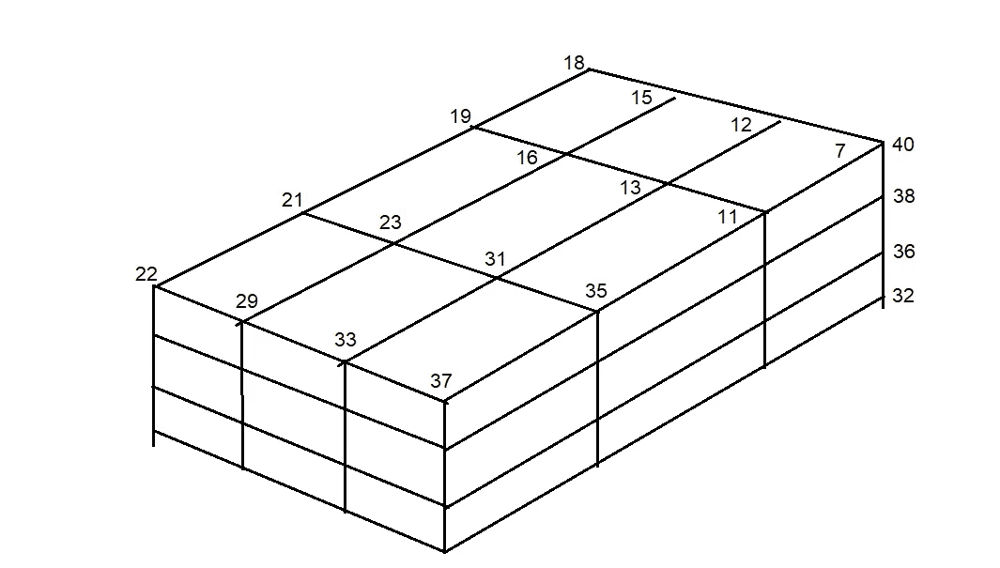

# 将物理设备与 IOTA 集成 IOTA LED 立方体

> 原文：<https://medium.com/coinmonks/integrating-physical-devices-with-iota-the-iota-led-cube-a5ff33c0894f?source=collection_archive---------0----------------------->

## 关于将物理设备与 IOTA 协议集成的初学者教程系列的第 11 部分。

# 介绍

这是初学者教程系列的第 11 部分，我们将探索如何将物理设备与 IOTA 协议相集成。自从我发表了这个系列的最后一篇教程以来，我已经有一段时间不得不做一些其他的事情了。这将在接下来的几个月中改变，因为我现在已经收到了 IOTA 发展基金的捐款，这将允许我继续制作这些教程。

说到这个话题，我想向所有向 IOTA 发展基金捐款的人表示我的荣幸和感谢。在一个大多数行为都是由短视的投机和贪婪所驱动的空间里，IOTA 发展基金是一个真正的独一无二的结构，它将 IOTA 与其他项目区分开来。

我在想，我们可以从一个更小的项目开始，这个项目有更多的“有趣”因素，而不是实际的实际用例。除了是一个很酷很有趣的项目之外，本教程仍然很重要，因为它将向您介绍 IOTA tangle 的一个有用特性，即 Zero Message Que，简称 ZMQ。

本教程的主要目标是使用一个 LED 立方体来可视化 IOTA tangle 的事务吞吐量。

# 使用案例

如前一节所述，为这个特定的教程寻找一个实际的用例可能有些牵强。然而，学习 ZMQ 和 ZMQ 流总是有用的，因为它可以应用于许多其他真实生活用例。一个例子是 tanglemonitor.com 流行的

为了将本教程与本系列中的其他教程联系起来。我猜你可以想象酒店老板在酒店接待处放置一个 LED 立方体作为有趣的视觉装饰品。同时，在可视化 IOTA 缠结的当前健康和事务吞吐量方面，立方体将具有实用功能。

*注意！
在本教程中，我们将监控通过 IOTA 网络传播的所有事务。为了监控混乱的状况，只关注已确认的事务可能更合适。这完全取决于您，因为 IOTA ZMQ 流提供了这两者。*

# 什么是 ZMQ(零消息 Que)？

ZMQ 或 ZMQ 流是由 IOTA IRI 节点发布的事件或消息，如果被激活的话。使用 ZMQ 监听器，您可以监视这些事件，并根据事件发生的时间、事件的类型等执行操作。

在我们的项目中，我们将监视 ZMQ 流中附加到 tangle 的新事务，每当这个特定事件发生时，我们的 LED 立方体上会闪烁一个随机 LED。

参见[此处](https://docs.iota.org/docs/node-software/0.1/iri/references/zmq-events)了解更多关于 IRI 节点发布的不同 ZMQ 消息和事件消息结构的信息。

*注意！
注意，在 IRI 配置文件中有一个配置设置(ZMQ_ENABLED ),它定义了 ZMQ 消息是否由节点发布。默认情况下，ZMQ_ENABLED 设置被设置为 False，必须将其更改为 True，节点才能开始发布 ZMQ 消息。您还可以在这里设置 ZMQ 消息发布的端口。还要注意，大多数公共 IRI 节点没有启用 ZMQ。如果您没有运行自己的 IOTA 节点，您可以在 fullnode Discord 通道上向 IOTA 社区请求一个启用了 ZMQ 的公共节点。或者，您可以使用 IOTA 基金会当前托管的以下启用了 zmq 的 devnet 节点:****TCP://ZMQ . devnet . IOTA . org****该节点正在端口* ***5556*** 上发布 ZMQ 消息

# 什么是 LED 立方体？

LED 立方体基本上是使用电源导线连接在一起的发光二极管(或简称为 LED)的三维矩阵(结构)。使用 Arduino 或 Raspberry PI 等微控制器，您可以编写一个程序，随意打开和关闭各个 LED，制作各种有趣的灯光图案。如果你想做的话，有成百上千的教程教你如何制作自己的 LED 立方体。您还可以获得完整的工具包，其中包含构建多维数据集所需的所有组件，包括如何构建多维数据集的详细说明。你需要的只是一个烙铁和大量的时间和耐心。

如果你想全身心投入构建和编程你自己的 LED 立方体，你应该看看这个[视频](https://www.youtube.com/watch?v=dVHP7Nhsn4E)寻找灵感。

由于我个人没有时间或耐心从头开始建造自己的 LED 立方体，我决定从易趣上花 25 美元买一个。

# PiCube

PiCube 是 kickstarter 项目[,它制作了一个预制的 LED 立方体，可以直接安装在 Raspberry PI 的顶部，无需任何布线或焊接。PiCube 项目还有一个 github 页面](https://www.kickstarter.com/projects/127134527/picube-4x4x4-led-cube-for-raspberry-pi-32-zero-and),您可以在那里获得文档和示例代码。

# 所需的软件和库

在我们开始为这个项目编写 Python 代码之前，我们需要确保我们已经在 Raspberry PI 上安装了所有需要的软件和库。对于本教程，唯一需要的额外库是 PyZMQ 库。要了解更多关于 PyZMQ 库以及如何安装它的信息，请访问下面的链接:[https://zeromq.org/languages/python/](https://zeromq.org/languages/python/)

# Python 代码

这个项目的 Python 代码非常简单，所以我不会详细介绍，只是简单介绍一下如何处理立方体中的单个 LED。在我的例子中，我只是为附加到 tangle 的每个新 IOTA 事务选择一个随机的 LED 来闪烁。在您的项目版本中，您可能希望 LED 以特定的顺序闪烁，如果是这样，您需要知道如何寻址立方体中的各个 LED。

LED 立方体背后的基本概念是将 LED 连接在由垂直和水平层表示的隔离电路中。关于 PiCube，LED 连接在 16 个隔离的垂直层和 4 个单独的水平层中，总共构成 64 个 LED。要打开/关闭立方体中的特定 LED，您只需打开/关闭各层交汇处(以及 LED 所在位置)的垂直层和水平层。由于每个层都连接到 PI 上的一个特定 GPIO 引脚，我现在可以使用 PI 的 GPOI.output()函数来打开/关闭各个 LED 的电源

经过一些测试后，我发现 PiCube 上的 LED 连接到 PI 的 GPIO 引脚，如下图所示。

这是这个项目的 Python 代码。

这个 python 脚本的源代码可以从[这里](https://gist.github.com/huggre/6d88d83256b41a8b9f6190b796ec7c9d)下载

# 运行项目

要运行这个项目，首先需要将前一节中的脚本作为文本文件保存在您的计算机上。

注意 Python 程序文件使用。py 扩展名，所以在你的树莓 PI 上保存文件为 ***zmq_cube.py***

要执行脚本，只需启动一个新的终端窗口，导航到保存脚本的文件夹，然后键入:

**python*zmq _ cube . py***

现在，您应该看到 PiCube 上的随机 LED 开始闪烁，每个闪烁代表一个新的事务被添加到 IOTA tangle 中。

在您的终端窗口中，您还应该看到各个事务的一些基本数据，如地址、事务散列、值和标签。

# 贡献

如果你想对本教程有所贡献，你可以在这里找到一个 Github 库。

# 捐款

如果你喜欢这个教程，并希望我继续制作其他教程，请随时向下面显示的 IOTA 地址捐款。

nyzbhovsmdwabxsacajttwjoqrvvawlbsfqvsjswwbjjlsqknzfc 9 xcrpqsvfqzpbjcjrannpvmmezqjrqsvvgz

> [在您的收件箱中直接获得最佳软件交易](https://coincodecap.com/?utm_source=coinmonks)

