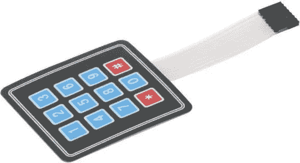

# 将物理设备与 IOTA(IOTA 支付终端)集成

> 原文：<https://medium.com/coinmonks/integrating-physical-devices-with-iota-the-payment-terminal-3e7e56bd5a9e?source=collection_archive---------0----------------------->

## 关于将物理设备与 IOTA 协议集成的初学者教程系列的第 9 部分。

# 介绍

这是初学者教程系列的第 9 部分，我们将探索如何将物理设备与 IOTA 协议相集成。本教程是一系列教程的最后一部分，我们将尝试用基于 IOTA 的解决方案复制传统的基于菲亚特的借记卡支付解决方案。在本教程中，我们将使用一些低成本的现成组件构建一个简单的基于 IOTA 的支付终端。

在你开始构建这个项目之前，你应该先看一下本系列的第[6](/coinmonks/integrating-physical-devices-with-iota-the-iota-debit-card-part-1-42dc1a05f18)、[7](/coinmonks/integrating-physical-devices-with-iota-the-iota-debit-card-part-2-1f073060ae1d)和[8](/coinmonks/integrating-physical-devices-with-iota-the-iota-debit-card-part-3-bc0f03b8b2c9)教程，因为它们都为构建本教程中的项目提供了基础。

# 使用案例

既然酒店老板已经建立并运行了他的 IOTA 借记卡支付系统，那么还有最后一个问题需要解决。这个问题与他的新 IOTA 借记卡解决方案如何在实际的最终用户支付场景中使用有关。到目前为止，与系统的交互一直基于连接到 Raspberry PI USB 端口的经典显示器和键盘。虽然这对于诸如创建和发行新的 IOTA 借记卡的管理任务来说是好的，但是作为终端用户支付接口来说可能不是很实用。想象一下，每当客人想为晚餐买单时，酒店餐厅的服务员都必须拖着一个大显示器和键盘。或者将一个大显示器和键盘连接到游泳池的储物柜上。这既不实际又昂贵。我们需要的是像便携式支付终端或一些简单的用户界面，可以集成到游泳池的储物柜。设计和构建一个漂亮的便携式支付终端或人机界面(HMI)超出了本教程的范围。然而，使用一些低成本的现成组件，我们应该能够构建一个原型，作为未来工业化版本的概念验证(PoC)。

# 成分

构建此项目所需的组件如下:

1.  树莓派
2.  12 键 4x3 矩阵-薄膜型键盘
3.  带 I2C 的 1602 液晶显示器
4.  RC522 RFID 读写器模块
5.  LED、试验板、一些电线和一个电阻

*注意！
除了键盘和 1602 LCD 显示屏之外的所有组件都已在之前的教程中讨论过，因此我将在本教程中跳过任何进一步的细节。*

**12 键— 4x3 矩阵—薄膜式键盘**
*12 键— 4x3 矩阵—薄膜式键盘*是一种简单的键盘，可以用作任何需要数字输入的项目的输入设备。小键盘因其低成本和易用性在修补者中很受欢迎。你应该花几块钱就能在易趣上买到一个。

*注意！
您也可以获得 16 (4x4)键配置的键盘。除了获取数字输入之外，如果您需要执行其他功能，这可能会很方便。请注意，如果您选择使用 16 键版本，您必须对本教程中使用的键盘库进行一些调整。*

**带 I2C 的 1602 LCD 显示器**
1602 LCD 显示器非常方便、紧凑，通常用于需要简单字符和基于数字的通信的项目。1602 具有可调背光功能，使其在明亮和黑暗的环境中都能正常工作。我选择在这个项目中使用 I2C 版本的 1602 液晶显示器。1602 LCD 的 I2C 版本在 LCD 背面附加了一个 I2C 模块(LCM1602 ),可用于串行通信。使用 I2C 模块，我们只需要最少数量的 GIO 引脚和连接来启动 LCD 并与 PI 一起运行。

1602 LCD (Front)

1602 LCD with I2C module attached (Back)

# 为项目布线

使用以下连接图连接本项目中使用的各种组件。

# 所需的软件和库

在我们开始为这个项目编写 Python 代码之前，我们需要确保在我们的 Raspberry PI 上安装了所有需要的软件和库。有关安装 Raspbian OS、Python、Pyota 和 RC522 RFID 读写器库的更多信息，请参见之前的教程。

为了让我们的 1602 LCD 和键盘正常工作，我们首先需要向我们的项目添加两个新的 Python 库。

要在您的项目中包含这些库，只需下载 [I2C_LCD_driver.py](https://gist.github.com/huggre/02045689aaeb153f2c4cf6573eb0bbcb) 和 [keypad.py](https://gist.github.com/huggre/1cf79a4e9848aa3cfd1f7aa8eb072be2) 文件，并将它们放在安装 MFRC522-python 库的同一个文件夹中。

参见[此处](http://www.circuitbasics.com/raspberry-pi-i2c-lcd-set-up-and-programming)了解更多关于使用 I2C_LCD_driver.py 库提供的不同功能的信息。

*注意！
在我们让 1602 LCD 与 I2C 一起工作之前，我们必须确保 I2C 通信在树莓 PI 上启用。查看* [*此处*](http://www.circuitbasics.com/raspberry-pi-i2c-lcd-set-up-and-programming) *了解更多关于在树莓 PI 上启用 I2C 的信息。*

*注意！
根据您使用的 Raspberry PI 版本，您可能需要对 I2C_LCD_driver.py 文件开头的 I2CBUS 和 ADDRESS 变量进行一些更改。对于旧版本的 PI，您可能需要将 I2CBUS 变量更改为 0。您可能还需要将地址变量更改为 LCD 使用的地址。我的 I2C 地址是 27，所以我将把值改为 0x27。*

# Python 代码

本项目中使用的 Python 代码是在[之前的教程](/coinmonks/integrating-physical-devices-with-iota-the-iota-debit-card-part-3-bc0f03b8b2c9)中使用的代码的变体，唯一的区别是我们将从小键盘而不是传统键盘获得用户输入。我们还将把显示器换成 1602 液晶显示器，用于视觉交流。

你可以从[这里](https://gist.github.com/huggre/55aa9337628706a4c8c5d6fbcd97c55a)下载源代码

# 运行项目

要运行项目，首先需要将上一节中的代码作为文本文件保存在安装 MFRC522-python 库的同一文件夹中。

注意 Python 程序文件使用。py 扩展名，所以我们在树莓 PI 上把文件保存为***iota _ terminal . py***。

要执行该程序，只需启动一个新的终端窗口，导航到保存 *iota_terminal.py* 的文件夹，然后键入:

**python iota_terminal.py**

您现在应该会在 LCD 上看到一条信息，询问您想要购买的<blinks>数量。使用键盘上的数字输入所需金额，完成后按#键。您可以使用*键进行更正。</blinks>

接下来，您将被要求输入当前分配给您的 IOTA 借记卡的 PIN 码。使用键盘上的数字输入 4 位 PIN 码，完成后按#键。您可以使用*键进行更正。

接下来，您将被要求将您的 IOTA 借记卡靠近 RFID 读卡器。一旦卡被 RFID 读取器检测到，IOTA 支付交易将被执行。交易过程的更新将显示在 LCD 上。

一旦交易被 IOTA tangle 确认，LED 将根据支付的闪烁次数开始闪烁。

# 下一步是什么？

你可以在这里找到本系列下一个教程的链接

# 贡献

如果你想对本教程有所贡献，你可以在这里找到一个 Github 库

# 捐款

如果你喜欢这个教程，并希望我继续制作其他教程，请随时向下面显示的 IOTA 地址捐款。

nyzbhovsmdwabxsacajttwjoqrvvawlbsfqvsjswwbjjlsqknzfc 9 xcrpqsvfqzpbjcjrannpvmmezqjrqsvvgz

> [在您的收件箱中直接获得最佳软件交易](https://coincodecap.com/?utm_source=coinmonks)

