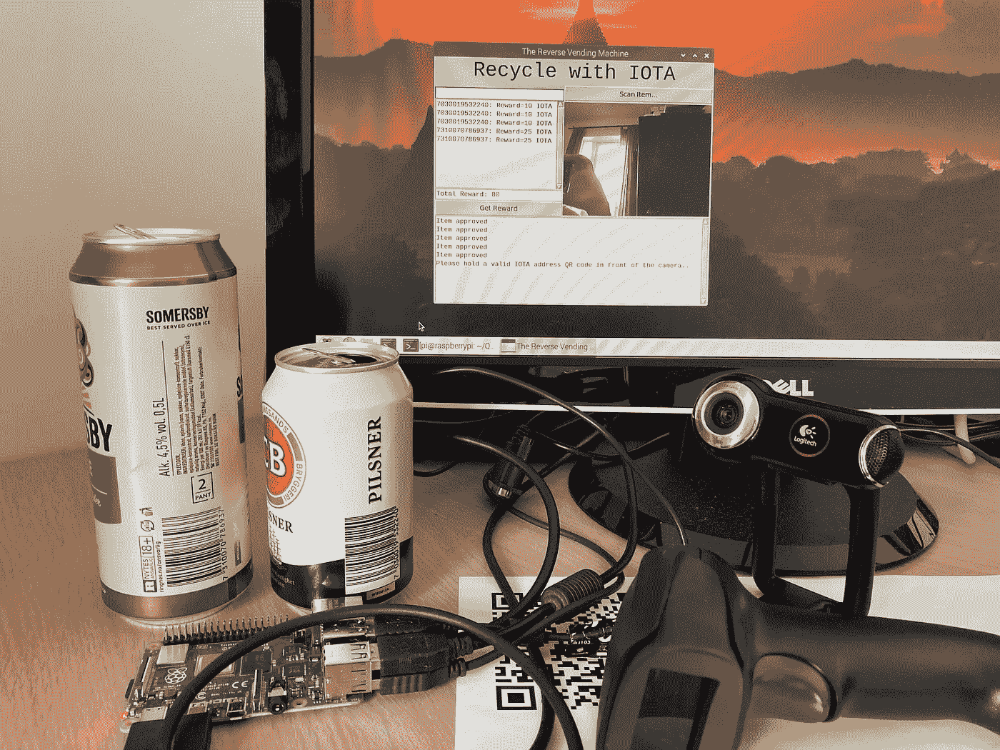
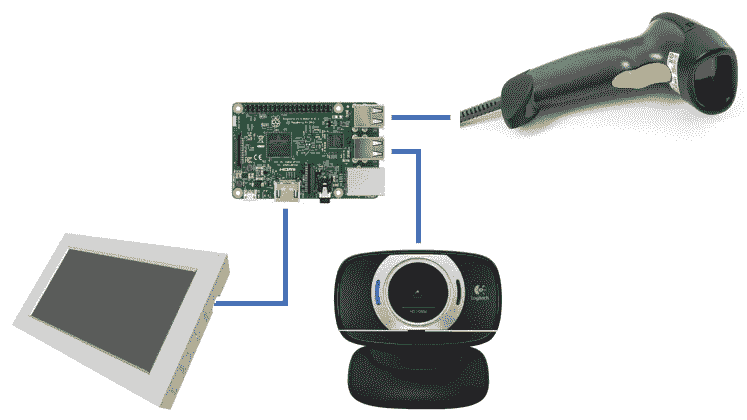
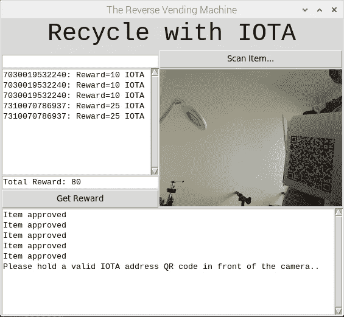
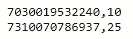
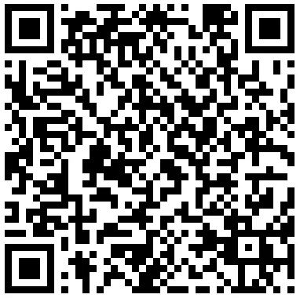

# 将物理设备与 IOTA 集成——反向自动售货机

> 原文：<https://medium.com/coinmonks/integrating-physical-devices-with-iota-the-reverse-vending-machine-14cb2de628fb?source=collection_archive---------4----------------------->

## 关于将物理设备与 IOTA 协议集成的初学者教程系列的第 17 部分。

# 介绍

这是初学者教程系列的第 17 部分，我们将探索如何将物理设备与 IOTA 协议集成在一起。在本教程中，我们将使用 Raspberry PI、触摸屏、摄像头和条形码扫描仪创建 IOTA 供电的反向自动售货机的基本功能。

*注意！
本教程不需要触摸显示屏和/或条形码扫描仪，因为您还可以选择使用传统的显示器、鼠标和键盘与 UI 进行交互。*

当我开始编写这个教程时，我最初的想法是做一些 IOTA 驱动的自动售货机。然而，我很快意识到，这样一台机器的主要功能将或多或少与我们在前四个教程中所做的项目相同；唯一不同的是，我们现在不得不触发某种机器人运动，而不是打开/关闭电源继电器。

在对这个问题思考了一会儿之后，我决定采用不同的想法..，如果我们采用之前的教程并颠倒用例会怎么样？结果将会是某种反向自动售货机。顾客不再为机器的服务付钱，而是由机器付钱给顾客。这肯定会带来一些新的挑战。

> [打折购买加密产品](https://coincodecap.com/deals)

# 使用案例

最近，我们酒店的老板注意到他的客人把空瓶子和空罐子丢在酒店和游泳池周围，却懒得捡起来扔进回收箱。他当然可以让他的员工做这件事，但他们通常忙于其他工作。

如果他能为他的客人清理自己的垃圾提供某种类型的激励或奖励呢？毕竟，这可能比雇佣一名新员工更便宜。

在思考这个问题一段时间后，他决定尝试一个他在其他地方看到实施的概念；一台奖励顾客回收的机器，换句话说:一台反向贩卖机。

为了实现这个想法，他觉得他的新“机器”应该满足一些基本要求:

1.  机器必须易于使用，顾客只需付出最少的努力。
2.  单个的瓶子和罐子应该根据它们的大小和类型给予不同的奖励。
3.  奖励应该用 IOTA 代币支付(毕竟，IOTA 是酒店 IOTA 的标准货币，并且可以在以后用于支付其他酒店服务)

# 这个概念

现在，让我们看看这个想法背后的基本概念以及它是如何工作的。

假设爱丽丝在酒店游泳池边经过漫长的一天后正在整理行李。

在她离开游泳池的路上，她拿着空瓶子/罐子，在出口旁边的回收站停了下来。

然后，她拿起安装在垃圾箱旁边的条形码扫描仪，扫描每个瓶子/罐子上的条形码，然后将其扔进垃圾箱。扫描仪旁边的一个小型液晶显示屏显示了每个单独项目的回收奖励以及总奖励。

扫描完所有商品后，她按下触摸屏上的“获取奖励”按钮。

然后，她拿起装有 Trinity 钱包的手机，生成一个新的接收方地址。

最后，她打开新地址的二维码，将手机放在扫描仪旁边的摄像头前。

一旦照相机检测到接收者地址(QR 码),就创建总回收奖励的 IOTA 支付交易，并将其发送到 Alice 的接收者地址。

Alice 现在可以在开放的 IOTA 市场上出售她的回收奖励，或者在酒店内外的其他 IOTA 支持的服务上花费它。

# 组件

接下来，让我们快速看一下这个项目中使用的硬件组件。

在这个项目中，我用的是我新买的树莓 PI 4，但是任何电脑基本上都可以工作。

**条形码扫描仪**
我在易趣上花了大约 14 美元买了这个 USB 连接的条形码扫描仪

在我的项目版本中，我最终使用了我放在身边的一个旧的罗技网络摄像头。您还可以使用 Raspberry PI 相机模块，对 Python 代码进行一些小的调整。

触摸显示屏我的计划是在这个项目中使用 7 英寸的触摸显示屏。然而，由于我没有任何微型 hdmi(从新的 RPI4)到标准 hdmi(在我的触摸显示器上)的电缆，我最终使用了普通的显示器和鼠标来与 UI 交互。稍后会详细介绍。

# 用户界面(UI)

正如本系列的第三篇教程一样，我决定在为客户构建一个简单的 UI 来与系统交互时使用 Python 和 Tkinter toolkit。

**以下是如何与 UI 交互的简要说明:**
对于每件可回收物品，将光标放在左上角的文本框中，扫描物品上打印的条形码(您也可以在文本框中手动输入条形码 ID)；然后按回车键或按“扫描项目…”按钮来注册项目。Python 脚本现在将检查在项目上找到的条形码是否存在于本地条形码数据库(barcodesdb.csv)中。如果找到条形码，该物品将与其相应的回收奖励值一起添加到物品列表中。随着更多物品添加到列表中，总回收奖励将显示在列表下方。注册完所有物品后，按“获取奖励”按钮。只要按下“获取奖励”按钮，摄像机就会被激活。现在，在摄像机前拿着 IOTA 奖励接收者地址的二维码。当摄像头检测到 QR 码时，将在后台执行奖励支付(请参见底部消息区域了解状态)。最后，UI 被重置，并为下一个客户做好准备。

*注意！
当我写这篇教程的时候，我还没有微型 HDMI 转标准 HDMI 电缆，当前 Tkinter UI 的布局是为普通 PC 显示器量身定制的。如果你想在更小尺寸的触摸显示器上实现 UI，请查看第三期教程* *作为指导。*

# 条形码数据库

在向回收物品列表添加新物品之前，我们首先需要检查该物品是否被批准回收。我们还需要获得每个单独项目的奖励值。为此，我们使用一个简单的查找表，以逗号分隔的文本文件(.csv)，其中第一个元素表示条形码 ID，第二个元素表示 IOTA 中的回收奖励

*注意！
在开始扫描瓶子或罐子之前，请确保更新 barcodesdb.csv 文件，以包含您计划通过应用程序回收的任何条形码 ID。您还需要包括每个条形码 ID 的奖励(在 IOTA 中)。*

# 所需的软件和库

接下来，让我们看看运行应用程序所需的软件和 Python 库。

最困难的部分可能是在你的机器上安装并运行 OpenCV。幸运的是，我找到了这篇关于如何在树莓 PI 4 上安装 OpenCV 的教程，作者是 Adrian Rosebrock。

使用 pip 剩下的部分应该非常简单。

[枕头](https://pypi.org/project/Pillow/)、 [imutils](https://pypi.org/project/imutils/) 、 [pyzbar](https://pypi.org/project/pyzbar/) 、 [PyOTA](https://pypi.org/project/PyOTA/) 、 [PyOTA-CCurl](https://pypi.org/project/PyOTA-CCurl/)

# Python 代码

我决定将这个项目的代码分成两个独立的 Python 文件。 **rvm_lib.py** 文件包含一个类，该类包含了 app 的主要功能。，而 **rvm_app.py** 文件用于启动 app。

除此之外，代码有很好的文档记录，所以我不会在这里包含更多的细节。

下面是 **rvm_app.py** 文件:

你可以从[这里](https://gist.github.com/huggre/2f4c7b181b221345fd7432edcc15056c)下载源代码

下面是 **rvm_lib.py** 文件:

你可以从[这里](https://gist.github.com/huggre/5815111ed70f5b0ed456ff5c979e3d4a)下载源代码

您还需要 barcodesdb.csv 文件，您可以在这里找到[和](https://gist.github.com/huggre/87ad61d5c8558729e80d4f6a447a7841)

# 运行项目

要运行该项目，首先需要将上一节中的 Python 和 barcodesdb.csv 文件保存到您的机器上。

接下来，用您计划在应用程序中使用的条形码 ID 更新 bacodesdb.csv 文件。

来执行应用程序。，只需启动一个新的终端窗口，导航到保存文件的文件夹，然后键入:

**python rvm_app.py**

现在，您应该可以在 LCD/监视器上看到 UI。

# 贡献

如果你想对本教程有所贡献，你可以在这里找到一个 Github 库

# 捐款

如果你喜欢这个教程，并希望我继续让其他人感到自由，使一个小的捐赠给下面的 IOTA 地址。

nyzbhovsmdwabxsacajttwjoqrvvawlbsfqvsjswwbjjlsqknzfc 9 xcrpqsvfqzpbjcjrannpvmmezqjrqsvvgz

> [直接在您的收件箱中获得最佳软件交易](https://coincodecap.com/?utm_source=coinmonks)

