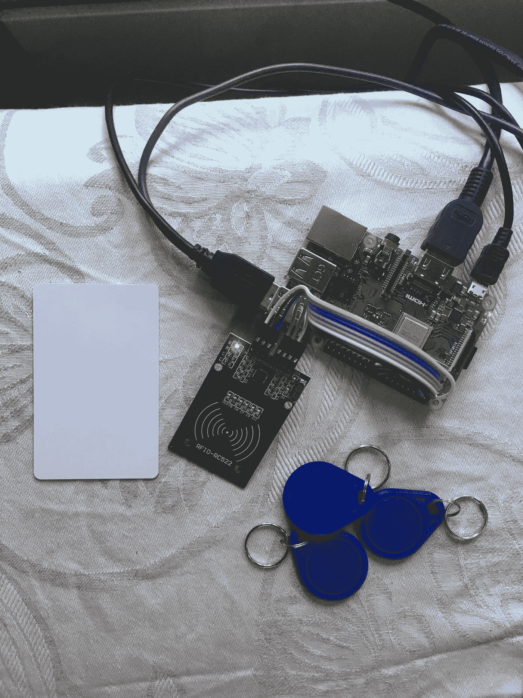
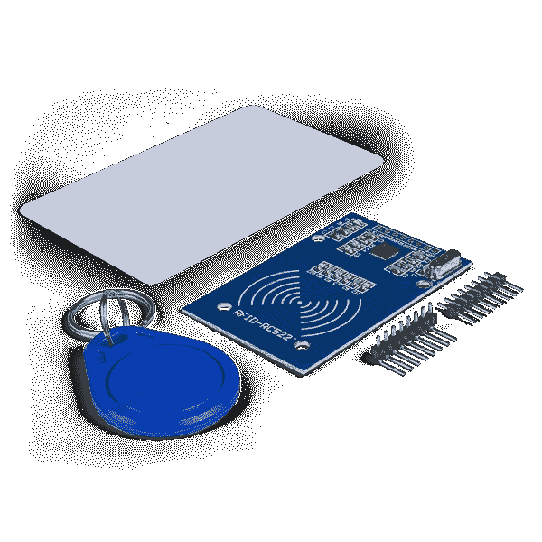
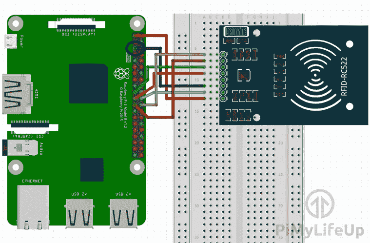
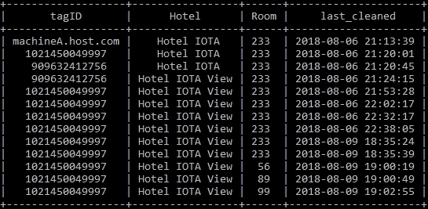

# 将物理设备与 IOTA 集成—将 RFID 与 IOTA 结合使用

> 原文：<https://medium.com/coinmonks/integrating-physical-devices-with-iota-using-rfid-with-iota-868c15e0a040?source=collection_archive---------2----------------------->

关于将物理设备与 IOTA 协议集成的初学者教程系列的第 5 部分。

# 介绍

这是初学者教程系列的第 5 部分，我们将探索如何将物理设备与 IOTA 协议相集成。在本教程中，我们将使用射频识别(RFID)读取器/写入器从 RFID 标签中捕获信息，这些信息将与 IOTA tangle 上的一些其他元数据一起存储。我们还将创建一个简单的报告，从 tangle 中检索相同的信息，并将其显示在监视器上。

本教程介绍了一个我们将在接下来的教程中探讨的新主题，即被称为事物的*同一性的概念。*

*注意！在我们继续之前，我想对我收到的所有捐款表示感谢。我被这种慷慨感动了，我想向你们所有人保证，这有助于我保持动力和专注。如果这个系列可以帮助任何人(尤其是孩子)开始接触电子、编程和 IOTA，那么我写这些教程的主要动机已经实现了。*

# 使用案例

现在，我们信任的酒店老板已经启动并运行了他的新冰箱付款系统，他想将注意力转移到另一个让他头疼的问题上。如今，他使用一个基于纸张的系统来跟踪酒店中每个房间是何时由谁为下一位客人打扫和准备的。他的基于纸张的系统的主要问题是，根据清洁记录何时被交给接待员，在房间被清洁的时间和它可以被提供给下一个客人的时间之间存在延迟。这些记录的另一个重要方面是，它们用于识别执行清洁任务的个人，以防与盗窃或工作未正确完成有关的任何争议。这些记录也用于支付他的清洁工的工资，因为每个人都是根据他们每月打扫的房间数来支付工资的。因此，清洁记录必须由正确的人签名，并且以后不能更改或篡改。此外，事实上，我们的酒店老板管理着多家酒店，共用一名清洁人员，这增加了复杂性，使所有这一切成为一场物流噩梦。

当他试图用数字系统取代基于纸张的系统时，他面临的第一个问题是，他的所有酒店都没有中央网络或数据库。每家酒店都是独立运营的，而他的清洁工则在他们之间轮换。第二个问题是如何快速方便地将所需信息输入新系统，用数字签名代替手写签名。清洁工不是电脑专家，所以操作起来必须简单。他需要解决的第三个问题是，接待员如何在他或她想要检查哪些房间已经打扫干净并可供新客人使用时检索清洁记录。

现在让我们看看我们是否能帮他找到解决这些问题的方法。让我们从第一个问题开始。

如果有一个无需许可，防篡改的全球数据库，任何人都可以免费使用，而无需维护服务器，网络基础设施，数据库和用户登录的麻烦，会怎么样？听起来好得难以置信，对吗？事实是，有这样一个数据库，它叫做 *The Tangle* 。

我们要解决的第二个问题是，在酒店的每一层楼放置一个与互联网相连的 Raspberry PI RFID 阅读器。清洁人员中的每个人都会获得一个唯一的 ID 卡(RFID 标签),每当该人在数据库中创建新记录时都会使用该 ID 卡。用数字签名替换手动签名。

我们要解决的第三个问题是创建一个简单的报告，接待员可以随时运行该报告来检查哪些房间已经打扫过了。该报告从缠结中检索清洁记录，并将其显示在接待处的监视器上。

那么，让我们开始吧…

# MFRC522

MFRC522 是一款低成本 RFID 读写器模块，工作频率为 13.56 Mhz。MFRC522 因其易用性和 Arduino/Raspberry PI 支持而在 tinker 社区广受欢迎。你可以花几美元从 ebay 或亚马逊上买到 MFRC522 模块。RFID 标签非常便宜(尤其是如果你大量购买的话),你可以买到钥匙圈或信用卡形状的标签。

# 关于射频识别(RFID)

在我们开始对 MFRC522 模块进行布线和编程之前，我们应该后退一步，看看 RFID 背后的技术及其工作原理。RFID 应用于各种行业，你可能每天都在使用它，甚至连想都没想过。比如你拿着员工 ID 卡在你的办公楼里开门的时候。RFID 使用由 RFID 读取器/写入器产生的电磁场来检测标签并与之通信。在标签内部有一个电线形式的小天线和一个携带标签标识和数据的小芯片。标签不需要电池，因为它由读取器/写入器在附近时产生的电磁场供电。这些 RFID 标签很酷的一点是，你不仅可以读取制造时硬编码到标签中的唯一 ID，还可以使用 MFRC522 模块将自己的数据存储到 RFID 芯片上。在本教程中，我们将着重于读取和使用标签的唯一 ID，但希望在未来的教程中，我们也将尝试向标签写入数据。敬请关注。

# 设置 MFRC522

我发现这个[关于连接和设置你的 MFRC522 与 Raspberry PI 的极好的教程](https://pimylifeup.com/raspberry-pi-rfid-rc522/)，我认为在这个教程中重复同样的步骤没有意义。这正是我们启动和运行 MFRC522 所需要的，因此非常感谢 Gus 编写本教程。

*注意！
我认为他的* [*教程*](https://pimylifeup.com/raspberry-pi-rfid-rc522/) *中的布线草图有一个小错误，因为草图指向了接地(GND)树莓上的 5 号引脚。正确的引脚应该是草图上方列表中的引脚 6。*

# 所需的软件和库

在我们开始为这个项目编写 Python 代码之前，我们需要确保在我们的 Raspberry PI 上安装了所有需要的软件和库。

遵循 Gus 的“[如何设置 Raspberry Pi RFID RC522 芯片](https://pimylifeup.com/raspberry-pi-rfid-rc522/)”教程，应负责安装启动 MFRC522 并使用 Python 运行所需的所有软件和库。我们现在需要安装的唯一附加库是用于与 IOTA tangle 通信的 [PyOTA 库](https://github.com/iotaledger/iota.lib.py)(如果您还没有安装的话)和我们的清理日志报告使用的 [PrettyTable](https://pypi.org/project/PrettyTable/) 库。

# Python 代码

我们这个项目的 Python 代码将由两部分组成。一部分是我们从清洁人员那里捕获信息，并以新事务的形式发送给 tangle。第二部分是我们从 tangle 中以清理日志报告的形式检索相同的信息，该报告可以由接待员运行。我们将在 tangle 上捕获的信息由以下四个元素组成:

1.  打扫房间的人的标签 ID。
2.  酒店的名字。
3.  被清理的房间号。
4.  打扫房间的日期/时间。

对于日期/时间元素，我们将使用事务发布到 tangle 时创建的事务时间戳。

我们将使用事务的消息元素以 json 数据格式存储关于 tangle 的信息。当我们稍后想要为清理日志报告检索相同的信息时，使用结构化的 json 数据格式会很方便。

下面的 Python 代码是我们从 RFID 阅读器捕获 tagID、酒店名称和房间号，并将其发送到 tangle 的部分。

你可以从[这里](https://gist.github.com/huggre/9f8fa49a6299b26ba1c49eddc3cafa04)下载源代码

接待员在检索和显示清理日志时会使用以下 Python 代码。

你可以从[这里](https://gist.github.com/huggre/62fed3834637738d186ce2fecd35c66f)下载源代码

运行该报告时，您应该会得到类似如下的结果。

The cleaning log example

# 运行项目

要运行项目的第一部分，首先需要将前一节中的代码作为文本文件保存在安装 SimpleMFRC522 库的同一文件夹中。

注意 Python 程序文件使用。py 扩展名，所以我们在树莓 PI 上把文件保存为***cleaning _ register . py***。

要执行该程序，只需启动一个新的终端窗口，导航到保存 *cleaning_register.py* 的文件夹，然后键入:

**python cleaning _ register . py**

现在，您应该可以在终端窗口中看到正在执行的代码。

该程序将首先显示一条欢迎消息，然后询问被清理的房间号。在用户输入房间号并按回车键后，程序将要求用户将他/她的 ID 卡靠近 RFID 阅读器。一旦 RFID 读取器检测到 ID 卡(RFID 标签)，它将读取存储在卡上的唯一 ID，并向 tangle 发送新的交易，包括作为交易消息的附加元数据。

一旦一个新的交易被发送到 tangle，你应该能够使用你最喜欢的 tangle 浏览器找到它，比如[thetangle.org](https://thetangle.org/)

该项目的第二部分可以在任何安装了 Python 和其他所需库的联网计算机上运行，即 [PyOTA](https://github.com/iotaledger/iota.lib.py) 和 [PrettyTable](https://pypi.org/project/PrettyTable/) 。

在电脑上保存文件为 **cleaning_log.py** ，输入 **python cleaning_log.py** 执行程序

执行程序后，你应该会看到清理日志显示在终端窗口中，列出了存储在 tangle 上的每个单独的清理记录。

*注意！确保在两个 Python 脚本中使用相同的 IOTA 地址，否则您将不会在日志中显示任何记录。*

# 下一步是什么？

你可以在这里[找到本系列下一个教程的链接](/coinmonks/integrating-physical-devices-with-iota-the-iota-debit-card-part-1-42dc1a05f18)

# 贡献

如果你想对本教程有所贡献，你可以在这里找到一个 Github 库

# 捐款

如果你喜欢这个教程，并希望我继续制作其他教程，请随时向下面显示的 IOTA 地址捐款。

nyzbhovsmdwabxsacajttwjoqrvvawlbsfqvsjswwbjjlsqknzfc 9 xcrpqsvfqzpbjcjrannpvmmezqjrqsvvgz