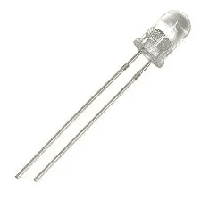
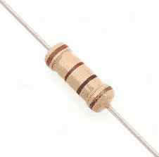

# 将物理设备与 IOTA 集成— WiFi 版

> 原文：<https://medium.com/coinmonks/integrating-physical-devices-with-iota-wifi-edition-9de749bc22f5?source=collection_archive---------3----------------------->

关于将物理设备与 IOTA 协议集成的初学者教程系列的第二部分。

# 介绍

这是初学者教程系列的第二部分，我们将探索如何将物理设备与 IOTA 协议集成在一起。在本教程中，我们基本上是在重现第一个教程中的用例。然而，这一次，我们将使用低成本的 WiFi 模块向继电器发送信号，而不是将我们的继电器模块硬连线到 Raspberry PI。

如果你还没有阅读本系列的[第一教程](/@hugogregersen/integrating-physical-devices-with-iota-83f4e00cc5bb)，你应该在继续之前阅读它，因为它反映了我们试图在第二教程中重现的相同的基本用例。

# 使用案例

现在，我们的前倾酒店老板已经安装了他的新 IOTA 驱动的冰箱支付系统，并按照[第一教程](/@hugogregersen/integrating-physical-devices-with-iota-83f4e00cc5bb)中的描述工作，他开始注意到一些使解决方案不太理想的问题。首先，为每台冰箱配备一个专用的树莓酱是非常昂贵的，因为每个树莓酱大约要 30-40 美元。其次，如果他想修改 Python 代码，或者甚至更改 IOTA 支付地址，他必须访问每个 PI 并逐个手动更新它们。

这些问题的一个解决方案是拥有一个多通道继电器，一个中央 Raspberry PI 作为所有冰箱的公共控制单元，如第一篇教程[所述。坏消息是，他将不得不在中央 PI 和酒店的每台冰箱之间提供物理布线。此外，根据他的 Raspberry PI 上可用的 GIO pin 的数量，他可以管理的冰箱(继电器)的数量也是有限的。](/@hugogregersen/integrating-physical-devices-with-iota-83f4e00cc5bb)

在为这个问题绞尽脑汁几天后，他想出了一个显而易见的解决办法；如果他可以使用某种类型的无线通信来打开/关闭继电器，同时让他的 Python 代码在中央服务器上运行以方便更新和维护，会怎么样？

幸运的是，这正是我们在第二节课要做的。

# 令人惊叹的 ESP8266

ESP8266 是一款低成本 WiFi 微芯片，具有完整的 TCP/IP 堆栈和微控制器功能，可以使用 Arduino IDE 进行编程。基于 ESP8266 芯片，已经开发了大量不同形状和大小的不同 WiFi 模块，并且现在可以以非常低的成本在市场上获得，一个例子是 ESP-01。带有内部可编程 IO 引脚的 ESP-01 非常适合简单的低成本 WiFi 项目。ESP8266 还能够运行自己的 web 服务器，我们将在本项目中使用该服务器与 WiFi 模块进行通信。

The ESP-01

请注意，您甚至可以获得集成了 ESP-01 的继电器模块，以实现紧凑安装和最少布线。

Relay module with integrated ESP-01

*注意！
如上所述，市场上有大量基于 ESP8266 芯片的不同 WiFi 模块，其中大多数可能同样适用于我们的项目。ESP-01 因其低成本和小外形而备受关注。但是，应该注意的是，ESP-01 没有集成的 USB 端口，用于将我们的 Arduino 代码/固件上传到微控制器。没有一个内置的 USB 端口使得这个初学者教程有点复杂(特别是没有 ESP-01 接口模块)。因此，而不是使用 ESP-01 我会使用我信任的 WeMos D1 无线板通过这个教程，因为它已经有一个内置的 USB 端口，电源插座等。使它基本上即插即用。*

The WeMos D1 WiFi board

# Arduino IDE

对 ESP8266 编程最简单的方法是使用 Arduino IDE。在 ide 中，您只需选择您拥有的 ESP8266 板的类型，就可以编译代码并上传到 MCU。Arduino IDE 中使用的编程语法是一种类似 C++的编程语言，用于在流行的 Arduino 原型和开发平台上进行编程。Arduino IDE 可以在这里免费下载[。要了解有关使用 Arduino IDE 配置和编程您的 ESP8266 板的更多信息，您应该查看特定 ESP8266 板附带的文档。](https://www.arduino.cc/en/Main/Software?)

# 成分

在这一节中，我们将看看构建项目所需的组件。假设你已经拥有一台能够运行 Pyhon 的电脑，你应该能够在大多数电子商店或 EBAY/AMAZON 上以低于 20 美元的价格获得它们。计算机将充当我们的中央控制单元，与 IOTA tangle 通信，并向我们的 ESP8266 WiFi 模块发送 HTTP 请求。如果你遵循了第一个教程[的话](/@hugogregersen/integrating-physical-devices-with-iota-83f4e00cc5bb)你可能还拥有一个树莓派，在这个教程中它可以作为中央电脑。

**启用 ESP8266 的 WiFi 模块**
启用 ESP8266 的 WiFi 模块用于无线通信，并使用其内置的 IO 引脚对我们的继电器进行开/关切换。市场上有许多 WiFi 模块的变体，其中任何一个都应该适用于我们的项目。我建议你选择一个有内置 USB 接口的模块，因为它会让你上传代码(arduino 草图)更容易。在本教程的其余部分，我将使用我的 WeMos D1 无线板。点击[此处](http://cyaninfinite.com/tutorials/getting-started-with-the-wemos-d1-esp8266-wifi-board/)了解更多关于使用带 Arduino IDE 的 WeMos D1 WiFi 板的信息。

The WeMos D1 WiFi board

**继电器**
继电器用于打开/关闭我们的电源电路，从而打开/关闭我们的设备(在这种情况下是 LED)。为了简化我们的电路，我们将使用一个继电器模块(屏蔽)，该模块内置了所有必需的组件、引脚和连接器。请注意，您可以购买带有多个继电器(通道)的模块，这些继电器可以单独打开/关闭。如前所述，这在需要管理多个设备的情况下非常有用。

**试验板**
试验板用于连接我们的电路，无需任何焊接，便于组装和拆卸。

**发光二极管(LED)**
LED 通电后会亮起，代表我们在这个项目中的物理设备(冰箱)。

**电阻器(330 欧姆)**
电阻器用于限制发送到我们 LED 的电流。如果没有电阻器，您可能会损坏 LED 和/或树莓 PI。您应该使用的电阻类型取决于 LED 的类型和您提供给电路的电压量。在我的情况下，我使用 9V 电池，所以 330 欧姆电阻应该没问题。我建议你根据你的项目版本中使用的元件来研究你应该使用什么类型的电阻。

**电池**
电池是用来给我们的电源电路提供电力的。在我的情况下，我使用 9V 电池。

电线我们还需要一些电线把它们连接起来。

**二维码**
如果您想使用 IOTA 移动钱包支付 LED，打印的 IOTA 支付地址二维码非常方便。使用 IOTA 钱包生成新地址或在[https://thetangle.org](https://thetangle.org)搜索现有地址时，您会发现一个二维码

**一台计算机**
一台能够运行 Python 的计算机，用于与 IOTA tangle 通信，并向我们的 WiFi 模块发送 HTTP 请求。你基本上可以使用任何联网的电脑，包括 Raspberry PI。

# 为项目布线

现在，让我们看看如何连接这个项目中使用的电路。

Wiring the project

按照以下方式连接电路:

1.  将 5 伏电压从 WeMos D1 连接到继电器模块上的 VCC 引脚。
2.  将 GND 从 WeMos D1 连接到继电器模块上的 GND 引脚。
3.  将 WeMos D1 上的 D14/SDA/D4 连接到继电器模块上的 IN(信号)引脚。
4.  将继电器模块上的 COM 端子连接到蓄电池的正极(+)。
5.  将继电器模块上的 NO 端子连接到 LED 的阳极(+)侧，中间有电阻器。
6.  将电池的负极(-)连接到 LED 的正极(-)侧。

*注意！
请注意 LED 上的两个引脚长度不同。短引脚代表 LED 的阴极(-)侧，长引脚代表阳极(+)侧。*

# 所需的软件和库

与我们在 Raspberry PI 上运行所有软件的第一个教程相反，我们现在需要将代码分成几个部分，在中央控制单元上运行一些 Python 代码，这些代码与 IOTA tangle 交互，并向我们的 WiFi 模块发送 HTTP 请求。我们还需要一些运行在 WiFi 模块上的 Arduino 代码，用于监听 HTTP 请求和处理 WiFi 模块上的 IO 引脚。

如果你还没有并且需要在中央电脑上安装 Python，你可以在这里找到:[https://www.python.org/downloads/](https://www.python.org/downloads/)

您还需要在中央计算机上安装 PyOTA API 库，这将允许我们使用 Python 编程语言访问 IOTA tangle。包含安装说明的 PyIOTA API 库可以在这里找到:[https://github.com/iotaledger/iota.lib.py](https://github.com/iotaledger/iota.lib.py)

为了使用 Python 发送 HTTP 请求，您还需要在中央计算机上安装 httplib2 库。带有安装说明的 httplib2 可以在这里找到:[https://github.com/httplib2/httplib2](https://github.com/httplib2/httplib2)

# Arduino 代码

首先，让我们看看将在我们的 ESP8266 WiFi 模块上运行的 Arduino 代码。这里发生的事情是，我们首先定义用于向继电器模块发送信号的引脚。其次，我们使用提供的 ssid 和密码连接到 WiFi 网络，因此**使用您的 WiFi 凭据更新代码很重要**。接下来，我们启动允许我们监听 HTTP 请求的 HTTP 服务器，最后我们开始监听传入的 HTTP 请求，相应地将中继引脚设置为高或低。

*注意！
在现实生活中，您可能希望为 WiFi 模块分配一个静态 IP 地址，防止它在断电等情况下获得新的 IP 地址。在本教程中，我不打算分配静态 IP 地址，只需注意，WiFi 模块使用的实际 IP 地址会在 Arduino 串行监视器中显示出来，这是在该模块加电或复位时显示的。记下这个 IP 地址，因为我们稍后将在 Python 代码中使用它。*

这个项目的 Arduino 源代码可以在[这里](https://gist.github.com/huggre/aed0baaef3dc7cf8dd80d925da2b8482)找到。

要将上述代码上传到您的 WiFi 模块，您首先必须安装 Arduino IDE，并确保您能够使用 USB 电缆与 WiFi 模块正确通信。我不会详细介绍如何使用 Arduino IDE 设置和配置您的主板，因为这因主板而异。我建议你面对与你的特定董事会相关的文件。当您的主板在 Arduino IDE 下正常工作时，您只需下载上面的代码，在 Arduino IDE 中打开代码，然后按下上传按钮。

# Python 代码

现在，让我们看看在我们的中央计算机上运行的 Python 代码。好消息是代码和我们在第一个教程中的代码差不多。唯一的区别是，我们现在向 WiFi 模块发送 HTTP 请求，让它负责打开/关闭中继，而不是将 Raspberry PI GIO 引脚设置为高或低。**确保使用 WiFi 模块的 IP 地址更新 url_on 和 url_off 变量。当启动或重置 WiFi 模块时，您会在 Arduino IDE 串行监视器中看到此 IP 地址。**

这个项目的 Python 源代码可以在[这里](https://gist.github.com/huggre/08090b9f5ad06707c91b2c0eeba990be)找到

# 运行项目

要运行该项目，您首先需要启动 WiFi 模块，以便它开始侦听来自中央计算机的 HTTP 请求。

其次，您需要在中央服务器上启动 Python 程序。

注意 Python 程序文件使用。py 扩展名，所以我们先把 Python 文件保存为***let _ there _ light _ wifi . py***在电脑上。

要执行该程序，只需启动一个新的终端窗口，导航到您保存*let _ there _ be _ light _ wifi . py*的文件夹，然后键入:

**python let _ there _ be _ light _ wifi . py**

现在，您应该可以在终端窗口中看到正在执行的代码，显示您当前的光余额，并每 10 秒钟检查一次 LED 的 IOTA 地址余额，以获得新的资金。

# 支付光

要打开 LED，您只需使用您最喜欢的 IOTA 钱包，并将一些 IOTA 转移到 LED 的 IOTA 地址。一旦 IOTA tangle 确认了交易，LED 就会亮起，并一直亮着，直到根据您传输的 IOTA 的数量，余额用完为止。在我的例子中，我将 1 秒钟的光的 IOTA/光比率设置为 1 IOTA。

*注意！
如果使用手机钱包支付电费，您可以考虑打印一个二维码，方便您随时扫描支付电费。*

# 下一步是什么？

你可以在这里找到这个系列下一个教程的链接

# 贡献

如果你想对本教程有所贡献，你可以在这里找到一个 Github 库

# 捐款

如果您喜欢本教程，并希望我继续制作其他教程，请随意向 Python 代码中使用的 IOTA 地址捐款。此外，在构建和测试您的项目版本时，请随意使用相同的 IOTA 地址，这样，每当我(和您)的 LED 灯亮起时，它都会很好地提醒我(我们)有人正在使用本教程。

nyzbhovsmdwabxsacajttwjoqrvvawlbsfqvsjswwbjjlsqknzfc 9 xcrpqsvfqzpbjcjrannpvmmezqjrqsvvgz