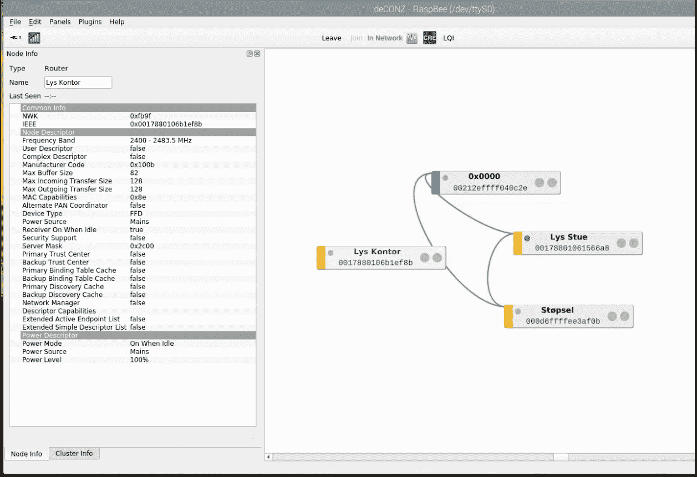
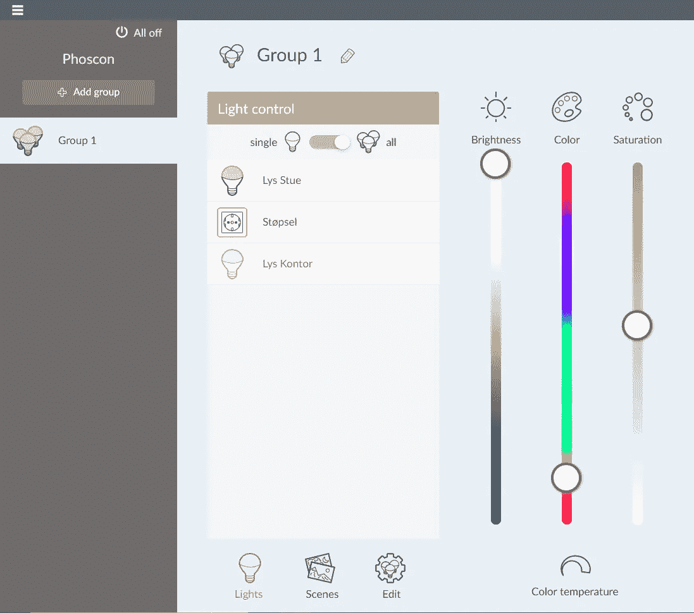
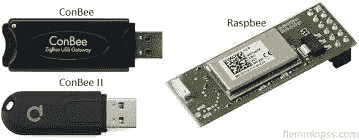

# 将物理设备与 IOTA 集成— Zigbee 版

> 原文：<https://medium.com/coinmonks/integrating-physical-devices-with-iota-zigbee-edition-49092cd8c0b9?source=collection_archive---------1----------------------->

## 关于将物理设备与 [IOTA](https://medium.com/coinmonks/iota/home) 协议集成的初学者系列教程的第 15 部分

# 介绍

这是初学者系列教程的第 15 部分，我们将探索如何将物理设备与 [IOTA 协议](https://medium.com/coinmonks/iota/home)集成在一起。正如[之前教程](/coinmonks/integrating-physical-devices-with-iota-philips-hue-edition-19eec4f28ef6)中承诺的；这一次，我们没有将我们的 IOTA 支付系统集成到专有的闭源 Phillips Hue 系统之上，而是将同样的想法应用到开源 Zigbee 硬件和软件平台之上。

*注意！
请注意，Phillips Hue 系统也是基于 Zigbee 协议的，因此您可能已经拥有的任何色调设备都应该可以很好地使用本教程。*

*注意！
我建议您先浏览本系列的* [*第一篇*](/coinmonks/integrating-physical-devices-with-iota-83f4e00cc5bb) *和* [*第十四篇*](/coinmonks/integrating-physical-devices-with-iota-philips-hue-edition-19eec4f28ef6) *教程，然后再继续，因为它们将为一般用例提供一些额外的上下文，以及我们在本教程中试图完成的内容。*

# 使用案例

那么，正如我们在[之前的教程](/coinmonks/integrating-physical-devices-with-iota-philips-hue-edition-19eec4f28ef6)中所讨论的那样，为什么我们的酒店老板想要在开源 Zigbee 协议和闭源 Phillips Hue 系统之上实现他的 IOTA 支付系统呢？嗯，我认为有几个原因:

1.  灵活性他不再局限于只使用飞利浦的智能设备。他现在可以从任何供应商那里购买并组合任何支持 Zigbee 的智能设备，比如广受欢迎的[宜家 DFRI tra](https://www.ikea.com/gb/en/cat/smart-lighting-36812/)
2.  与其他供应商相比，Phillips Hue 设备相当昂贵。
3.  简单性 I
    他不再需要单独的色相桥，因为他的本地网络中的任何计算机都可以充当这个桥(在我的例子中，我使用的是带有缺陷 HDMI 输出的旧 Raspberry PI)
4.  Simplicity II
    不再需要运行 IOTA Python 代码的独立计算机，因为他现在可以使用他现有的桥计算机。
5.  定制
    本教程中使用的所有软件都是开源的，可以定制并适应他的特定用例。

# 关于 deCONZ

[deCONZ](https://phoscon.de/en/conbee/software#deconz) 是开源的，可以免费使用运行在桥计算机上的“桥”软件。 [deCONZ](https://phoscon.de/en/conbee/software#deconz) 作为新 Zigbee 网络的通信中枢，提供 Zigbee 设备和连接的图形概览。 [deCONZ](https://phoscon.de/en/conbee/software#deconz) 还提供了一个 REST API，我们将使用 Python 来控制我们的单个 Zigbee 设备。

# 关于 Phoscon

[Phoscon](https://phoscon.de/en/conbee/software#phoscon-app) 是 deCONZ 附带的基于网络的用户界面。 [Phoscon](https://phoscon.de/en/conbee/software#phoscon-app) 是一个用户友好的 UI，用于管理您的单个 Zigbee 设备、分组设备、管理场景等。

# 组件

除了桥接计算机本身，我们还需要一个能够通过 Zigbee 协议进行通信的硬件模块(网关)。

目前有两种替代硬件模块与 deCONZ 兼容。用于树莓派的 [RaspBee 网关](https://phoscon.de/en/raspbee)和 [ConBee 通用 USB 网关](https://phoscon.de/en/conbee2/)。你应该可以在亚马逊或易趣上花 40 美元左右买到它们。

*注意！在我的项目版本中，我使用的是 RaspBee 模块。然而，我想 ConBee USB 网关更灵活，因为它可以用于任何支持 USB 的计算机，包括树莓 PI。*

*注意！
rasp bee 模块具有非常小的外形尺寸，适合大多数标准 PI 外壳。*

# 安装 RaspBee/ConBee、deCONZ 和 Phoscon

当我第一次收到我的 RaspBee 模块时，我试着使用模块附带的安装指南来设置它。这不是一次非常愉快的经历，因为文档非常糟糕而且已经过时。在为设置奋斗了一段时间后，我在他的博客上看到了*弗莱明*发布的教程。使用这个优秀的教程，我在几分钟内就完成了所有的工作。

*注意！
如果使用 Raspberry PI 作为桥接计算机，我强烈建议您忽略 ConBee/RaspBee 附带的安装指南，而使用 flemmings 教程。这将为你节省大量的时间和挫折。*

*注意！
你会在这里* 找到树莓派 [*的 RaspBee SD 卡图片的附加版本*](https://phoscon.de/en/conbee/sdcard)

# 将 IOTA 地址分配给 Zigbee 设备

一旦你用 deCONZ 安装并运行了所有的 Zigbee 设备。下一步是为每个设备分配一个唯一的支付地址。创建新地址(包括二维码)的最简单方法是使用 Trinity 钱包。记下每个地址，因为我们稍后会在 Python 脚本中用到它们。

接下来，在一张纸上打印每个地址的二维码，并将其贴在或放在各自的物理 Zigbee 设备旁边。

# 所需的软件和库

在我们继续这个项目的 Python 代码之前，我们需要确保安装了所有需要的依赖项和库。在我的设置中，桥接计算机还将运行 Python 代码，该代码与 IOTA tangle 和 deCONZ REST API 进行交互。这意味着必须在桥接计算机上安装以下额外的 Python 库:

[PyOTA 库](https://github.com/iotaledger/iota.py)，Python [json 库](https://pypi.org/project/jsonlib/)和 Python [请求库](https://pypi.org/project/requests/)。

# 代码

现在我们已经做好了所有的准备，让我们来看看这个项目的 Python 代码。

我们在这个项目中使用的 Python 脚本基本上和我们在第一个教程中使用的一样，只是做了一些小的调整。请注意，这里不再有对 Raspberry PI GPIO 引脚或库的任何引用，这意味着我们现在可以从本地网络内的任何计算机上运行 Python 脚本。

Python 脚本基本上每 10 秒检查一次每个 IOTA 地址(在前面的步骤中创建)的余额。当新的资金被添加到一个地址时，该脚本只需使用一个 deCONZ REST API 调用来打开与之关联的 deCONZ 设备。久而久之，脚本不断地从本地设备余额中删除时间，当余额为空时关闭设备(再次使用 API 调用)。

*重要！
查看* [*deCONZ REST API —入门*](https://dresden-elektronik.github.io/deconz-rest-doc/getting_started/) *页面，了解有关获取 deCONZ* ***API 密钥*** *以及解锁 deCONZ 网关以接受传入 API 请求的更多信息。*

*注意！
注意，当打开/关闭设备时，我们需要通过 API 调用提供设备 ID。查看* [*deCONZ REST API —入门*](https://dresden-elektronik.github.io/deconz-rest-doc/getting_started/) *页面，了解如何获取 Zigbee 网络中每个设备的设备 ID 的更多信息。*

这是我们的 Python 脚本，用于检查 IOTA tangle 上的平衡以及打开/关闭各个 Zigbee 设备。

你可以从[这里](https://gist.github.com/huggre/0b69ee1242e5a4a2b018afdafc1388d0)下载这个脚本

# 运行项目

要运行该项目，首先需要将上一节中的脚本作为文本文件保存在您的计算机上。

注意 Python 程序文件使用。py 扩展名，所以我们将文件保存为***pay _ the _ light _ ZigBee _ dev 2 . py***
*(_ dev 2 . py*引用由脚本控制的特定 deCONZ 设备 id)

接下来，我们需要对脚本做一些小的调整:

1.  将 IOTA 付款地址替换为您在本教程前面为该特定设备 id 创建的地址。
2.  根据所针对的特定 deCONZ 设备更新 device_id 变量(除非 id=2，否则无需更改)

要执行该脚本，只需启动一个新的终端窗口，导航到保存*pay _ the _ light _ ZigBee _ dev 2 . py*的文件夹，然后键入:

**python pay _ the _ light _ ZigBee _ dev 2 . py**

现在，您应该可以在您的终端窗口中看到正在执行的代码，显示设备 2 的当前余额，并每 10 秒钟检查一次设备的 IOTA 地址余额以获取新资金。

# 支付光

要打开特定的 Zigbee 设备，只需拿起装有 Trinity wallet 的手机，扫描设备的相关 QR 码，并将一些 IOTA 传输到其 IOTA 地址。一旦 IOTA tangle 确认了交易，设备就会打开并保持打开状态，直到余额变空，这取决于您传输的 IOTA 的数量。在我的示例中，我将 IOTA/设备时间比率设置为 1 IOTA，服务时间为 1 秒。

# 管理多个 Zigbee 设备

如果你看一下本教程的 Python 脚本，你会注意到脚本本身并不是为同时管理多个 Zigbee 设备而准备的。我想处理这个问题的适当方法是重新编写代码，以包含某种类型的设备列表或数组，从而允许我们并行管理多个设备。另一种选择当然是(正如我所做的)简单地让多个 Python 实例同时运行。每个实例使用其自己的设备 id/IOTA 地址运行其自己的脚本。

如果您想接受重新编写脚本以并行支持多个设备的挑战，请随时在下面的 github 资源库中提出 pull 请求。

# 贡献

如果你想对本教程有所贡献，你可以在这里找到一个 Github 库

# 下一步是什么？

在下一篇教程中，我想我们可以研究一个完全不同的主题，即使用 IOTA 和 IOTA Tangle 在供应链环境中跟踪和追踪货物。在这里，我们将玩条形码和条形码扫描器。敬请关注。

# 捐款

如果你喜欢这个教程，并希望我继续让其他人感到自由，使一个小的捐赠给下面的 IOTA 地址。

nyzbhovsmdwabxsacajttwjoqrvvawlbsfqvsjswwbjjlsqknzfc 9 xcrpqsvfqzpbjcjrannpvmmezqjrqsvvgz

> [在您的收件箱中直接获得最佳软件交易](https://coincodecap.com/?utm_source=coinmonks)

