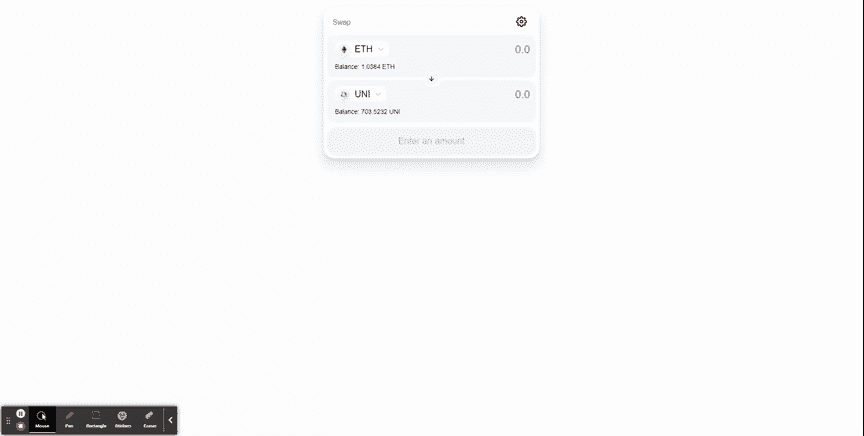

# 使用 1 个配置对象将 uniswap 集成到您的 dApp 中

> 原文：<https://medium.com/coinmonks/integration-uniswap-into-your-dapp-with-1-config-object-f7a0be6e72c6?source=collection_archive---------5----------------------->

由 uniswap grants 资助，目的是让您在不到 2 分钟的时间内启动并运行 uniswap，但给你完全的定制，使其成为你自己的，支持任何你想要的令牌，菲亚特价格更新，自动平衡处理，新交易的推送通知，在每个新的街区检查以确保用户得到最好的价格，改变主题颜色，支持任何有以太坊提供商的钱包等等，这都取决于你。支持所有主要的前端框架，angular，react 和 vue，所以你不必做繁重的工作。

在你的 dApp 中集成 uniswap 应该是一件简单的事情，但是对于所有复杂的事情，包括使它工作、管理交易状态、调用正确的交换方法、维护用户的余额、同步菲亚特价格、生成令牌图标、处理所有 UI 支持所有浏览器，我可以继续下去。最重要的是，你真的不想弹出一个窗口让用户使用 uniswap 小部件进行交换，你想保持用户体验与你的 dApp 一致。您应该只需几行代码就能集成 uniswap，就像您集成 google tag manager 或大多数 web2.0 软件一样。这就是 uniswap-dApp-integration 解决的问题。

# 特征

🚀用几行代码将其集成到您现有的 dApp 中

🚀同时支持 uniswap v2 和 v3 价格，并返回最佳价格

🚀查询所有最佳路线并为您找到最优惠的价格

🚀反应逻辑，所以当价格变动或交易到期时，它会为您生成一个新的交易，但会提醒用户(在每个新的交易块上查询新的交易)

🚀反应菲亚特价格，让用户可以看到在菲亚特的交易量，这也随着价格的变化而更新

🚀反应式平衡同步，因此用户可以随时看到他们的正确平衡(在每个新块上同步)

🚀支持所有主流浏览器

🚀反应灵敏

🚀完全可定制，你想要的风格，支持你想要的任何令牌，等等

🚀对所有 uni WAP 链上逻辑使用令人敬畏的[simple-uni WAP-SDK](https://github.com/uniswap-integration/simple-uniswap-sdk)

🚀完全生成的类型支持完全的类型脚本

🚀还有更多！！

在我向您介绍如何开始之前，我想解决 uniswap 对这篇文章的一些反弹，这篇文章是关于限制访问少量令牌的[https://uniswap.org/blog/token-access-app/](https://uniswap.org/blog/token-access-app/)。这个项目是由 uniswap 自己资助的，它允许你用几行代码来支持你想要的任何令牌。uni WAP 协议是无许可的，但是 FE 可以显示和隐藏 uni WAP 认为不是安全令牌的内容，因为它们应该能够保护其域和最终用户免受威胁和不良行为者的侵害。uniswap 的大部分流量来自其他平台。这个包只是呼应了 uniswap 代表无许可、自治和不可变的协议。允许您构建自己的 UI，支持您想要的任何令牌。这就是 DEFI 的全部意义，对吗？我们应该努力让许多客户端接口都做他们需要/想要支持的事情。我希望这个包有助于实现这一愿景。

现在回到有趣的部分！

# 入门指南

我要展示的所有代码都在 react 中，但我们有 angular、vue 和 react 包，它们都遵循相同的结构。

要开始使用 react 应用程序，如果您想从头开始，请使用以下代码安装一个样板 react 应用程序:

```
npx create-react-app my-app --template typescript
```

然后，您需要通过执行以下操作来安装 uni WAP-react 及其对等依赖项 uni WAP-dApp-integration-shared:

```
npm install uniswap-react uniswap-dapp-integration-shared
```

现在只需创建一个新的配置实例，然后将它传递给组件。下面的代码有一些额外的代码行，显示了与 MetaMask 的集成。

就这样，运行 react 应用程序，安装 MetaMask，您会看到客户端加载。现场试玩是[在这里](https://uniswap-dapp-integration.netlify.app/)去看看吧。下面是一个小的 gif 显示了现在已经产生了什么，我在 rinkeby 上做的交换只是为了向你展示交易交换。如前所述，上面的现场演示正是我用来记录下面的 gif。



我上面的配置很简单，你可以在这里查看所有的配置设置。你可以传入任何你想要的令牌，只要它有一个池，它就不会被阻塞。您可以传入主题颜色，可以传入不在 trust wallet repo 中的令牌资产的自定义令牌，可以传入任何以太坊提供商。在本例中，我们仅使用 MetaMask，但它可用于任何大型钱包。您可以根据自己的需要对其进行多或少的定制。

[**角包**](https://github.com/uniswap-integration/uniswap-dapp-integration-monorepo/tree/master/angular)

[**反应过来包**](https://github.com/uniswap-integration/uniswap-dapp-integration-monorepo/tree/master/react-package)

[**Vue 包**](https://github.com/uniswap-integration/uniswap-dapp-integration-monorepo/tree/master/vue)

我们对 PRs 或您希望看到支持的其他前端框架的请求持开放态度。你也可以安装共享的 monorepo 并构建你自己的接口，你可以在这里找到。

所有的 onchain uniswap 逻辑都由我们支持的另一个包 simple-uniswap-sdk 提供支持。

我们袖手旁观是一个开放的网站，我希望这个工具能帮助你节省时间，并建立更棒的东西。

尽情享受吧！！！

又及:刚刚开始推特给我一个关注[https://twitter.com/devjoshstevens](https://twitter.com/devjoshstevens)