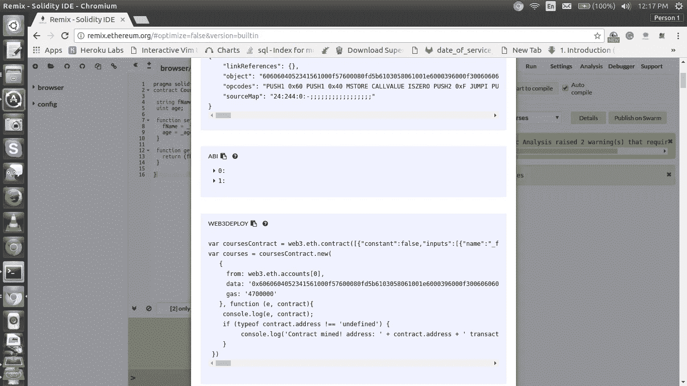

# 通过 Web3.js 与以太坊智能合约交互

> 原文：<https://medium.com/coinmonks/interacting-with-ethereum-smart-contracts-through-web3-js-e0efad17977?source=collection_archive---------0----------------------->


# 智能合同

智能合同是自动执行的合同，买卖双方的协议条款直接写入代码行。守则和其中包含的协议存在于一个分散的区块链网络中。智能合同使个人能够以可信、无冲突的方式交换数据，而不依赖于第三方，如银行、律师或公证人。这些智能合同存储在[以太坊区块链](https://blog.coincodecap.com/tag/ethereum/)上，因此需要像常规交易一样进行验证或挖掘。以太坊智能合约存储为可用于构建应用程序的特殊交易。用智能合同专用编程语言编写的合同被编译成“字节码”，
，一种叫做“以太坊虚拟机”(EVM)的功能可以读取和执行。

**Solidity** 是你可以用来编写实际的[智能合约](https://blog.coincodecap.com/tag/smart-contact/)的语言。语法非常类似于 JavaScript，它是在考虑以太坊虚拟机的情况下设计的。Solidity 是静态类型的，支持继承、库并包含复杂的用户定义类型。

> [发现并回顾最佳以太坊产品](https://coincodecap.com)

**solidity 中的数据类型**

hash: 256 位、32 字节的数据块，可编入字节索引，可通过位运算操作。
uint: 256 位无符号整数，可进行按位和无符号算术运算。
int: 256 位有符号整数，可进行按位和有符号算术运算。
string32:以零结尾的 ASCII 字符串，最大长度 32 字节(256 位)。
地址:账户标识符，类似于 160 位哈希类型。
bool:双态值。

**固体中的可见性**

公共—所有
私有—只有此合同
内部—只有此合同及其派生的合同
外部—不能在内部访问，只能在外部访问。

solidiy 程序可以在本地机器上执行，或者使用一个叫做 **remix** 的在线 IDE。对于这篇博文，我们将使用在线编辑器。

您可以在以下位置找到 remix ide

 [## 混合可靠性集成开发环境

### 编辑描述

remix.ethereum.org](https://remix.ethereum.org/) 

智能合约有点像 API。这篇博客的目的是展示智能合约如何与 web UI 交互。

为了简洁起见，我将使用一个非常小的智能契约。

*courses.sol*

```
pragma solidity ^0.4.0;contract Courses {

 string fName;
 uint age;

 function setInstructor(string _fName, uint _age) public {
   fName = _fName;
   age = _age;
 }

 function getInstructor() public constant returns (string, uint) {
   return (fName, age);
 }

}
```

该代码包含一个 getter 方法和一个 setter 方法。 **setInstructor** 方法设置变量 fName 和 age 的值。并且 **getInstructor** 检索这些值。

这个程序可以使用 remix 的 **Javascript VM** 环境编译和执行。但是为了给这个程序附加一个 web UI，我们必须使用一个 web3 提供者。


现在，我们将安装 Ganache CLI 和 Web3.js 来创建一个简单的用户界面，允许我们与以太坊智能合约进行交互。

# 安装和运行 Ganache CLI

以前被称为 **TestRPC** 的 Ganache CLI 使用 ethereumjs 来模拟完整的客户端行为，并使开发以太坊应用程序更快、更容易、更安全。它还包括所有流行的 RPC 函数和特性，如事件，并且可以确定性地运行，使开发变得轻而易举。因为它是基于 Node.js 的，所以我们需要 Node.js 和 NPM(节点包管理器)一起安装来安装 Ganache CLI。

在安装 Ganache CLI 之前，使用以下命令确保节点和 npm 版本是最新的，

```
node -v
npm -v
```

可以使用以下命令安装 Ganache CLI

```
npm install -g ganache-cli
```

完成后，运行以下命令启动它:

```
ganache-cli
```

运行 ganache-cli 有很多选项，可以参考他们的 Github 页面。

这为您提供了 10 个不同的帐户和私钥，以及一个位于 **localhost:8545** 的本地服务器。

# 安装 Web3.js

web3.js 库是官方的以太坊 Javascript API。它用于与以太坊智能合约进行交互。它是包含以太坊生态系统特定功能的模块集合。

创建一个新目录并切换到该目录。

接下来，运行 npm init 命令创建 package.json 文件，该文件将存储项目依赖项:

```
npm init
```

使用以下命令安装 web3.js

```
npm install ethereum/web3.js — save
```

切换到 Remix IDE，单击 Run 选项卡，然后将环境下拉列表从 Javascript VM 更改为 **Web3 Provider。**

点击“OK”，然后指定 testrpc/ganache-cli 本地主机地址(默认情况下，它是 [http://localhost:8545](http://localhost:8545/) )

现在，我们不再在 Javascript VM 中部署和测试，而是在您的计算机上使用 Ganache CLI 客户端。

# 使用 Web 用户界面与智能合同交互

下一部分是使用 HTML、javascript 和 CSS 为我们的智能合约创建一个简单的 UI 页面。UI 将使用两个输入字段接受教师的姓名和年龄，并在文本字段中显示这些数据。

> *index.html*

```
<!DOCTYPE html>
<html lang=”en”>
<head>
 <meta charset=”UTF-8">
 <meta name=”viewport” content=”width=device-width, initial-scale=1.0">
 <meta http-equiv=”X-UA-Compatible” content=”ie=edge”>
 <title>Document</title><link rel=”stylesheet” type=”text/css” href=”index.css”><script src=”./node_modules/web3/dist/web3.min.js”></script></head>
<body>
 <div class=”container”><h1>First Smart Contract</h1><h2 id=”instructor”></h2><label for=”name” class=”col-lg-2 control-label”>Instructor Name</label>
 <input id=”name” type=”text”><label for=”name” class=”col-lg-2 control-label”>Instructor Age</label>
 <input id=”age” type=”text”><button id=”button”>Update Instructor</button></div><script src=”[https://code.jquery.com/jquery-3.2.1.slim.min.js](https://code.jquery.com/jquery-3.2.1.slim.min.js)"></script><script>
 // future code goes here
 </script></body>
</html>
```

和一个简单的 CSS 文件

> *index.css*

```
body {
 background-color:#F0F0F0;
 padding: 2em;
 font-family: ‘Raleway’,’Source Sans Pro’, ‘Arial’;
}
.container {
 width: 50%;
 margin: 0 auto;
}
label {
 display:block;
 margin-bottom:10px;
}
input {
 padding:10px;
 width: 50%;
 margin-bottom: 1em;
}
button {
 margin: 2em 0;
 padding: 1em 4em;
 display:block;
}#instructor {
 padding:1em;
 background-color:#fff;
 margin: 1em 0;
}
```

Web3.js 库已经存在于 head 标记中，我们可以将它连接到 testrpc/ganache-cli 客户端。

以下所有代码都应该出现在 index.html 的脚本标记中

```
if (typeof web3 !== ‘undefined’) 
{
 web3 = new Web3(web3.currentProvider);
 } 
else 
{
 // set the provider you want from Web3.providers
web3 = new Web3(new Web3.providers.HttpProvider(“[http://localhost:8545](http://localhost:8545/)”));
 }
```

如果 web3 没有被定义，我们将使用当前的提供者。这适用于我们使用 chrome 扩展如 meta-mask 或者使用以太坊浏览器如 Mist 的情况。如果没有定义，我们可以自己手动指定提供者(这就是我们的 ganache-cli/testrpc)。

现在我们必须指定 web3 默认帐户。这可以通过 **web3.eth.defaultAccount** 方法来实现

```
web3.eth.defaultAccount = web3.eth.accounts[0];
```

这里我们使用的是 ganache-cli 提供的 10 个帐户中的第一个。

接下来，我们需要使用 **web3.eth.contract()** 方法来初始化(或创建)地址契约。它接受一个参数，称为 **ABI(应用程序二进制接口)。**

ABI 是两个程序模块之间的接口，其中一个通常位于机器代码级别。该接口实际上是将数据编码/解码为机器代码的方法。在以太坊中，基本上就是如何对 EVM 的可靠性合约调用进行编码，以及如何从交易中读取数据

ABI 可以通过点击编译标签和点击详细信息从 remix 获得。向下滚动并复制界面-ABI 的内容。这应该作为 web3.eth.contract()的参数传递。



ABI in details

```
var CoursesContract = web3.eth.contract(PASTE ABI HERE!);
```

现在我们已经创建了一个可变的 CoursesContract，它是与我们的合同进行交互的接口。

下一步是指定合同的地址。通过点击 remix 中的 **Run** 创建智能合同后，该地址可用。


Address after creation

```
var Courses = CoursesContract.at('PASTE CONTRACT ADDRESS HERE');
```


console

如果我们在浏览器中检查控制台的页面，我们可以看到`Courses`变量可以用来调用契约的函数，就像

```
Courses.setInstructor(‘Stephen Hawking’, 76)
```

或者

```
Courses.getInstructor()
```

通过使用 javascript 和 jquery 调用这些函数，可以在我们的 web 页面中使用它们。

```
$(“#button”).click(function() {
 Courses.setInstructor($(“#name”).val(), $(“#age”).val());
});
```

这里，我们使用 setInstructor 函数将字段、姓名和年龄的内容传递给智能合同。

```
Courses.getInstructor(function(error, result){
  if(!error){
    $(“#instructor”).html(result[0]+’ (‘+result[1]+’ years old)’);
    console.log(result);
    }
 else
   console.error(error);
 });
```

此函数调用将通过使用 getInstructor 函数从智能联系人获取数据，在 UI 的文本字段中显示教师的姓名和年龄。


现在，如果我们检查 remix 中的值，我们将得到


完美！！

这是一个非常简单的例子，说明了我们如何与智能合约进行交互，并且只能在本地环境中进行检查。应该做进一步的研究来研究实际环境中的相互作用。希望这有助于理解一些基本概念。

请查看以下链接。

 [## 坚固性-坚固性 0.4.21 文件

### Solidity 是一种面向契约的高级语言，用于实现智能契约。它受到了 C++，Python…

solidity.readthedocs.io](https://solidity.readthedocs.io/en/v0.4.21/) [](https://github.com/trufflesuite/ganache-cli) [## trufflesuite/ganache-cli

### 用于测试和开发的快速以太坊 RPC 客户端

github.com](https://github.com/trufflesuite/ganache-cli)  [## 欢迎阅读 Docs - web3.js 最新文档

### 编辑描述

web3js.readthedocs.i](https://web3js.readthedocs.io/en/latest/) 

[https://coursetro . com/posts/code/99/interactive-with-a-Smart-Contract-through-web 3 . js-(教程)](https://coursetro.com/posts/code/99/Interacting-with-a-Smart-Contract-through-Web3.js-(Tutorial))

> 加入 Coinmonks [电报频道](https://t.me/coincodecap)和 [Youtube 频道](https://www.youtube.com/c/coinmonks/videos)获取每日[加密新闻](http://coincodecap.com/)

## 另外，阅读

*   [密码电报信号](http://Top 4 Telegram Channels for Crypto Traders) | [密码交易机器人](/coinmonks/crypto-trading-bot-c2ffce8acb2a)
*   [复制交易](/coinmonks/top-10-crypto-copy-trading-platforms-for-beginners-d0c37c7d698c) | [加密税务软件](/coinmonks/crypto-tax-software-ed4b4810e338)
*   [网格交易](https://coincodecap.com/grid-trading) | [加密硬件钱包](/coinmonks/the-best-cryptocurrency-hardware-wallets-of-2020-e28b1c124069)
*   [印度的加密交易所](/coinmonks/crypto-exchange-dd2f9d6f3769) | [印度的加密应用](/coinmonks/buy-bitcoin-in-india-feb50ddfef94)
*   开发人员的最佳加密 API
*   最佳[加密借贷平台](/coinmonks/top-5-crypto-lending-platforms-in-2020-that-you-need-to-know-a1b675cec3fa)
*   杠杆代币的终极指南
*   [8 大加密附属计划](https://coincodecap.com/crypto-affiliate-programs) | [eToro vs 比特币基地](https://coincodecap.com/etoro-vs-coinbase)
*   [币安期货交易](https://coincodecap.com/binance-futures-trading)|[3 commas vs Mudrex vs eToro](https://coincodecap.com/mudrex-3commas-etoro)
*   [如何购买 Monero](https://coincodecap.com/buy-monero) | [IDEX 评论](https://coincodecap.com/idex-review) | [BitKan 交易机器人](https://coincodecap.com/bitkan-trading-bot)
*   [YouHodler vs CoinLoan vs Hodlnaut](/coinmonks/youhodler-vs-coinloan-vs-hodlnaut-b1050acde55a) |[Cryptohopper vs HaasBot](https://coincodecap.com/cryptohopper-vs-haasbot)