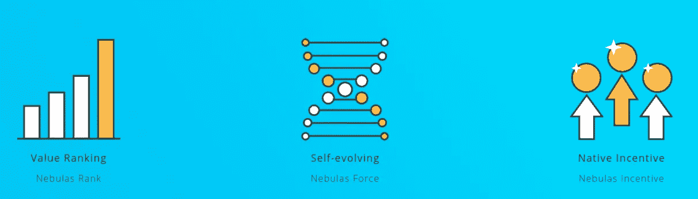
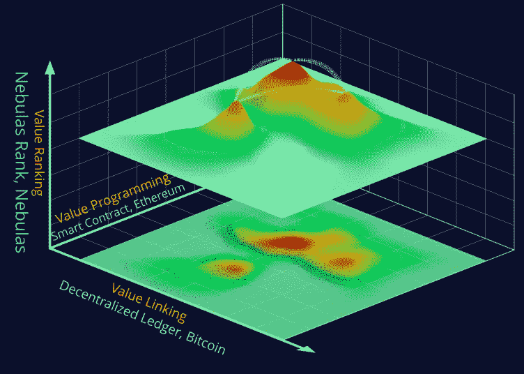
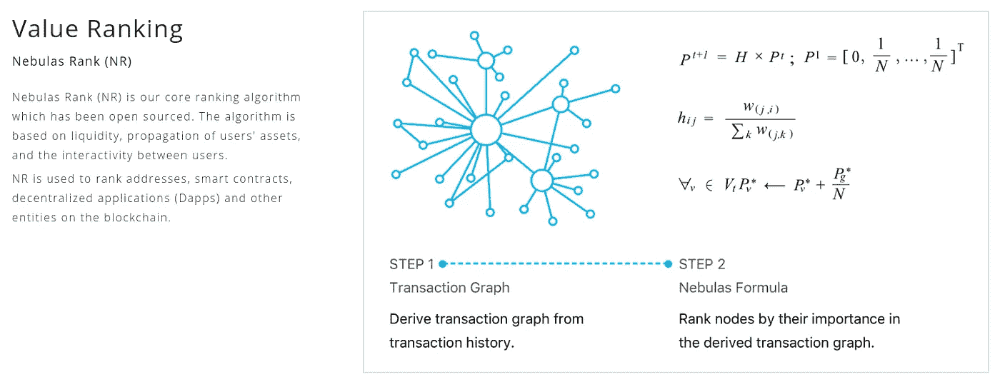
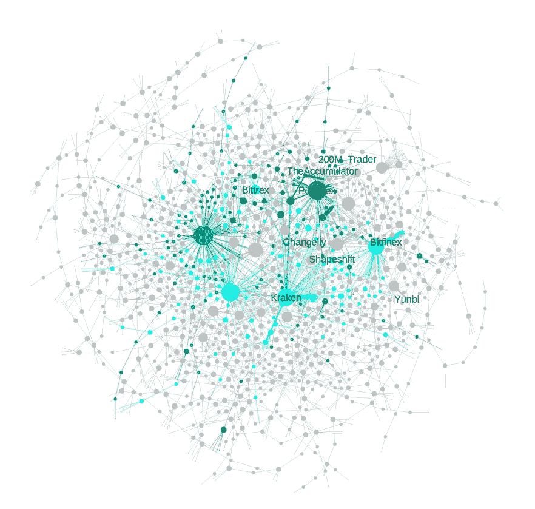
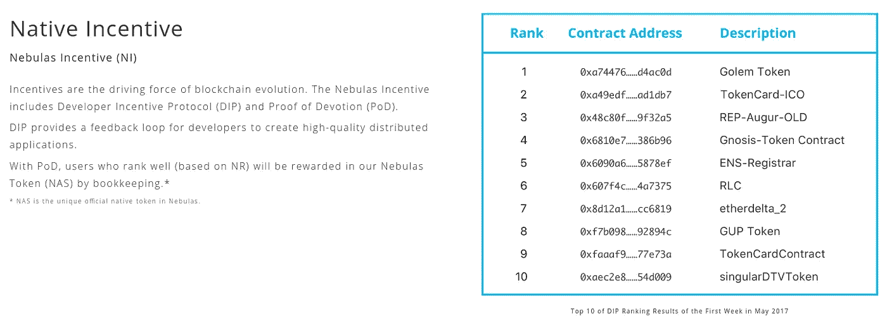
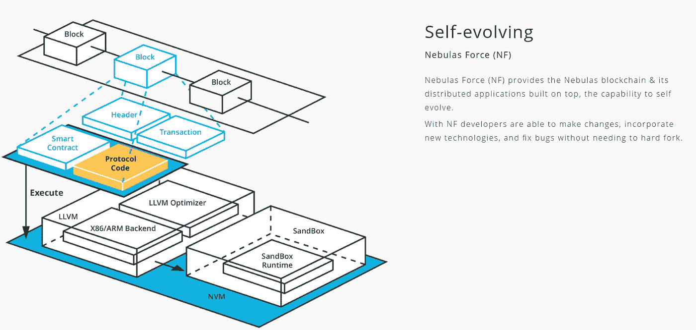

# 有趣的区块链和他们做什么— 1:星云

> 原文：<https://medium.com/coinmonks/interesting-blockchains-and-what-they-do-1-nebulas-6192dca70d2b?source=collection_archive---------5----------------------->

## 在这个系列中，我将让你们了解我最喜欢的区块链。声明:我投资了其中的大部分。

当人们谈论*区块链时，*大多数人会想到比特币或以太坊。然而在现实中，有许许多多不同的*区块链*。比特币、以太坊、Zcash、Monero、摩根大通的 Quorum、IBM 的 Hyperledger，都是不一样的区块链。有些关注隐私，有些关注企业，还有一些关注可伸缩性。一个独特的区块链以不同的方式工作，并试图解决其他问题。我将回顾一些，在我看来，独特的区块链，并谈论他们做什么。

这里描述的区块链不仅仅是货币，因为我对它们不感兴趣。它们更像通用平台，比如以太坊。如果你想了解更多关于区块链平台的信息，可以在这里阅读我的另一篇文章。

还有很多我可能不知道的区块链，但是这些引起了我的注意。

# I)星云

星云不是你典型的区块链。以太坊和*智能合约*的诞生引发了许多问题:

*   无法衡量不同应用程序和智能合同的价值
*   自我进化的能力，在这种能力下，变化可以以健康的方式实现，而不会造成社区的分化和分裂
*   一个激励区块链所有参与者让自己成为未来证明的生态系统

乍一看，这似乎是一个难以解决的奇怪问题，但是一旦我们深入研究，你就会明白星云的重要性。

Nebulas Core Technologies [source: [https://nebulas.io/technology.html](https://nebulas.io/technology.html)]

除了这三项核心技术，还有另外两个非常有趣的方面:

*   一个分散的搜索框架，为你的问题找到最好的 dApps 或智能合同(根据 *Nebulas 排名*)
*   一个新的共识机制叫做*奉献证明*

让我们再深入一点。

Dimensions of digital value [source: [https://nebulas.io/docs/NebulasWhitepaper.pdf](https://nebulas.io/docs/NebulasWhitepaper.pdf)]

## 星云等级

比特币区块链代表了一个一维世界，交易是点对点进行的。以太坊区块链用智能合约和 DApps 给我们带来了一个二维世界。现在越来越多的应用建立在以太坊上。当区块链 DApp 的数量达到移动应用商店的数量时，用户如何搜索并找到预期的 DApp 将是一个巨大的挑战。— *打人者徐，星云创始人*

Nebulas 在其白皮书中概述了一个事实，即随着各种智能合同和 dapp 的兴起，区块链世界和 [Web 3.0](/@matteozago/why-the-web-3-0-matters-and-you-should-know-about-it-a5851d63c949) 将需要一个适用于智能合同、dapp 甚至用户的通用价值衡量标准。请看*星云等级*。通过算法探索和分析链上活动，*星云排名*将能够量化区块链上每个实体的价值。

NR 将为用户提供对区块链生态系统更深入的了解，这将为更好的商业决策和研究活动铺平道路。NR 也将服务于 *Nebulas 搜索引擎，*作为探索 Web 3.0 的一种方式，就像谷歌允许你探索 Web 2.0 一样，当然是以一种分散的方式。

Nebulas Rank [source: [https://nebulas.io/technology.html](https://nebulas.io/technology.html)]

以下是如何扣除 NR 价值衡量的基本概述:

*   **流动性** *，*如交易的频率和规模，是*星云等级*衡量的第一个方面。想想交易所的情况:交易所的用户越多，流动性越好，质量也就越好。这是一个正反馈循环。一个简单的例子是 NR 对指数进行排名，流动性最强的指数排名最高。
*   **传播**，资产流动性的范围和深度，是第二个衡量方面。传播可以被认为是某些区块链实体产生的影响信息。把它想象成迅速传播的东西——这表明这个想法本身有很大的价值(例如 CryptoKitties)。
*   **互操作性**，NR 衡量的最终维度。在一个透明的信息世界中，区块链实体与其他区块链实体的互动量将非常重要。把这个也算进去也很重要。

所有的信息将来源于链上数据，因为这是最可验证和最准确的数据来衡量。

Visual representation of the NR liquidity framework (Partial) [source: [https://nebulas.io/docs/NebulasTechnicalWhitepaper.pdf](https://nebulas.io/docs/NebulasTechnicalWhitepaper.pdf)]

## 奉献证明

> 电力问题是对计算能力的浪费。而 PoS 让富人更富。Nebulas 开发了奉献证明(PoD)算法。PoD 还使用 NR 作为价值衡量标准，以确定对生态系统有巨大贡献的帐户，并给予他们担任簿记员的公平机会，以避免簿记垄断。

星云排名，这在区块链世界是独一无二的，它允许星云在区块链技术上采取其他方式。这些方法中的一个是其新的共识机制，即*奉献证明*。根据 NR 的说法，PoD 允许“有影响力的”用户成为簿记员，并获得 tx 费和 block 奖励作为激励。让我来分解一下:

*   NR 值高于特定阈值的用户可以通过支付安全押金而被选择成为簿记员(*验证者*)，
*   通过虚拟挖掘，每个簿记员候选人竞争获得簿记权利，
*   已经获得这些权利的用户负责块生成，并因此获得经济回报，
*   如果任何用户恶意行为，他们的保证金将被没收，他们的排名将大幅下降。

这么想吧，PoD 基本上是用另一个大因素 PoS 的:*信誉*。如果他们把记账工作搞砸了，他们基本上就再也没有机会成为记账员了。*(这不包括 Sybil 攻击，但是，用户可以伪造多个身份)*

> 奉献证明结合了 NEM 的重要性证明和利害关系证明，解决了 PoI 的可逆性问题和 PoS 的资本垄断危机。

PoD and DIP are both part of the Nebulas Incentive structure. [source: [https://nebulas.io/technology.html](https://nebulas.io/technology.html)]

## 开发者激励协议(DIP)

顾名思义，智能合约和 dApps 的开发者将会因为他们的努力而获得回报。如果他们的智能合同或 dApps 在部署时达到高于指定阈值的 NR 分数，开发人员将在 NAS 中获得奖励。

DIP 给出的奖励将被记录在链上供每个人查看，这将吸引更多的开发人员尝试在区块链的 Nebulas 上开发，从而创建一个积极的反馈循环。

## 星云力

> 人类的 DNA 不会通过硬或软的叉子进化。相反，小突变被整合到我们的 DNA 系统中，这是一个类似区块链的去中心化系统，每个人都有一个完整的副本。Nebulas 的区块链系统也以非常相似的方式进化。

*Nebulas Force (NF)* 用于解决 Nebulas 区块链及其应用层的演进能力。这一点与其他技术创新相结合，是其经得起未来考验的关键。

NR、PoD 和 DIP 等基本协议的数据将记录在区块链星云上。更多的数据将允许基本协议升级，而不需要硬分叉。区块链及其建立在其上的实体将真正能够自我进化。

用户数量和机构群体投票机制将是决定应该升级什么以及区块链应该以何种方式发展的关键。随着不断增长的数据、激励措施和正反馈循环，区块链星云拥有巨大的潜力。

开发人员将能够在各种虚拟环境中测试他们的区块链创新:Nebulas 虚拟机、侧链和沙箱。因为 Nebulas 将利用 LLVM 编译器，开发者将能够用他们喜欢的语言编写代码。

Nebulas Force [source: [https://nebulas.io/technology.html](https://nebulas.io/technology.html)]

*如果你想了解更多，我强烈建议阅读以下文献:*

*   [*星云白皮书*](https://nebulas.io/docs/NebulasWhitepaper.pdf)
*   [*星云技术白皮书*](https://nebulas.io/docs/NebulasTechnicalWhitepaper.pdf)
*   [*下一代区块链不再硬叉*](https://cointelegraph.com/news/no-more-hard-forks-in-next-generation-blockchain)

*感谢阅读！*