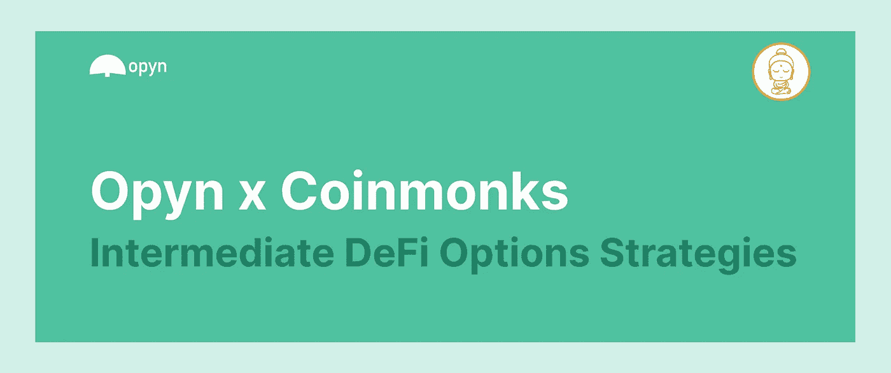
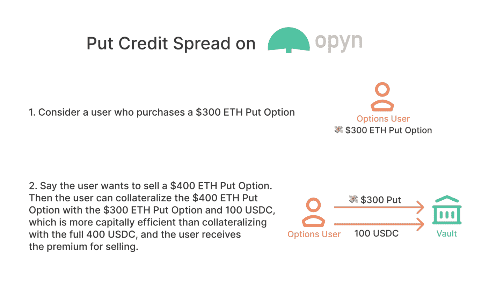
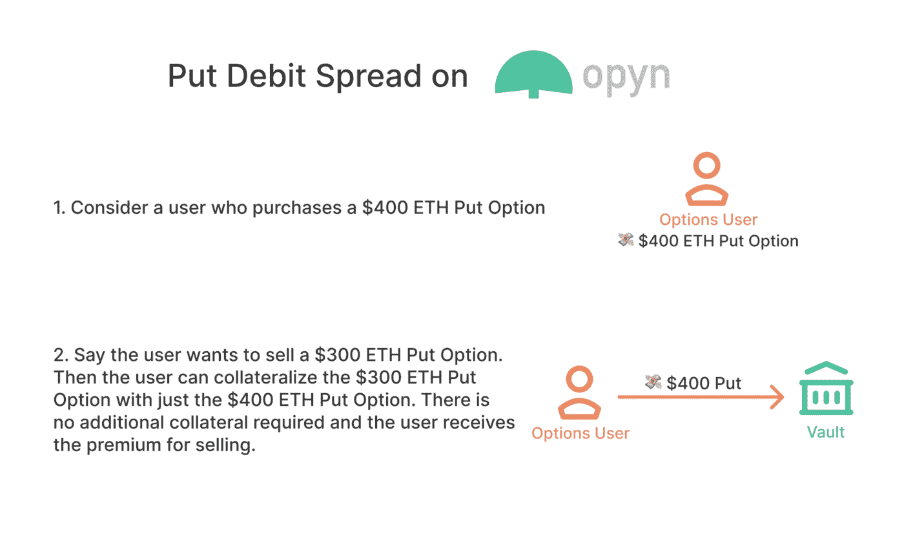
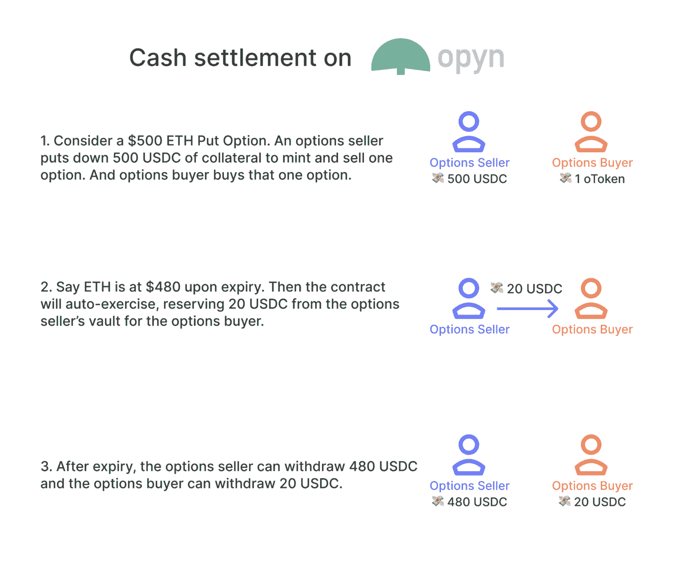

# Opyn 的中间期权策略

> 原文：<https://medium.com/coinmonks/intermediate-options-strategies-with-opyn-1006a14498e7?source=collection_archive---------8----------------------->

在过去两年中，分散金融(DeFi)生态系统受益于重大创新。除其他因素外，诸如 [Opyn](https://opyn.co/) 等安全 DeFi 期权协议的发展也对这一创新做出了贡献，吸引了大量的资本流入和交易量。

本指南将涵盖中间 DeFi 期权策略，特别是利差。我们将探索它们是什么，它们如何工作，为什么交易者使用它们，并确定用户必须考虑的主要风险。然后，我们将把重点转移到解释如何在 [Opyn](https://opyn.co/) 上执行这些交易的资源上，并提供资源和常见的期权术语。

Opyn x Coinmonks

# 什么是选项？

期权是一种衍生品合约，它赋予买方在某个日期(通常称为到期日)或之前，以固定价格购买或出售固定数量的基础资产的权利，而非义务。在 DeFi 中，基础资产可以包括任何 ERC 20 指数的资产，如:WETH、WBTC、UNI、YFI、SNX 等。

人们出于各种原因使用期权。主要原因包括创收、投机和对冲。就本文而言，我们将重点关注利用期权头寸(如价差)的资本效率优势的中间期权策略。价差允许多头期权抵押空头期权，使用户能够将结构的最大损失作为抵押品。

# Opyn v2 是什么？

Opyn v2 建立在 [Gamma 协议](https://github.com/opynfinance/GammaProtocol)的基础上，是一个资本高效的 DeFi 期权交易协议，允许用户在 ERC20s 上购买、出售和创建期权。DeFi 用户和产品依赖 Opyn 的智能合约和界面来对冲 DeFi 风险或对不同加密货币进行投机。Opyn 与其他 DeFi 选项协议有七个主要区别。

Opyn v2:

*   允许资本效率更高的期权交易策略，如差价
*   允许快速铸造(可以铸造没有抵押品的期权，只要它们在交易结束前被烧掉)
*   具有竞争性定价，因为出价/要价由市场供求决定
*   允许用户在到期前出售期权
*   货币期权的期权自动执行
*   如果产品已被列入白名单，则允许任何人创建新选项
*   允许运营商代表用户进行交易

Gamma 协议的主要特征允许在 DeFi 期权交易中提高资本效率，包括:保证金提高、欧式期权、现金结算期权和快速铸币厂。

**利润提升**

Gamma 协议从价差开始，为更具资本效率的期权奠定了基础。具体到 Opyn，利差允许多头抵押空头抵押，使用户能够将结构的最大损失作为抵押品。

**欧洲现金结算期权**

现金结算的欧式期权，通过允许安全构建差价来提高利润。欧式期权意味着期权持有者只能在期权到期时行使期权。现金结算意味着期权持有者不必提供基础资产就可以行使。相反，期权在抵押资产中结算，期权持有人在行使时获得现金支付(就行权资产而言，行权价格与基础资产价格之间的差额)被转移。

**闪光薄荷糖**

由于保险库抵押是在交易结束时检查的，所以只要在交易结束前烧掉，就可以在没有抵押的情况下铸造期权。

# 中间选择策略

上述特征使 Opyn v2 能够使 DeFi 中的期权交易更具资本效率。这是与传统市场竞争的第一步，大大降低了交易者的抵押品要求。价差允许多头抵押空头抵押，使用户能够将结构的最大损失作为抵押品。差价是降低风险和保证金要求的常用方法，以下是四种最常见的期权差价:

## 呼叫借记差价:

**概述:**买入借记价差，也称为看涨买入价差，是一种期权策略，涉及同时买入和卖出不同价格的同类别期权，需要现金净流出。结果是交易账户的净借方。买入借记价差降低了买入期权的成本，但它限制了资产价格的涨幅，从而限制了交易的盈利范围。

交易场景:如果交易员认为某项资产的价值将适度上升，他们通常会使用看涨期权价差。这种情况最常发生在波动性较大的时候。

**最大收益/最大损失:**买入借记价差的潜在利润限于执行价格减去价差的净成本之间的差额。如果股票价格等于或高于卖空通知到期时的执行价格，则实现最大利润。最大损失等于价差成本。如果头寸持有至到期，且两个看涨期权到期时都没有价值，则实现了这一金额的损失。

**持仓详情:**买入借记价差涉及两个买入期权，导致交易账户的净借记:

*   在特定的到期日以高于当前市场的执行价格购买看涨期权(看涨期权)并支付溢价
*   同时，以更高的执行价格卖出一个与第一个看涨期权到期日完全相同的看涨期权(卖空期权)

[如何交易 Opyn v2 上的买入借记价差](/opyn/how-to-trade-defi-options-opyn-v2-tutorial-aabc0a323430#17ce)

## 买入信用利差:

**概述:**看涨信用价差，也称为看跌看涨期权价差，是一种期权策略，通过以特定的执行价格购买看涨期权，同时以较低的执行价格出售相同数量的到期日相同的看涨期权。

**交易场景:**当交易员预计标的资产价格将下跌时，他们通常会使用看涨期权价差。

**最大收益/最大损失:**使用买入信用利差获得的最大利润等于开始交易时获得的信用。最大损失等于执行价格减去收到的净信贷之间的差额。买入信用利差被认为是一种有限风险和有限回报的策略。利润和损失的限额由特定看涨期权的执行价格决定。

**头寸详情:**买入信用价差涉及两个买入期权，导致交易账户的净信用:

*   购买一个具有较高执行价格和特定到期日的看涨期权(看涨期权),支付溢价
*   同时，卖出相同数量、到期日相同的看涨期权(看跌期权),但执行价格较低，从而获得溢价

[如何交易 Opyn v2 的买入信用利差](/opyn/how-to-trade-defi-options-opyn-v2-tutorial-aabc0a323430#1d28)

## 放入借方差价:

**概述:**看跌借方价差，也称为看跌价差，是一种期权策略，通过购买看跌期权，同时以较低的执行价格出售相同到期日的相同资产的相同数量的看跌期权来实现。该交易的结果是交易账户的净借方。卖出的所有期权的总和(较低的执行价格)低于买入的所有期权的总和(较高的执行价格)，因此交易者必须拿出钱来开始交易。

**交易场景:**当交易员预计某项资产的价格会出现温和下跌时，他们通常会使用看跌期权价差。当基础证券的价格下跌时，这种策略净盈利。

**最大收益/最大损失:**利用卖出借方差价获得的最大利润等于两个执行价格之间的差额减去期权的净成本。最大损失等于价差成本。

**头寸详情:**卖出借方差价涉及两个卖出期权，导致交易账户的净借方:

*   购买一个具有较高执行价格的看跌期权(长期看跌期权),并在特定的到期日支付溢价
*   同时，以较低的执行价格卖出相同数量的到期日相同的看跌期权(看跌期权),赚取溢价

[如何交易 Opyn v2 的卖出借方差价](/opyn/how-to-trade-defi-options-opyn-v2-tutorial-aabc0a323430#7360)

## 放入信用利差:

**概述:**看跌信用价差，也称为看涨看跌价差，是一种期权策略，通过以较高的执行价格出售看跌期权，同时以较低的执行价格购买相同数量的到期日相同的看跌期权。交易者从期权的两个溢价之间的差额中获得净贷记。

**交易场景:**当交易者预计标的资产价格将温和上涨时，他们通常会使用看涨看跌期权价差。

**最大收益/最大损失:**最大利润，即净信贷，只有在到期时资产价格收盘高于较高的执行价格时才会出现。最大损失等于执行价格和收到的净信贷之间的差额。利润和损失的限额由特定看涨期权的执行价格决定。

**头寸详情:**卖出信用价差涉及两个卖出期权，导致交易账户的净信用:

*   购买有特定到期日的执行价格较低的看跌期权(长期看跌期权),支付溢价
*   同时，卖出相同数量、相同到期日的看跌期权(看跌期权),但执行价格更高，赚取溢价

[如何交易 Opyn v2 的看跌期权信用利差](/opyn/how-to-trade-defi-options-opyn-v2-tutorial-aabc0a323430#9641)

# 关键选项条款:

**期权:**期权是基于基础资产价值的衍生金融工具，如 ETH 或 BTC。期权合约为买方提供了买入(看涨)或卖出(看跌)标的资产的机会。

**买入期权:**买入期权是一种金融合约，赋予期权买方在特定时间内以特定价格购买资产的权利，但没有义务。

**看跌期权:**看跌期权是一种金融合约，赋予期权买方在特定时间内以特定价格出售资产的权利，但没有义务。

**期权买方:**支付期权金购买期权的人。这个人有权利，但没有义务去行使选择权。也称为期权“持有者”，或“做多”期权的人。

**期权卖方:**卖出期权以换取溢价的人。当买方根据期权合同行使其权利时，期权卖方有义务履行。期权卖方也是“做空”期权的人。

**基础资产:**期权价值所基于的基础资产。这是期权如何获得其价值的主要组成部分。期权被归类为衍生工具，因为它们的价值来自基础资产的表现或价格行为。

**期权费:**期权买方预先支付给期权卖方作为回报的钱。这是期权的成本。

出价:买方愿意为期权支付的价格。如果你卖出一个期权，这是你从合约中得到的溢价。

**提问:**卖方愿意接受的期权价格。如果你想购买期权，这是你要支付的溢价。

**执行价格:**执行价格是期权合约在执行时可以买入或卖出的设定价格。对于看涨期权，执行价格是一项资产可以被购买的价格；对于看跌期权，执行价格是资产可以出售的价格。

**到期日:**期权合约失效的日期。对于欧式期权，这是期权买方行使期权合约的到期日。对于美式期权，这是期权购买者必须执行期权合约的日期。

**行权:**行权是指以执行价格买入或卖出标的资产的权利。如果看跌期权的持有者行权，他们将卖出标的资产。如果看涨期权的持有者行使期权，他们将购买标的资产。

**At The Money (ATM):** 当看涨期权或看跌期权的执行价格与当前标的资产价格相同时，该期权为 At The Money。

**在货币(ITM):** 指具有内在价值的期权。当看涨期权的执行价格低于当前的标的资产价格时，它就是在赚钱。当看跌合约的执行价格高于当前的标的资产价格时，该合约就生效了。

**出了钱(OTM):** 只包含外在价值的期权。当看涨期权的执行价格高于当前的标的资产价格时，它就不赚钱了。当一个看跌期权的执行价格低于当前的标的资产价格时，这个期权就没有价值了