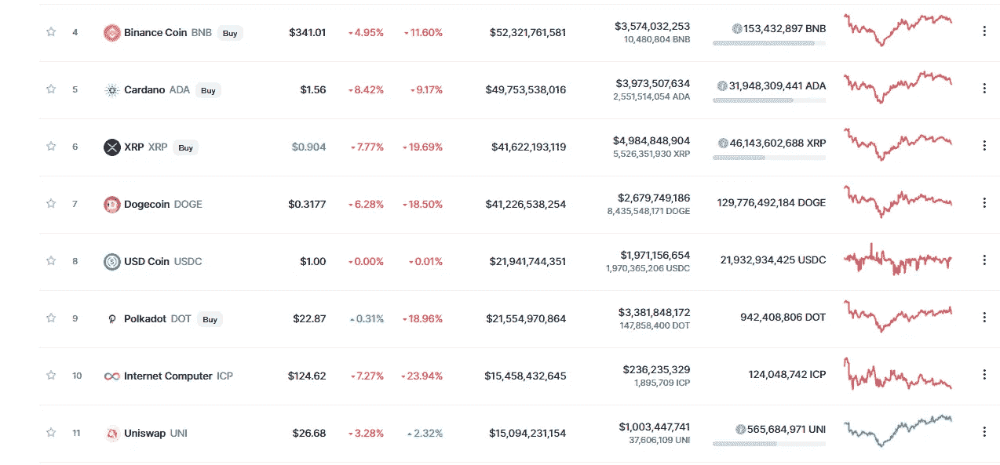

# 互联网计算机(ICP):“新”互联网？

> 原文：<https://medium.com/coinmonks/internet-computer-icp-the-new-internet-25c2b869390d?source=collection_archive---------2----------------------->

据计算机科学家兼企业家多米尼克·威廉姆斯称，他的基金会几天前开通了“新”互联网。伴随着一股热潮:**新的加密硬币互联网计算机跻身前十种加密货币**。

ICP (10), ranking by market cap — [coinmarketcap.com](https://coinmarketcap.com/en/)

我们正在谈论一个(最终在某一点上)**全球计算机网络**，它目前位于美国、欧盟和新加坡…