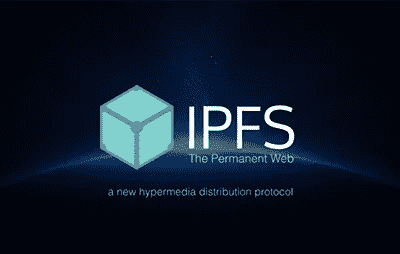

# 星际文件系统(IPFS)——网络的未来

> 原文：<https://medium.com/coinmonks/interplanetary-file-system-ipfs-future-of-the-web-c45c955e384c?source=collection_archive---------3----------------------->

IPFS 或星际文件系统是一个利用分布式文件系统的对等超媒体协议。也就是说这是另一种互联网协议。但它不仅仅是另一个普通的协议。它的某些特性使它脱颖而出，并有可能成为未来的网络协议。

HTTP——由蒂姆·伯纳斯·李开发的超文本传输协议是当今使用最广泛的协议，但它似乎越来越陈旧，无法跟上快速增长的网络。

## HTTP 的问题:

*   互联网用户的数量一直在不断增加。因此，请求数据的用户数量也在不断增加。为了向用户提供这些数据，HTTP 占用了大量的可用带宽，即使请求数据的人彼此离得很近。考虑到大量的可用数据，这种方法的效率还不够高。
*   光速是一个巨大的瓶颈，因为数据传输不能超过这个速度。因此，合理的做法是让服务器离你近一些。因此，当您请求数据时，它会更快地到达您的手中。但是，如果您正在请求一些数据，而这些数据恰好位于离您仅几米远的系统中，那么如果数据只是从该系统中提取，而不是通过网络主干将请求传输到离您更近的另一个城市并返回，那么速度会更快。

*   我相信每个人都见过这个错误，这是一个 404 错误，这意味着内容被破坏或删除。HTTP 链接的主要问题是它不可靠，链接会被破坏很多次。此外，如果内容被删除，它将永远丢失，除非有人手动复制了数据。例如，如果有人入侵维基百科页面并删除其所有内容，这些内容将永远消失，除非有人手动备份了这些数据

*   HTTP 最大的问题(从我的角度来看)是它是集中式的。这给了少数拥有数据的个人巨大的权力，如果政府和某些个人想这样做，他们可以很容易地限制对数据的访问。

IPFS 解决了这些问题，并帮助我们走向一个安全，高效和廉价的网络。

## IPFS 是如何解决这些问题的？

*   与 HTTP 使用的 IP 寻址方法相比，IPFS 使用的是内容寻址方法。使用内容地址可以更快地获取数据，因为它将从拥有数据副本的最近系统中检索数据。既然是内容寻址，你可能会问，IPFS 如何区分网页？它通过为每个页面生成一个唯一的地址来做到这一点。内容由不能改变的加密生成的散列来标识。
*   IPFS 使用分布式哈希表来存储各种系统上的数据。分布式哈希表的一个例子是 C [hord](https://en.wikipedia.org/wiki/Chord_(peer-to-peer)) 。
*   为了控制分布式哈希表并赋予其结构，IPFS 使用了受 git 启发的 Merkle DAG 协议。Git 使用这个协议进行版本控制，而 IPFS 使用它来提供一个结构。
*   IPFS 的另一个优点是，用户可以从不同的来源一次下载文件的部分内容，并在他们身边组合起来，而不是从一个单一的来源下载整个文件。

我想现在你应该明白为什么 IPFS 被认为是网络的未来了。

有趣的事实:它被命名为星际文件系统的原因是，当人类成为星际物种时，从最近的用户那里获取数据比从光年以外的行星获取数据更明智:)

## 参考资料:

1.  [https://ipfs.io/](https://ipfs.io/)
2.  https://www.youtube.com/watch?v=BA2rHlbB5i0

Click to read more IPFS stories