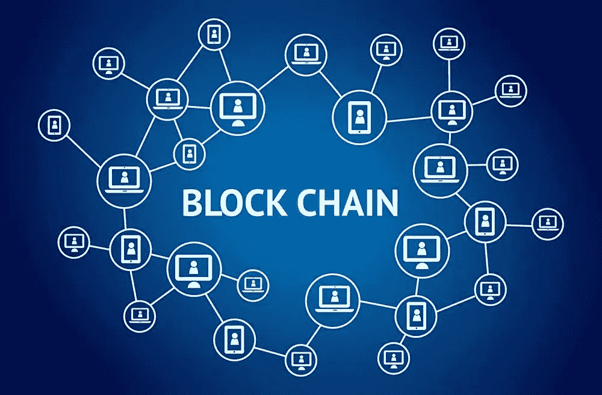
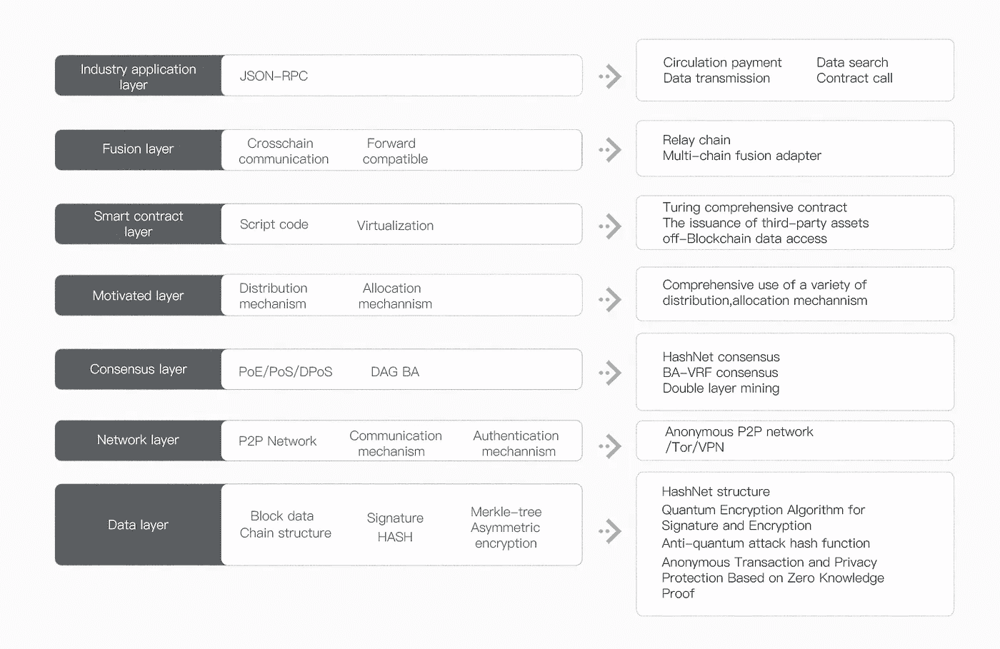

# InterValue:从区块链到价值互联

> 原文：<https://medium.com/coinmonks/intervalue-from-blockchain-to-value-interconnect-c52bb300134a?source=collection_archive---------7----------------------->

如果不是比特币的突然兴起，我们可能不知道区块链是什么，换句话说，存在了将近十年而鲜为人知的比特币，有一天被炒得沸沸扬扬，让某个人发了大财。这无疑使人们更加关注区块链技术，人们开始对它进行研究，并发现区块链实际上具有改变未来世界的潜力。投机者蜂拥至区块链，从而使得情况为我们所熟悉。

提到区块链，大多数人只是对它知之甚少，而不是真正的礼物。因此，甚至许多人想仔细研究它，但不能数字。因此，我们可以看到许多人试图用各种方式向网民解释流行区块链的概念。

从狭义上讲，区块链是一种链式数据结构，其中数据块以时间顺序的方式顺序连接，密码学确保了不可伪造和不可伪造的分布式分类账。

从广义上讲，区块链技术是一种全新的分布式基础设施和计算范式，它使用区块链数据结构来验证和存储数据，使用分布式节点一致性算法来生成和更新数据，使用密码术来确保数据传输和访问，使用密码术来保护数据传输和访问，并使用由自动化脚本代码组成的智能契约来编程和操纵数据。

区块链技术不仅仅是我们熟悉的一种固定形式，从开始到现在已经经过了多次迭代，并且还在不断的完善和发展。

**01。区块链 1.0:加密货币。**

2009 年初，比特币网络正式上线。作为一种虚拟货币体系，比特币的总量由网络共识协议定义。任何个人或机构不得随意修改其中的供应和交易记录。比特币的底层技术区块链实际上是一种极其巧妙的分布式共享账本和点对点价值转移技术，其影响可能不亚于复式记账的发明。

**02。区块链 2.0:智能合约。**

大约在 2014 年，业界开始认识到区块链技术的重要性，并创建了一个公共技术平台来为开发者提供 BaaS(区块链即服务)，这大大提高了交易速度，减少了资源消耗。智能合约的发起者以太坊将区块链带入了 2.0 时代。区块链 2.0 应用融入了“智能合约”(使用程序算法代替人工执行合约)的概念。这使得区块链可以从最初的货币体系扩展到股权、债权和财产权的登记和转让，证券和金融合同的交易和执行，甚至游戏和防伪等金融领域。

03。区块链 3.0:区块链技术应用。

2015 年后，随着基于 DAG 数据结构的区块链 3.0 技术(如 Byteball 和 IOTA)的兴起，区块链系统更加高效、可扩展、高度互操作，并提供比以前更好的用户体验。区块链的应用逐渐延伸到医疗保健领域，

知识产权版权、教育和 IOT。共享经济、通信、社会管理、慈善、文化、娱乐等更广泛的应用。

**04。区块链 4.0:区块链生态系统。**

最近，基于 Hashgraph 数据结构的区块链 4.0 技术逐渐引起了业界的关注。基于 Hashgraph 的一致性算法可以在事务吞吐量和可扩展性上实现质的增长。区块链将成为产业的基础设施，形成巩固的生态系统，也广泛而深刻地改变着人们的生活方式。

**05。从区块链到价值互联**

互联网实现了人类社会的一些信息在互联网上传递和共享，形成了信息互联。区块链将在基于价值的互联网上实现包括人类社会所有数字资产和实物资产在内的所有信息的传递和共享，创造价值。互联互通。实现价值互联，即实现价值传输网络的各种底层网络协议，构建全球价值互联网，为各种类型的价值传输应用提供基础网络，是 InterValue 项目的大愿景。

平台中的关键技术和区块链基础设施中的功能是 InterValue 最关注的焦点。这些特性包括匿名 P2P 协议、新的反量子哈希算法和新的签名算法、独特的交易匿名保护双层共识和挖掘机制、图灵完全智能契约等。它使用公平分配机制来支持第三方资产分配，跨链通信，公共链、许可链、财团链和母表单等多链合并功能属于区块链 4.0 基础设施的实际应用。

为了打造一个完全去中心化的网络价值传递生态系统和完全开放的社区生态系统，InterValue 对区块链基础设施的各个方面进行了重大改进，并在某些层面进行了突破性创新。

**重大技术创新包括:**

1.共识:我们设计了一种高效安全的双层共识机制，由 HashNet 共识和 BA-VRF(基于可验证随机函数的拜占庭协议)共识组成，支持高事务并发、快速确认和构建针对不同应用场景的生态系统。

2.在跨链和合并链中，采用链中继技术解决跨链事务和多链间透明操作的问题，既能保持跨链操作的独立性，又能重用区间值的各种函数。

3.行业应用方面，我们以 JSON-RPC 的形式设计了大量的行业通用接口，满足流通支付数据传输、数据查询、合同调用等 diƈerent 场景。

4.智能契约，我们设计了 Moses 虚拟机(MVM ),它支持声明式非图灵完全契约以及用 Moses 语言编写的高级图灵完全契约。MVM 能够方便、安全地访问 oƈ-Blockchain 数据，并支持第三方资产的发行，可以集成到公共、许可(私有)或财团(混合)区块链方面的应用中。

5.抗量子攻击，设计了新的抗量子算法，用 Keccak-512 哈希算法代替现有的 SHA 系列算法，用基于整数格的 NTRUsign 签名算法代替 ECDSA 签名算法。这些算法降低了来自量子计算发展和量子计算机逐渐普及的威胁。

6.交易匿名基于 Monero 和 ZCash 等加密货币的匿名特性，将零知识证明和环签名应用于交易匿名和隐私保护，具有较高的性价比和良好的安全性，能够满足不同应用场景下的隐私需求。

7.在 P2P 网络的基础上，结合基于 Tor 的匿名性和基于区块链的分布式 VPN 的优点，设计了一种新颖的匿名 P2P 覆盖网络，包括匿名访问方法和加密通信协议，大大增强了网络中节点的匿名性，保证了节点地址难以追踪，通信协议难以破解。

8.生态激励，使用各种令牌分配方式，支持双层挖掘进行激励。

InterValue Key Features Design

在 InterValue 被广泛使用的世界里，人们可以在任何行为和活动中实现自动支付、自动评价、自动保存、自动判断合法性。人们可以选择是否保留他们的终身活动和活动。一个拥有个体完全意识和完全自主智能的虚拟人诞生了。当人们将现实生活中的各种资产完全转移到链条上后，代表个人社会实体的虚拟人将与个人资产一起，永远留在链条上。进化持续实现了人类社会的虚拟永生，让每一个参与者都能获得相应的价值体现，引领人类走向价值互联的世界。