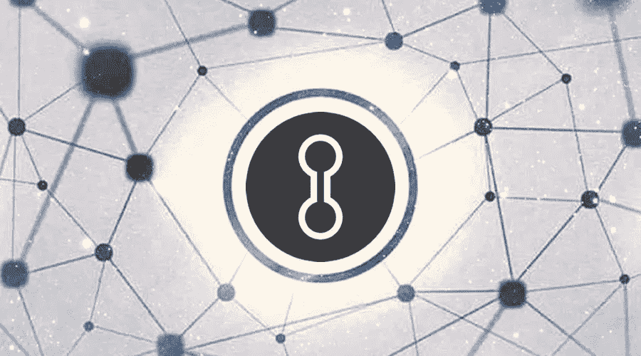
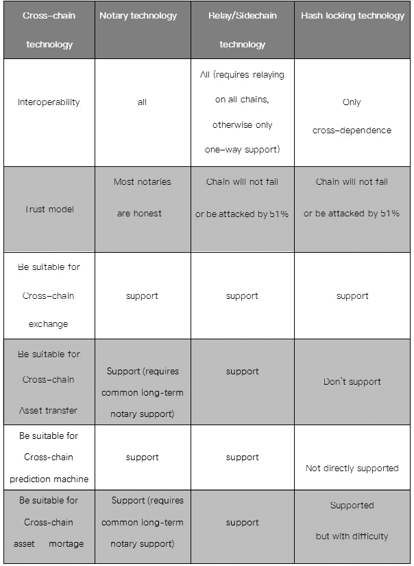
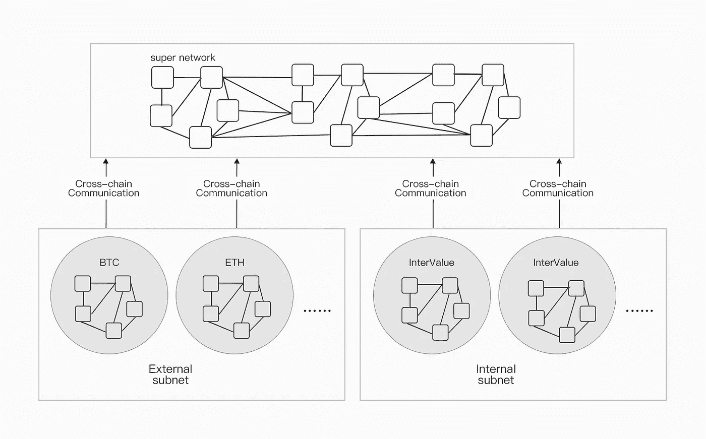
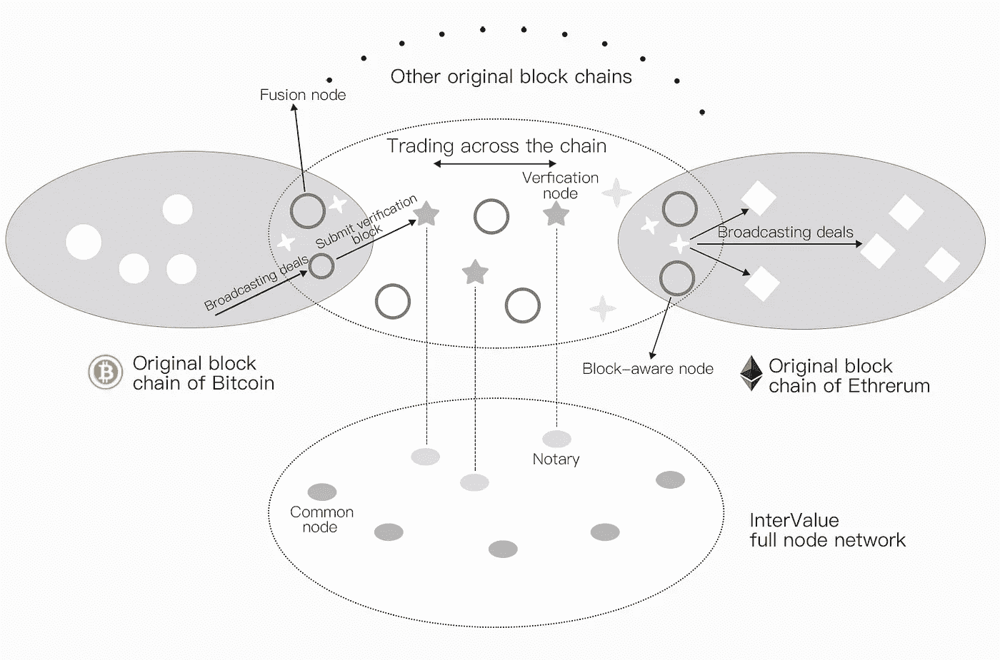

# InterValue 的跨链技术和多链整合将实现价值互联

> 原文：<https://medium.com/coinmonks/intervalues-cross-chain-technology-and-multi-chain-integration-will-realize-value-interconnection-698cd04b9b5f?source=collection_archive---------7----------------------->

近两年来，随着区块链的火热发展，大量资本涌入其中。参与区块链技术研究和应用开发的行业如雨后春笋般涌现。从区块链市场的现状来看，目前的区块链项目还不能真正服务于商业应用。除了区块链容量有限，交易确认慢，更重要的是，单个区块链项目是一个独立的价值网络，存在网络隔离的问题。不同区块链项目之间的合作难度极大地限制了区块链项目的使用空间。因此，如何实现跨链技术和多链集成成为当前区块链研究的热点之一。

**01。交叉链技术概述**

目前，存在三种跨链技术:**公证方案、侧链/中继和散列锁。**

**公证方案**:在公证方案中，一组可信节点作为公证人，验证区块链 Y 上是否发生了特定事件，并向区块链 x 的节点证明，Ripple Lab 提出的 Interledger 就是公证方案的代表。

**侧链/中继**:如果区块链 X 能够验证来自区块链 Y 的数据，那么区块链 X 称为侧链。侧链通常基于锚定在某个区块链上的令牌，而其他区块链可以独立存在。现有的侧链项目无法构建跨链智能合约并支持各种金融功能，这是这些区块链项目无法在股票、债券和金融衍生品市场领域取得进展的原因。著名的比特币侧链包括 BTC 中继(ConsenSys 提出)、根茎和元素链(BlockStream 提出)，其他不针对比特币的侧链包括 Lisk 和 Asch。中继链技术通过将原始区块链的多个令牌转移到原始区块链的多重签名地址来临时锁定原始区块链的多个令牌，这些签名者投票决定中继链上发生的交易是否有效。Polkadot 和 COSMOS 是代表性的中继链技术。

**Hash-locking**:Hash-locking 是一种通过锁定一段时间来猜测一个 Hash 值的明文来进行支付的机制，源于 Lightening Networks。然而，散列锁支持有限数量的函数。虽然它在大多数场景中支持跨链资产交换和跨链资产保留，但它不可用于跨链资产可移植性和跨链智能合约。

这三种跨链技术的比较如表所示

Cross-chain technology advantage comparison

InterValue 作为一个以价值互联为目的的项目，它包含了价值互联的两层含义。除了来自 InterValue 平台的用户之间的价值互联，还应该实现不同区块链项目之间的价值互联。这将最终改变目前区块链项目之间各自为政的“孤岛”局面，实现无处不在的价值互联。

**02。值间多链集成**

InterValue 采用全节点适配器多链合并技术连接不同的区块链。具体来说，作为统一入口，InterValue 使用全节点合并适配器来触发外部子网(BTC，ETH)上的事务。本地全节点网络由外部子网和内部子网组成。外部子网主要包括其他连锁网络，如 BTC、ETH 等。内部子网主要包括区间分段网络。顶层网络主要由所有节点中较高的节点组成。

Full node fusion adapter cross-chain integration

多链融合适配器部署在完整节点上，作为跨链通信模块功能的一部分。全节点触发本地节点外部子网的转移操作，实现转移代理的角色。

**03。值间跨链通信**

InterValue 不仅是一个独立的区块链网络，也是支持跨链通信功能的桥梁，如跨链资产交换和跨链资产可移植性。通过使用 InterValue 平台，任何人都可以开发符合应用场景要求的财务应用。值间跨链技术的基本思想是采用中继链思想，将跨链通信模块实现为值间基本链上的全节点覆盖层。在这个技术路线图中，我们不仅保持了跨链互操作性的独立性，而且重用了基本值链提供的各种功能

Intervalue cross-chain communication and cross-chain integration architecture design

InterValue 的跨链通信模块包括三种类型的节点:**验证节点、块感知节点和合并节点。**

它们各自的功能如下:

1.**验证节点**是区间值基本链中的公证节点。它们验证来自一些原始区块链的数据的有效性，并在 InterValue 中构造新的区块。验证节点必须抵押足够的资产来保证它们忠诚地完成工作。

2.**块感知节点**帮助验证节点收集有效的跨链通信块。这些节点类似于 PoW 中的矿工，运行某个原始区块链的完整客户端，构造新的区块，执行交易。在接收到跨链事务请求块之后，块感知节点将这些请求块打包并发送给验证节点。

3.**合并节点**充当区间值和另一个原始区块链之间的网关。每个合并节点有两个队列，分别处理输入事务和输出事务。此外，合并节点应该具有一些原始区块链的令牌，并支持跨链 Oracle。

**04。总结**

区块链是价值网络空间的核心基础设施。它的应用不应该局限于和止于联盟链的应用，它会在一个小范围内循环，InterValue 的跨链技术，和多链整合，到不同的领域。区块链的连接和扩展将实现价值传输网络的各种底层网络协议，构建全球价值互联网，为各种价值传输应用提供基础网络。