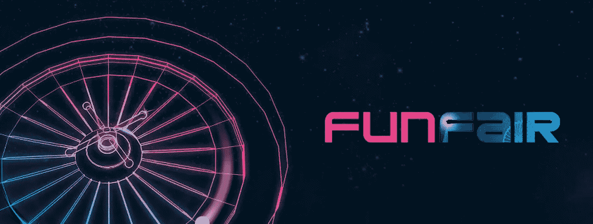
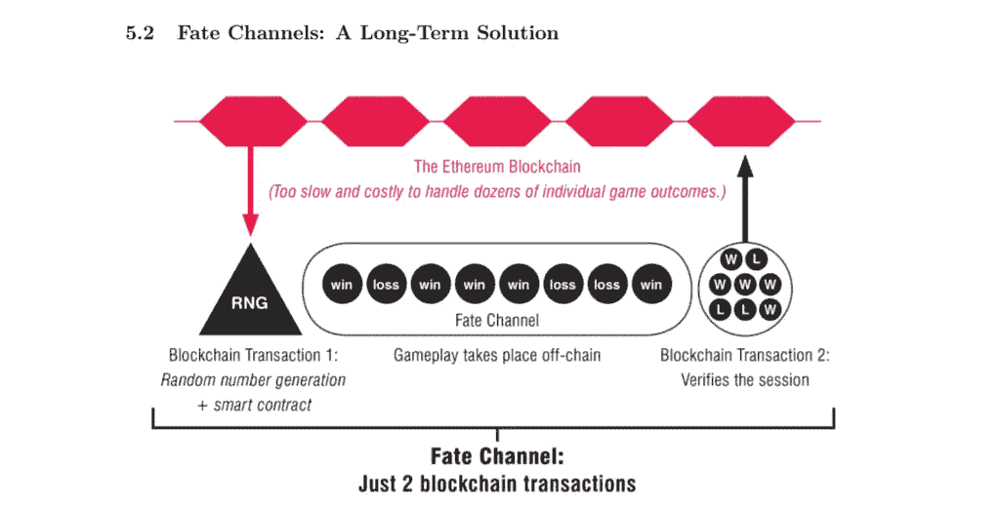

# FunFair 首席执行官 Jez San 访谈

> 原文：<https://medium.com/coinmonks/interview-with-funfairs-ceo-jez-san-bff1f6a2ad57?source=collection_archive---------8----------------------->

毫无疑问，FunFair 是区块链在线赌场技术发展的先锋。他们不仅有自己的以太币游戏，允许用户玩他们的游戏，他们也在颠覆[行业许可运作的方式](https://casinosblockchain.io/news/funfair-will-revamp-licenses-for-blockchain-gaming/)。他们的团队还通过使用他们自己的**状态通道**，称为**命运通道**，在以太坊区块链上探索**智能缩放解决方案**。最重要的是，他们有一个强大社区的支持。

命运通道是一种特定类型的状态通道，由 FunFair 开发，旨在改善以太坊的区块链在处理多个微交易和玩家互动时的缓慢。状态通道是独立于主区块链发生的**实例，其中所有这些较小的事务和交互都可以发生**而不会给主链**带来过重负担。因此，它允许更多的可伸缩性。**

> 我们使用它来生成实时随机数，作为双方(玩家和命运频道服务)之间的合作。它还可以与玩家互动(玩家点击，在 21 点游戏中获得一张新卡等)，还可以进行零汽油成本的微支付(下注、赢钱等)。我们称之为命运通道，因为我们用它来产生随机数。命运通道在游戏开始时打开，当玩家结束时关闭(所以结算很快)。游戏结束后，资金会立即返还到玩家的账户——fun fair 的博客[帖子](https://funfair.io/state-channels-in-disguise/)

Retrieved from FunFair’s commercial Whitepaper

# 问答环节

[CasinoBlockchain](https://casinosblockchain.io) 的团队联系了 FunFair 的首席执行官 Jez San，就他们项目的当前状态以及关于基础和技术问题的未来前景进行了问答。Jez 是一名著名的程序员和企业家，他最初是通过开发视频游戏软件而受到关注的。他在高中时十几岁就创办了 Argonaut 公司。后来，Argonaut 与任天堂签署了一项协议。

FunFair’s CEO, Jez San

**1 —您的产品目前处于测试阶段。尽管如此，你的代币目前在 CoinMarketCap 上排名第 75 位，而井** [**按日使用人数排名**](https://dappradar.com/category/gambling) **。你认为这是一个多大的好兆头？**

我们真的为我们的产品感到自豪，我们相信我们的命运频道背后的技术是业界最好的，也是目前唯一的解决区块链游戏固有问题的方法。我们的测试项目进展顺利，我们离上市越来越近了。

虽然排名上的其他 dapp 已经存在了一段时间，但我们在短短几周内就超过了他们，我们预计我们的排名将继续提高，随着我们加入更多的测试人员并继续添加新的游戏内容，我们和其他 dapp 之间的差距将会扩大。

随着我们的封闭测试版的推出，**我们最近** [**签署了我们的第一个运营商合作伙伴**](https://funfair.io/funfair-technologies-signs-raketherake-as-first-operator/) **在受欢迎的子公司 RaketheRake** 。这不仅是我们旅程中的一个重要里程碑，也证明了该技术对各种类型的组织的吸引力，我们期待着今年晚些时候与他们一起投入使用。

**2 —整个加密市场的现状是否让您担心分散式赌博的潜在用途？**

目前，传统的在线赌博正面临着信任的认知问题。最近来自 UKGC(英国赌博委员会)的数据显示，只有 33%的人信任与他们一起赌博的经营者，然而对经营者的信任是玩家选择去哪里赌博的一个关键驱动因素。分散式游戏为游戏行业内在的公平和透明问题提供了切实可行的解决方案。

当前加密货币交易市场的大部分纯粹基于投机，很少考虑每枚硬币的用途。我们的娱乐代币将成为**首批为市场带来真正效用的代币之一**，一旦我们的首批赌场投入使用，它将带来公平、准确的估价，而不管更广泛的市场状况如何。

**3——作为以太坊区块链的一个解决方案，你提议使用 FunFair 的命运频道，这是你的国家频道版本。您是否计划引入其他扩展解决方案，如 child-chains？**

虽然我们总是对提高功能和透明度的技术进步持开放态度，但我们对 FunFair 命运频道目前的进展和可行性感到非常高兴。没有其他人能提供像我们的命运频道这样快速和划算的服务。

当然，随着时间的推移，我们将为 FunFair 平台的各个领域设计和实施新的解决方案，以继续确保游戏的速度和质量，以及我们引以为豪的整体优质用户体验。

我们还将积极与其他行业利益相关者合作，改善网络，提高所有人的可用性。通过分享想法和与其他区块链专家一起工作，这只会有利于更广泛的行业和我们的合作伙伴赌场以及其他垂直行业的最终用户。

**4——您认为这些第二层扩展解决方案已经具备了良好实施所需的一切，并准备就绪了吗？**

我们的测试阶段证明非常成功，根据用户反馈和现场测试不断进行调整和改进，以确保我们的最终平台尽可能完美。虽然我们实际上“准备就绪”，但我们希望与我们的发布合作伙伴一起完善平台，以确保我们以最强的状态上线。

**5-就目前情况来看，你的主要精力似乎放在吃角子老虎机游戏上。社区可以期待在不久的将来有更多种类的游戏吗？**

虽然我们最近推出了高质量的吃角子老虎机游戏，但我们游戏产品组合中的许多早期游戏都是桌面游戏，这是任何成功的赌场运营的基础。我们独特的命运频道为在线桌上游戏提供了完美的平台，因为它们非常复杂，并且需要链外随机数生成器(RNG)。

虽然你可以期待更多的吃角子老虎机游戏在开发中，**我们也在开发一系列不同地区和主题的骰子和即赢游戏**。展望未来，我们还将引入更多的游戏开发商合作伙伴，以进一步增强我们的游戏内容，确保我们拥有最多样、最优质的区块链游戏产品，可与任何传统赌场产品相媲美。

你认为是什么让 FunFair 在区块链赌博领域如此特别？

FunFair 是区块链唯一一个可以提供与现有在线游戏模式相当的游戏体验，并且在许多方面优于现有在线游戏模式的平台。当前的区块链游戏笨重、缓慢、简单、昂贵，并且不能为普通玩家提供价值或寿命。

我们已经花了时间为我们的愿景奠定基础，建立了一个区块链和游戏专家团队，我们的技术在这一旅程中遥遥领先于市场，成功的测试阶段即将完成，我们的第一家运营商 RaketheRake 即将上线。

**区块链游戏无疑将改变在线赌场行业的面貌，我们相信我们最适合服务主流，并将其带给大众**。

有关区块链、加密货币和在线赌博的更多信息，请访问[**casinos block chain . io**](https://casinosblockchain.io)